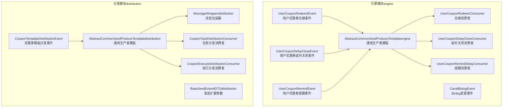
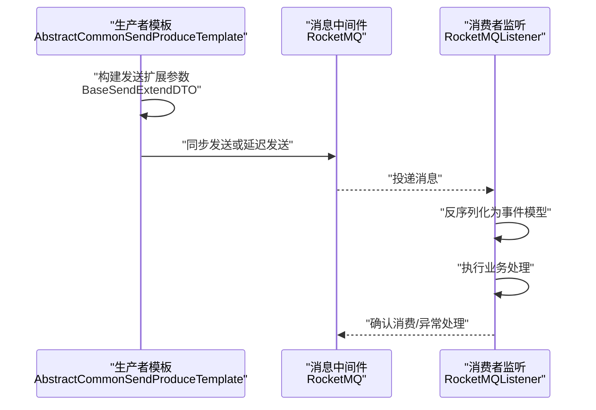
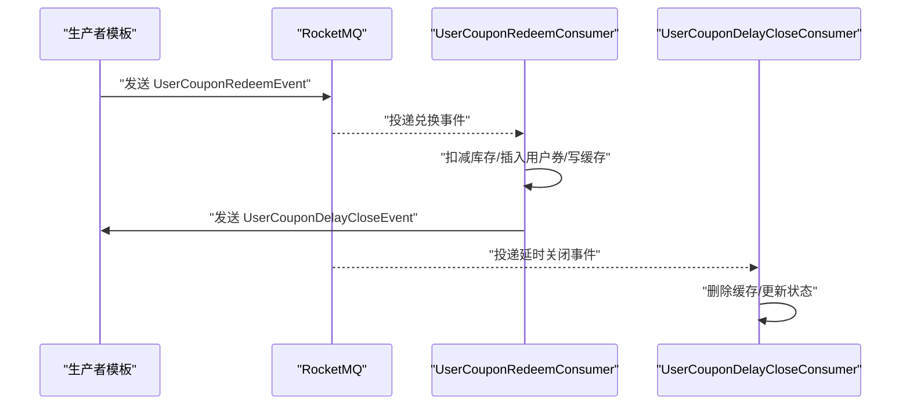
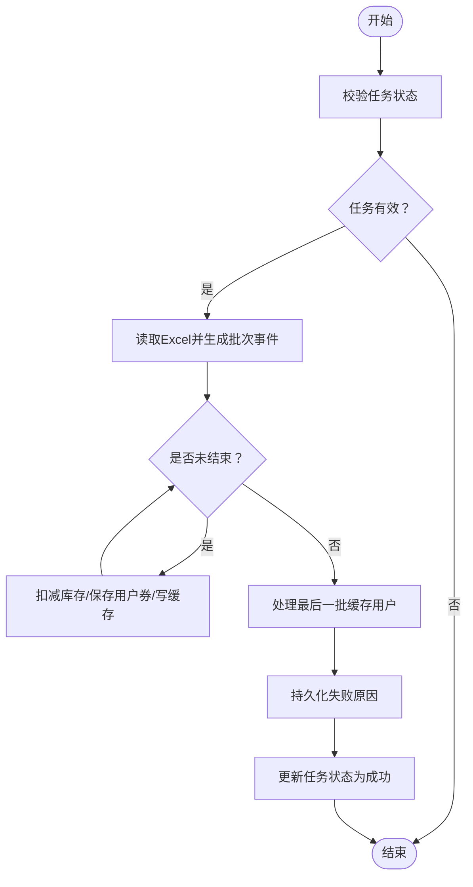
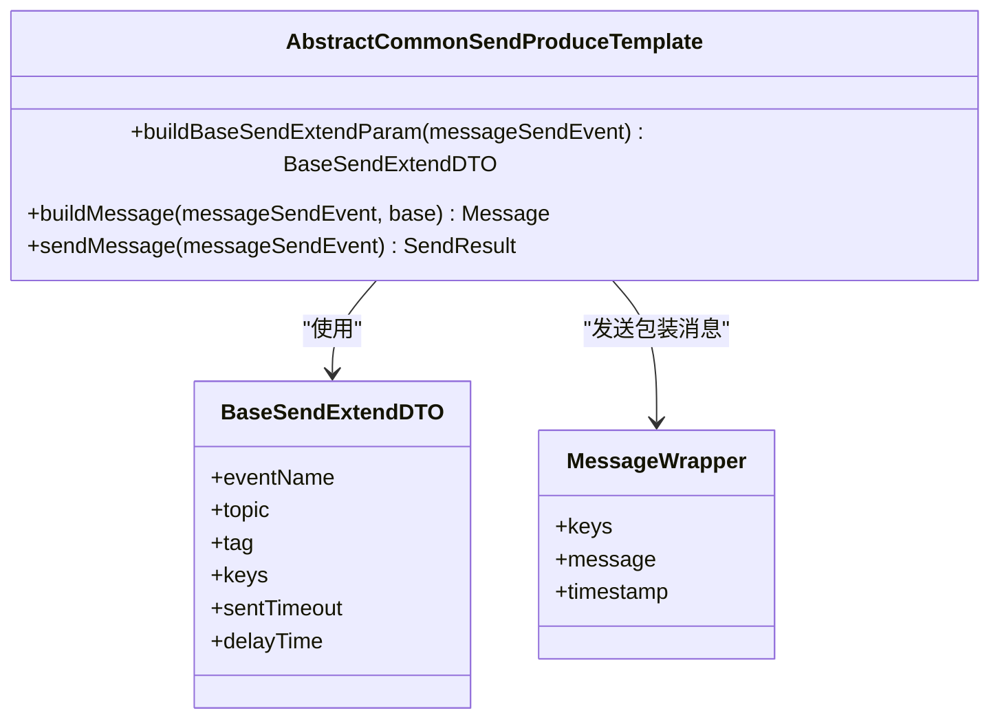
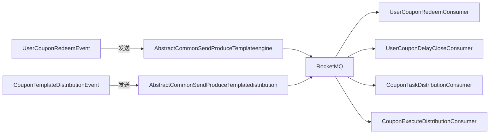

# 事件驱动架构设计

<cite>
**本文引用的文件**
- [UserCouponRedeemEvent.java](file://engine/src/main/java/com/fengxin/maplecoupon/engine/mq/design/UserCouponRedeemEvent.java)
- [CouponTemplateDistributionEvent.java](file://distribution/src/main/java/com/fengxin/maplecoupon/distribution/mq/design/CouponTemplateDistributionEvent.java)
- [UserCouponDelayCloseEvent.java](file://engine/src/main/java/com/fengxin/maplecoupon/engine/mq/design/UserCouponDelayCloseEvent.java)
- [UserCouponRemindEvent.java](file://engine/src/main/java/com/fengxin/maplecoupon/engine/mq/design/UserCouponRemindEvent.java)
- [AbstractCommonSendProduceTemplate.java（engine）](file://engine/src/main/java/com/fengxin/maplecoupon/engine/mq/design/AbstractCommonSendProduceTemplate.java)
- [AbstractCommonSendProduceTemplate.java（distribution）](file://distribution/src/main/java/com/fengxin/maplecoupon/distribution/mq/design/AbstractCommonSendProduceTemplate.java)
- [BaseSendExtendDTO.java（distribution）](file://distribution/src/main/java/com/fengxin/maplecoupon/distribution/mq/design/BaseSendExtendDTO.java)
- [MessageWrapper.java（distribution）](file://distribution/src/main/java/com/fengxin/maplecoupon/distribution/mq/design/MessageWrapper.java)
- [UserCouponRedeemConsumer.java](file://engine/src/main/java/com/fengxin/maplecoupon/engine/mq/consumer/UserCouponRedeemConsumer.java)
- [UserCouponDelayCloseConsumer.java](file://engine/src/main/java/com/fengxin/maplecoupon/engine/mq/consumer/UserCouponDelayCloseConsumer.java)
- [UserCouponRemindDelayConsumer.java](file://engine/src/main/java/com/fengxin/maplecoupon/engine/mq/consumer/UserCouponRemindDelayConsumer.java)
- [CouponTaskDistributionConsumer.java](file://distribution/src/main/java/com/fengxin/maplecoupon/distribution/mq/consumer/CouponTaskDistributionConsumer.java)
- [CouponExecuteDistributionConsumer.java](file://distribution/src/main/java/com/fengxin/maplecoupon/distribution/mq/consumer/CouponExecuteDistributionConsumer.java)
- [CanalBinlogEvent.java](file://engine/src/main/java/com/fengxin/maplecoupon/engine/mq/design/CanalBinlogEvent.java)
</cite>

## 目录
1. [简介](#简介)
2. [项目结构](#项目结构)
3. [核心组件](#核心组件)
4. [架构总览](#架构总览)
5. [详细组件分析](#详细组件分析)
6. [依赖分析](#依赖分析)
7. [性能考虑](#性能考虑)
8. [故障排查指南](#故障排查指南)
9. [结论](#结论)
10. [附录](#附录)

## 简介
本文件系统性梳理 MapleCoupon 事件驱动架构的设计与实现，重点覆盖以下方面：
- 事件定义与设计思路：如用户优惠券兑换事件、优惠券模板分发事件等
- 事件数据结构：事件头、事件体与扩展字段
- 生命周期管理：从事件创建到处理完成的全流程
- 事件分类与优先级：普通事件、延迟事件、定时事件的处理策略
- 版本管理与向后兼容：事件演进与兼容性保障
- 监控与追踪：日志、埋点与可观测性
- 失败恢复机制：幂等、补偿与重试

## 项目结构
事件驱动模块主要分布在 engine 与 distribution 子工程中，分别负责核心业务事件处理与大规模分发场景。整体采用 RocketMQ 作为消息中间件，结合模板方法抽象生产者与统一消息包装器，形成“事件模型 + 生产者模板 + 消费者监听”的标准流水线。

图表来源
- [UserCouponRedeemEvent.java:1-48](file://engine/src/main/java/com/fengxin/maplecoupon/engine/mq/design/UserCouponRedeemEvent.java#L1-L48)
- [CouponTemplateDistributionEvent.java:1-90](file://distribution/src/main/java/com/fengxin/maplecoupon/distribution/mq/design/CouponTemplateDistributionEvent.java#L1-L90)
- [AbstractCommonSendProduceTemplate.java（engine）:1-76](file://engine/src/main/java/com/fengxin/maplecoupon/engine/mq/design/AbstractCommonSendProduceTemplate.java#L1-L76)
- [AbstractCommonSendProduceTemplate.java（distribution）:1-76](file://distribution/src/main/java/com/fengxin/maplecoupon/distribution/mq/design/AbstractCommonSendProduceTemplate.java#L1-L76)
- [BaseSendExtendDTO.java（distribution）:1-49](file://distribution/src/main/java/com/fengxin/maplecoupon/distribution/mq/design/BaseSendExtendDTO.java#L1-L49)
- [MessageWrapper.java（distribution）:1-42](file://distribution/src/main/java/com/fengxin/maplecoupon/distribution/mq/design/MessageWrapper.java#L1-L42)
- [UserCouponRedeemConsumer.java:1-125](file://engine/src/main/java/com/fengxin/maplecoupon/engine/mq/consumer/UserCouponRedeemConsumer.java#L1-L125)
- [UserCouponDelayCloseConsumer.java:1-71](file://engine/src/main/java/com/fengxin/maplecoupon/engine/mq/consumer/UserCouponDelayCloseConsumer.java#L1-L71)
- [UserCouponRemindDelayConsumer.java:1-41](file://engine/src/main/java/com/fengxin/maplecoupon/engine/mq/consumer/UserCouponRemindDelayConsumer.java#L1-L41)
- [CouponTaskDistributionConsumer.java:1-89](file://distribution/src/main/java/com/fengxin/maplecoupon/distribution/mq/consumer/CouponTaskDistributionConsumer.java#L1-L89)
- [CouponExecuteDistributionConsumer.java:1-335](file://distribution/src/main/java/com/fengxin/maplecoupon/distribution/mq/consumer/CouponExecuteDistributionConsumer.java#L1-L335)

章节来源
- [UserCouponRedeemEvent.java:1-48](file://engine/src/main/java/com/fengxin/maplecoupon/engine/mq/design/UserCouponRedeemEvent.java#L1-L48)
- [CouponTemplateDistributionEvent.java:1-90](file://distribution/src/main/java/com/fengxin/maplecoupon/distribution/mq/design/CouponTemplateDistributionEvent.java#L1-L90)
- [AbstractCommonSendProduceTemplate.java（engine）:1-76](file://engine/src/main/java/com/fengxin/maplecoupon/engine/mq/design/AbstractCommonSendProduceTemplate.java#L1-L76)
- [AbstractCommonSendProduceTemplate.java（distribution）:1-76](file://distribution/src/main/java/com/fengxin/maplecoupon/distribution/mq/design/AbstractCommonSendProduceTemplate.java#L1-L76)
- [BaseSendExtendDTO.java（distribution）:1-49](file://distribution/src/main/java/com/fengxin/maplecoupon/distribution/mq/design/BaseSendExtendDTO.java#L1-L49)
- [MessageWrapper.java（distribution）:1-42](file://distribution/src/main/java/com/fengxin/maplecoupon/distribution/mq/design/MessageWrapper.java#L1-L42)
- [UserCouponRedeemConsumer.java:1-125](file://engine/src/main/java/com/fengxin/maplecoupon/engine/mq/consumer/UserCouponRedeemConsumer.java#L1-L125)
- [UserCouponDelayCloseConsumer.java:1-71](file://engine/src/main/java/com/fengxin/maplecoupon/engine/mq/consumer/UserCouponDelayCloseConsumer.java#L1-L71)
- [UserCouponRemindDelayConsumer.java:1-41](file://engine/src/main/java/com/fengxin/maplecoupon/engine/mq/consumer/UserCouponRemindDelayConsumer.java#L1-L41)
- [CouponTaskDistributionConsumer.java:1-89](file://distribution/src/main/java/com/fengxin/maplecoupon/distribution/mq/consumer/CouponTaskDistributionConsumer.java#L1-L89)
- [CouponExecuteDistributionConsumer.java:1-335](file://distribution/src/main/java/com/fengxin/maplecoupon/distribution/mq/consumer/CouponExecuteDistributionConsumer.java#L1-L335)

## 核心组件
- 事件模型：定义业务事件的数据结构，如兑换、延时关闭、提醒、分发等
- 生产者模板：封装 RocketMQ 发送逻辑，支持同步与延迟消息
- 消息包装器：统一封装事件与业务键、时间戳等元信息
- 消费者监听：按主题与消费者组订阅消息并执行业务处理
- Binlog 监控：通过 Canal 将数据库变更转换为事件流

章节来源
- [UserCouponRedeemEvent.java:1-48](file://engine/src/main/java/com/fengxin/maplecoupon/engine/mq/design/UserCouponRedeemEvent.java#L1-L48)
- [CouponTemplateDistributionEvent.java:1-90](file://distribution/src/main/java/com/fengxin/maplecoupon/distribution/mq/design/CouponTemplateDistributionEvent.java#L1-L90)
- [AbstractCommonSendProduceTemplate.java（engine）:1-76](file://engine/src/main/java/com/fengxin/maplecoupon/engine/mq/design/AbstractCommonSendProduceTemplate.java#L1-L76)
- [AbstractCommonSendProduceTemplate.java（distribution）:1-76](file://distribution/src/main/java/com/fengxin/maplecoupon/distribution/mq/design/AbstractCommonSendProduceTemplate.java#L1-L76)
- [MessageWrapper.java（distribution）:1-42](file://distribution/src/main/java/com/fengxin/maplecoupon/distribution/mq/design/MessageWrapper.java#L1-L42)
- [CanalBinlogEvent.java:1-84](file://engine/src/main/java/com/fengxin/maplecoupon/engine/mq/design/CanalBinlogEvent.java#L1-L84)

## 架构总览
事件驱动架构以“事件即契约”为核心，生产者将业务事件序列化为消息，消费者基于主题与标签订阅并异步处理。延迟/定时事件通过 RocketMQ 的延迟投递能力实现，确保在指定时刻触发后续动作。

图表来源
- [AbstractCommonSendProduceTemplate.java（engine）:1-76](file://engine/src/main/java/com/fengxin/maplecoupon/engine/mq/design/AbstractCommonSendProduceTemplate.java#L1-L76)
- [AbstractCommonSendProduceTemplate.java（distribution）:1-76](file://distribution/src/main/java/com/fengxin/maplecoupon/distribution/mq/design/AbstractCommonSendProduceTemplate.java#L1-L76)
- [BaseSendExtendDTO.java（distribution）:1-49](file://distribution/src/main/java/com/fengxin/maplecoupon/distribution/mq/design/BaseSendExtendDTO.java#L1-L49)

## 详细组件分析

### 用户优惠券兑换事件（UserCouponRedeemEvent）
- 设计意图：封装兑换请求参数、模板信息、用户上下文与时间戳，作为异步处理入口
- 关键字段：请求参数、领取次数、模板信息、用户ID、时间
- 生命周期：由生产者模板发送至兑换主题；消费者监听到消息后，扣减库存、插入用户券记录、写入缓存、并发送延时关闭事件

图表来源
- [UserCouponRedeemEvent.java:1-48](file://engine/src/main/java/com/fengxin/maplecoupon/engine/mq/design/UserCouponRedeemEvent.java#L1-L48)
- [UserCouponRedeemConsumer.java:1-125](file://engine/src/main/java/com/fengxin/maplecoupon/engine/mq/consumer/UserCouponRedeemConsumer.java#L1-L125)
- [UserCouponDelayCloseEvent.java:1-41](file://engine/src/main/java/com/fengxin/maplecoupon/engine/mq/design/UserCouponDelayCloseEvent.java#L1-L41)
- [UserCouponDelayCloseConsumer.java:1-71](file://engine/src/main/java/com/fengxin/maplecoupon/engine/mq/consumer/UserCouponDelayCloseConsumer.java#L1-L71)

章节来源
- [UserCouponRedeemEvent.java:1-48](file://engine/src/main/java/com/fengxin/maplecoupon/engine/mq/design/UserCouponRedeemEvent.java#L1-L48)
- [UserCouponRedeemConsumer.java:1-125](file://engine/src/main/java/com/fengxin/maplecoupon/engine/mq/consumer/UserCouponRedeemConsumer.java#L1-L125)
- [UserCouponDelayCloseConsumer.java:1-71](file://engine/src/main/java/com/fengxin/maplecoupon/engine/mq/consumer/UserCouponDelayCloseConsumer.java#L1-L71)

### 优惠券模板分发事件（CouponTemplateDistributionEvent）
- 设计意图：承载分发任务、模板信息、有效期、用户联系方式与批量控制标志，驱动大规模用户券发放
- 关键字段：任务ID/批次ID、通知方式、店铺编号、模板ID、有效期、消耗规则、用户信息、批量阈值、结束标识
- 生命周期：任务分发消费者校验任务与模板状态后，读取Excel并逐批生成分发事件；执行分发消费者按批次扣减库存、批量保存用户券、写入缓存并处理失败回滚

图表来源
- [CouponTaskDistributionConsumer.java:1-89](file://distribution/src/main/java/com/fengxin/maplecoupon/distribution/mq/consumer/CouponTaskDistributionConsumer.java#L1-L89)
- [CouponExecuteDistributionConsumer.java:1-335](file://distribution/src/main/java/com/fengxin/maplecoupon/distribution/mq/consumer/CouponExecuteDistributionConsumer.java#L1-L335)
- [CouponTemplateDistributionEvent.java:1-90](file://distribution/src/main/java/com/fengxin/maplecoupon/distribution/mq/design/CouponTemplateDistributionEvent.java#L1-L90)

章节来源
- [CouponTemplateDistributionEvent.java:1-90](file://distribution/src/main/java/com/fengxin/maplecoupon/distribution/mq/design/CouponTemplateDistributionEvent.java#L1-L90)
- [CouponTaskDistributionConsumer.java:1-89](file://distribution/src/main/java/com/fengxin/maplecoupon/distribution/mq/consumer/CouponTaskDistributionConsumer.java#L1-L89)
- [CouponExecuteDistributionConsumer.java:1-335](file://distribution/src/main/java/com/fengxin/maplecoupon/distribution/mq/consumer/CouponExecuteDistributionConsumer.java#L1-L335)

### 用户优惠券延时关闭事件（UserCouponDelayCloseEvent）
- 设计意图：在用户券有效期结束后自动清理缓存并更新状态
- 关键字段：用户券ID、用户ID、模板ID、延时时间
- 生命周期：消费者删除用户券缓存项并更新数据库状态

章节来源
- [UserCouponDelayCloseEvent.java:1-41](file://engine/src/main/java/com/fengxin/maplecoupon/engine/mq/design/UserCouponDelayCloseEvent.java#L1-L41)
- [UserCouponDelayCloseConsumer.java:1-71](file://engine/src/main/java/com/fengxin/maplecoupon/engine/mq/consumer/UserCouponDelayCloseConsumer.java#L1-L71)

### 用户优惠券提醒事件（UserCouponRemindEvent）
- 设计意图：在开抢前按设定时间间隔发送提醒
- 关键字段：模板ID、店铺编号、用户ID、联系方式、提醒方式、提醒时间、开抢时间、延迟时间
- 生命周期：消费者将事件映射为提醒DTO并调用提醒服务执行

章节来源
- [UserCouponRemindEvent.java:1-64](file://engine/src/main/java/com/fengxin/maplecoupon/engine/mq/design/UserCouponRemindEvent.java#L1-L64)
- [UserCouponRemindDelayConsumer.java:1-41](file://engine/src/main/java/com/fengxin/maplecoupon/engine/mq/consumer/UserCouponRemindDelayConsumer.java#L1-L41)

### 通用生产者模板与消息包装器
- 通用生产者模板：封装 RocketMQ 发送流程，支持同步与延迟消息；通过扩展参数设置主题、标签、业务键、超时与延迟时间
- 消息包装器：统一封装事件体、业务键与时间戳，便于消费者侧的追踪与幂等

图表来源
- [AbstractCommonSendProduceTemplate.java（engine）:1-76](file://engine/src/main/java/com/fengxin/maplecoupon/engine/mq/design/AbstractCommonSendProduceTemplate.java#L1-L76)
- [AbstractCommonSendProduceTemplate.java（distribution）:1-76](file://distribution/src/main/java/com/fengxin/maplecoupon/distribution/mq/design/AbstractCommonSendProduceTemplate.java#L1-L76)
- [BaseSendExtendDTO.java（distribution）:1-49](file://distribution/src/main/java/com/fengxin/maplecoupon/distribution/mq/design/BaseSendExtendDTO.java#L1-L49)
- [MessageWrapper.java（distribution）:1-42](file://distribution/src/main/java/com/fengxin/maplecoupon/distribution/mq/design/MessageWrapper.java#L1-L42)

章节来源
- [AbstractCommonSendProduceTemplate.java（engine）:1-76](file://engine/src/main/java/com/fengxin/maplecoupon/engine/mq/design/AbstractCommonSendProduceTemplate.java#L1-L76)
- [AbstractCommonSendProduceTemplate.java（distribution）:1-76](file://distribution/src/main/java/com/fengxin/maplecoupon/distribution/mq/design/AbstractCommonSendProduceTemplate.java#L1-L76)
- [BaseSendExtendDTO.java（distribution）:1-49](file://distribution/src/main/java/com/fengxin/maplecoupon/distribution/mq/design/BaseSendExtendDTO.java#L1-L49)
- [MessageWrapper.java（distribution）:1-42](file://distribution/src/main/java/com/fengxin/maplecoupon/distribution/mq/design/MessageWrapper.java#L1-L42)

### Binlog 监控事件（CanalBinlogEvent）
- 设计意图：将数据库变更转化为事件流，支撑异步一致性与数据同步
- 关键字段：变更数据、DDL 标识、表结构、SQL 类型、时间戳等
- 使用场景：与消费者配合实现跨模块数据一致性与审计

章节来源
- [CanalBinlogEvent.java:1-84](file://engine/src/main/java/com/fengxin/maplecoupon/engine/mq/design/CanalBinlogEvent.java#L1-L84)

## 依赖分析
- 组件耦合：消费者对生产者模板与消息包装器存在直接依赖；事件模型彼此独立，通过主题/标签解耦
- 外部依赖：RocketMQ 客户端、MyBatis Plus、RedisTemplate、EasyExcel、Hutool 工具库
- 幂等与事务：通过注解与脚本实现幂等消费与事务补偿

图表来源
- [UserCouponRedeemEvent.java:1-48](file://engine/src/main/java/com/fengxin/maplecoupon/engine/mq/design/UserCouponRedeemEvent.java#L1-L48)
- [CouponTemplateDistributionEvent.java:1-90](file://distribution/src/main/java/com/fengxin/maplecoupon/distribution/mq/design/CouponTemplateDistributionEvent.java#L1-L90)
- [AbstractCommonSendProduceTemplate.java（engine）:1-76](file://engine/src/main/java/com/fengxin/maplecoupon/engine/mq/design/AbstractCommonSendProduceTemplate.java#L1-L76)
- [AbstractCommonSendProduceTemplate.java（distribution）:1-76](file://distribution/src/main/java/com/fengxin/maplecoupon/distribution/mq/design/AbstractCommonSendProduceTemplate.java#L1-L76)
- [UserCouponRedeemConsumer.java:1-125](file://engine/src/main/java/com/fengxin/maplecoupon/engine/mq/consumer/UserCouponRedeemConsumer.java#L1-L125)
- [UserCouponDelayCloseConsumer.java:1-71](file://engine/src/main/java/com/fengxin/maplecoupon/engine/mq/consumer/UserCouponDelayCloseConsumer.java#L1-L71)
- [CouponTaskDistributionConsumer.java:1-89](file://distribution/src/main/java/com/fengxin/maplecoupon/distribution/mq/consumer/CouponTaskDistributionConsumer.java#L1-L89)
- [CouponExecuteDistributionConsumer.java:1-335](file://distribution/src/main/java/com/fengxin/maplecoupon/distribution/mq/consumer/CouponExecuteDistributionConsumer.java#L1-L335)

章节来源
- [UserCouponRedeemConsumer.java:1-125](file://engine/src/main/java/com/fengxin/maplecoupon/engine/mq/consumer/UserCouponRedeemConsumer.java#L1-L125)
- [CouponExecuteDistributionConsumer.java:1-335](file://distribution/src/main/java/com/fengxin/maplecoupon/distribution/mq/consumer/CouponExecuteDistributionConsumer.java#L1-L335)

## 性能考虑
- 批量处理：分发消费者通过 Redis Set 缓存待发放用户，达到阈值或最后一批时批量扣减库存与保存用户券，减少数据库压力
- Lua 脚本：使用 Redis Lua 脚本原子性地维护用户券与模板的关联缓存，降低网络往返与锁竞争
- 延迟消息：利用 RocketMQ 延迟投递避免轮询，降低 CPU 占用
- 幂等与补偿：通过业务键与幂等注解避免重复消费；对失败场景进行补偿与回滚

## 故障排查指南
- 发送失败：生产者模板捕获异常并记录日志，建议结合告警系统进行重试与人工介入
- 消费异常：消费者对关键步骤进行日志记录与状态检查，必要时触发延时重试或补偿
- Redis 宕机：在写入缓存失败时进行二次写入或延时重试，保证最终一致
- 库存不一致：分发消费者在库存不足或缓存为空时进行库存恢复，避免超发

章节来源
- [UserCouponRedeemConsumer.java:1-125](file://engine/src/main/java/com/fengxin/maplecoupon/engine/mq/consumer/UserCouponRedeemConsumer.java#L1-L125)
- [CouponExecuteDistributionConsumer.java:1-335](file://distribution/src/main/java/com/fengxin/maplecoupon/distribution/mq/consumer/CouponExecuteDistributionConsumer.java#L1-L335)

## 结论
MapleCoupon 的事件驱动架构以清晰的事件模型、统一的生产者模板与严格的生命周期管理为基础，结合延迟/定时事件与幂等/补偿机制，实现了高并发下的可靠与可扩展。通过 Binlog 监控与消息包装器，进一步增强了系统的可观测性与一致性保障。

## 附录
- 事件版本管理与向后兼容：建议在事件头引入版本字段与兼容性策略，逐步迁移旧事件格式
- 监控与追踪：建议在消息包装器中加入 traceId/spanId，结合链路追踪系统实现端到端观测
- 失败恢复：对关键路径增加重试与死信队列策略，确保异常场景下的可恢复性