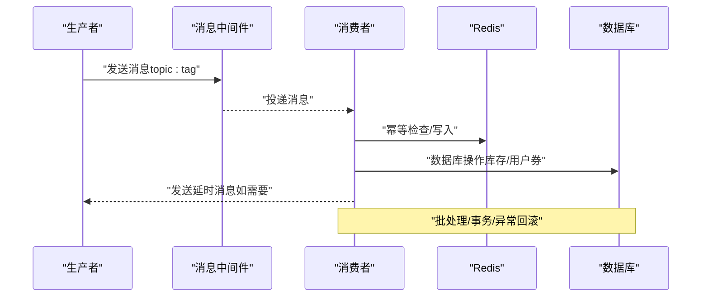
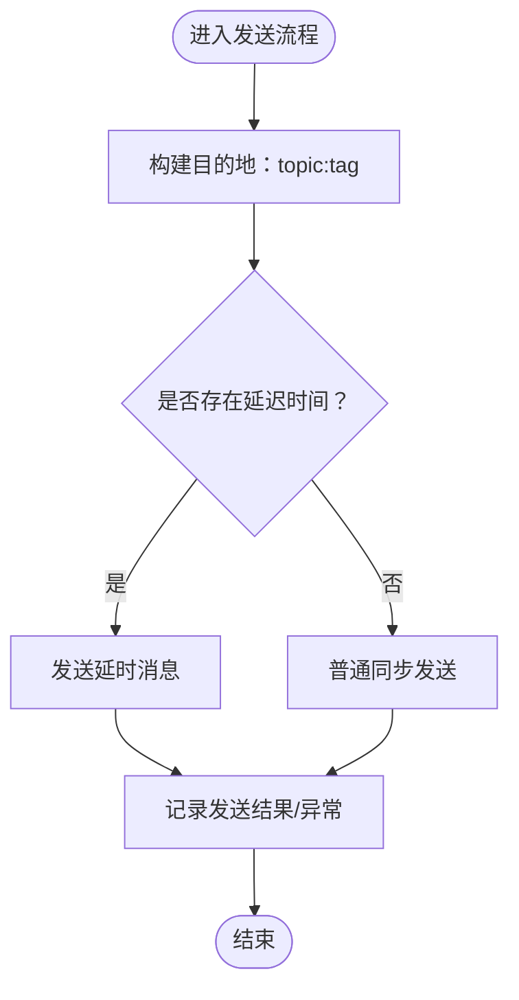
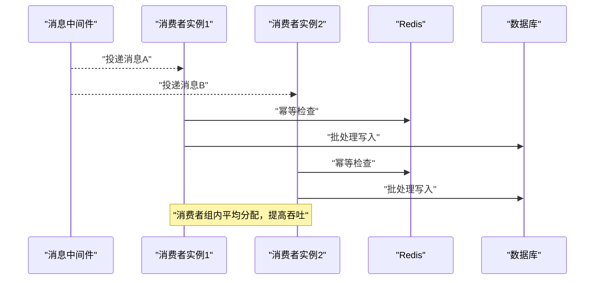
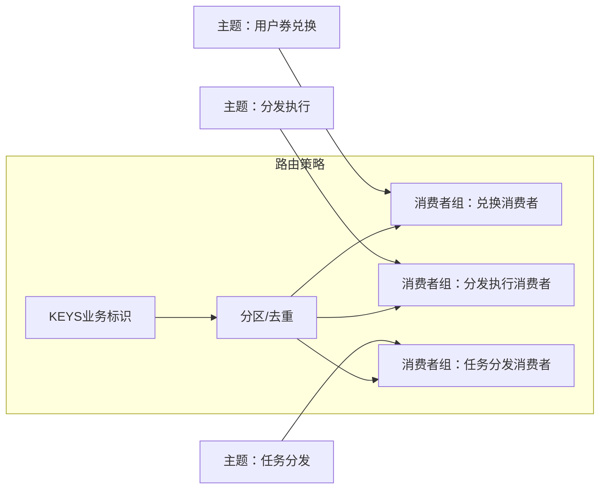
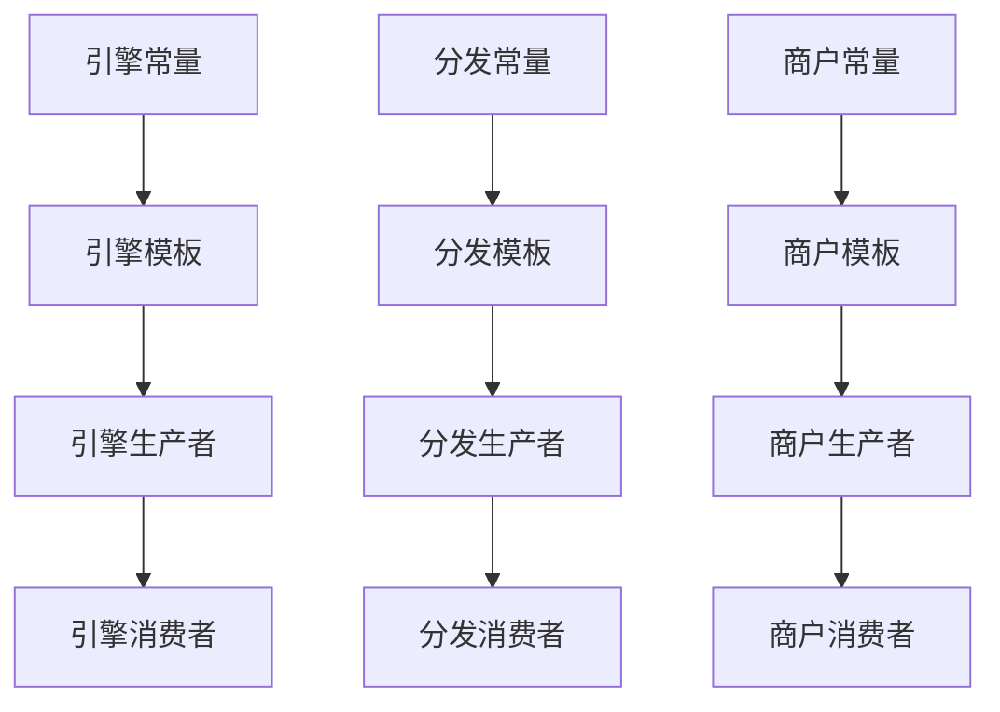

# 性能监控与调优

<cite>
**本文引用的文件**   
- [RocketMQConstant（引擎模块）](file://engine/src/main/java/com/fengxin/maplecoupon/engine/common/constant/RocketMQConstant.java)
- [RocketMQConstant（认证模块）](file://auth/src/main/java/com/fengxin/maplecoupon/auth/common/constant/RocketMQConstant.java)
- [RocketMQConstant（商户管理模块）](file://merchant-admin/src/main/java/com/fengxin/maplecoupon/merchantadmin/common/constant/RocketMQConstant.java)
- [RocketMQConstant（分发模块）](file://distribution/src/main/java/com/fengxin/maplecoupon/distribution/common/constant/RocketMQConstant.java)
- [AbstractCommonSendProduceTemplate（分发模块）](file://distribution/src/main/java/com/fengxin/maplecoupon/distribution/mq/design/AbstractCommonSendProduceTemplate.java)
- [AbstractCommonSendProduceTemplate（引擎模块）](file://engine/src/main/java/com/fengxin/maplecoupon/engine/mq/design/AbstractCommonSendProduceTemplate.java)
- [AbstractCommonSendProduceTemplate（商户管理模块）](file://merchant-admin/src/main/java/com/fengxin/maplecoupon/merchantadmin/mq/design/AbstractCommonSendProduceTemplate.java)
- [BaseSendExtendDTO（分发模块）](file://distribution/src/main/java/com/fengxin/maplecoupon/distribution/mq/design/BaseSendExtendDTO.java)
- [BaseSendExtendDTO（引擎模块）](file://engine/src/main/java/com/fengxin/maplecoupon/engine/mq/design/BaseSendExtendDTO.java)
- [BaseSendExtendDTO（商户管理模块）](file://merchant-admin/src/main/java/com/fengxin/maplecoupon/merchantadmin/mq/design/BaseSendExtendDTO.java)
- [CouponExecuteDistributionProducer](file://distribution/src/main/java/com/fengxin/maplecoupon/distribution/mq/producer/CouponExecuteDistributionProducer.java)
- [UserCouponRedeemProducer](file://engine/src/main/java/com/fengxin/maplecoupon/engine/mq/producer/UserCouponRedeemProducer.java)
- [CouponTemplateTaskProducer](file://merchant-admin/src/main/java/com/fengxin/maplecoupon/merchantadmin/mq/producer/CouponTemplateTaskProducer.java)
- [CouponExecuteDistributionConsumer](file://distribution/src/main/java/com/fengxin/maplecoupon/distribution/mq/consumer/CouponExecuteDistributionConsumer.java)
- [UserCouponRedeemConsumer](file://engine/src/main/java/com/fengxin/maplecoupon/engine/mq/consumer/UserCouponRedeemConsumer.java)
- [CouponTaskSendNumDelayConsumer](file://merchant-admin/src/main/java/com/fengxin/maplecoupon/merchantadmin/mq/consumer/CouponTaskSendNumDelayConsumer.java)
- [DuplicateMQConsumeAspect](file://framework/src/main/java/com/fengxin/idempotent/DuplicateMQConsumeAspect.java)
- [MQConsumeStatusEnum](file://framework/src/main/java/com/fengxin/enums/MQConsumeStatusEnum.java)
- [application-dev.yaml（分发模块）](file://distribution/src/main/resources/application-dev.yaml)
- [DBHashModShardingAlgorithm（分发模块）](file://distribution/src/main/java/com/fengxin/maplecoupon/distribution/dao/sharding/DBHashModShardingAlgorithm.java)
- [TableHashModShardingAlgorithm（分发模块）](file://distribution/src/main/java/com/fengxin/maplecoupon/distribution/dao/sharding/TableHashModShardingAlgorithm.java)
- [DBHashModShardingAlgorithm（结算模块）](file://settlement/src/main/java/com/fengxin/maplecoupon/settlement/dao/sharding/DBHashModShardingAlgorithm.java)
- [DBShardingUtil（引擎模块）](file://engine/src/main/java/com/fengxin/maplecoupon/engine/dao/sharding/DBShardingUtil.java)
- [DBShardingUtil（结算模块）](file://settlement/src/main/java/com/fengxin/maplecoupon/settlement/dao/sharding/DBShardingUtil.java)
</cite>

## 目录
1. [简介](#简介)
2. [项目结构](#项目结构)
3. [核心组件](#核心组件)
4. [架构总览](#架构总览)
5. [详细组件分析](#详细组件分析)
6. [依赖关系分析](#依赖关系分析)
7. [性能考量](#性能考量)
8. [故障排查指南](#故障排查指南)
9. [结论](#结论)
10. [附录](#附录)

## 简介
本技术文档围绕消息队列性能监控与调优展开，结合工程中 RocketMQ 的实际实现，系统阐述以下内容：
- 关键性能指标：消息吞吐量、端到端延迟、堆积量、消费者性能与幂等保障
- 调优参数：Producer/Consumer 线程数、批量大小、超时时间、重试策略等
- 消息路由与分区：主题/标签、消费者组、负载均衡与数据分布优化
- 瓶颈识别与解决：网络 I/O、磁盘 I/O、CPU 使用率的定位与优化
- 测试与压测：场景设计、指标采集与结果分析
- 扩容与容量规划：基于业务峰值与资源消耗的容量评估与扩容建议
- 高并发最佳实践：幂等、批处理、异步化、延迟队列与资源隔离

## 项目结构
本仓库采用多模块划分，RocketMQ 相关能力分布在“引擎”、“分发”、“商户管理”、“框架”等模块中，分别承担“事件产生、事件消费、幂等控制、常量与模板”等职责。

```mermaid
graph TB
subgraph "引擎模块"
E_Producer["UserCouponRedeemProducer"]
E_Consumer["UserCouponRedeemConsumer"]
E_Const["RocketMQConstant引擎"]
E_Template["AbstractCommonSendProduceTemplate引擎"]
end
subgraph "分发模块"
D_Producer["CouponExecuteDistributionProducer"]
D_Consumer["CouponExecuteDistributionConsumer"]
D_Const["RocketMQConstant分发"]
D_Template["AbstractCommonSendProduceTemplate分发"]
end
subgraph "商户管理模块"
M_Producer["CouponTemplateTaskProducer"]
M_Consumer["CouponTaskSendNumDelayConsumer"]
M_Const["RocketMQConstant商户管理"]
M_Template["AbstractCommonSendProduceTemplate商户管理"]
end
subgraph "框架"
F_Aop["DuplicateMQConsumeAspect"]
F_Enum["MQConsumeStatusEnum"]
end
E_Producer --> E_Const
D_Producer --> D_Const
M_Producer --> M_Const
E_Producer --> E_Template
D_Producer --> D_Template
M_Producer --> M_Template
E_Consumer --> E_Const
D_Consumer --> D_Const
M_Consumer --> M_Const
E_Consumer --> F_Aop
D_Consumer --> F_Aop
M_Consumer --> F_Aop
```

**图表来源**
- [RocketMQConstant（引擎模块）:1-50](file://engine/src/main/java/com/fengxin/maplecoupon/engine/common/constant/RocketMQConstant.java#L1-L50)
- [RocketMQConstant（分发模块）:1-31](file://distribution/src/main/java/com/fengxin/maplecoupon/distribution/common/constant/RocketMQConstant.java#L1-L31)
- [RocketMQConstant（商户管理模块）:1-33](file://merchant-admin/src/main/java/com/fengxin/maplecoupon/merchantadmin/common/constant/RocketMQConstant.java#L1-L33)
- [AbstractCommonSendProduceTemplate（引擎模块）:37-75](file://engine/src/main/java/com/fengxin/maplecoupon/engine/mq/design/AbstractCommonSendProduceTemplate.java#L37-L75)
- [AbstractCommonSendProduceTemplate（分发模块）:37-75](file://distribution/src/main/java/com/fengxin/maplecoupon/distribution/mq/design/AbstractCommonSendProduceTemplate.java#L37-L75)
- [AbstractCommonSendProduceTemplate（商户管理模块）:37-75](file://merchant-admin/src/main/java/com/fengxin/maplecoupon/merchantadmin/mq/design/AbstractCommonSendProduceTemplate.java#L37-L75)
- [UserCouponRedeemProducer:1-52](file://engine/src/main/java/com/fengxin/maplecoupon/engine/mq/producer/UserCouponRedeemProducer.java#L1-L52)
- [CouponExecuteDistributionProducer:1-52](file://distribution/src/main/java/com/fengxin/maplecoupon/distribution/mq/producer/CouponExecuteDistributionProducer.java#L1-L52)
- [CouponTemplateTaskProducer:1-53](file://merchant-admin/src/main/java/com/fengxin/maplecoupon/merchantadmin/mq/producer/CouponTemplateTaskProducer.java#L1-L53)
- [UserCouponRedeemConsumer:1-125](file://engine/src/main/java/com/fengxin/maplecoupon/engine/mq/consumer/UserCouponRedeemConsumer.java#L1-L125)
- [CouponExecuteDistributionConsumer:1-335](file://distribution/src/main/java/com/fengxin/maplecoupon/distribution/mq/consumer/CouponExecuteDistributionConsumer.java#L1-L335)
- [CouponTaskSendNumDelayConsumer:1-58](file://merchant-admin/src/main/java/com/fengxin/maplecoupon/merchantadmin/mq/consumer/CouponTaskSendNumDelayConsumer.java#L1-L58)
- [DuplicateMQConsumeAspect:38-86](file://framework/src/main/java/com/fengxin/idempotent/DuplicateMQConsumeAspect.java#L38-L86)
- [MQConsumeStatusEnum:1-38](file://framework/src/main/java/com/fengxin/enums/MQConsumeStatusEnum.java#L1-L38)

**章节来源**
- [RocketMQConstant（引擎模块）:1-50](file://engine/src/main/java/com/fengxin/maplecoupon/engine/common/constant/RocketMQConstant.java#L1-L50)
- [RocketMQConstant（分发模块）:1-31](file://distribution/src/main/java/com/fengxin/maplecoupon/distribution/common/constant/RocketMQConstant.java#L1-L31)
- [RocketMQConstant（商户管理模块）:1-33](file://merchant-admin/src/main/java/com/fengxin/maplecoupon/merchantadmin/common/constant/RocketMQConstant.java#L1-L33)

## 核心组件
- 生产者模板与具体生产者
  - 抽象模板统一构建消息目的地（topic:tag）、设置超时与延迟参数、记录发送日志与异常
  - 具体生产者负责填充事件名、topic、keys、sentTimeout 等参数，并构造消息载荷
- 消费者模板与具体消费者
  - 消费监听器按 topic 与 consumerGroup 接收消息，执行业务逻辑
  - 消费者内部结合 Redis、数据库、Excel 等进行批处理与幂等控制
- 幂等与状态枚举
  - 基于 Redis 的幂等切面，防止重复消费；消费状态枚举用于判断是否重试

**章节来源**
- [AbstractCommonSendProduceTemplate（分发模块）:37-75](file://distribution/src/main/java/com/fengxin/maplecoupon/distribution/mq/design/AbstractCommonSendProduceTemplate.java#L37-L75)
- [AbstractCommonSendProduceTemplate（引擎模块）:37-75](file://engine/src/main/java/com/fengxin/maplecoupon/engine/mq/design/AbstractCommonSendProduceTemplate.java#L37-L75)
- [AbstractCommonSendProduceTemplate（商户管理模块）:37-75](file://merchant-admin/src/main/java/com/fengxin/maplecoupon/merchantadmin/mq/design/AbstractCommonSendProduceTemplate.java#L37-L75)
- [BaseSendExtendDTO（分发模块）:1-48](file://distribution/src/main/java/com/fengxin/maplecoupon/distribution/mq/design/BaseSendExtendDTO.java#L1-L48)
- [BaseSendExtendDTO（引擎模块）:1-48](file://engine/src/main/java/com/fengxin/maplecoupon/engine/mq/design/BaseSendExtendDTO.java#L1-L48)
- [BaseSendExtendDTO（商户管理模块）:1-48](file://merchant-admin/src/main/java/com/fengxin/maplecoupon/merchantadmin/mq/design/BaseSendExtendDTO.java#L1-L48)
- [CouponExecuteDistributionProducer:1-52](file://distribution/src/main/java/com/fengxin/maplecoupon/distribution/mq/producer/CouponExecuteDistributionProducer.java#L1-L52)
- [UserCouponRedeemProducer:1-52](file://engine/src/main/java/com/fengxin/maplecoupon/engine/mq/producer/UserCouponRedeemProducer.java#L1-L52)
- [CouponTemplateTaskProducer:1-53](file://merchant-admin/src/main/java/com/fengxin/maplecoupon/merchantadmin/mq/producer/CouponTemplateTaskProducer.java#L1-L53)
- [CouponExecuteDistributionConsumer:1-335](file://distribution/src/main/java/com/fengxin/maplecoupon/distribution/mq/consumer/CouponExecuteDistributionConsumer.java#L1-L335)
- [UserCouponRedeemConsumer:1-125](file://engine/src/main/java/com/fengxin/maplecoupon/engine/mq/consumer/UserCouponRedeemConsumer.java#L1-L125)
- [CouponTaskSendNumDelayConsumer:1-58](file://merchant-admin/src/main/java/com/fengxin/maplecoupon/merchantadmin/mq/consumer/CouponTaskSendNumDelayConsumer.java#L1-L58)
- [DuplicateMQConsumeAspect:38-86](file://framework/src/main/java/com/fengxin/idempotent/DuplicateMQConsumeAspect.java#L38-L86)
- [MQConsumeStatusEnum:1-38](file://framework/src/main/java/com/fengxin/enums/MQConsumeStatusEnum.java#L1-L38)

## 架构总览
下图展示 RocketMQ 在各模块中的角色与交互：Producer 生成事件并发送到指定 Topic；Consumer 组订阅 Topic 并执行业务；幂等切面保障消费幂等；延迟队列用于异步延时处理。

**图表来源**
- [UserCouponRedeemProducer:1-52](file://engine/src/main/java/com/fengxin/maplecoupon/engine/mq/producer/UserCouponRedeemProducer.java#L1-L52)
- [CouponExecuteDistributionProducer:1-52](file://distribution/src/main/java/com/fengxin/maplecoupon/distribution/mq/producer/CouponExecuteDistributionProducer.java#L1-L52)
- [CouponTemplateTaskProducer:1-53](file://merchant-admin/src/main/java/com/fengxin/maplecoupon/merchantadmin/mq/producer/CouponTemplateTaskProducer.java#L1-L53)
- [UserCouponRedeemConsumer:1-125](file://engine/src/main/java/com/fengxin/maplecoupon/engine/mq/consumer/UserCouponRedeemConsumer.java#L1-L125)
- [CouponExecuteDistributionConsumer:1-335](file://distribution/src/main/java/com/fengxin/maplecoupon/distribution/mq/consumer/CouponExecuteDistributionConsumer.java#L1-L335)
- [CouponTaskSendNumDelayConsumer:1-58](file://merchant-admin/src/main/java/com/fengxin/maplecoupon/merchantadmin/mq/consumer/CouponTaskSendNumDelayConsumer.java#L1-L58)
- [DuplicateMQConsumeAspect:38-86](file://framework/src/main/java/com/fengxin/idempotent/DuplicateMQConsumeAspect.java#L38-L86)

## 详细组件分析

### 生产者模板与参数调优
- 参数要点
  - 发送超时：由 BaseSendExtendDTO.sentTimeout 控制，影响发送阻塞与失败重试
  - 延迟时间：由 BaseSendExtendDTO.delayTime 控制，用于延时消息
  - 目的地：topic:tag，确保路由与过滤
- 调优建议
  - Producer 线程数：根据 CPU 核数与网络带宽适度提升，避免过度竞争
  - 批量大小：批量发送可显著提升吞吐，但需平衡内存占用与延迟
  - 重试策略：同步发送失败重试次数应谨慎设置，避免放大流量风暴
  - 超时时间：结合网络 RTT 与业务 SLA 设定，过短易误判，过长影响响应

**图表来源**
- [AbstractCommonSendProduceTemplate（分发模块）:37-75](file://distribution/src/main/java/com/fengxin/maplecoupon/distribution/mq/design/AbstractCommonSendProduceTemplate.java#L37-L75)
- [AbstractCommonSendProduceTemplate（引擎模块）:37-75](file://engine/src/main/java/com/fengxin/maplecoupon/engine/mq/design/AbstractCommonSendProduceTemplate.java#L37-L75)
- [AbstractCommonSendProduceTemplate（商户管理模块）:37-75](file://merchant-admin/src/main/java/com/fengxin/maplecoupon/merchantadmin/mq/design/AbstractCommonSendProduceTemplate.java#L37-L75)
- [BaseSendExtendDTO（分发模块）:1-48](file://distribution/src/main/java/com/fengxin/maplecoupon/distribution/mq/design/BaseSendExtendDTO.java#L1-L48)
- [BaseSendExtendDTO（引擎模块）:1-48](file://engine/src/main/java/com/fengxin/maplecoupon/engine/mq/design/BaseSendExtendDTO.java#L1-L48)
- [BaseSendExtendDTO（商户管理模块）:1-48](file://merchant-admin/src/main/java/com/fengxin/maplecoupon/merchantadmin/mq/design/BaseSendExtendDTO.java#L1-L48)

**章节来源**
- [application-dev.yaml（分发模块）:13-19](file://distribution/src/main/resources/application-dev.yaml#L13-L19)
- [CouponExecuteDistributionProducer:32-40](file://distribution/src/main/java/com/fengxin/maplecoupon/distribution/mq/producer/CouponExecuteDistributionProducer.java#L32-L40)
- [UserCouponRedeemProducer:32-40](file://engine/src/main/java/com/fengxin/maplecoupon/engine/mq/producer/UserCouponRedeemProducer.java#L32-L40)
- [CouponTemplateTaskProducer:33-41](file://merchant-admin/src/main/java/com/fengxin/maplecoupon/merchantadmin/mq/producer/CouponTemplateTaskProducer.java#L33-L41)

### 消费者模板与消费者性能
- 消费者组与负载均衡
  - 每个 Topic 对应独立的消费者组，便于水平扩展与故障隔离
  - 消费者数量应与 Topic 分区数匹配，避免过多空闲消费者
- 批处理与幂等
  - 大量写入场景采用批处理与 Lua 脚本，降低网络往返与锁竞争
  - 幂等切面通过 Redis 标记消费状态，避免重复处理
- 延迟队列与异步化
  - 使用延时消息实现到期自动关闭等场景，减少轮询与 CPU 占用

**图表来源**
- [CouponExecuteDistributionConsumer:63-67](file://distribution/src/main/java/com/fengxin/maplecoupon/distribution/mq/consumer/CouponExecuteDistributionConsumer.java#L63-L67)
- [UserCouponRedeemConsumer:45-48](file://engine/src/main/java/com/fengxin/maplecoupon/engine/mq/consumer/UserCouponRedeemConsumer.java#L45-L48)
- [CouponTaskSendNumDelayConsumer:40-55](file://merchant-admin/src/main/java/com/fengxin/maplecoupon/merchantadmin/mq/consumer/CouponTaskSendNumDelayConsumer.java#L40-L55)
- [DuplicateMQConsumeAspect:38-86](file://framework/src/main/java/com/fengxin/idempotent/DuplicateMQConsumeAspect.java#L38-L86)

**章节来源**
- [CouponExecuteDistributionConsumer:1-335](file://distribution/src/main/java/com/fengxin/maplecoupon/distribution/mq/consumer/CouponExecuteDistributionConsumer.java#L1-L335)
- [UserCouponRedeemConsumer:1-125](file://engine/src/main/java/com/fengxin/maplecoupon/engine/mq/consumer/UserCouponRedeemConsumer.java#L1-L125)
- [CouponTaskSendNumDelayConsumer:1-58](file://merchant-admin/src/main/java/com/fengxin/maplecoupon/merchantadmin/mq/consumer/CouponTaskSendNumDelayConsumer.java#L1-L58)
- [DuplicateMQConsumeAspect:38-86](file://framework/src/main/java/com/fengxin/idempotent/DuplicateMQConsumeAspect.java#L38-L86)

### 消息路由与分区策略
- 主题与标签
  - 各模块通过 RocketMQConstant 统一维护主题与消费者组，保证一致性
- 分区与负载均衡
  - 通过消费者组内的多个实例实现分区消费的负载均衡
- 数据分布优化
  - 业务 keys 作为消息 KEYS，有助于 RocketMQ 的顺序与去重能力（结合幂等）
  - 分布式缓存与数据库分片算法配合，避免热点集中

**图表来源**
- [RocketMQConstant（引擎模块）:1-50](file://engine/src/main/java/com/fengxin/maplecoupon/engine/common/constant/RocketMQConstant.java#L1-L50)
- [RocketMQConstant（分发模块）:1-31](file://distribution/src/main/java/com/fengxin/maplecoupon/distribution/common/constant/RocketMQConstant.java#L1-L31)
- [RocketMQConstant（商户管理模块）:1-33](file://merchant-admin/src/main/java/com/fengxin/maplecoupon/merchantadmin/common/constant/RocketMQConstant.java#L1-L33)
- [CouponExecuteDistributionProducer:34-39](file://distribution/src/main/java/com/fengxin/maplecoupon/distribution/mq/producer/CouponExecuteDistributionProducer.java#L34-L39)
- [UserCouponRedeemProducer:34-39](file://engine/src/main/java/com/fengxin/maplecoupon/engine/mq/producer/UserCouponRedeemProducer.java#L34-L39)
- [CouponTemplateTaskProducer:35-40](file://merchant-admin/src/main/java/com/fengxin/maplecoupon/merchantadmin/mq/producer/CouponTemplateTaskProducer.java#L35-L40)

**章节来源**
- [DBHashModShardingAlgorithm（分发模块）:1-34](file://distribution/src/main/java/com/fengxin/maplecoupon/distribution/dao/sharding/DBHashModShardingAlgorithm.java#L1-L34)
- [TableHashModShardingAlgorithm（分发模块）:1-44](file://distribution/src/main/java/com/fengxin/maplecoupon/distribution/dao/sharding/TableHashModShardingAlgorithm.java#L1-L44)
- [DBHashModShardingAlgorithm（结算模块）:1-34](file://settlement/src/main/java/com/fengxin/maplecoupon/settlement/dao/sharding/DBHashModShardingAlgorithm.java#L1-L34)
- [DBShardingUtil（引擎模块）:1-37](file://engine/src/main/java/com/fengxin/maplecoupon/engine/dao/sharding/DBShardingUtil.java#L1-L37)
- [DBShardingUtil（结算模块）:1-37](file://settlement/src/main/java/com/fengxin/maplecoupon/settlement/dao/sharding/DBShardingUtil.java#L1-L37)

## 依赖关系分析
- 模块间耦合
  - 各模块通过 RocketMQConstant 与抽象模板解耦，生产者与消费者仅依赖常量与模板接口
- 外部依赖
  - RocketMQ Spring Boot Starter、Redis、MyBatis Plus、EasyExcel 等
- 循环依赖
  - 当前结构未见循环依赖，消费者通过 RocketMQ 注解声明订阅，避免反向依赖

**图表来源**
- [RocketMQConstant（引擎模块）:1-50](file://engine/src/main/java/com/fengxin/maplecoupon/engine/common/constant/RocketMQConstant.java#L1-L50)
- [RocketMQConstant（分发模块）:1-31](file://distribution/src/main/java/com/fengxin/maplecoupon/distribution/common/constant/RocketMQConstant.java#L1-L31)
- [RocketMQConstant（商户管理模块）:1-33](file://merchant-admin/src/main/java/com/fengxin/maplecoupon/merchantadmin/common/constant/RocketMQConstant.java#L1-L33)
- [AbstractCommonSendProduceTemplate（引擎模块）:37-75](file://engine/src/main/java/com/fengxin/maplecoupon/engine/mq/design/AbstractCommonSendProduceTemplate.java#L37-L75)
- [AbstractCommonSendProduceTemplate（分发模块）:37-75](file://distribution/src/main/java/com/fengxin/maplecoupon/distribution/mq/design/AbstractCommonSendProduceTemplate.java#L37-L75)
- [AbstractCommonSendProduceTemplate（商户管理模块）:37-75](file://merchant-admin/src/main/java/com/fengxin/maplecoupon/merchantadmin/mq/design/AbstractCommonSendProduceTemplate.java#L37-L75)
- [CouponExecuteDistributionProducer:1-52](file://distribution/src/main/java/com/fengxin/maplecoupon/distribution/mq/producer/CouponExecuteDistributionProducer.java#L1-L52)
- [UserCouponRedeemProducer:1-52](file://engine/src/main/java/com/fengxin/maplecoupon/engine/mq/producer/UserCouponRedeemProducer.java#L1-L52)
- [CouponTemplateTaskProducer:1-53](file://merchant-admin/src/main/java/com/fengxin/maplecoupon/merchantadmin/mq/producer/CouponTemplateTaskProducer.java#L1-L53)
- [CouponExecuteDistributionConsumer:1-335](file://distribution/src/main/java/com/fengxin/maplecoupon/distribution/mq/consumer/CouponExecuteDistributionConsumer.java#L1-L335)
- [UserCouponRedeemConsumer:1-125](file://engine/src/main/java/com/fengxin/maplecoupon/engine/mq/consumer/UserCouponRedeemConsumer.java#L1-L125)
- [CouponTaskSendNumDelayConsumer:1-58](file://merchant-admin/src/main/java/com/fengxin/maplecoupon/merchantadmin/mq/consumer/CouponTaskSendNumDelayConsumer.java#L1-L58)

**章节来源**
- [RocketMQConstant（引擎模块）:1-50](file://engine/src/main/java/com/fengxin/maplecoupon/engine/common/constant/RocketMQConstant.java#L1-L50)
- [RocketMQConstant（分发模块）:1-31](file://distribution/src/main/java/com/fengxin/maplecoupon/distribution/common/constant/RocketMQConstant.java#L1-L31)
- [RocketMQConstant（商户管理模块）:1-33](file://merchant-admin/src/main/java/com/fengxin/maplecoupon/merchantadmin/common/constant/RocketMQConstant.java#L1-L33)

## 性能考量
- 指标监控
  - 吞吐量：统计发送/接收速率与积压消息数
  - 延迟：从生产到消费的端到端时延，关注 99 分位
  - 积压：消费者组未消费消息数，反映消费能力与流量匹配度
  - 消费者性能：并发度、批处理效率、幂等命中率
- 调优参数
  - Producer：线程数、批量大小、发送超时、重试次数
  - Consumer：并发线程、拉取批量、预读队列、ACK 策略
- 资源瓶颈
  - 网络 I/O：消息大小、序列化开销、网络带宽
  - 磁盘 I/O：批量写入、刷盘策略、SSD/RAID
  - CPU：序列化/反序列化、批处理、Lua 脚本执行
- 路由与分区
  - keys 均匀分布，避免热点；消费者组规模与分区数匹配
- 幂等与事务
  - 幂等切面降低重复消费；事务写入与补偿机制减少脏数据

[本节为通用性能讨论，无需列出具体文件来源]

## 故障排查指南
- 常见问题
  - 发送超时：检查 sentTimeout、网络抖动、NameServer/Broker 可用性
  - 消费堆积：检查消费者并发、批处理效率、数据库写入性能
  - 幂等冲突：确认 Redis 键空间与过期策略，避免误删
  - 延时消息未触发：核对 deliverTimeMills 与 Broker 配置
- 排查步骤
  - 查看生产日志与发送结果
  - 查看消费日志与异常栈
  - 校验 Redis 幂等键与状态
  - 监控消费者组积压与处理速率
  - 回放消息验证幂等与业务逻辑

**章节来源**
- [CouponExecuteDistributionProducer:64-72](file://distribution/src/main/java/com/fengxin/maplecoupon/distribution/mq/producer/CouponExecuteDistributionProducer.java#L64-L72)
- [UserCouponRedeemProducer:64-70](file://engine/src/main/java/com/fengxin/maplecoupon/engine/mq/producer/UserCouponRedeemProducer.java#L64-L70)
- [CouponExecuteDistributionConsumer:84-91](file://distribution/src/main/java/com/fengxin/maplecoupon/distribution/mq/consumer/CouponExecuteDistributionConsumer.java#L84-L91)
- [UserCouponRedeemConsumer:118-123](file://engine/src/main/java/com/fengxin/maplecoupon/engine/mq/consumer/UserCouponRedeemConsumer.java#L118-L123)
- [DuplicateMQConsumeAspect:38-86](file://framework/src/main/java/com/fengxin/idempotent/DuplicateMQConsumeAspect.java#L38-L86)

## 结论
通过统一的 RocketMQ 常量与抽象模板，结合幂等控制与批处理优化，本项目在高并发场景下实现了稳定的消息流转。建议持续关注发送/消费延迟、积压与资源使用情况，按业务峰值动态调整 Producer/Consumer 并发与批处理参数，并完善监控告警与压测体系以支撑容量规划与性能回归。

[本节为总结性内容，无需列出具体文件来源]

## 附录
- 测试与压测建议
  - 压测场景：峰值 QPS、突发流量、长时间稳定压测
  - 指标采集：吞吐、P99 延迟、积压、CPU/内存/IO、网络带宽
  - 结果分析：定位瓶颈（Producer/Consumer/Broker/存储），迭代调参
- 扩容与容量规划
  - 依据峰值 QPS 与消息大小估算带宽与存储
  - 提升消费者并发与批处理，必要时增加 Topic 分区
  - 通过 Redis 与数据库分片缓解热点，避免单点瓶颈

[本节为通用实践建议，无需列出具体文件来源]