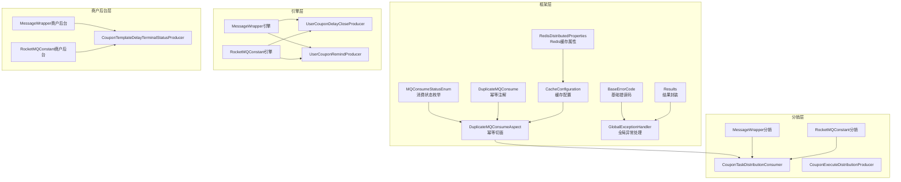
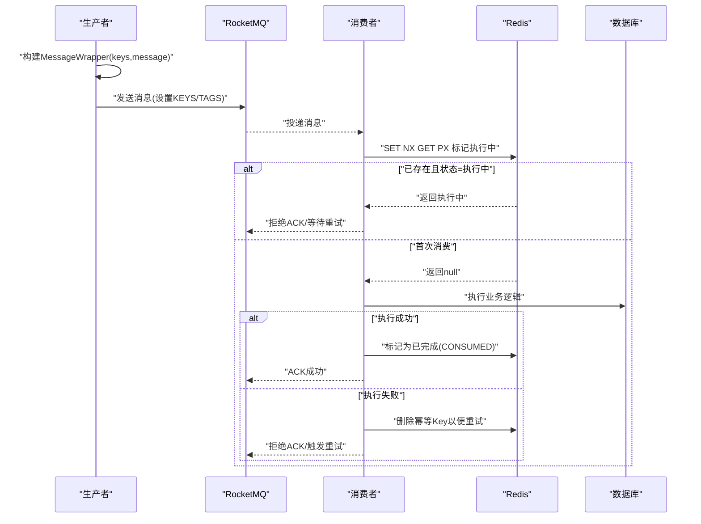
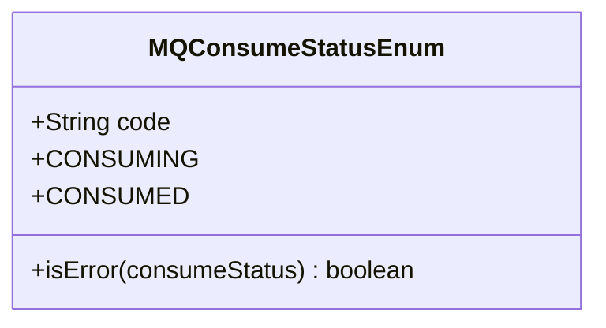
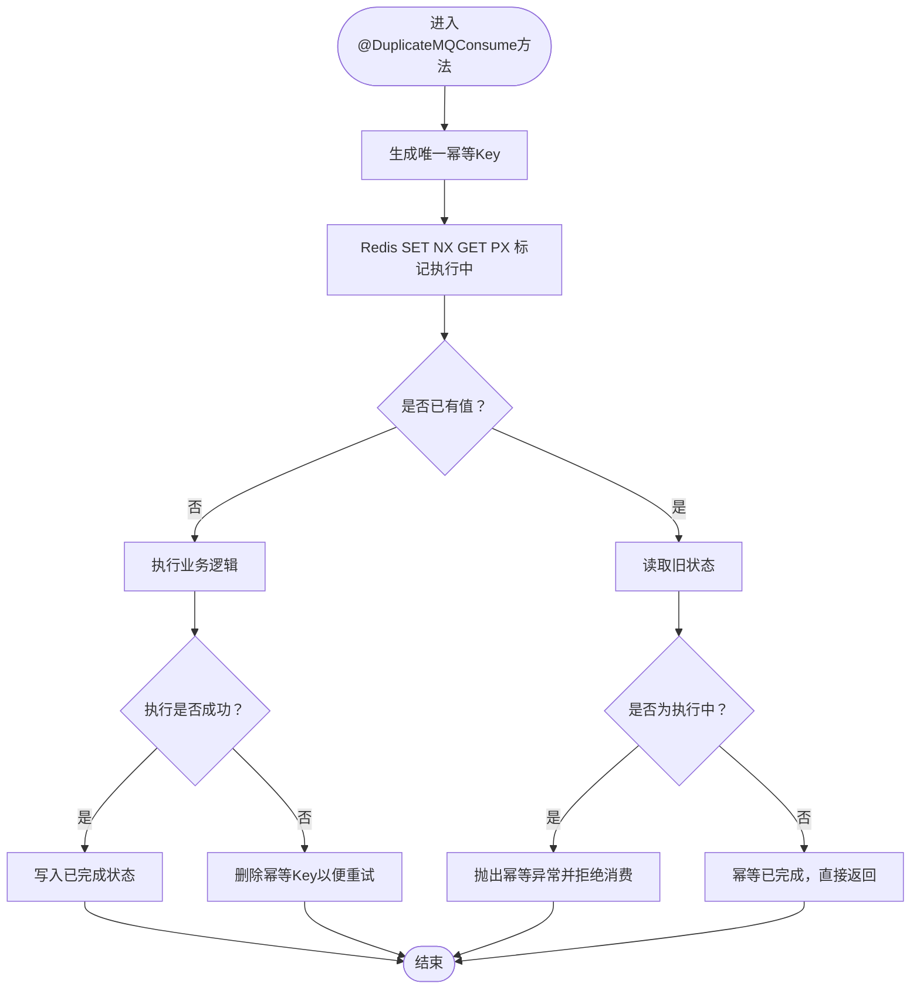
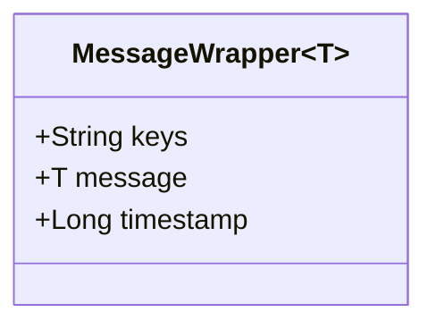
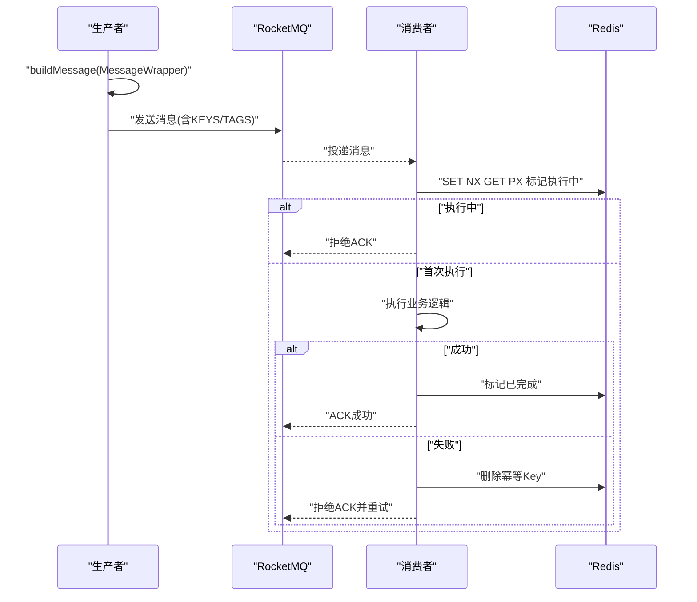
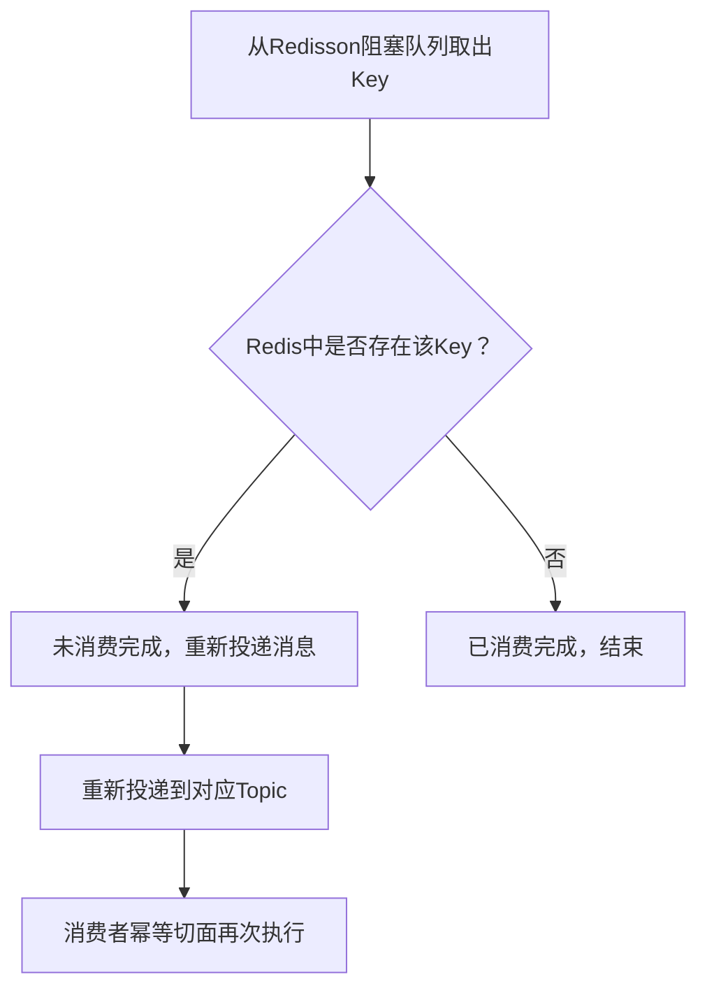
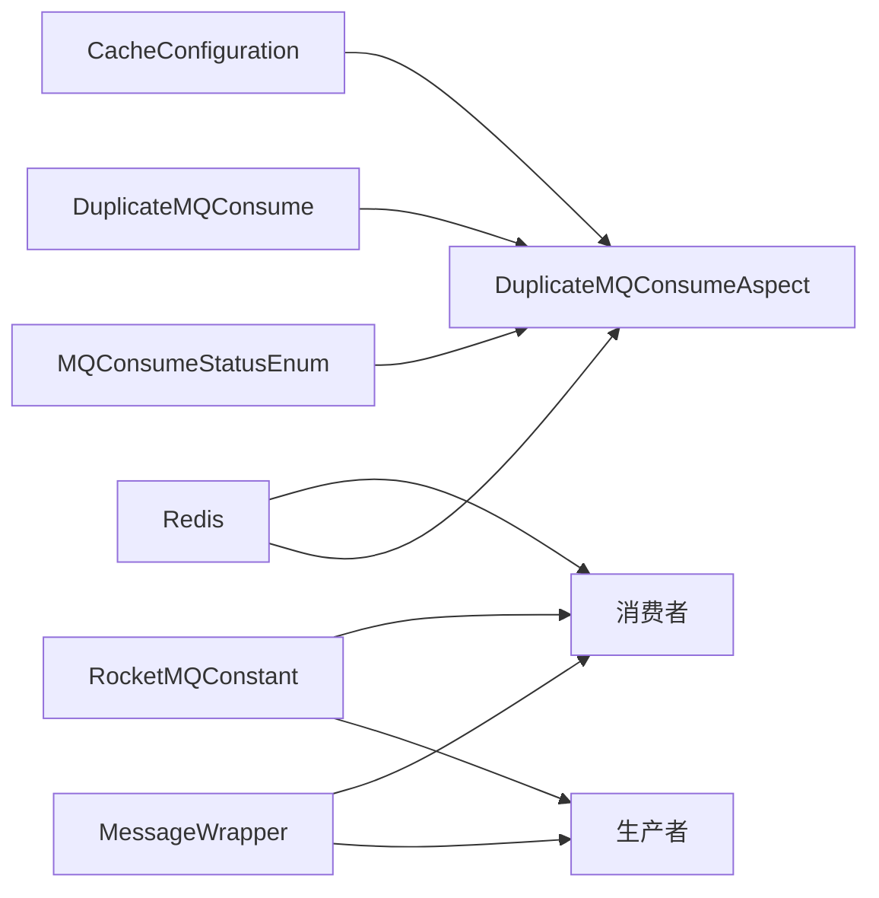

# 消息可靠性保障

<cite>
**本文引用的文件**
- [MQConsumeStatusEnum.java](file://framework/src/main/java/com/fengxin/enums/MQConsumeStatusEnum.java)
- [DuplicateMQConsume.java](file://framework/src/main/java/com/fengxin/idempotent/DuplicateMQConsume.java)
- [DuplicateMQConsumeAspect.java](file://framework/src/main/java/com/fengxin/idempotent/DuplicateMQConsumeAspect.java)
- [MessageWrapper.java（引擎模块）](file://engine/src/main/java/com/fengxin/maplecoupon/engine/mq/design/MessageWrapper.java)
- [MessageWrapper.java（分销模块）](file://distribution/src/main/java/com/fengxin/maplecoupon/distribution/mq/design/MessageWrapper.java)
- [MessageWrapper.java（商户后台模块）](file://merchant-admin/src/main/java/com/fengxin/maplecoupon/merchantadmin/mq/design/MessageWrapper.java)
- [UserCouponDelayCloseProducer.java](file://engine/src/main/java/com/fengxin/maplecoupon/engine/mq/producer/UserCouponDelayCloseProducer.java)
- [UserCouponRemindProducer.java](file://engine/src/main/java/com/fengxin/maplecoupon/engine/mq/producer/UserCouponRemindProducer.java)
- [CouponTemplateDelayTerminalStatusProducer.java](file://merchant-admin/src/main/java/com/fengxin/maplecoupon/merchantadmin/mq/producer/CouponTemplateDelayTerminalStatusProducer.java)
- [CouponTaskDistributionConsumer.java](file://distribution/src/main/java/com/fengxin/maplecoupon/distribution/mq/consumer/CouponTaskDistributionConsumer.java)
- [RocketMQConstant（引擎）](file://engine/src/main/java/com/fengxin/maplecoupon/engine/common/constant/RocketMQConstant.java)
- [RocketMQConstant（认证）](file://auth/src/main/java/com/fengxin/maplecoupon/auth/common/constant/RocketMQConstant.java)
- [application-dev.yaml（引擎）](file://engine/src/main/resources/application-dev.yaml)
- [application-dev.yaml（分销）](file://distribution/src/main/resources/application-dev.yaml)
- [application-dev.yaml（商户后台）](file://merchant-admin/src/main/resources/application-dev.yaml)
- [RemindUserCouponTemplateImpl.java](file://engine/src/main/java/com/fengxin/maplecoupon/engine/service/handler/service/impl/RemindUserCouponTemplateImpl.java)
- [BaseErrorCode.java](file://framework/src/main/java/com/fengxin/errorcode/BaseErrorCode.java)
- [GlobalExceptionHandler.java](file://framework/src/main/java/com/fengxin/web/GlobalExceptionHandler.java)
- [Results.java](file://framework/src/main/java/com/fengxin/web/Results.java)
- [RedisDistributedProperties.java](file://framework/src/main/java/com/fengxin/config/RedisDistributedProperties.java)
- [CacheConfiguration.java](file://framework/src/main/java/com/fengxin/config/CacheConfiguration.java)
</cite>

## 目录
1. [引言](#引言)
2. [项目结构](#项目结构)
3. [核心组件](#核心组件)
4. [架构总览](#架构总览)
5. [详细组件分析](#详细组件分析)
6. [依赖分析](#依赖分析)
7. [性能考虑](#性能考虑)
8. [故障排查指南](#故障排查指南)
9. [结论](#结论)
10. [附录](#附录)

## 引言
本技术文档聚焦于MapleCoupon中消息可靠性保障的实现与最佳实践，围绕以下目标展开：
- 消息确认、ACK机制与失败重试策略
- MessageWrapper的设计与使用：消息包装、元数据管理与错误处理
- MQConsumeStatusEnum的状态管理：成功、失败与重试状态的定义与转换
- 消息去重与幂等性保证：唯一标识符生成与重复检测
- 消息监控与告警：消费延迟监控、堆积告警与异常通知
- 故障恢复与数据一致性：实现方案与灾难恢复建议

## 项目结构
MapleCoupon采用多模块架构，消息可靠性相关能力在框架层（framework）、引擎层（engine）、分销层（distribution）、商户后台层（merchant-admin）均有体现。RocketMQ作为消息中间件，结合Redis实现幂等控制；各模块通过统一的常量与设计模式确保一致性。

图表来源
- [MQConsumeStatusEnum.java:1-38](file://framework/src/main/java/com/fengxin/enums/MQConsumeStatusEnum.java#L1-L38)
- [DuplicateMQConsume.java:1-31](file://framework/src/main/java/com/fengxin/idempotent/DuplicateMQConsume.java#L1-L31)
- [DuplicateMQConsumeAspect.java:1-86](file://framework/src/main/java/com/fengxin/idempotent/DuplicateMQConsumeAspect.java#L1-L86)
- [MessageWrapper.java（引擎模块）:1-42](file://engine/src/main/java/com/fengxin/maplecoupon/engine/mq/design/MessageWrapper.java#L1-L42)
- [MessageWrapper.java（分销模块）:1-42](file://distribution/src/main/java/com/fengxin/maplecoupon/distribution/mq/design/MessageWrapper.java#L1-L42)
- [MessageWrapper.java（商户后台模块）:1-42](file://merchant-admin/src/main/java/com/fengxin/maplecoupon/merchantadmin/mq/design/MessageWrapper.java#L1-L42)
- [UserCouponDelayCloseProducer.java:34-52](file://engine/src/main/java/com/fengxin/maplecoupon/engine/mq/producer/UserCouponDelayCloseProducer.java#L34-L52)
- [UserCouponRemindProducer.java:33-52](file://engine/src/main/java/com/fengxin/maplecoupon/engine/mq/producer/UserCouponRemindProducer.java#L33-L52)
- [CouponTaskDistributionConsumer.java:42-88](file://distribution/src/main/java/com/fengxin/maplecoupon/distribution/mq/consumer/CouponTaskDistributionConsumer.java#L42-L88)
- [CouponTemplateDelayTerminalStatusProducer.java:29-51](file://merchant-admin/src/main/java/com/fengxin/maplecoupon/merchantadmin/mq/producer/CouponTemplateDelayTerminalStatusProducer.java#L29-L51)
- [RocketMQConstant（引擎）:1-49](file://engine/src/main/java/com/fengxin/maplecoupon/engine/common/constant/RocketMQConstant.java#L1-L49)
- [RocketMQConstant（认证）:1-49](file://auth/src/main/java/com/fengxin/maplecoupon/auth/common/constant/RocketMQConstant.java#L1-L49)
- [RedisDistributedProperties.java:1-24](file://framework/src/main/java/com/fengxin/config/RedisDistributedProperties.java#L1-L24)
- [CacheConfiguration.java:1-35](file://framework/src/main/java/com/fengxin/config/CacheConfiguration.java#L1-L35)

章节来源
- [RocketMQConstant（引擎）:1-49](file://engine/src/main/java/com/fengxin/maplecoupon/engine/common/constant/RocketMQConstant.java#L1-L49)
- [RocketMQConstant（认证）:1-49](file://auth/src/main/java/com/fengxin/maplecoupon/auth/common/constant/RocketMQConstant.java#L1-L49)
- [application-dev.yaml（引擎）:1-37](file://engine/src/main/resources/application-dev.yaml#L1-L37)
- [application-dev.yaml（分销）:1-20](file://distribution/src/main/resources/application-dev.yaml#L1-L20)
- [application-dev.yaml（商户后台）:1-20](file://merchant-admin/src/main/resources/application-dev.yaml#L1-L20)

## 核心组件
- MQConsumeStatusEnum：定义“消费中”“消费完成”两种状态，提供判断是否处于“消费中”的静态方法，用于触发重试。
- DuplicateMQConsume：幂等注解，声明幂等键前缀、SpEL表达式生成的唯一键与过期时间。
- DuplicateMQConsumeAspect：基于Redis Lua脚本的幂等切面，利用SET NX GET PX原子操作实现“执行中/已完成”状态标记与冲突检测。
- MessageWrapper：泛型消息包装器，包含业务键（keys）、消息体（message）与发送时间戳（timestamp），用于消息去重与追踪。
- 生产者与消费者：生产者负责构建MessageWrapper并设置RocketMQ消息头（KEYS/TAGS），消费者通过注解与切面实现幂等消费。

章节来源
- [MQConsumeStatusEnum.java:15-37](file://framework/src/main/java/com/fengxin/enums/MQConsumeStatusEnum.java#L15-L37)
- [DuplicateMQConsume.java:16-31](file://framework/src/main/java/com/fengxin/idempotent/DuplicateMQConsume.java#L16-L31)
- [DuplicateMQConsumeAspect.java:33-72](file://framework/src/main/java/com/fengxin/idempotent/DuplicateMQConsumeAspect.java#L33-L72)
- [MessageWrapper.java（引擎模块）:19-41](file://engine/src/main/java/com/fengxin/maplecoupon/engine/mq/design/MessageWrapper.java#L19-L41)
- [MessageWrapper.java（分销模块）:19-41](file://distribution/src/main/java/com/fengxin/maplecoupon/distribution/mq/design/MessageWrapper.java#L19-L41)
- [MessageWrapper.java（商户后台模块）:19-41](file://merchant-admin/src/main/java/com/fengxin/maplecoupon/merchantadmin/mq/design/MessageWrapper.java#L19-L41)

## 架构总览
消息可靠性保障由“生产端-传输层-消费端-存储/缓存”四部分协同实现：
- 生产端：构建MessageWrapper，设置KEYS与TAGS，启用RocketMQ重试与超时配置。
- 传输层：RocketMQ NameServer与Topic/ConsumerGroup配置，确保消息有序与可重放。
- 消费端：幂等注解+切面，基于Redis原子操作实现“执行中/已完成”状态标记，避免重复消费。
- 存储/缓存：Redis用于幂等令牌与状态标记，必要时结合本地阻塞队列实现兜底重试。

图表来源
- [DuplicateMQConsumeAspect.java:44-71](file://framework/src/main/java/com/fengxin/idempotent/DuplicateMQConsumeAspect.java#L44-L71)
- [UserCouponDelayCloseProducer.java:44-50](file://engine/src/main/java/com/fengxin/maplecoupon/engine/mq/producer/UserCouponDelayCloseProducer.java#L44-L50)
- [UserCouponRemindProducer.java:44-50](file://engine/src/main/java/com/fengxin/maplecoupon/engine/mq/producer/UserCouponRemindProducer.java#L44-L50)
- [CouponTemplateDelayTerminalStatusProducer.java:43-49](file://merchant-admin/src/main/java/com/fengxin/maplecoupon/merchantadmin/mq/producer/CouponTemplateDelayTerminalStatusProducer.java#L43-L49)

## 详细组件分析

### MQConsumeStatusEnum：消费状态管理
- 定义“消费中（CONSUMING）”“消费完成（CONSUMED）”，并提供静态方法判断是否应触发重试。
- 在幂等切面中，若Redis返回“消费中”则抛出异常，阻止重复执行；若返回“已完成”则直接跳过。

图表来源
- [MQConsumeStatusEnum.java:15-37](file://framework/src/main/java/com/fengxin/enums/MQConsumeStatusEnum.java#L15-L37)

章节来源
- [MQConsumeStatusEnum.java:15-37](file://framework/src/main/java/com/fengxin/enums/MQConsumeStatusEnum.java#L15-L37)

### DuplicateMQConsume与DuplicateMQConsumeAspect：幂等与重试
- 注解参数：
  - keyPrefix：幂等Key前缀，便于命名空间隔离
  - key：SpEL表达式，动态生成唯一键（如任务ID）
  - timeout：幂等Key过期时间（秒）
- 切面逻辑：
  - 使用Lua脚本原子地SET NX GET PX，首次成功写入“执行中”，否则根据返回值判断是否重试或跳过
  - 成功后写入“已完成”状态；异常时删除幂等Key，允许消息队列重试

图表来源
- [DuplicateMQConsume.java:16-31](file://framework/src/main/java/com/fengxin/idempotent/DuplicateMQConsume.java#L16-L31)
- [DuplicateMQConsumeAspect.java:44-71](file://framework/src/main/java/com/fengxin/idempotent/DuplicateMQConsumeAspect.java#L44-L71)

章节来源
- [DuplicateMQConsume.java:16-31](file://framework/src/main/java/com/fengxin/idempotent/DuplicateMQConsume.java#L16-L31)
- [DuplicateMQConsumeAspect.java:33-72](file://framework/src/main/java/com/fengxin/idempotent/DuplicateMQConsumeAspect.java#L33-L72)

### MessageWrapper：消息包装与元数据管理
- 字段：
  - keys：消息发送键，用于幂等与去重
  - message：业务消息体
  - timestamp：消息发送时间戳
- 使用场景：
  - 生产端：在生产者构建MessageWrapper并设置RocketMQ消息头（KEYS/TAGS）
  - 消费端：幂等切面以keys为维度进行状态标记与冲突检测

图表来源
- [MessageWrapper.java（引擎模块）:19-41](file://engine/src/main/java/com/fengxin/maplecoupon/engine/mq/design/MessageWrapper.java#L19-L41)
- [MessageWrapper.java（分销模块）:19-41](file://distribution/src/main/java/com/fengxin/maplecoupon/distribution/mq/design/MessageWrapper.java#L19-L41)
- [MessageWrapper.java（商户后台模块）:19-41](file://merchant-admin/src/main/java/com/fengxin/maplecoupon/merchantadmin/mq/design/MessageWrapper.java#L19-L41)

章节来源
- [MessageWrapper.java（引擎模块）:19-41](file://engine/src/main/java/com/fengxin/maplecoupon/engine/mq/design/MessageWrapper.java#L19-L41)
- [MessageWrapper.java（分销模块）:19-41](file://distribution/src/main/java/com/fengxin/maplecoupon/distribution/mq/design/MessageWrapper.java#L19-L41)
- [MessageWrapper.java（商户后台模块）:19-41](file://merchant-admin/src/main/java/com/fengxin/maplecoupon/merchantadmin/mq/design/MessageWrapper.java#L19-L41)

### 生产者与消费者：ACK与重试策略
- 生产者：
  - 构建MessageWrapper并设置RocketMQ消息头（KEYS/TAGS）
  - 设置发送超时与同步/异步重试次数，确保消息可靠投递
- 消费者：
  - 使用@DuplicateMQConsume注解与幂等切面，结合Redis实现“执行中/已完成”状态标记
  - 失败时删除幂等Key，触发消息队列重试；成功时写入“已完成”

图表来源
- [UserCouponDelayCloseProducer.java:44-50](file://engine/src/main/java/com/fengxin/maplecoupon/engine/mq/producer/UserCouponDelayCloseProducer.java#L44-L50)
- [UserCouponRemindProducer.java:44-50](file://engine/src/main/java/com/fengxin/maplecoupon/engine/mq/producer/UserCouponRemindProducer.java#L44-L50)
- [CouponTemplateDelayTerminalStatusProducer.java:43-49](file://merchant-admin/src/main/java/com/fengxin/maplecoupon/merchantadmin/mq/producer/CouponTemplateDelayTerminalStatusProducer.java#L43-L49)
- [CouponTaskDistributionConsumer.java:49-66](file://distribution/src/main/java/com/fengxin/maplecoupon/distribution/mq/consumer/CouponTaskDistributionConsumer.java#L49-L66)
- [DuplicateMQConsumeAspect.java:44-71](file://framework/src/main/java/com/fengxin/idempotent/DuplicateMQConsumeAspect.java#L44-L71)

章节来源
- [UserCouponDelayCloseProducer.java:34-52](file://engine/src/main/java/com/fengxin/maplecoupon/engine/mq/producer/UserCouponDelayCloseProducer.java#L34-L52)
- [UserCouponRemindProducer.java:33-52](file://engine/src/main/java/com/fengxin/maplecoupon/engine/mq/producer/UserCouponRemindProducer.java#L33-L52)
- [CouponTemplateDelayTerminalStatusProducer.java:29-51](file://merchant-admin/src/main/java/com/fengxin/maplecoupon/merchantadmin/mq/producer/CouponTemplateDelayTerminalStatusProducer.java#L29-L51)
- [CouponTaskDistributionConsumer.java:42-88](file://distribution/src/main/java/com/fengxin/maplecoupon/distribution/mq/consumer/CouponTaskDistributionConsumer.java#L42-L88)
- [application-dev.yaml（引擎）:15-19](file://engine/src/main/resources/application-dev.yaml#L15-L19)
- [application-dev.yaml（分销）:15-19](file://distribution/src/main/resources/application-dev.yaml#L15-L19)
- [application-dev.yaml（商户后台）:15-19](file://merchant-admin/src/main/resources/application-dev.yaml#L15-L19)

### 延迟任务与兜底重试：Redis阻塞队列
- 引擎侧通过Redisson阻塞队列与Redis键存在性检测，实现延迟任务的兜底重试：
  - 若Redis中仍存在幂等Key，表示任务未完成，可能是消费机器宕机，重新投递消息
  - 该机制与幂等切面配合，确保最终一致性

图表来源
- [RemindUserCouponTemplateImpl.java:115-122](file://engine/src/main/java/com/fengxin/maplecoupon/engine/service/handler/service/impl/RemindUserCouponTemplateImpl.java#L115-L122)

章节来源
- [RemindUserCouponTemplateImpl.java:100-122](file://engine/src/main/java/com/fengxin/maplecoupon/engine/service/handler/service/impl/RemindUserCouponTemplateImpl.java#L100-L122)

## 依赖分析
- 组件耦合与协作：
  - MQConsumeStatusEnum与DuplicateMQConsumeAspect强关联，前者提供状态语义，后者实现状态落地
  - MessageWrapper贯穿生产与消费两端，作为幂等Key与消息体的载体
  - RocketMQ常量集中管理Topic与ConsumerGroup，确保跨模块一致性
  - Redis配置通过CacheConfiguration注入Key序列化器，提升幂等Key的可维护性
- 外部依赖：
  - RocketMQ：NameServer、生产者组、发送超时与重试配置
  - Redis：幂等令牌、状态标记、阻塞队列

图表来源
- [MQConsumeStatusEnum.java:15-37](file://framework/src/main/java/com/fengxin/enums/MQConsumeStatusEnum.java#L15-L37)
- [DuplicateMQConsume.java:16-31](file://framework/src/main/java/com/fengxin/idempotent/DuplicateMQConsume.java#L16-L31)
- [DuplicateMQConsumeAspect.java:33-72](file://framework/src/main/java/com/fengxin/idempotent/DuplicateMQConsumeAspect.java#L33-L72)
- [MessageWrapper.java（引擎模块）:19-41](file://engine/src/main/java/com/fengxin/maplecoupon/engine/mq/design/MessageWrapper.java#L19-L41)
- [RocketMQConstant（引擎）:9-49](file://engine/src/main/java/com/fengxin/maplecoupon/engine/common/constant/RocketMQConstant.java#L9-L49)
- [CacheConfiguration.java:24-34](file://framework/src/main/java/com/fengxin/config/CacheConfiguration.java#L24-L34)

章节来源
- [CacheConfiguration.java:1-35](file://framework/src/main/java/com/fengxin/config/CacheConfiguration.java#L1-L35)
- [RedisDistributedProperties.java:1-24](file://framework/src/main/java/com/fengxin/config/RedisDistributedProperties.java#L1-L24)

## 性能考虑
- 幂等Key过期时间（timeout）需结合业务峰值与重试窗口权衡，避免过短导致频繁重试、过长导致资源占用
- Redis Lua脚本原子性写入，减少网络往返与竞争条件
- RocketMQ发送超时与重试次数应与下游处理能力匹配，避免消息积压
- 消费线程池与并发度需与Topic分区数协调，避免单点瓶颈

## 故障排查指南
- 幂等异常（重复消费）：
  - 现象：日志提示“幂等校验生效，当前正在消费中……”
  - 处理：检查幂等Key过期时间与业务执行耗时，适当延长timeout；确认消费者幂等注解key表达式是否稳定
- ACK失败与重试：
  - 现象：消费者抛出异常后Redis幂等Key被删除，消息被RocketMQ重试
  - 处理：查看全局异常处理器输出，定位具体异常原因；优化业务逻辑或外部依赖
- 消息堆积：
  - 现象：消费延迟上升、Redis阻塞队列长度增长
  - 处理：扩容消费者实例、增加Topic分区、优化业务处理耗时；检查RocketMQ消费组状态
- 异常通知与监控：
  - 建议：结合全局异常处理器与日志采集，建立消费延迟、堆积告警与异常通知机制

章节来源
- [DuplicateMQConsumeAspect.java:53-71](file://framework/src/main/java/com/fengxin/idempotent/DuplicateMQConsumeAspect.java#L53-L71)
- [GlobalExceptionHandler.java:45-64](file://framework/src/main/java/com/fengxin/web/GlobalExceptionHandler.java#L45-L64)
- [BaseErrorCode.java:28-33](file://framework/src/main/java/com/fengxin/errorcode/BaseErrorCode.java#L28-L33)
- [Results.java:48-66](file://framework/src/main/java/com/fengxin/web/Results.java#L48-L66)

## 结论
MapleCoupon通过“幂等注解+Redis原子标记+RocketMQ重试+延迟兜底重试”的组合拳，实现了消息可靠性保障。MessageWrapper作为统一载体贯穿全链路，MQConsumeStatusEnum提供明确的状态语义。配合合理的超时与重试配置、监控告警与异常处理，系统在高并发与复杂业务场景下具备良好的稳定性与一致性。

## 附录
- 最佳实践建议：
  - 明确幂等Key生成规则（如任务ID、用户ID、业务单号），确保全局唯一
  - 控制幂等Key过期时间，兼顾重试窗口与资源占用
  - 对关键路径启用延迟兜底重试，结合Redis阻塞队列与幂等切面
  - 建立消费延迟、堆积与异常的监控指标，配置阈值告警
  - 灾难恢复：备份RocketMQ与Redis数据，演练消费者扩缩容与故障切换