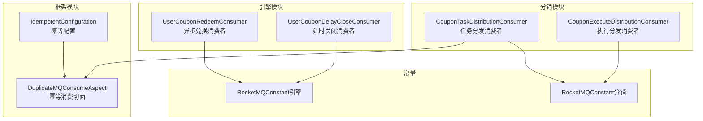
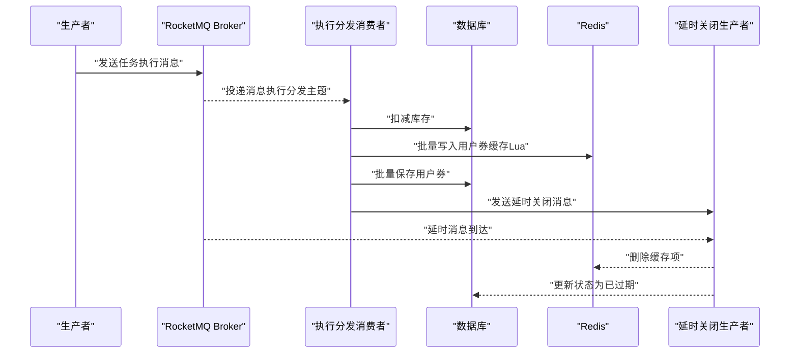
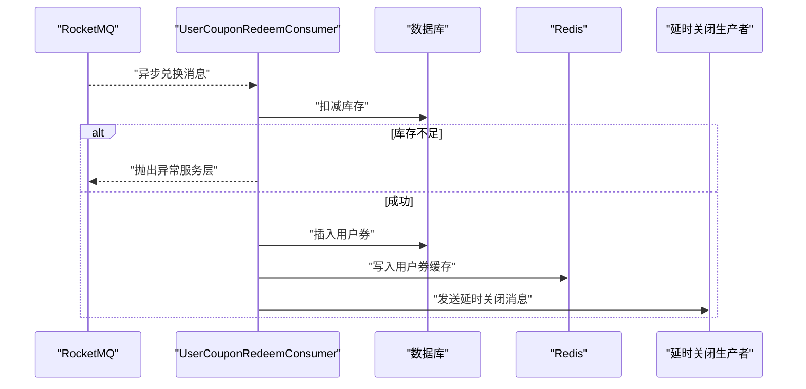
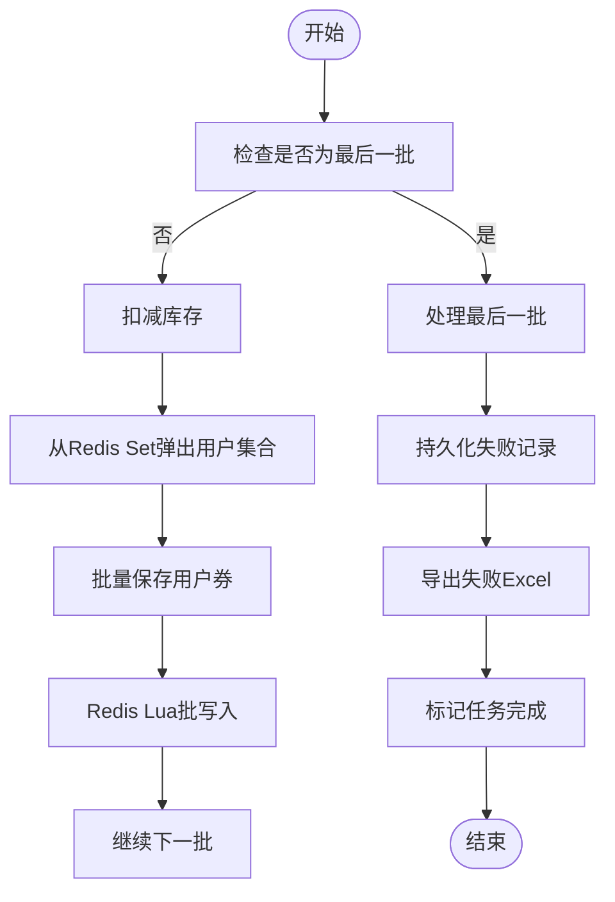
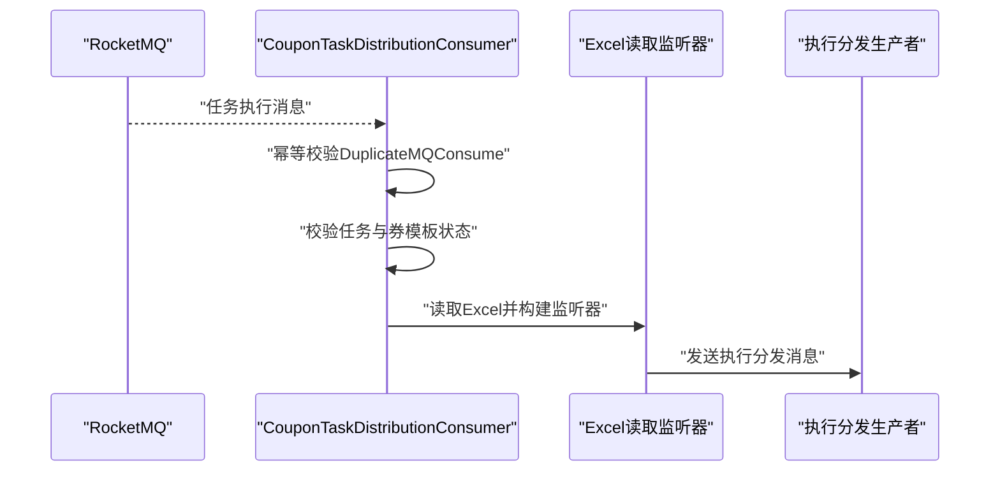
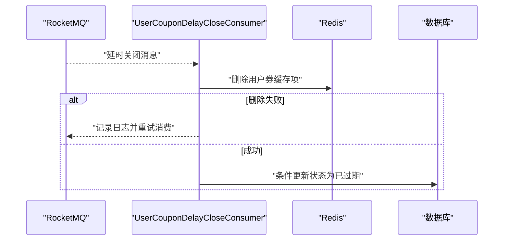
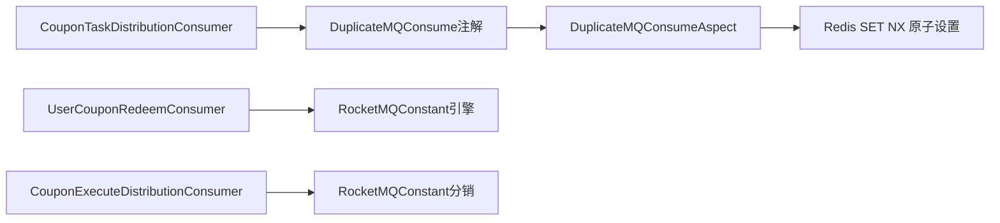

# 消息消费者实现

<cite>
**本文引用的文件**
- [CouponExecuteDistributionConsumer.java](file://distribution/src/main/java/com/fengxin/maplecoupon/distribution/mq/consumer/CouponExecuteDistributionConsumer.java)
- [UserCouponRedeemConsumer.java](file://engine/src/main/java/com/fengxin/maplecoupon/engine/mq/consumer/UserCouponRedeemConsumer.java)
- [UserCouponDelayCloseConsumer.java](file://engine/src/main/java/com/fengxin/maplecoupon/engine/mq/consumer/UserCouponDelayCloseConsumer.java)
- [CouponTaskDistributionConsumer.java](file://distribution/src/main/java/com/fengxin/maplecoupon/distribution/mq/consumer/CouponTaskDistributionConsumer.java)
- [IdempotentConfiguration.java](file://framework/src/main/java/com/fengxin/config/IdempotentConfiguration.java)
- [DuplicateMQConsumeAspect.java](file://framework/src/main/java/com/fengxin/idempotent/DuplicateMQConsumeAspect.java)
- [MQConsumeStatusEnum.java](file://framework/src/main/java/com/fengxin/enums/MQConsumeStatusEnum.java)
- [RocketMQConstant.java（引擎模块）](file://engine/src/main/java/com/fengxin/maplecoupon/engine/common/constant/RocketMQConstant.java)
- [RocketMQConstant.java（分销模块）](file://distribution/src/main/java/com/fengxin/maplecoupon/distribution/common/constant/RocketMQConstant.java)
- [application.yaml（引擎）](file://engine/src/main/resources/application.yaml)
- [application.yaml（分销）](file://distribution/src/main/resources/application.yaml)
</cite>

## 目录
1. [简介](#简介)
2. [项目结构](#项目结构)
3. [核心组件](#核心组件)
4. [架构总览](#架构总览)
5. [详细组件分析](#详细组件分析)
6. [依赖分析](#依赖分析)
7. [性能考虑](#性能考虑)
8. [故障排查指南](#故障排查指南)
9. [结论](#结论)
10. [附录](#附录)

## 简介
本文围绕消息消费者实现展开，重点覆盖以下内容：
- 核心消费者实现模式：UserCouponRedeemConsumer、CouponExecuteDistributionConsumer、CouponTaskDistributionConsumer、UserCouponDelayCloseConsumer
- 并发处理机制：线程池配置、消息批处理与消费速率控制
- 幂等性保证：去重策略与重复消费处理
- 异常处理与重试：本地重试、Broker重试与死信队列
- 性能监控与调优：消费延迟、堆积与吞吐量
- 扩容与缩容：消费者实例扩展与负载均衡配置

## 项目结构
本项目采用多模块架构，消息消费者分布在不同业务模块中：
- 引擎模块（engine）：负责用户优惠券兑换、延时关闭等核心消费逻辑
- 分销模块（distribution）：负责优惠券任务分发与执行消费
- 框架模块（framework）：提供幂等消费切面与通用常量

图表来源
- [UserCouponRedeemConsumer.java:45-48](file://engine/src/main/java/com/fengxin/maplecoupon/engine/mq/consumer/UserCouponRedeemConsumer.java#L45-L48)
- [UserCouponDelayCloseConsumer.java:32-35](file://engine/src/main/java/com/fengxin/maplecoupon/engine/mq/consumer/UserCouponDelayCloseConsumer.java#L32-L35)
- [CouponTaskDistributionConsumer.java:38-41](file://distribution/src/main/java/com/fengxin/maplecoupon/distribution/mq/consumer/CouponTaskDistributionConsumer.java#L38-L41)
- [CouponExecuteDistributionConsumer.java:63-66](file://distribution/src/main/java/com/fengxin/maplecoupon/distribution/mq/consumer/CouponExecuteDistributionConsumer.java#L63-L66)
- [IdempotentConfiguration.java:35-38](file://framework/src/main/java/com/fengxin/config/IdempotentConfiguration.java#L35-L38)
- [RocketMQConstant.java（引擎模块）:30-38](file://engine/src/main/java/com/fengxin/maplecoupon/engine/common/constant/RocketMQConstant.java#L30-L38)
- [RocketMQConstant.java（分销模块）:21-29](file://distribution/src/main/java/com/fengxin/maplecoupon/distribution/common/constant/RocketMQConstant.java#L21-L29)

章节来源
- [application.yaml（引擎）:1-22](file://engine/src/main/resources/application.yaml#L1-L22)
- [application.yaml（分销）:1-15](file://distribution/src/main/resources/application.yaml#L1-L15)

## 核心组件
- 引擎模块消费者
  - UserCouponRedeemConsumer：处理用户优惠券异步兑换，包含库存扣减、用户券入库、Redis缓存写入与延时关闭消息发送
  - UserCouponDelayCloseConsumer：处理延时关闭事件，清理Redis缓存并更新数据库状态
- 分销模块消费者
  - CouponTaskDistributionConsumer：读取Excel并进行前置校验，触发执行分发流程
  - CouponExecuteDistributionConsumer：执行库存扣减、用户券批量入库、Redis Lua批处理、失败记录持久化与任务完成收尾

章节来源
- [UserCouponRedeemConsumer.java:49-124](file://engine/src/main/java/com/fengxin/maplecoupon/engine/mq/consumer/UserCouponRedeemConsumer.java#L49-L124)
- [UserCouponDelayCloseConsumer.java:37-69](file://engine/src/main/java/com/fengxin/maplecoupon/engine/mq/consumer/UserCouponDelayCloseConsumer.java#L37-L69)
- [CouponTaskDistributionConsumer.java:42-87](file://distribution/src/main/java/com/fengxin/maplecoupon/distribution/mq/consumer/CouponTaskDistributionConsumer.java#L42-L87)
- [CouponExecuteDistributionConsumer.java:67-163](file://distribution/src/main/java/com/fengxin/maplecoupon/distribution/mq/consumer/CouponExecuteDistributionConsumer.java#L67-L163)

## 架构总览
消息消费者通过RocketMQ监听指定主题与消费者组，结合幂等切面与延时消息实现可靠消费。

图表来源
- [CouponExecuteDistributionConsumer.java:170-243](file://distribution/src/main/java/com/fengxin/maplecoupon/distribution/mq/consumer/CouponExecuteDistributionConsumer.java#L170-L243)
- [UserCouponDelayCloseConsumer.java:40-67](file://engine/src/main/java/com/fengxin/maplecoupon/engine/mq/consumer/UserCouponDelayCloseConsumer.java#L40-L67)

## 详细组件分析

### UserCouponRedeemConsumer（异步兑换消费者）
职责与流程
- 接收异步兑换事件，扣减券模板库存
- 新增用户优惠券记录，写入Redis缓存
- 发送延时关闭消息，到期自动失效

关键点
- 使用事务确保库存扣减与用户券写入的一致性
- Redis写入失败时进行二次确认与重试
- 延时消息发送失败时记录日志并报警，便于人工重投

图表来源
- [UserCouponRedeemConsumer.java:55-123](file://engine/src/main/java/com/fengxin/maplecoupon/engine/mq/consumer/UserCouponRedeemConsumer.java#L55-L123)

章节来源
- [UserCouponRedeemConsumer.java:49-124](file://engine/src/main/java/com/fengxin/maplecoupon/engine/mq/consumer/UserCouponRedeemConsumer.java#L49-L124)

### CouponExecuteDistributionConsumer（执行分发消费者）
职责与流程
- 接收执行分发事件，按批次扣减库存并批量保存用户券
- 使用Redis Set缓存待发放用户，Lua脚本批量写入用户券缓存
- 处理库存不足与重复领取导致的失败，持久化失败原因并回滚库存
- 任务完成后标记完成时间与状态

关键点
- 批量大小阈值与Redis Set弹出配合，避免一次性处理过多
- Lua脚本批处理提升Redis写入吞吐
- 失败记录分页导出至Excel（本地），便于后续人工处理

图表来源
- [CouponExecuteDistributionConsumer.java:80-162](file://distribution/src/main/java/com/fengxin/maplecoupon/distribution/mq/consumer/CouponExecuteDistributionConsumer.java#L80-L162)

章节来源
- [CouponExecuteDistributionConsumer.java:67-163](file://distribution/src/main/java/com/fengxin/maplecoupon/distribution/mq/consumer/CouponExecuteDistributionConsumer.java#L67-L163)

### CouponTaskDistributionConsumer（任务分发消费者）
职责与流程
- 接收任务执行事件，进行前置校验（任务状态、券模板状态）
- 通过EasyExcel读取文件，构建Excel读取监听器
- 触发执行分发生产者，将逐批用户写入执行分发主题

关键点
- 使用幂等切面防止重复消费
- 前置校验失败直接返回，避免无效处理

图表来源
- [CouponTaskDistributionConsumer.java:49-87](file://distribution/src/main/java/com/fengxin/maplecoupon/distribution/mq/consumer/CouponTaskDistributionConsumer.java#L49-L87)
- [DuplicateMQConsumeAspect.java:39-72](file://framework/src/main/java/com/fengxin/idempotent/DuplicateMQConsumeAspect.java#L39-L72)

章节来源
- [CouponTaskDistributionConsumer.java:42-87](file://distribution/src/main/java/com/fengxin/maplecoupon/distribution/mq/consumer/CouponTaskDistributionConsumer.java#L42-L87)

### UserCouponDelayCloseConsumer（延时关闭消费者）
职责与流程
- 接收延时关闭事件，删除Redis缓存中的用户券记录
- 条件更新数据库状态为“已过期”，确保幂等

图表来源
- [UserCouponDelayCloseConsumer.java:40-67](file://engine/src/main/java/com/fengxin/maplecoupon/engine/mq/consumer/UserCouponDelayCloseConsumer.java#L40-L67)

章节来源
- [UserCouponDelayCloseConsumer.java:37-69](file://engine/src/main/java/com/fengxin/maplecoupon/engine/mq/consumer/UserCouponDelayCloseConsumer.java#L37-L69)

## 依赖分析
- 消费者与常量
  - 引擎模块消费者绑定引擎模块RocketMQ常量
  - 分销模块消费者绑定分销模块RocketMQ常量
- 幂等依赖
  - CouponTaskDistributionConsumer通过注解启用幂等切面
  - DuplicateMQConsumeAspect基于Redis实现幂等令牌，LUA脚本保证原子性

图表来源
- [CouponTaskDistributionConsumer.java:49-53](file://distribution/src/main/java/com/fengxin/maplecoupon/distribution/mq/consumer/CouponTaskDistributionConsumer.java#L49-L53)
- [DuplicateMQConsumeAspect.java:44-48](file://framework/src/main/java/com/fengxin/idempotent/DuplicateMQConsumeAspect.java#L44-L48)
- [RocketMQConstant.java（引擎模块）:30-38](file://engine/src/main/java/com/fengxin/maplecoupon/engine/common/constant/RocketMQConstant.java#L30-L38)
- [RocketMQConstant.java（分销模块）:21-29](file://distribution/src/main/java/com/fengxin/maplecoupon/distribution/common/constant/RocketMQConstant.java#L21-L29)

章节来源
- [IdempotentConfiguration.java:35-38](file://framework/src/main/java/com/fengxin/config/IdempotentConfiguration.java#L35-L38)
- [DuplicateMQConsumeAspect.java:39-72](file://framework/src/main/java/com/fengxin/idempotent/DuplicateMQConsumeAspect.java#L39-L72)
- [MQConsumeStatusEnum.java:15-37](file://framework/src/main/java/com/fengxin/enums/MQConsumeStatusEnum.java#L15-L37)

## 性能考虑
- 并发与批处理
  - 执行分发消费者采用Redis Set缓存待发放用户，按批次弹出并批量保存，降低单次内存压力
  - 批量保存用户券时，若出现唯一索引冲突，逐条插入并记录失败原因，避免全量回滚
  - Redis批写入通过Lua脚本减少网络往返
- 消费速率控制
  - RocketMQ消费者线程池与并发度由Spring Boot Starter RocketMQ配置决定；建议根据CPU核数与磁盘I/O能力调整
  - 对于高吞吐场景，可通过拆分主题与消费者组、增加消费者实例数实现水平扩展
- 延迟与堆积
  - 通过延时消息实现到期自动失效，避免长时间占用资源
  - 监控消费延迟与堆积指标，必要时动态扩容消费者实例
- 吞吐量优化
  - 批量入库与Lua批写入显著提升Redis写入性能
  - 数据库层面使用MyBatis Plus批处理接口，减少JDBC往返

章节来源
- [CouponExecuteDistributionConsumer.java:170-243](file://distribution/src/main/java/com/fengxin/maplecoupon/distribution/mq/consumer/CouponExecuteDistributionConsumer.java#L170-L243)
- [CouponExecuteDistributionConsumer.java:275-316](file://distribution/src/main/java/com/fengxin/maplecoupon/distribution/mq/consumer/CouponExecuteDistributionConsumer.java#L275-L316)

## 故障排查指南
- 幂等异常
  - 现象：重复消费被拦截，抛出幂等异常
  - 处理：检查幂等键生成规则与超时时间，确认Redis可用性
- 库存不足
  - 现象：库存扣减失败，抛出服务异常
  - 处理：检查券模板库存与并发消费情况，必要时限流或扩容
- Redis写入失败
  - 现象：Redis写入后查询为空，触发二次写入或延时消息重试
  - 处理：检查Redis主从复制与网络稳定性，必要时启用重试与告警
- 延时消息未达
  - 现象：延时关闭消息未触发
  - 处理：检查Broker延时级别与消息路由，查看日志并重投

章节来源
- [DuplicateMQConsumeAspect.java:50-71](file://framework/src/main/java/com/fengxin/idempotent/DuplicateMQConsumeAspect.java#L50-L71)
- [UserCouponRedeemConsumer.java:105-122](file://engine/src/main/java/com/fengxin/maplecoupon/engine/mq/consumer/UserCouponRedeemConsumer.java#L105-L122)
- [UserCouponDelayCloseConsumer.java:53-67](file://engine/src/main/java/com/fengxin/maplecoupon/engine/mq/consumer/UserCouponDelayCloseConsumer.java#L53-L67)

## 结论
本项目的消息消费者通过明确的主题与消费者组划分、幂等切面保障、延时消息与Lua批处理等手段，实现了高可靠、高性能的异步处理链路。在实际运行中，应重点关注并发度与批处理大小的平衡、Redis与数据库的稳定性，以及监控与告警体系的完善。

## 附录

### 并发处理机制与线程池配置
- RocketMQ消费者线程池与并发度由Spring Boot Starter RocketMQ默认配置提供；如需定制，可在应用配置中设置消费者线程池大小与并发度参数
- 建议根据CPU核数与磁盘I/O能力进行压测，确定最优并发度

章节来源
- [application.yaml（引擎）:1-22](file://engine/src/main/resources/application.yaml#L1-L22)
- [application.yaml（分销）:1-15](file://distribution/src/main/resources/application.yaml#L1-L15)

### 消息批处理与消费速率控制
- 批处理策略
  - 执行分发消费者按批次从Redis Set弹出用户并批量保存，避免单次处理过大
  - 失败记录分页导出，避免一次性导出大量数据
- 速率控制
  - 通过拆分主题与消费者组、增加消费者实例数实现水平扩展
  - 结合Broker端的消费速率限制与客户端重试策略，避免瞬时洪峰

章节来源
- [CouponExecuteDistributionConsumer.java:83-91](file://distribution/src/main/java/com/fengxin/maplecoupon/distribution/mq/consumer/CouponExecuteDistributionConsumer.java#L83-L91)
- [CouponExecuteDistributionConsumer.java:132-152](file://distribution/src/main/java/com/fengxin/maplecoupon/distribution/mq/consumer/CouponExecuteDistributionConsumer.java#L132-L152)

### 幂等性保证与重复消费处理
- 幂等键生成
  - CouponTaskDistributionConsumer使用注解指定幂等键前缀与SpEL表达式，结合Redis SET NX实现原子去重
- 重复消费处理
  - 若检测到正在消费或已完成，直接返回或抛出幂等异常
  - 消费异常时删除幂等键，允许Broker重试重新消费

章节来源
- [CouponTaskDistributionConsumer.java:49-53](file://distribution/src/main/java/com/fengxin/maplecoupon/distribution/mq/consumer/CouponTaskDistributionConsumer.java#L49-L53)
- [DuplicateMQConsumeAspect.java:40-71](file://framework/src/main/java/com/fengxin/idempotent/DuplicateMQConsumeAspect.java#L40-L71)
- [MQConsumeStatusEnum.java:15-37](file://framework/src/main/java/com/fengxin/enums/MQConsumeStatusEnum.java#L15-L37)

### 异常处理与重试机制
- 本地重试
  - Redis写入失败时进行二次写入与延时消息重试
- Broker重试
  - 幂等切面在异常时删除幂等键，触发Broker重试
- 死信队列
  - 建议对无法处理的异常消息进入死信队列，以便人工干预与重投

章节来源
- [UserCouponRedeemConsumer.java:105-122](file://engine/src/main/java/com/fengxin/maplecoupon/engine/mq/consumer/UserCouponRedeemConsumer.java#L105-L122)
- [DuplicateMQConsumeAspect.java:66-70](file://framework/src/main/java/com/fengxin/idempotent/DuplicateMQConsumeAspect.java#L66-L70)

### 性能监控与调优
- 关键指标
  - 消费延迟、堆积量、吞吐量、失败率、重试次数
- 调优建议
  - 动态扩容消费者实例，监控Broker与消费者端指标
  - 优化批处理大小与Redis批写入脚本，减少网络往返

章节来源
- [CouponExecuteDistributionConsumer.java:170-243](file://distribution/src/main/java/com/fengxin/maplecoupon/distribution/mq/consumer/CouponExecuteDistributionConsumer.java#L170-L243)

### 扩容与缩容策略
- 扩容
  - 增加消费者实例数，确保同一消费者组内的实例数大于等于分区数
  - 拆分主题与消费者组，实现业务隔离与独立扩展
- 缩容
  - 平滑迁移流量，避免消费者组内实例数小于分区数导致的消费停滞
  - 监控消费延迟与堆积，逐步减少实例数

章节来源
- [RocketMQConstant.java（引擎模块）:30-38](file://engine/src/main/java/com/fengxin/maplecoupon/engine/common/constant/RocketMQConstant.java#L30-L38)
- [RocketMQConstant.java（分销模块）:21-29](file://distribution/src/main/java/com/fengxin/maplecoupon/distribution/common/constant/RocketMQConstant.java#L21-L29)