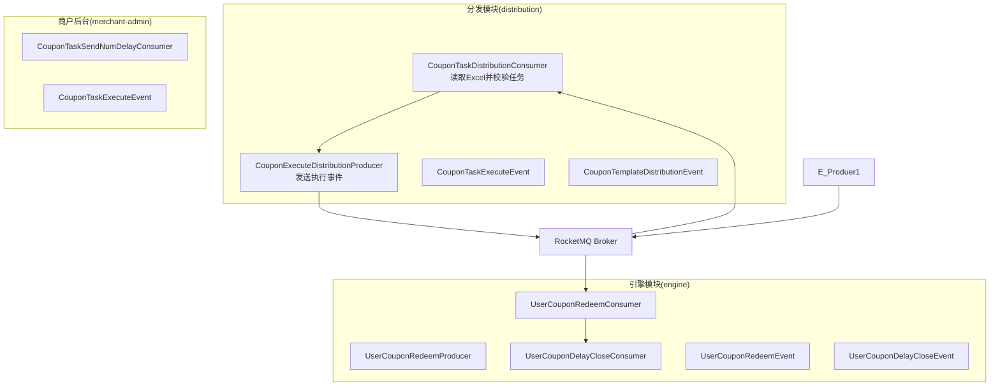
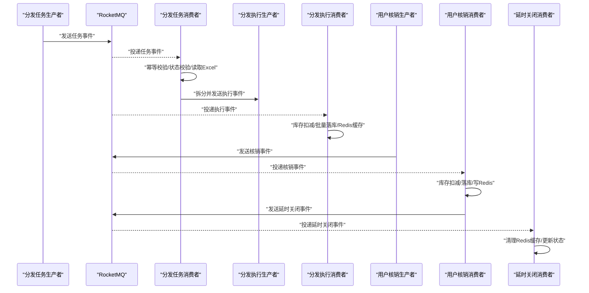
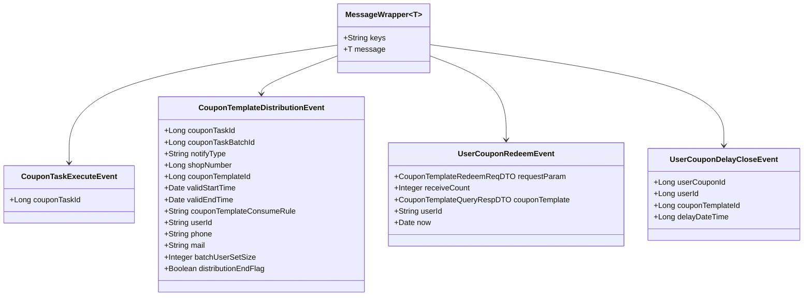
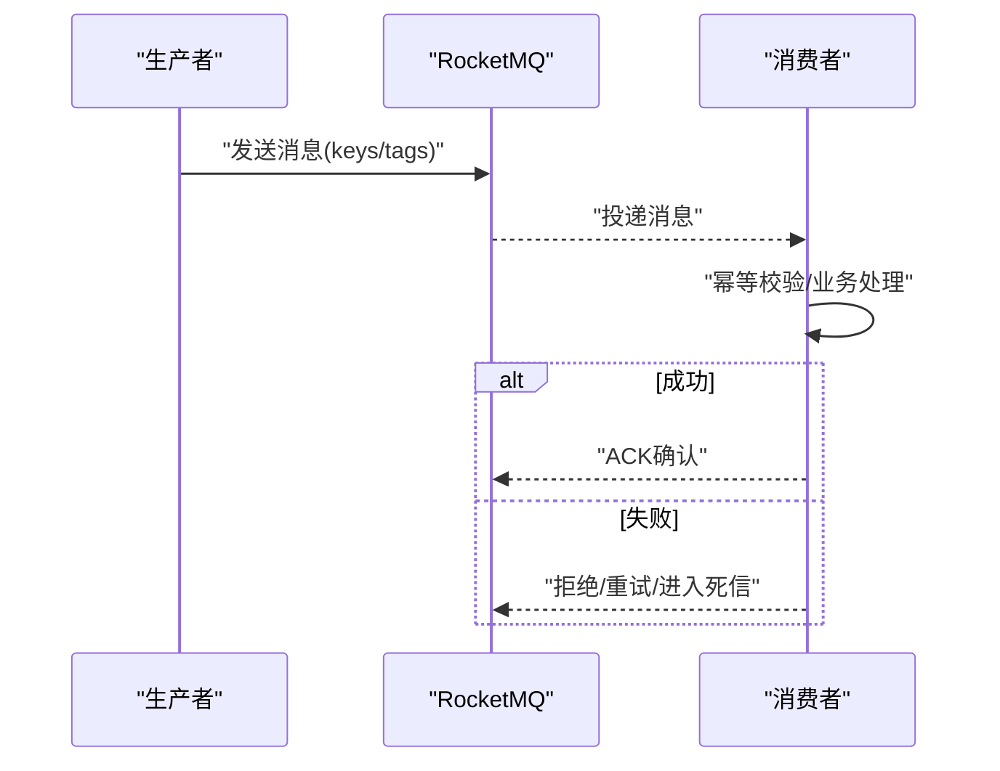
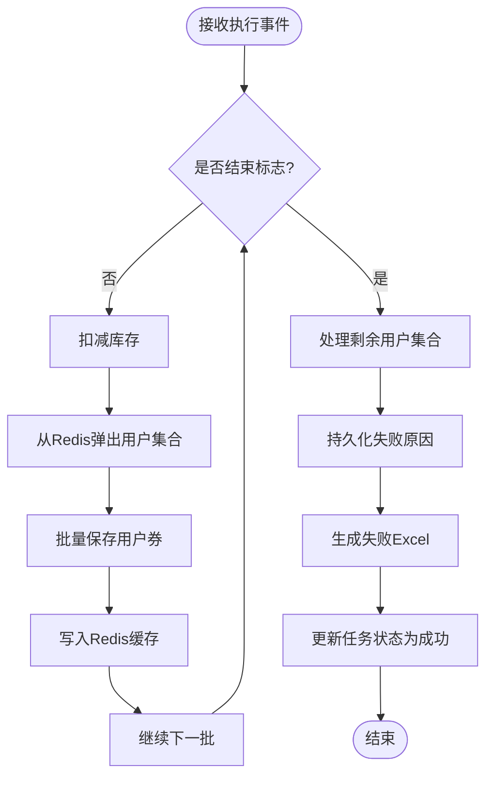
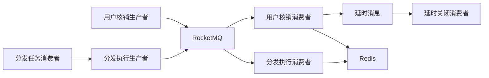

# 消息队列系统

<cite>
**本文引用的文件**
- [CouponTemplateDistributionEvent.java](file://distribution/src/main/java/com/fengxin/maplecoupon/distribution/mq/design/CouponTemplateDistributionEvent.java)
- [CouponTaskExecuteEvent.java（distribution）](file://distribution/src/main/java/com/fengxin/maplecoupon/distribution/mq/design/CouponTaskExecuteEvent.java)
- [CouponTaskExecuteEvent.java（merchant-admin）](file://merchant-admin/src/main/java/com/fengxin/maplecoupon/merchantadmin/mq/design/CouponTaskExecuteEvent.java)
- [UserCouponRedeemEvent.java](file://engine/src/main/java/com/fengxin/maplecoupon/engine/mq/design/UserCouponRedeemEvent.java)
- [UserCouponDelayCloseEvent.java](file://engine/src/main/java/com/fengxin/maplecoupon/engine/mq/design/UserCouponDelayCloseEvent.java)
- [RocketMQConstant.java（distribution）](file://distribution/src/main/java/com/fengxin/maplecoupon/distribution/common/constant/RocketMQConstant.java)
- [RocketMQConstant.java（engine）](file://engine/src/main/java/com/fengxin/maplecoupon/engine/common/constant/RocketMQConstant.java)
- [RocketMQConstant.java（merchant-admin）](file://merchant-admin/src/main/java/com/fengxin/maplecoupon/merchantadmin/common/constant/RocketMQConstant.java)
- [CouponExecuteDistributionProducer.java](file://distribution/src/main/java/com/fengxin/maplecoupon/distribution/mq/producer/CouponExecuteDistributionProducer.java)
- [CouponExecuteDistributionConsumer.java](file://distribution/src/main/java/com/fengxin/maplecoupon/distribution/mq/consumer/CouponExecuteDistributionConsumer.java)
- [CouponTaskDistributionConsumer.java](file://distribution/src/main/java/com/fengxin/maplecoupon/distribution/mq/consumer/CouponTaskDistributionConsumer.java)
- [UserCouponRedeemProducer.java](file://engine/src/main/java/com/fengxin/maplecoupon/engine/mq/producer/UserCouponRedeemProducer.java)
- [UserCouponRedeemConsumer.java](file://engine/src/main/java/com/fengxin/maplecoupon/engine/mq/consumer/UserCouponRedeemConsumer.java)
- [UserCouponDelayCloseConsumer.java](file://engine/src/main/java/com/fengxin/maplecoupon/engine/mq/consumer/UserCouponDelayCloseConsumer.java)
- [MQConsumeStatusEnum.java](file://framework/src/main/java/com/fengxin/enums/MQConsumeStatusEnum.java)
</cite>

## 目录
1. [简介](#简介)
2. [项目结构](#项目结构)
3. [核心组件](#核心组件)
4. [架构总览](#架构总览)
5. [详细组件分析](#详细组件分析)
6. [依赖分析](#依赖分析)
7. [性能考量](#性能考量)
8. [故障排查指南](#故障排查指南)
9. [结论](#结论)
10. [附录](#附录)

## 简介
本技术文档围绕MapleCoupon消息队列系统展开，系统以Apache RocketMQ为核心，采用事件驱动架构，解耦优惠券分发、用户核销与任务执行等关键业务流程。文档覆盖事件模型、生产者/消费者实现模式、可靠性保障机制（确认、重试、死信）、序列化与反序列化最佳实践、消息路由与分区策略、监控与调试、性能调优与扩容方案。

## 项目结构
- 模块划分清晰，按业务域拆分：distribution（分发）、engine（引擎/核销）、merchant-admin（商户后台）、gateway（网关）、settlement（结算）、auth（认证）、framework（通用框架）。
- RocketMQ常量集中于各模块common/constant目录，统一管理主题与消费者组。
- 事件模型位于各模块mq/design下，统一使用MessageWrapper包裹消息体，便于扩展与追踪。
- 生产者位于mq/producer，消费者位于mq/consumer，遵循“主题-消费者组”一一对应原则。

图表来源
- [CouponTaskDistributionConsumer.java:42-88](file://distribution/src/main/java/com/fengxin/maplecoupon/distribution/mq/consumer/CouponTaskDistributionConsumer.java#L42-L88)
- [CouponExecuteDistributionProducer.java:26-51](file://distribution/src/main/java/com/fengxin/maplecoupon/distribution/mq/producer/CouponExecuteDistributionProducer.java#L26-L51)
- [CouponExecuteDistributionConsumer.java:67-163](file://distribution/src/main/java/com/fengxin/maplecoupon/distribution/mq/consumer/CouponExecuteDistributionConsumer.java#L67-L163)
- [UserCouponRedeemProducer.java:26-51](file://engine/src/main/java/com/fengxin/maplecoupon/engine/mq/producer/UserCouponRedeemProducer.java#L26-L51)
- [UserCouponRedeemConsumer.java:49-124](file://engine/src/main/java/com/fengxin/maplecoupon/engine/mq/consumer/UserCouponRedeemConsumer.java#L49-L124)
- [UserCouponDelayCloseConsumer.java:37-70](file://engine/src/main/java/com/fengxin/maplecoupon/engine/mq/consumer/UserCouponDelayCloseConsumer.java#L37-L70)

章节来源
- [RocketMQConstant.java（distribution）:9-30](file://distribution/src/main/java/com/fengxin/maplecoupon/distribution/common/constant/RocketMQConstant.java#L9-L30)
- [RocketMQConstant.java（engine）:9-49](file://engine/src/main/java/com/fengxin/maplecoupon/engine/common/constant/RocketMQConstant.java#L9-L49)
- [RocketMQConstant.java（merchant-admin）:9-32](file://merchant-admin/src/main/java/com/fengxin/maplecoupon/merchantadmin/common/constant/RocketMQConstant.java#L9-L32)

## 核心组件
- 事件模型
  - 优惠券分发任务事件：用于触发Excel解析与库存校验，随后拆分为执行事件。
  - 优惠券模板分发执行事件：承载分发批次、有效期、用户信息、结束标识等，驱动库存扣减与用户券落库。
  - 用户核销事件：封装核销请求参数、模板信息、用户ID与时间戳，异步持久化并写入Redis。
  - 用户券延时关闭事件：基于延时消息在到期后清理Redis缓存并更新数据库状态。
- 生产者
  - 分发执行生产者：构建MessageWrapper并设置KEYS/TAGS，超时控制。
  - 用户核销生产者：构造异步核销事件，设置唯一KEYS。
- 消费者
  - 分发任务消费者：幂等消费、任务与模板状态校验、Excel读取与拆分。
  - 分发执行消费者：库存扣减、用户券批量落库、Redis缓存一致性、失败记录与回滚。
  - 用户核销消费者：库存扣减、用户券落库、Redis缓存写入、延时消息发送。
  - 延时关闭消费者：清理Redis缓存并更新数据库状态。

章节来源
- [CouponTaskExecuteEvent.java（distribution）:18-23](file://distribution/src/main/java/com/fengxin/maplecoupon/distribution/mq/design/CouponTaskExecuteEvent.java#L18-L23)
- [CouponTemplateDistributionEvent.java:21-89](file://distribution/src/main/java/com/fengxin/maplecoupon/distribution/mq/design/CouponTemplateDistributionEvent.java#L21-L89)
- [UserCouponRedeemEvent.java:22-47](file://engine/src/main/java/com/fengxin/maplecoupon/engine/mq/design/UserCouponRedeemEvent.java#L22-L47)
- [UserCouponDelayCloseEvent.java:20-40](file://engine/src/main/java/com/fengxin/maplecoupon/engine/mq/design/UserCouponDelayCloseEvent.java#L20-L40)
- [CouponExecuteDistributionProducer.java:26-51](file://distribution/src/main/java/com/fengxin/maplecoupon/distribution/mq/producer/CouponExecuteDistributionProducer.java#L26-L51)
- [UserCouponRedeemProducer.java:26-51](file://engine/src/main/java/com/fengxin/maplecoupon/engine/mq/producer/UserCouponRedeemProducer.java#L26-L51)
- [CouponTaskDistributionConsumer.java:49-87](file://distribution/src/main/java/com/fengxin/maplecoupon/distribution/mq/consumer/CouponTaskDistributionConsumer.java#L49-L87)
- [CouponExecuteDistributionConsumer.java:80-163](file://distribution/src/main/java/com/fengxin/maplecoupon/distribution/mq/consumer/CouponExecuteDistributionConsumer.java#L80-L163)
- [UserCouponRedeemConsumer.java:54-123](file://engine/src/main/java/com/fengxin/maplecoupon/engine/mq/consumer/UserCouponRedeemConsumer.java#L54-L123)
- [UserCouponDelayCloseConsumer.java:40-69](file://engine/src/main/java/com/fengxin/maplecoupon/engine/mq/consumer/UserCouponDelayCloseConsumer.java#L40-L69)

## 架构总览
系统采用“任务-执行-核销-延时”的事件链路，结合RocketMQ的顺序消息与延时队列能力，确保业务一致性与最终一致性的平衡。

图表来源
- [CouponTaskDistributionConsumer.java:54-87](file://distribution/src/main/java/com/fengxin/maplecoupon/distribution/mq/consumer/CouponTaskDistributionConsumer.java#L54-L87)
- [CouponExecuteDistributionProducer.java:32-50](file://distribution/src/main/java/com/fengxin/maplecoupon/distribution/mq/producer/CouponExecuteDistributionProducer.java#L32-L50)
- [CouponExecuteDistributionConsumer.java:170-243](file://distribution/src/main/java/com/fengxin/maplecoupon/distribution/mq/consumer/CouponExecuteDistributionConsumer.java#L170-L243)
- [UserCouponRedeemProducer.java:32-50](file://engine/src/main/java/com/fengxin/maplecoupon/engine/mq/producer/UserCouponRedeemProducer.java#L32-L50)
- [UserCouponRedeemConsumer.java:56-123](file://engine/src/main/java/com/fengxin/maplecoupon/engine/mq/consumer/UserCouponRedeemConsumer.java#L56-L123)
- [UserCouponDelayCloseConsumer.java:40-69](file://engine/src/main/java/com/fengxin/maplecoupon/engine/mq/consumer/UserCouponDelayCloseConsumer.java#L40-L69)

## 详细组件分析

### 事件模型与序列化
- 事件载体
  - 任务执行事件：携带任务ID，作为消息KEYS的一部分，便于幂等与追踪。
  - 模板分发事件：包含任务批次、有效期、用户信息、结束标识等，驱动批量处理。
  - 用户核销事件：包含请求参数、模板信息、用户ID与时间戳，便于异步处理。
  - 延时关闭事件：包含用户券ID、模板ID、用户ID与延时时间，用于到期处理。
- 序列化与反序列化
  - 使用MessageWrapper包裹事件对象，统一设置KEYS/TAGS，便于RocketMQ检索与追踪。
  - JSON序列化用于事件字段与规则解析，注意字段类型与时区格式化。
  - Redis缓存使用字符串序列化，避免跨语言兼容问题；对复杂结构采用JSON字符串存储。

图表来源
- [CouponTaskExecuteEvent.java（distribution）:18-23](file://distribution/src/main/java/com/fengxin/maplecoupon/distribution/mq/design/CouponTaskExecuteEvent.java#L18-L23)
- [CouponTemplateDistributionEvent.java:21-89](file://distribution/src/main/java/com/fengxin/maplecoupon/distribution/mq/design/CouponTemplateDistributionEvent.java#L21-L89)
- [UserCouponRedeemEvent.java:22-47](file://engine/src/main/java/com/fengxin/maplecoupon/engine/mq/design/UserCouponRedeemEvent.java#L22-L47)
- [UserCouponDelayCloseEvent.java:20-40](file://engine/src/main/java/com/fengxin/maplecoupon/engine/mq/design/UserCouponDelayCloseEvent.java#L20-L40)

章节来源
- [CouponTaskExecuteEvent.java（distribution）:18-23](file://distribution/src/main/java/com/fengxin/maplecoupon/distribution/mq/design/CouponTaskExecuteEvent.java#L18-L23)
- [CouponTemplateDistributionEvent.java:21-89](file://distribution/src/main/java/com/fengxin/maplecoupon/distribution/mq/design/CouponTemplateDistributionEvent.java#L21-L89)
- [UserCouponRedeemEvent.java:22-47](file://engine/src/main/java/com/fengxin/maplecoupon/engine/mq/design/UserCouponRedeemEvent.java#L22-L47)
- [UserCouponDelayCloseEvent.java:20-40](file://engine/src/main/java/com/fengxin/maplecoupon/engine/mq/design/UserCouponDelayCloseEvent.java#L20-L40)

### 生产者模式与可靠性
- 分发执行生产者
  - 构建MessageWrapper，设置KEYS为任务ID，便于幂等与追踪；设置TAGS便于分类过滤。
  - 超时控制2秒，避免阻塞发送线程。
- 用户核销生产者
  - 构造异步核销事件，KEYS包含用户ID，便于按用户维度路由与幂等。
- 可靠性保障
  - RocketMQ默认开启ACK确认；消费者处理失败可通过重试与死信队列兜底。
  - 幂等：通过KEYS与业务状态校验实现；框架提供MQ消费幂等注解示例。

图表来源
- [CouponExecuteDistributionProducer.java:32-50](file://distribution/src/main/java/com/fengxin/maplecoupon/distribution/mq/producer/CouponExecuteDistributionProducer.java#L32-L50)
- [UserCouponRedeemProducer.java:32-50](file://engine/src/main/java/com/fengxin/maplecoupon/engine/mq/producer/UserCouponRedeemProducer.java#L32-L50)
- [CouponTaskDistributionConsumer.java:49-53](file://distribution/src/main/java/com/fengxin/maplecoupon/distribution/mq/consumer/CouponTaskDistributionConsumer.java#L49-L53)

章节来源
- [CouponExecuteDistributionProducer.java:26-51](file://distribution/src/main/java/com/fengxin/maplecoupon/distribution/mq/producer/CouponExecuteDistributionProducer.java#L26-L51)
- [UserCouponRedeemProducer.java:26-51](file://engine/src/main/java/com/fengxin/maplecoupon/engine/mq/producer/UserCouponRedeemProducer.java#L26-L51)
- [MQConsumeStatusEnum.java:15-38](file://framework/src/main/java/com/fengxin/enums/MQConsumeStatusEnum.java#L15-L38)

### 消费者模式与处理流程
- 分发任务消费者
  - 幂等注解：基于任务ID去重，防止重复消费。
  - 任务与模板状态校验：确保任务处于进行中、模板处于有效状态。
  - Excel读取与拆分：通过监听器逐行解析，拆分为执行事件并发送。
- 分发执行消费者
  - 批量处理：按批次扣减库存、批量落库、Redis缓存一致性。
  - 失败处理：唯一索引冲突回滚、库存恢复、失败记录持久化。
  - 结束收尾：处理最后一段未完成的用户集合，生成失败清单并更新任务状态。
- 用户核销消费者
  - 库存扣减、用户券落库、Redis缓存写入，必要时二次校验与重试。
  - 发送延时关闭事件，确保到期自动失效。
- 延时关闭消费者
  - 清理Redis缓存并更新数据库状态，保证最终一致性。

图表来源
- [CouponExecuteDistributionConsumer.java:80-163](file://distribution/src/main/java/com/fengxin/maplecoupon/distribution/mq/consumer/CouponExecuteDistributionConsumer.java#L80-L163)

章节来源
- [CouponTaskDistributionConsumer.java:49-87](file://distribution/src/main/java/com/fengxin/maplecoupon/distribution/mq/consumer/CouponTaskDistributionConsumer.java#L49-L87)
- [CouponExecuteDistributionConsumer.java:80-332](file://distribution/src/main/java/com/fengxin/maplecoupon/distribution/mq/consumer/CouponExecuteDistributionConsumer.java#L80-L332)
- [UserCouponRedeemConsumer.java:54-123](file://engine/src/main/java/com/fengxin/maplecoupon/engine/mq/consumer/UserCouponRedeemConsumer.java#L54-L123)
- [UserCouponDelayCloseConsumer.java:40-69](file://engine/src/main/java/com/fengxin/maplecoupon/engine/mq/consumer/UserCouponDelayCloseConsumer.java#L40-L69)

### 消息路由与分区策略
- 路由键（KEYS）
  - 分发执行：KEYS为任务ID，便于按任务维度路由与幂等。
  - 用户核销：KEYS包含用户ID，便于按用户维度路由与幂等。
- 分区与顺序
  - 若需保证同一任务或同一用户的顺序性，建议将KEYS设置为任务ID或用户ID，配合RocketMQ的分区策略实现顺序消息。
- 负载均衡
  - 多消费者组并行消费，提升吞吐；同组内多个实例实现负载均衡。

章节来源
- [CouponExecuteDistributionProducer.java:36-38](file://distribution/src/main/java/com/fengxin/maplecoupon/distribution/mq/producer/CouponExecuteDistributionProducer.java#L36-L38)
- [UserCouponRedeemProducer.java:37-39](file://engine/src/main/java/com/fengxin/maplecoupon/engine/mq/producer/UserCouponRedeemProducer.java#L37-L39)

### 延时消息与死信队列
- 延时消息
  - 用户核销完成后发送延时关闭事件，到期后自动清理缓存并更新状态。
- 死信队列
  - 消费失败的消息进入死信队列，便于离线重放与人工干预。
- 重试策略
  - 消费者内部捕获异常并记录日志，必要时通过延时队列或死信队列兜底。

章节来源
- [UserCouponRedeemConsumer.java:112-122](file://engine/src/main/java/com/fengxin/maplecoupon/engine/mq/consumer/UserCouponRedeemConsumer.java#L112-L122)
- [UserCouponDelayCloseConsumer.java:40-69](file://engine/src/main/java/com/fengxin/maplecoupon/engine/mq/consumer/UserCouponDelayCloseConsumer.java#L40-L69)

### 监控与调试
- 日志
  - 消费者日志包含消息体、异常堆栈、关键业务状态，便于定位问题。
- 追踪
  - KEYS与TAGS统一设置，结合RocketMQ控制台进行消息检索与重放。
- 报警
  - 发送失败时记录告警日志，结合日志平台进行聚合与告警。

章节来源
- [CouponExecuteDistributionConsumer.java:88-103](file://distribution/src/main/java/com/fengxin/maplecoupon/distribution/mq/consumer/CouponExecuteDistributionConsumer.java#L88-L103)
- [UserCouponRedeemConsumer.java:120-122](file://engine/src/main/java/com/fengxin/maplecoupon/engine/mq/consumer/UserCouponRedeemConsumer.java#L120-L122)

## 依赖分析
- 模块间耦合
  - 分发模块与引擎模块通过主题解耦，仅通过事件契约交互。
  - 商户后台模块与分发模块共享任务执行事件，便于统一编排。
- 外部依赖
  - RocketMQ：消息传输、延时队列、死信队列。
  - Redis：缓存用户券列表，支持ZSet排序与去重。
  - MyBatis-Plus：批量操作与事务控制。

图表来源
- [CouponTaskDistributionConsumer.java:79-86](file://distribution/src/main/java/com/fengxin/maplecoupon/distribution/mq/consumer/CouponTaskDistributionConsumer.java#L79-L86)
- [CouponExecuteDistributionConsumer.java:67-163](file://distribution/src/main/java/com/fengxin/maplecoupon/distribution/mq/consumer/CouponExecuteDistributionConsumer.java#L67-L163)
- [UserCouponRedeemProducer.java:26-51](file://engine/src/main/java/com/fengxin/maplecoupon/engine/mq/producer/UserCouponRedeemProducer.java#L26-L51)
- [UserCouponRedeemConsumer.java:49-124](file://engine/src/main/java/com/fengxin/maplecoupon/engine/mq/consumer/UserCouponRedeemConsumer.java#L49-L124)
- [UserCouponDelayCloseConsumer.java:37-70](file://engine/src/main/java/com/fengxin/maplecoupon/engine/mq/consumer/UserCouponDelayCloseConsumer.java#L37-L70)

章节来源
- [RocketMQConstant.java（distribution）:9-30](file://distribution/src/main/java/com/fengxin/maplecoupon/distribution/common/constant/RocketMQConstant.java#L9-L30)
- [RocketMQConstant.java（engine）:9-49](file://engine/src/main/java/com/fengxin/maplecoupon/engine/common/constant/RocketMQConstant.java#L9-L49)
- [RocketMQConstant.java（merchant-admin）:9-32](file://merchant-admin/src/main/java/com/fengxin/maplecoupon/merchantadmin/common/constant/RocketMQConstant.java#L9-L32)

## 性能考量
- 批量处理
  - 分发执行消费者按批次扣减库存与批量落库，减少数据库往返。
  - Redis缓存写入使用Lua脚本，降低网络开销。
- 序列化优化
  - JSON序列化用于事件与规则解析；对热点字段采用紧凑格式。
- 超时与并发
  - 生产者设置合理超时，避免阻塞；消费者组内并行实例提升吞吐。
- 缓存一致性
  - 先写数据库，再写Redis；若Redis失败则重试或延时补偿。

章节来源
- [CouponExecuteDistributionConsumer.java:170-243](file://distribution/src/main/java/com/fengxin/maplecoupon/distribution/mq/consumer/CouponExecuteDistributionConsumer.java#L170-L243)
- [UserCouponRedeemConsumer.java:88-110](file://engine/src/main/java/com/fengxin/maplecoupon/engine/mq/consumer/UserCouponRedeemConsumer.java#L88-L110)

## 故障排查指南
- 常见问题
  - 库存不足：库存扣减失败时记录日志并回滚，检查上游任务与模板状态。
  - 唯一索引冲突：用户重复领取导致冲突，记录失败原因并恢复库存。
  - Redis写入失败：二次校验与重试，必要时通过延时队列补偿。
  - 发送失败：记录告警日志，结合日志平台进行聚合与重放。
- 排查步骤
  - 查看消费者日志与异常堆栈。
  - 使用KEYS检索消息，定位具体事件。
  - 检查数据库与Redis状态，验证一致性。
  - 关注死信队列与重试队列，进行离线重放。

章节来源
- [CouponExecuteDistributionConsumer.java:275-316](file://distribution/src/main/java/com/fengxin/maplecoupon/distribution/mq/consumer/CouponExecuteDistributionConsumer.java#L275-L316)
- [UserCouponRedeemConsumer.java:105-122](file://engine/src/main/java/com/fengxin/maplecoupon/engine/mq/consumer/UserCouponRedeemConsumer.java#L105-L122)

## 结论
MapleCoupon消息队列系统通过事件驱动与RocketMQ可靠传输，实现了优惠券分发、核销与延时关闭的解耦与高可用。通过KEYS路由、批量处理、Redis缓存与幂等设计，系统在保证一致性的同时具备良好的扩展性与可观测性。建议持续完善监控与告警体系，优化热点路由与批处理阈值，进一步提升整体性能与稳定性。

## 附录
- 常用配置项（示例）
  - 生产者超时：2000ms
  - 批量落库阈值：100000条
  - 幂等窗口：120s
  - 延时关闭：有效期截止时间
- 建议
  - 对高频用户与任务ID设置更细粒度的路由键。
  - 引入指标埋点与APM，结合日志平台进行全链路追踪。
  - 对失败路径建立自动化重试与人工干预通道。