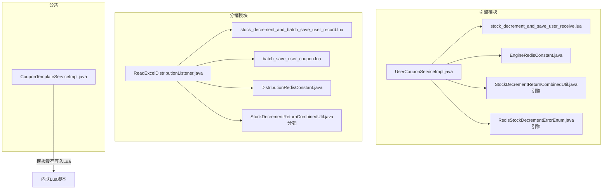
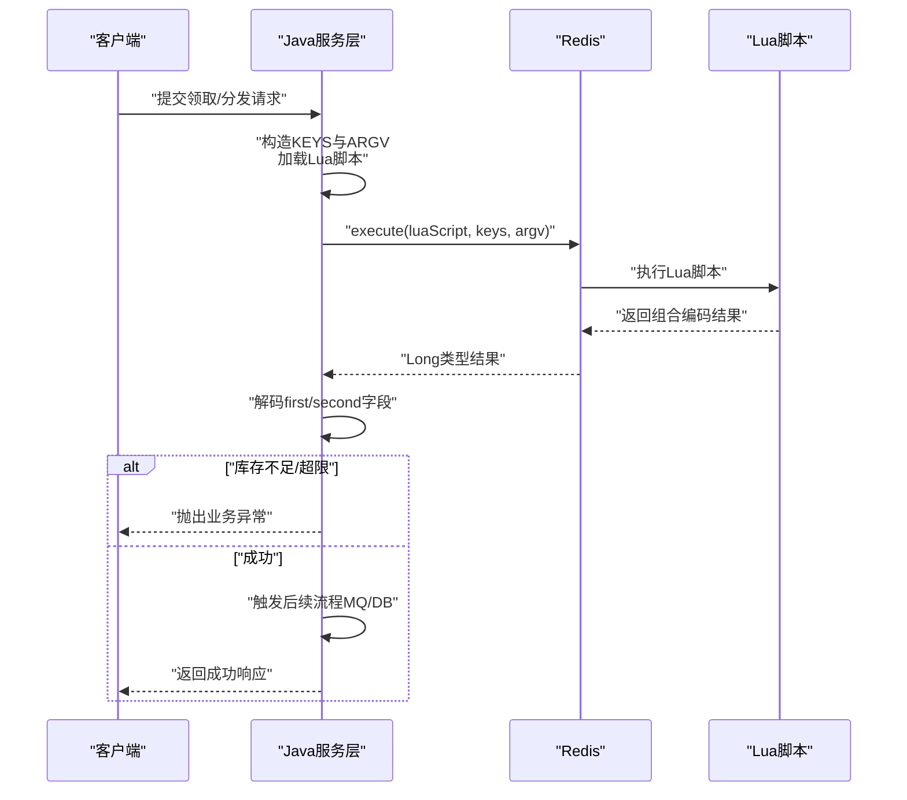
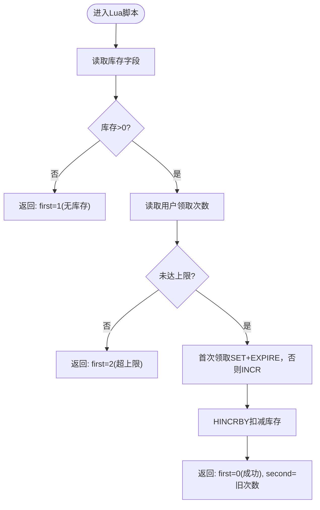
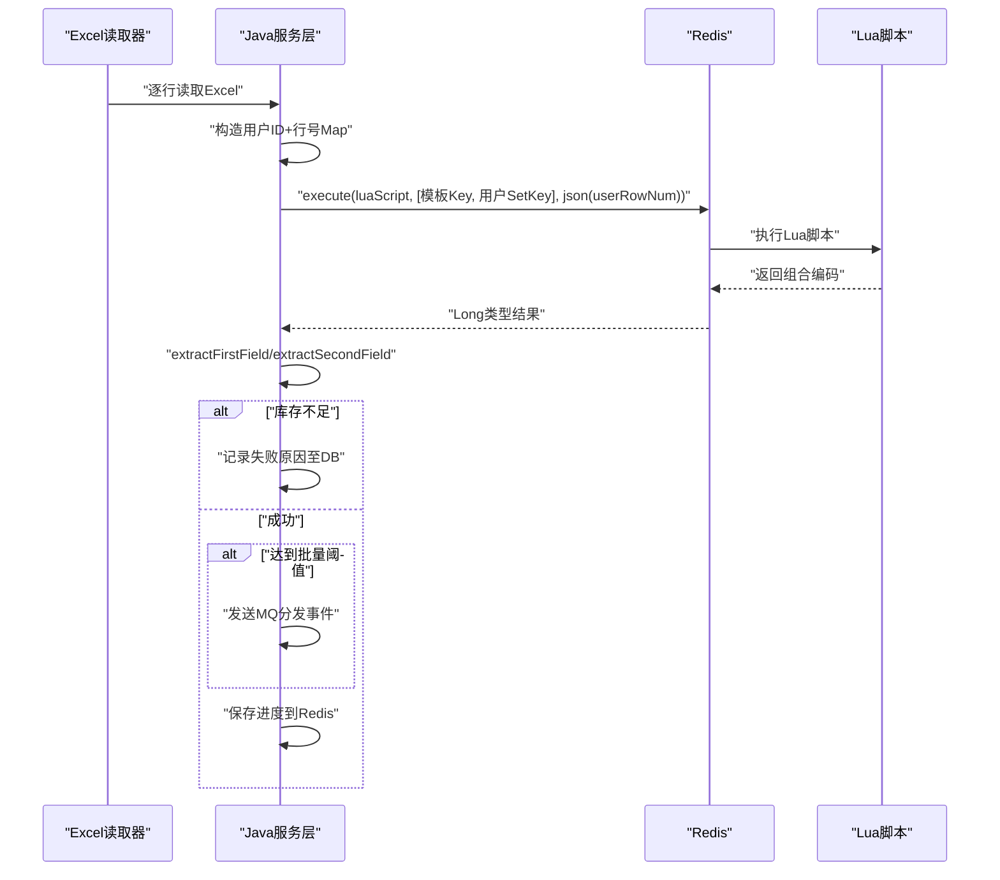
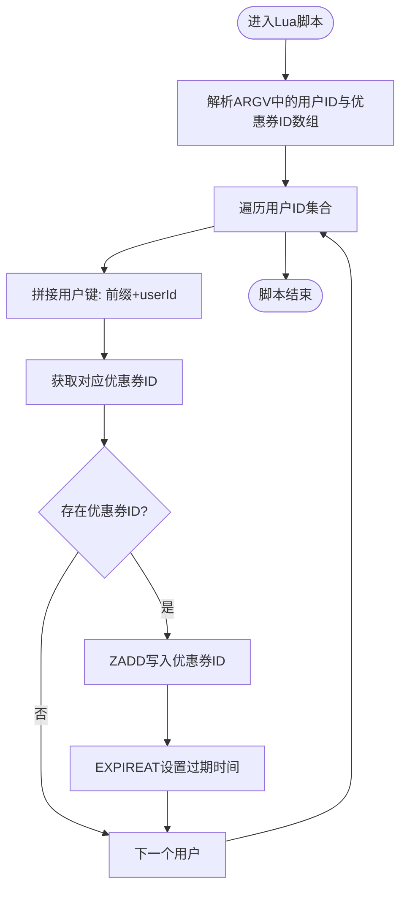
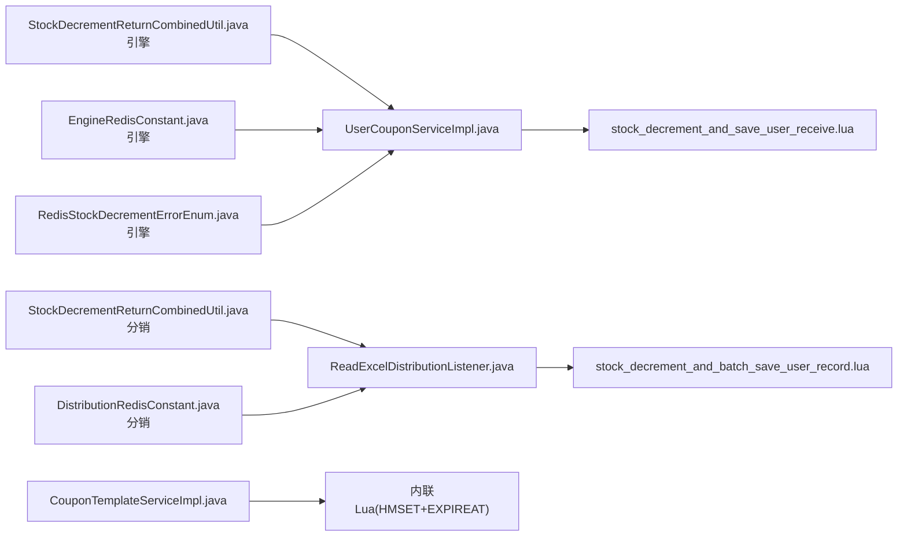

# Lua脚本优化

<cite>
**本文引用的文件**
- [stock_decrement_and_save_user_receive.lua](file://engine/src/main/resources/lua/stock_decrement_and_save_user_receive.lua)
- [stock_decrement_and_batch_save_user_record.lua](file://distribution/src/main/resources/lua/stock_decrement_and_batch_save_user_record.lua)
- [batch_save_user_coupon.lua](file://distribution/src/main/resources/lua/batch_save_user_coupon.lua)
- [UserCouponServiceImpl.java](file://engine/src/main/java/com/fengxin/maplecoupon/engine/service/impl/UserCouponServiceImpl.java)
- [ReadExcelDistributionListener.java](file://distribution/src/main/java/com/fengxin/maplecoupon/distribution/service/handler/excel/ReadExcelDistributionListener.java)
- [StockDecrementReturnCombinedUtil.java（引擎）](file://engine/src/main/java/com/fengxin/maplecoupon/engine/util/StockDecrementReturnCombinedUtil.java)
- [StockDecrementReturnCombinedUtil.java（分销）](file://distribution/src/main/java/com/fengxin/maplecoupon/distribution/util/StockDecrementReturnCombinedUtil.java)
- [RedisStockDecrementErrorEnum.java（引擎）](file://engine/src/main/java/com/fengxin/maplecoupon/engine/common/enums/RedisStockDecrementErrorEnum.java)
- [EngineRedisConstant.java（引擎）](file://engine/src/main/java/com/fengxin/maplecoupon/engine/common/constant/EngineRedisConstant.java)
- [DistributionRedisConstant.java（分销）](file://distribution/src/main/java/com/fengxin/maplecoupon/distribution/common/constant/DistributionRedisConstant.java)
- [CouponTemplateServiceImpl.java](file://engine/src/main/java/com/fengxin/maplecoupon/engine/service/impl/CouponTemplateServiceImpl.java)
</cite>

## 目录
1. [简介](#简介)
2. [项目结构](#项目结构)
3. [核心组件](#核心组件)
4. [架构总览](#架构总览)
5. [详细组件分析](#详细组件分析)
6. [依赖分析](#依赖分析)
7. [性能考量](#性能考量)
8. [故障排查指南](#故障排查指南)
9. [结论](#结论)
10. [附录](#附录)

## 简介
本文件聚焦于MapleCoupon中基于Redis的Lua脚本优化实践，系统阐述以下主题：
- 原子性与一致性保障：通过Lua脚本在Redis侧完成多命令合并与原子执行，避免竞态条件。
- 库存扣减脚本：引擎侧与分销侧两套脚本分别面向“单条用户领取”和“批量Excel导入分发”，对比其设计差异与适用场景。
- 批量保存用户优惠券脚本：面向Excel导入场景，批量写入用户ZSet并统一过期控制，提升吞吐与降低RTT。
- 调试与性能分析：结合Java侧调用模式、返回值编码与错误处理，给出可落地的排障路径。
- 版本管理与兼容：通过脚本路径常量与Hutool单例缓存，确保脚本加载与版本一致性。
- Java与Lua交互：参数传递、结果解码、错误映射与幂等保护。

## 项目结构
围绕Lua脚本优化的关键目录与文件如下：
- 引擎模块（engine）：负责用户领取、库存扣减、模板缓存等核心流程，包含Lua脚本与调用实现。
- 分销模块（distribution）：负责Excel导入与批量分发，包含库存扣减+批量写入脚本与批量写入脚本。
- 公共工具：返回值编码/解码工具、Redis键常量、错误枚举等。

**图表来源**
- [UserCouponServiceImpl.java](file://engine/src/main/java/com/fengxin/maplecoupon/engine/service/impl/UserCouponServiceImpl.java)
- [stock_decrement_and_save_user_receive.lua](file://engine/src/main/resources/lua/stock_decrement_and_save_user_receive.lua)
- [EngineRedisConstant.java（引擎）](file://engine/src/main/java/com/fengxin/maplecoupon/engine/common/constant/EngineRedisConstant.java)
- [StockDecrementReturnCombinedUtil.java（引擎）](file://engine/src/main/java/com/fengxin/maplecoupon/engine/util/StockDecrementReturnCombinedUtil.java)
- [RedisStockDecrementErrorEnum.java（引擎）](file://engine/src/main/java/com/fengxin/maplecoupon/engine/common/enums/RedisStockDecrementErrorEnum.java)
- [ReadExcelDistributionListener.java](file://distribution/src/main/java/com/fengxin/maplecoupon/distribution/service/handler/excel/ReadExcelDistributionListener.java)
- [stock_decrement_and_batch_save_user_record.lua](file://distribution/src/main/resources/lua/stock_decrement_and_batch_save_user_record.lua)
- [batch_save_user_coupon.lua](file://distribution/src/main/resources/lua/batch_save_user_coupon.lua)
- [DistributionRedisConstant.java（分销）](file://distribution/src/main/java/com/fengxin/maplecoupon/distribution/common/constant/DistributionRedisConstant.java)
- [StockDecrementReturnCombinedUtil.java（分销）](file://distribution/src/main/java/com/fengxin/maplecoupon/distribution/util/StockDecrementReturnCombinedUtil.java)
- [CouponTemplateServiceImpl.java](file://engine/src/main/java/com/fengxin/maplecoupon/engine/service/impl/CouponTemplateServiceImpl.java)

**章节来源**
- [UserCouponServiceImpl.java](file://engine/src/main/java/com/fengxin/maplecoupon/engine/service/impl/UserCouponServiceImpl.java)
- [ReadExcelDistributionListener.java](file://distribution/src/main/java/com/fengxin/maplecoupon/distribution/service/handler/excel/ReadExcelDistributionListener.java)
- [CouponTemplateServiceImpl.java](file://engine/src/main/java/com/fengxin/maplecoupon/engine/service/impl/CouponTemplateServiceImpl.java)

## 核心组件
- 引擎侧库存扣减与领取记录脚本：在单次请求中完成库存检查、用户领取次数校验、库存扣减与领取计数持久化，返回组合编码结果，供Java侧快速分支处理。
- 分销侧库存扣减与批量写入脚本：在单次请求中完成库存检查、库存扣减、用户集合写入与批次计数统计，返回组合编码结果，Java侧据此决定是否继续分发与保存进度。
- 批量保存用户优惠券脚本：接收用户ID与优惠券ID数组，批量写入ZSet并统一过期控制，显著降低RTT与网络开销。
- 返回值编码工具：将布尔/枚举状态与数值字段打包为整型，便于单次返回与高效解码。
- 错误枚举与常量：定义Redis库存扣减错误码与Redis键命名规范，确保跨模块一致性。

**章节来源**
- [stock_decrement_and_save_user_receive.lua](file://engine/src/main/resources/lua/stock_decrement_and_save_user_receive.lua)
- [stock_decrement_and_batch_save_user_record.lua](file://distribution/src/main/resources/lua/stock_decrement_and_batch_save_user_record.lua)
- [batch_save_user_coupon.lua](file://distribution/src/main/resources/lua/batch_save_user_coupon.lua)
- [StockDecrementReturnCombinedUtil.java（引擎）](file://engine/src/main/java/com/fengxin/maplecoupon/engine/util/StockDecrementReturnCombinedUtil.java)
- [StockDecrementReturnCombinedUtil.java（分销）](file://distribution/src/main/java/com/fengxin/maplecoupon/distribution/util/StockDecrementReturnCombinedUtil.java)
- [RedisStockDecrementErrorEnum.java（引擎）](file://engine/src/main/java/com/fengxin/maplecoupon/engine/common/enums/RedisStockDecrementErrorEnum.java)
- [EngineRedisConstant.java（引擎）](file://engine/src/main/java/com/fengxin/maplecoupon/engine/common/constant/EngineRedisConstant.java)
- [DistributionRedisConstant.java（分销）](file://distribution/src/main/java/com/fengxin/maplecoupon/distribution/common/constant/DistributionRedisConstant.java)

## 架构总览
整体交互链路：Java服务层通过Spring Data Redis加载Lua脚本，构造KEYS与ARGV，调用Redis执行Lua；Lua在服务端原子执行多条Redis命令，返回单一整型编码；Java侧解码并按状态分支处理，必要时回退到数据库事务或消息队列。

**图表来源**
- [UserCouponServiceImpl.java](file://engine/src/main/java/com/fengxin/maplecoupon/engine/service/impl/UserCouponServiceImpl.java)
- [ReadExcelDistributionListener.java](file://distribution/src/main/java/com/fengxin/maplecoupon/distribution/service/handler/excel/ReadExcelDistributionListener.java)
- [stock_decrement_and_save_user_receive.lua](file://engine/src/main/resources/lua/stock_decrement_and_save_user_receive.lua)
- [stock_decrement_and_batch_save_user_record.lua](file://distribution/src/main/resources/lua/stock_decrement_and_batch_save_user_record.lua)

## 详细组件分析

### 引擎侧：库存扣减与用户领取记录脚本
- 设计要点
  - 原子性：在Lua中先读取库存，再做库存判断与扣减，最后更新用户领取次数与过期时间，避免并发导致的超卖。
  - 返回值编码：使用14位作为第二字段，承载用户领取次数；第一字段编码三种状态（成功/无库存/超上限），Java侧通过位运算解码。
  - 参数传递：KEYS包含“模板库存键”和“用户领取计数键”，ARGV包含“有效期截止时间（毫秒）”和“每人上限”。
- 性能特性
  - 单次RTT完成多步操作，减少往返延迟。
  - 使用EXPIRE一次性设置有效期，避免多次网络往返。
- 错误处理
  - 通过错误枚举映射不同失败场景，Java侧统一抛出业务异常。
- 与Java交互
  - 使用DefaultRedisScript加载脚本，设置结果类型为Long，执行后解码first/second字段，按需触发消息队列或数据库事务。

**图表来源**
- [stock_decrement_and_save_user_receive.lua](file://engine/src/main/resources/lua/stock_decrement_and_save_user_receive.lua)
- [StockDecrementReturnCombinedUtil.java（引擎）](file://engine/src/main/java/com/fengxin/maplecoupon/engine/util/StockDecrementReturnCombinedUtil.java)
- [RedisStockDecrementErrorEnum.java（引擎）](file://engine/src/main/java/com/fengxin/maplecoupon/engine/common/enums/RedisStockDecrementErrorEnum.java)

**章节来源**
- [stock_decrement_and_save_user_receive.lua](file://engine/src/main/resources/lua/stock_decrement_and_save_user_receive.lua)
- [UserCouponServiceImpl.java](file://engine/src/main/java/com/fengxin/maplecoupon/engine/service/impl/UserCouponServiceImpl.java)
- [StockDecrementReturnCombinedUtil.java（引擎）](file://engine/src/main/java/com/fengxin/maplecoupon/engine/util/StockDecrementReturnCombinedUtil.java)
- [RedisStockDecrementErrorEnum.java（引擎）](file://engine/src/main/java/com/fengxin/maplecoupon/engine/common/enums/RedisStockDecrementErrorEnum.java)

### 分销侧：库存扣减与批量写入用户记录脚本
- 设计要点
  - 原子性：在Lua中完成库存检查、库存扣减与用户集合写入，保证一致性。
  - 批量统计：返回用户集合长度，Java侧据此判断是否达到批量阈值并触发分发。
  - 返回值编码：使用17位作为第二字段，承载用户集合长度，Java侧通过位运算解码。
- 批量策略
  - Java侧每读取N条记录执行一次Lua，若集合长度达到批量阈值则发送MQ并保存进度。
  - 通过Redis进度键记录已处理行号，支持断点续跑。
- 与Java交互
  - 使用Singleton缓存脚本实例，避免重复加载；执行后通过工具类解码first/second字段，按需写入失败明细。

**图表来源**
- [ReadExcelDistributionListener.java](file://distribution/src/main/java/com/fengxin/maplecoupon/distribution/service/handler/excel/ReadExcelDistributionListener.java)
- [stock_decrement_and_batch_save_user_record.lua](file://distribution/src/main/resources/lua/stock_decrement_and_batch_save_user_record.lua)
- [StockDecrementReturnCombinedUtil.java（分销）](file://distribution/src/main/java/com/fengxin/maplecoupon/distribution/util/StockDecrementReturnCombinedUtil.java)

**章节来源**
- [stock_decrement_and_batch_save_user_record.lua](file://distribution/src/main/resources/lua/stock_decrement_and_batch_save_user_record.lua)
- [ReadExcelDistributionListener.java](file://distribution/src/main/java/com/fengxin/maplecoupon/distribution/service/handler/excel/ReadExcelDistributionListener.java)
- [StockDecrementReturnCombinedUtil.java（分销）](file://distribution/src/main/java/com/fengxin/maplecoupon/distribution/util/StockDecrementReturnCombinedUtil.java)

### 分销侧：批量保存用户优惠券脚本
- 设计要点
  - 批量写入：接收用户ID数组与优惠券ID数组，循环写入ZSet，统一设置过期时间，降低RTT与网络开销。
  - 参数传递：KEYS[1]为用户ID前缀，ARGV[1]与ARGV[2]分别为用户ID数组与优惠券ID数组（JSON字符串）。
  - 过期控制：脚本中使用EXPIREAT对每个用户键设置过期时间戳。
- 性能优势
  - 单次Lua执行完成批量写入，避免多次网络往返。
  - 通过ZSet存储，天然具备去重与排序能力，便于后续查询与清理。

**图表来源**
- [batch_save_user_coupon.lua](file://distribution/src/main/resources/lua/batch_save_user_coupon.lua)

**章节来源**
- [batch_save_user_coupon.lua](file://distribution/src/main/resources/lua/batch_save_user_coupon.lua)

### 模板缓存写入的内联Lua
- 设计要点
  - 使用内联Lua脚本完成HMSET与EXPIREAT，确保模板缓存写入的原子性与过期时间一致性。
  - 参数通过ARGV传入，KEYS为模板缓存键。
- 性能特性
  - 单次RTT完成哈希写入与过期设置，减少网络往返。

**章节来源**
- [CouponTemplateServiceImpl.java](file://engine/src/main/java/com/fengxin/maplecoupon/engine/service/impl/CouponTemplateServiceImpl.java)

## 依赖分析
- 脚本加载与缓存
  - Java侧通过Hutool单例缓存DefaultRedisScript实例，避免重复加载Lua脚本带来的I/O与编译成本。
- 返回值解码
  - 不同模块使用各自的编码位宽（引擎14位、分销17位），Java侧通过工具类解码first/second字段，确保跨模块一致性。
- 键空间与常量
  - 引擎与分销各自维护Redis键常量，避免硬编码，提升可维护性。
- 错误映射
  - 引擎侧通过错误枚举将Lua返回码映射为具体业务异常，Java侧统一处理。

**图表来源**
- [UserCouponServiceImpl.java](file://engine/src/main/java/com/fengxin/maplecoupon/engine/service/impl/UserCouponServiceImpl.java)
- [ReadExcelDistributionListener.java](file://distribution/src/main/java/com/fengxin/maplecoupon/distribution/service/handler/excel/ReadExcelDistributionListener.java)
- [CouponTemplateServiceImpl.java](file://engine/src/main/java/com/fengxin/maplecoupon/engine/service/impl/CouponTemplateServiceImpl.java)
- [StockDecrementReturnCombinedUtil.java（引擎）](file://engine/src/main/java/com/fengxin/maplecoupon/engine/util/StockDecrementReturnCombinedUtil.java)
- [StockDecrementReturnCombinedUtil.java（分销）](file://distribution/src/main/java/com/fengxin/maplecoupon/distribution/util/StockDecrementReturnCombinedUtil.java)
- [EngineRedisConstant.java（引擎）](file://engine/src/main/java/com/fengxin/maplecoupon/engine/common/constant/EngineRedisConstant.java)
- [DistributionRedisConstant.java（分销）](file://distribution/src/main/java/com/fengxin/maplecoupon/distribution/common/constant/DistributionRedisConstant.java)
- [RedisStockDecrementErrorEnum.java（引擎）](file://engine/src/main/java/com/fengxin/maplecoupon/engine/common/enums/RedisStockDecrementErrorEnum.java)

**章节来源**
- [UserCouponServiceImpl.java](file://engine/src/main/java/com/fengxin/maplecoupon/engine/service/impl/UserCouponServiceImpl.java)
- [ReadExcelDistributionListener.java](file://distribution/src/main/java/com/fengxin/maplecoupon/distribution/service/handler/excel/ReadExcelDistributionListener.java)
- [CouponTemplateServiceImpl.java](file://engine/src/main/java/com/fengxin/maplecoupon/engine/service/impl/CouponTemplateServiceImpl.java)

## 性能考量
- 原子性与一致性
  - Lua脚本在Redis侧执行，避免分布式锁与跨服务协调，显著降低延迟与复杂度。
- RTT优化
  - 批量写入ZSet与内联Lua写入哈希，减少网络往返。
- 编码复用
  - 统一的返回值编码与解码工具，减少序列化/反序列化开销。
- 缓存与预热
  - Hutool单例缓存脚本实例，避免重复加载；模板缓存写入使用EXPIREAT，确保时效性。
- 并发控制
  - 引擎侧通过Redis键与Lua脚本实现轻量级并发控制；分销侧通过批量阈值与进度键实现有序分发与断点续跑。

[本节为通用性能讨论，无需列出具体文件来源]

## 故障排查指南
- 常见问题
  - 库存不足：Lua返回first字段指示无库存，Java侧捕获并抛出业务异常。
  - 用户超限：Lua返回first字段指示已达上限，Java侧按错误枚举处理。
  - 脚本加载失败：确认脚本路径与资源可见性，检查DefaultRedisScript加载逻辑。
  - 返回值解码异常：确认编码位宽与工具类一致，避免跨模块混用。
  - 进度丢失：分销侧通过Redis进度键记录已处理行号，异常退出后可断点续跑。
- 调试建议
  - 在Java侧打印KEYS与ARGV内容，定位参数传递问题。
  - 使用Redis客户端直接执行Lua脚本，验证逻辑正确性。
  - 关注Lua脚本中的ZADD与EXPIREAT执行结果，确保键空间与过期策略符合预期。
  - 对批量场景，监控MQ分发频率与失败明细，及时调整批量阈值。

**章节来源**
- [UserCouponServiceImpl.java](file://engine/src/main/java/com/fengxin/maplecoupon/engine/service/impl/UserCouponServiceImpl.java)
- [ReadExcelDistributionListener.java](file://distribution/src/main/java/com/fengxin/maplecoupon/distribution/service/handler/excel/ReadExcelDistributionListener.java)
- [RedisStockDecrementErrorEnum.java（引擎）](file://engine/src/main/java/com/fengxin/maplecoupon/engine/common/enums/RedisStockDecrementErrorEnum.java)

## 结论
MapleCoupon通过在Redis侧执行Lua脚本，实现了高并发场景下的库存扣减与用户记录原子性操作，显著降低了网络往返与竞态风险。引擎侧与分销侧分别针对“单条领取”和“批量导入”场景提供了定制化的脚本方案，并通过统一的返回值编码与错误映射，使Java侧能够快速、稳定地处理各种业务分支。配合Hutool单例缓存与Redis键常量，整体方案在性能与可维护性之间取得了良好平衡。

[本节为总结性内容，无需列出具体文件来源]

## 附录
- 版本管理与兼容
  - 通过脚本路径常量与Hutool单例缓存，确保脚本加载与版本一致性，避免重复加载与缓存污染。
  - 如需升级脚本，建议在变更前保留历史版本路径，并在Java侧通过新常量切换，逐步灰度验证。
- 最佳实践
  - 优先使用Lua脚本完成原子性操作，减少跨服务协调。
  - 批量场景优先采用ZSet与内联Lua，降低RTT与网络开销。
  - 统一返回值编码与错误映射，确保跨模块一致性。
  - 对关键路径增加监控与告警，关注Lua执行耗时与失败率。

[本节为通用实践建议，无需列出具体文件来源]