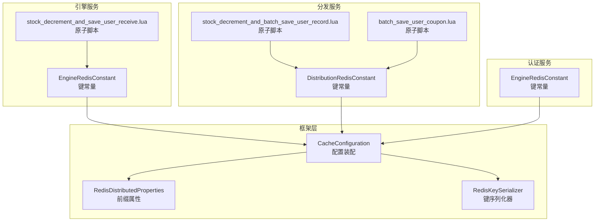
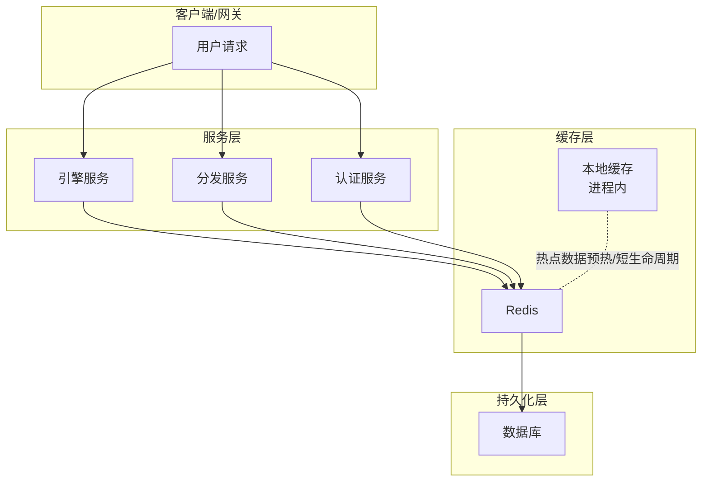
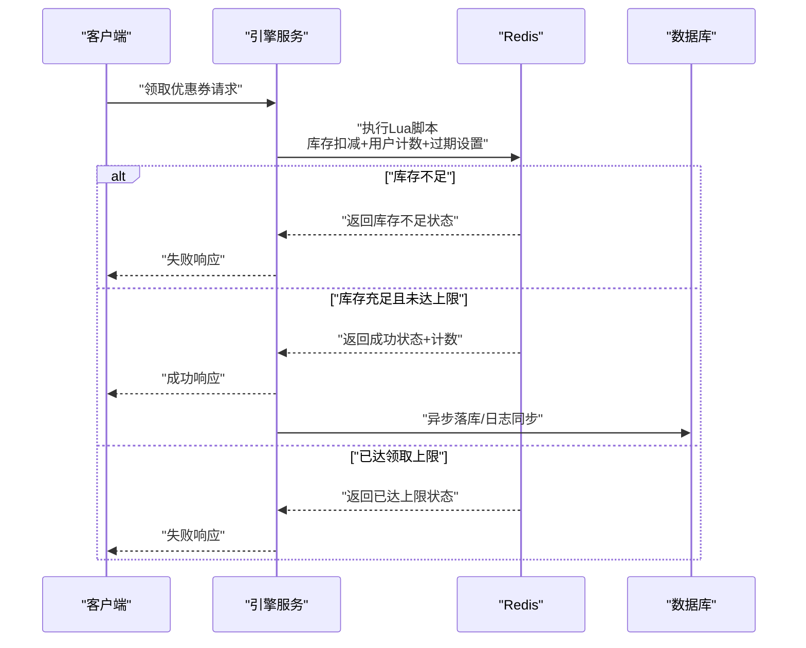
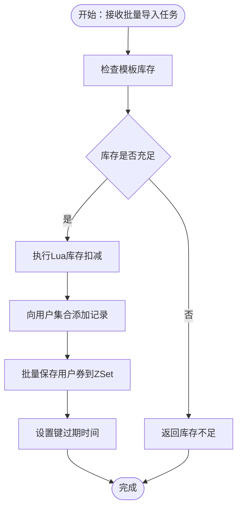
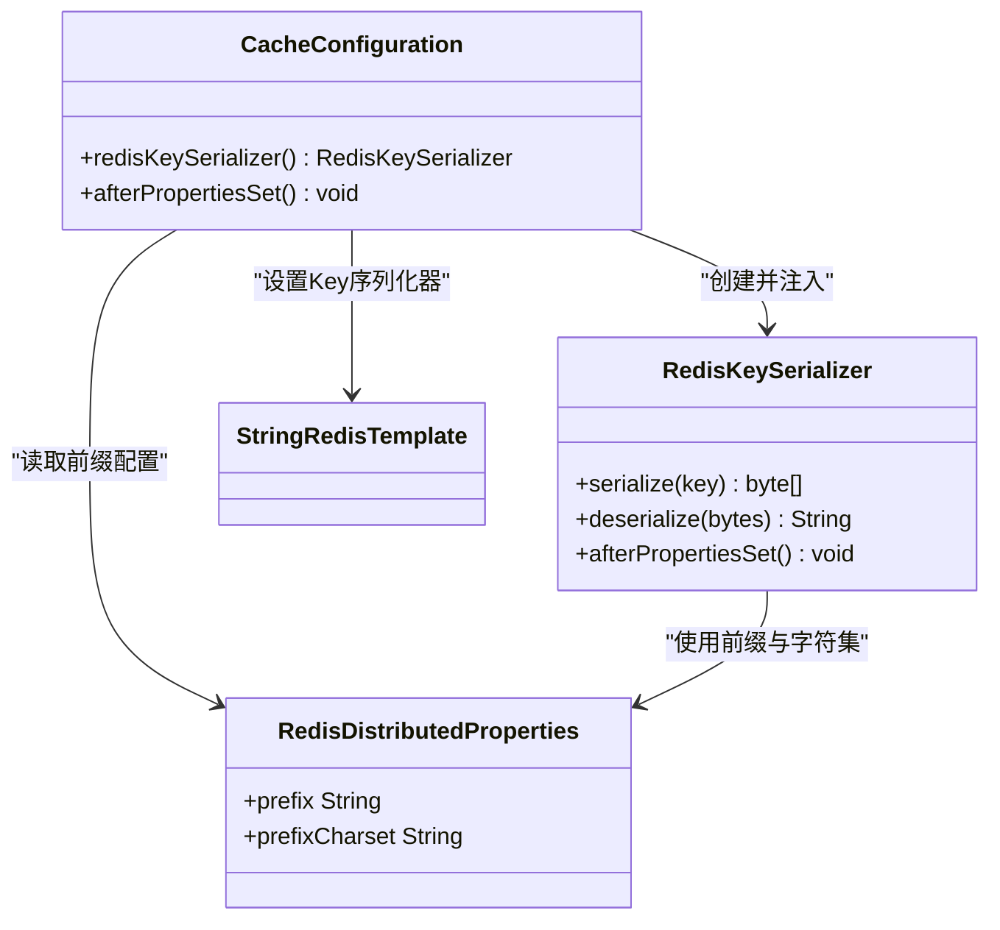
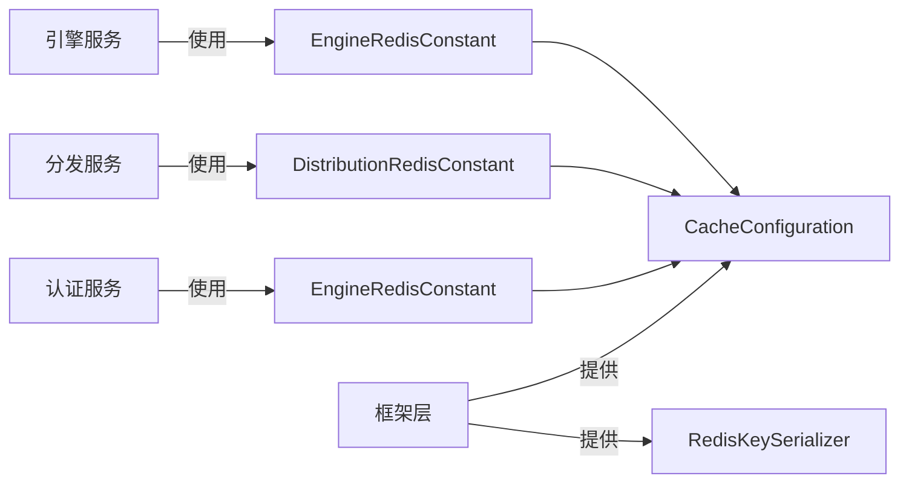

# Redis架构设计

<cite>
**本文引用的文件**
- [EngineRedisConstant.java](file://engine/src/main/java/com/fengxin/maplecoupon/engine/common/constant/EngineRedisConstant.java)
- [EngineRedisConstant.java](file://auth/src/main/java/com/fengxin/maplecoupon/auth/common/constant/EngineRedisConstant.java)
- [DistributionRedisConstant.java](file://distribution/src/main/java/com/fengxin/maplecoupon/distribution/common/constant/DistributionRedisConstant.java)
- [CacheConfiguration.java](file://framework/src/main/java/com/fengxin/config/CacheConfiguration.java)
- [RedisDistributedProperties.java](file://framework/src/main/java/com/fengxin/config/RedisDistributedProperties.java)
- [RedisKeySerializer.java](file://framework/src/main/java/com/fengxin/config/RedisKeySerializer.java)
- [stock_decrement_and_save_user_receive.lua](file://engine/src/main/resources/lua/stock_decrement_and_save_user_receive.lua)
- [stock_decrement_and_batch_save_user_record.lua](file://engine/src/main/resources/lua/stock_decrement_and_batch_save_user_record.lua)
- [stock_decrement_and_batch_save_user_record.lua](file://distribution/src/main/resources/lua/stock_decrement_and_batch_save_user_record.lua)
- [batch_save_user_coupon.lua](file://distribution/src/main/resources/lua/batch_save_user_coupon.lua)
- [application.yaml](file://engine/src/main/resources/application.yaml)
- [application.yaml](file://distribution/src/main/resources/application.yaml)
- [application.yaml](file://auth/src/main/resources/application.yaml)
</cite>

## 目录
1. [引言](#引言)
2. [项目结构](#项目结构)
3. [核心组件](#核心组件)
4. [架构总览](#架构总览)
5. [详细组件分析](#详细组件分析)
6. [依赖关系分析](#依赖关系分析)
7. [性能考量](#性能考量)
8. [故障排查指南](#故障排查指南)
9. [结论](#结论)
10. [附录](#附录)

## 引言
本文件系统化梳理MapleCoupon中Redis的多层架构设计，围绕“引擎服务、分发服务、结算服务”的缓存需求差异，阐述缓存键空间划分、命名规范与组织结构；总结Lua原子化脚本在库存扣减与用户记录上的应用；给出缓存层次结构图与高可用保障建议，并对序列化策略与内存优化进行实践指导。

## 项目结构
- 模块化组织：引擎、分发、认证等模块各自维护独立的Redis常量类，形成清晰的键空间边界。
- 公共配置：框架层提供统一的Redis键前缀与序列化器配置，确保跨模块一致性。
- 资源脚本：引擎与分发模块内嵌Lua脚本，实现库存扣减、用户领取计数、批量保存等原子操作。

图表来源
- [EngineRedisConstant.java:1-56](file://engine/src/main/java/com/fengxin/maplecoupon/engine/common/constant/EngineRedisConstant.java#L1-L56)
- [DistributionRedisConstant.java:1-21](file://distribution/src/main/java/com/fengxin/maplecoupon/distribution/common/constant/DistributionRedisConstant.java#L1-L21)
- [EngineRedisConstant.java:1-55](file://auth/src/main/java/com/fengxin/maplecoupon/auth/common/constant/EngineRedisConstant.java#L1-L55)
- [CacheConfiguration.java:1-35](file://framework/src/main/java/com/fengxin/config/CacheConfiguration.java#L1-L35)
- [RedisDistributedProperties.java:1-25](file://framework/src/main/java/com/fengxin/config/RedisDistributedProperties.java#L1-L25)
- [RedisKeySerializer.java:1-38](file://framework/src/main/java/com/fengxin/config/RedisKeySerializer.java#L1-L38)
- [stock_decrement_and_save_user_receive.lua:1-58](file://engine/src/main/resources/lua/stock_decrement_and_save_user_receive.lua#L1-L58)
- [stock_decrement_and_batch_save_user_record.lua:1-33](file://engine/src/main/resources/lua/stock_decrement_and_batch_save_user_record.lua#L1-L33)
- [stock_decrement_and_batch_save_user_record.lua:1-33](file://distribution/src/main/resources/lua/stock_decrement_and_batch_save_user_record.lua#L1-L33)
- [batch_save_user_coupon.lua:1-16](file://distribution/src/main/resources/lua/batch_save_user_coupon.lua#L1-L16)

章节来源
- [EngineRedisConstant.java:1-56](file://engine/src/main/java/com/fengxin/maplecoupon/engine/common/constant/EngineRedisConstant.java#L1-L56)
- [DistributionRedisConstant.java:1-21](file://distribution/src/main/java/com/fengxin/maplecoupon/distribution/common/constant/DistributionRedisConstant.java#L1-L21)
- [EngineRedisConstant.java:1-55](file://auth/src/main/java/com/fengxin/maplecoupon/auth/common/constant/EngineRedisConstant.java#L1-L55)
- [CacheConfiguration.java:1-35](file://framework/src/main/java/com/fengxin/config/CacheConfiguration.java#L1-L35)
- [RedisDistributedProperties.java:1-25](file://framework/src/main/java/com/fengxin/config/RedisDistributedProperties.java#L1-L25)
- [RedisKeySerializer.java:1-38](file://framework/src/main/java/com/fengxin/config/RedisKeySerializer.java#L1-L38)

## 核心组件
- 键空间与命名规范
  - 命名前缀：各模块以“业务域:功能:实体:标识”组织，如“maple-coupon_engine:template:...”、“maple-coupon_distribution:template-task-execute-progress:...”。
  - 分布式锁前缀：统一使用“lock:业务域:...”，便于运维识别与清理。
  - 空值占位：针对热点空值场景，采用“empty:业务域:...”避免缓存穿透。
  - 多段标识：通过下划线或下标分隔不同维度（如用户ID、模板ID、时间戳），保证键的可读性与可检索性。
- 数据类型选择
  - Hash：用于存储结构化元数据（如库存、模板信息）。
  - Set：用于去重集合（如已领取用户集合）。
  - String/Int：用于计数与阈值控制（如用户领取次数）。
  - Sorted Set：用于按时间排序的队列或优先级场景（如批次任务进度）。
- 过期策略
  - TTL：对用户领取次数、登录态等短期数据设置过期时间，防止长期占用内存。
  - 绝对过期：结合业务生命周期，在Lua脚本中一次性设置过期时间。
- 原子化脚本
  - 引擎：库存扣减与用户领取次数+1的组合操作，减少并发竞争带来的不一致。
  - 分发：库存扣减与用户集合写入的组合操作，支持批量导入场景。
- 键前缀与序列化
  - 框架层通过配置类注入统一的Key序列化器，支持可选前缀与字符集，确保跨模块键的一致性与可维护性。

章节来源
- [EngineRedisConstant.java:11-55](file://engine/src/main/java/com/fengxin/maplecoupon/engine/common/constant/EngineRedisConstant.java#L11-L55)
- [DistributionRedisConstant.java:10-20](file://distribution/src/main/java/com/fengxin/maplecoupon/distribution/common/constant/DistributionRedisConstant.java#L10-L20)
- [EngineRedisConstant.java:11-54](file://auth/src/main/java/com/fengxin/maplecoupon/auth/common/constant/EngineRedisConstant.java#L11-L54)
- [CacheConfiguration.java:21-34](file://framework/src/main/java/com/fengxin/config/CacheConfiguration.java#L21-L34)
- [RedisDistributedProperties.java:15-23](file://framework/src/main/java/com/fengxin/config/RedisDistributedProperties.java#L15-L23)
- [RedisKeySerializer.java:22-31](file://framework/src/main/java/com/fengxin/config/RedisKeySerializer.java#L22-L31)
- [stock_decrement_and_save_user_receive.lua:24-58](file://engine/src/main/resources/lua/stock_decrement_and_save_user_receive.lua#L24-L58)
- [stock_decrement_and_batch_save_user_record.lua:15-33](file://engine/src/main/resources/lua/stock_decrement_and_batch_save_user_record.lua#L15-L33)
- [stock_decrement_and_batch_save_user_record.lua:15-33](file://distribution/src/main/resources/lua/stock_decrement_and_batch_save_user_record.lua#L15-L33)
- [batch_save_user_coupon.lua:7-15](file://distribution/src/main/resources/lua/batch_save_user_coupon.lua#L7-L15)

## 架构总览
下图展示了MapleCoupon中Redis在三层缓存体系中的协作：本地缓存（进程内）、分布式缓存（Redis）与持久化存储（数据库）。引擎侧侧重高并发库存扣减与用户限次；分发侧侧重批量导入与进度追踪；认证侧侧重登录态与分布式锁。

图表来源
- [application.yaml:16-22](file://engine/src/main/resources/application.yaml#L16-L22)
- [application.yaml:1-15](file://distribution/src/main/resources/application.yaml#L1-L15)
- [application.yaml:1-19](file://auth/src/main/resources/application.yaml#L1-L19)

## 详细组件分析

### 引擎服务缓存策略
- 缓存目标
  - 优惠券模板元数据：Hash存储，包含库存、有效期等。
  - 用户领取次数与上限：String/Int计数，配合TTL。
  - 分布式锁：防止超卖与并发异常。
  - 提醒与空值：提醒检查键与空值占位键，降低穿透风险。
- 关键键空间
  - 模板键、模板锁键、空值键、用户模板限次键、用户模板列表键、提醒检查键、用户提醒键、结算锁键、用户登录键。
- 原子化脚本
  - 库存扣减与用户领取次数+1的组合操作，返回组合状态码，便于上层快速判断。
- 过期策略
  - 用户领取次数首次设置TTL，后续累加无需重复设置，提升吞吐。

图表来源
- [stock_decrement_and_save_user_receive.lua:24-58](file://engine/src/main/resources/lua/stock_decrement_and_save_user_receive.lua#L24-L58)
- [EngineRedisConstant.java:11-55](file://engine/src/main/java/com/fengxin/maplecoupon/engine/common/constant/EngineRedisConstant.java#L11-L55)

章节来源
- [EngineRedisConstant.java:11-55](file://engine/src/main/java/com/fengxin/maplecoupon/engine/common/constant/EngineRedisConstant.java#L11-L55)
- [stock_decrement_and_save_user_receive.lua:1-58](file://engine/src/main/resources/lua/stock_decrement_and_save_user_receive.lua#L1-L58)

### 分发服务缓存策略
- 缓存目标
  - 模板任务执行进度：Sorted Set或字符串计数，跟踪批次导入完成度。
  - 批量保存用户券：Set记录用户ID与行号组合，避免重复与丢失。
- 关键键空间
  - 模板任务执行进度键、批量保存用户券键。
- 原子化脚本
  - 库存扣减与用户集合写入的组合操作，支持批量导入场景。
  - 批量保存用户券：遍历用户ID集合，写入ZSet并设置过期时间。

图表来源
- [stock_decrement_and_batch_save_user_record.lua:10-33](file://distribution/src/main/resources/lua/stock_decrement_and_batch_save_user_record.lua#L10-L33)
- [batch_save_user_coupon.lua:1-16](file://distribution/src/main/resources/lua/batch_save_user_coupon.lua#L1-L16)
- [DistributionRedisConstant.java:10-20](file://distribution/src/main/java/com/fengxin/maplecoupon/distribution/common/constant/DistributionRedisConstant.java#L10-L20)

章节来源
- [DistributionRedisConstant.java:10-20](file://distribution/src/main/java/com/fengxin/maplecoupon/distribution/common/constant/DistributionRedisConstant.java#L10-L20)
- [stock_decrement_and_batch_save_user_record.lua:1-33](file://distribution/src/main/resources/lua/stock_decrement_and_batch_save_user_record.lua#L1-L33)
- [batch_save_user_coupon.lua:1-16](file://distribution/src/main/resources/lua/batch_save_user_coupon.lua#L1-L16)

### 认证服务缓存策略
- 缓存目标
  - 登录态与分布式锁：登录态键与注册分布式锁键，保障幂等与安全。
- 关键键空间
  - 用户登录键、注册分布式锁键。
- 过期策略
  - 登录态键结合会话管理设置TTL，避免长期占用。

章节来源
- [EngineRedisConstant.java:51-54](file://auth/src/main/java/com/fengxin/maplecoupon/auth/common/constant/EngineRedisConstant.java#L51-L54)

### 键前缀与序列化配置
- 配置入口
  - 通过配置类装配RedisKeySerializer，注入StringRedisTemplate作为全局Key序列化器。
  - RedisDistributedProperties提供可选前缀与字符集，默认UTF-8。
- 设计要点
  - 可选前缀：便于多环境隔离与多租户区分。
  - 字符集：确保键序列化与反序列化的稳定性。

图表来源
- [CacheConfiguration.java:21-34](file://framework/src/main/java/com/fengxin/config/CacheConfiguration.java#L21-L34)
- [RedisDistributedProperties.java:15-23](file://framework/src/main/java/com/fengxin/config/RedisDistributedProperties.java#L15-L23)
- [RedisKeySerializer.java:22-36](file://framework/src/main/java/com/fengxin/config/RedisKeySerializer.java#L22-L36)

章节来源
- [CacheConfiguration.java:1-35](file://framework/src/main/java/com/fengxin/config/CacheConfiguration.java#L1-L35)
- [RedisDistributedProperties.java:1-25](file://framework/src/main/java/com/fengxin/config/RedisDistributedProperties.java#L1-L25)
- [RedisKeySerializer.java:1-38](file://framework/src/main/java/com/fengxin/config/RedisKeySerializer.java#L1-L38)

## 依赖关系分析
- 模块间耦合
  - 引擎与分发共享部分常量前缀（如“maple-coupon_engine”），但各自保持独立的键命名细节，降低耦合度。
  - 认证服务复用引擎侧的登录相关键命名，保持一致性。
- 外部依赖
  - Lua脚本依赖Redis原生命令（HGET/HINCRBY/SADD/ZADD等），确保原子性与高性能。
  - Spring Data Redis负责键序列化与模板注入，框架层提供统一配置。

图表来源
- [EngineRedisConstant.java:1-56](file://engine/src/main/java/com/fengxin/maplecoupon/engine/common/constant/EngineRedisConstant.java#L1-L56)
- [DistributionRedisConstant.java:1-21](file://distribution/src/main/java/com/fengxin/maplecoupon/distribution/common/constant/DistributionRedisConstant.java#L1-L21)
- [EngineRedisConstant.java:1-55](file://auth/src/main/java/com/fengxin/maplecoupon/auth/common/constant/EngineRedisConstant.java#L1-L55)
- [CacheConfiguration.java:1-35](file://framework/src/main/java/com/fengxin/config/CacheConfiguration.java#L1-L35)

章节来源
- [EngineRedisConstant.java:1-56](file://engine/src/main/java/com/fengxin/maplecoupon/engine/common/constant/EngineRedisConstant.java#L1-L56)
- [DistributionRedisConstant.java:1-21](file://distribution/src/main/java/com/fengxin/maplecoupon/distribution/common/constant/DistributionRedisConstant.java#L1-L21)
- [EngineRedisConstant.java:1-55](file://auth/src/main/java/com/fengxin/maplecoupon/auth/common/constant/EngineRedisConstant.java#L1-L55)
- [CacheConfiguration.java:1-35](file://framework/src/main/java/com/fengxin/config/CacheConfiguration.java#L1-L35)

## 性能考量
- 原子化与批处理
  - 使用Lua脚本将多条命令合并为单个原子操作，减少网络往返与竞态条件。
  - 批量导入场景通过脚本一次性写入多个用户券，降低多次调用开销。
- 内存优化
  - 合理设置TTL，避免长期驻留；对空值使用占位键，减少穿透查询。
  - 选择合适的数据结构：Hash存储结构化元数据，Set去重，ZSet排序。
- 并发控制
  - 分布式锁键统一前缀，便于监控与清理；对关键路径加锁，避免超卖。
- 配置与扩展
  - 通过前缀与字符集配置，支持多环境与多租户隔离；必要时引入连接池与集群部署。

## 故障排查指南
- 常见问题定位
  - 库存超卖：检查Lua脚本执行路径与分布式锁使用情况。
  - 热点空值穿透：确认空值占位键是否存在，以及TTL设置是否合理。
  - 批量导入失败：核对用户集合键与ZSet写入逻辑，检查过期时间设置。
- 排查步骤
  - 通过键前缀快速定位模块与功能；使用Redis命令查看对应键值与过期时间。
  - 对比Lua脚本返回的状态码，定位具体失败原因（库存不足、已达上限等）。
- 高可用建议
  - 引入哨兵/集群模式，配置主从复制与自动故障转移。
  - 对关键键设置合理的TTL与备份策略，定期巡检热点键。

## 结论
MapleCoupon的Redis架构以模块化键空间与统一序列化配置为基础，结合Lua原子化脚本实现高并发下的库存扣减与用户限次控制。引擎、分发、认证三类场景分别满足不同的缓存需求：引擎强调原子性与限次控制，分发强调批量导入与进度追踪，认证强调登录态与幂等。通过合理的键命名、数据类型与过期策略，以及框架层的统一配置，系统在性能与可维护性之间取得平衡。

## 附录
- 配置项参考
  - 前缀与字符集：framework.cache.redis.prefix、framework.cache.redis.prefixCharset
- 关键键空间一览
  - 引擎：模板、模板锁、空值、用户模板限次、用户模板列表、提醒检查、用户提醒、结算锁、用户登录
  - 分发：模板任务执行进度、批量保存用户券
  - 认证：用户登录、注册分布式锁