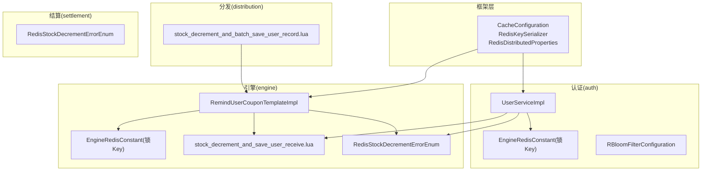
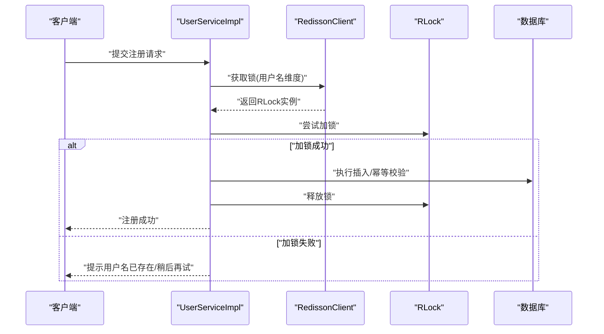
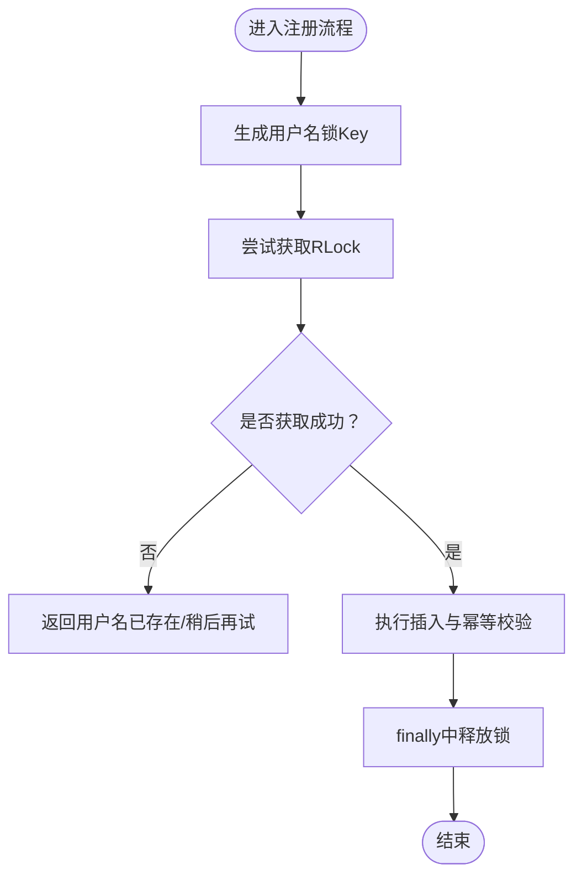
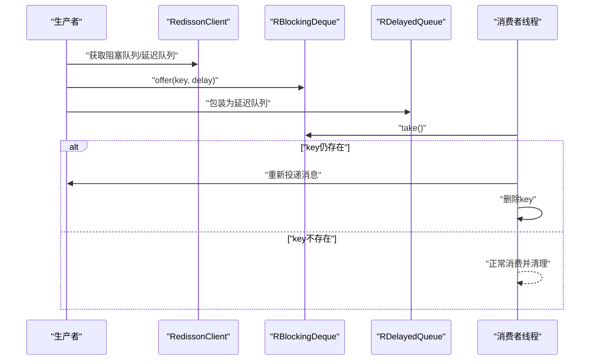
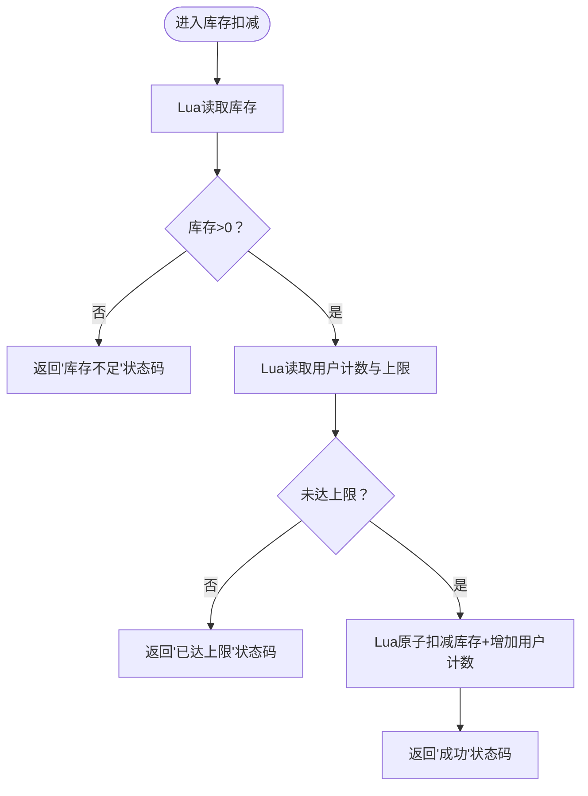
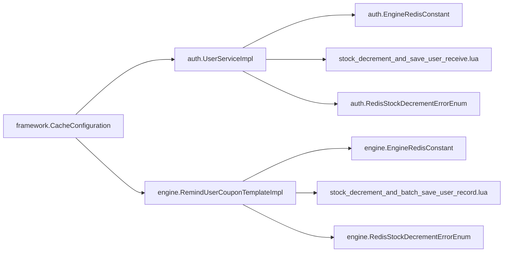

# 分布式锁机制

<cite>
**本文引用的文件**
- [EngineRedisConstant.java](file://engine/src/main/java/com/fengxin/maplecoupon/engine/common/constant/EngineRedisConstant.java)
- [EngineRedisConstant.java](file://auth/src/main/java/com/fengxin/maplecoupon/auth/common/constant/EngineRedisConstant.java)
- [UserServiceImpl.java](file://auth/src/main/java/com/fengxin/maplecoupon/auth/service/impl/UserServiceImpl.java)
- [RedisDistributedProperties.java](file://framework/src/main/java/com/fengxin/config/RedisDistributedProperties.java)
- [CacheConfiguration.java](file://framework/src/main/java/com/fengxin/config/CacheConfiguration.java)
- [RedisKeySerializer.java](file://framework/src/main/java/com/fengxin/config/RedisKeySerializer.java)
- [stock_decrement_and_save_user_receive.lua](file://engine/src/main/resources/lua/stock_decrement_and_save_user_receive.lua)
- [stock_decrement_and_batch_save_user_record.lua](file://distribution/src/main/resources/lua/stock_decrement_and_batch_save_user_record.lua)
- [RedisStockDecrementErrorEnum.java](file://engine/src/main/java/com/fengxin/maplecoupon/engine/common/enums/RedisStockDecrementErrorEnum.java)
- [RedisStockDecrementErrorEnum.java](file://auth/src/main/java/com/fengxin/maplecoupon/auth/common/enums/RedisStockDecrementErrorEnum.java)
- [RedisStockDecrementErrorEnum.java](file://settlement/src/main/java/com/fengxin/maplecoupon/settlement/common/enums/RedisStockDecrementErrorEnum.java)
- [RemindUserCouponTemplateImpl.java](file://engine/src/main/java/com/fengxin/maplecoupon/engine/service/impl/RemindUserCouponTemplateImpl.java)
- [RBloomFilterConfiguration.java](file://engine/src/main/java/com/fengxin/maplecoupon/engine/config/RBloomFilterConfiguration.java)
- [RBloomFilterConfiguration.java](file://auth/src/main/java/com/fengxin/maplecoupon/auth/config/RBloomFilterConfiguration.java)
- [application-dev.yaml](file://engine/src/main/resources/application-dev.yaml)
- [application-dev.yaml](file://auth/src/main/resources/application-dev.yaml)
</cite>

## 目录
1. [引言](#引言)
2. [项目结构](#项目结构)
3. [核心组件](#核心组件)
4. [架构总览](#架构总览)
5. [详细组件分析](#详细组件分析)
6. [依赖关系分析](#依赖关系分析)
7. [性能考量](#性能考量)
8. [故障排查指南](#故障排查指南)
9. [结论](#结论)
10. [附录](#附录)

## 引言
本文件系统性梳理MapleCoupon中基于Redisson的分布式锁应用，重点覆盖以下方面：
- 锁类型与使用场景：结合项目现状，明确使用的是Redisson的可重入互斥锁（RLock），未发现显式公平锁与读写锁的直接使用证据；对“公平锁/读写锁”的讨论以通用原理与最佳实践为主。
- 库存扣减中的作用：通过Lua原子脚本与Redis锁协同，避免超卖并保证一致性。
- 获取/释放/续期机制：基于Redisson客户端的锁API与自动续期能力，结合业务代码的释放时机。
- 配置参数：框架层的Redis Key前缀配置，以及与锁相关的运行时行为建议。
- 集成方式：注解式与编程式两种使用路径，结合项目实际采用编程式。
- 性能与监控：结合Lua原子化与Redis锁的特性进行评估，并给出可观测性建议。
- 常见问题与最佳实践：结合代码实现与枚举状态，总结排查思路与优化建议。

## 项目结构
MapleCoupon采用多模块架构，分布式锁主要分布在以下模块：
- framework：提供Redis相关基础配置（如Key序列化器、前缀配置）。
- engine：面向引擎服务，包含Redis常量、Lua脚本、延时队列等。
- auth：面向认证服务，包含用户注册的分布式锁保护。
- distribution：面向分发服务，包含批量保存用户领券记录的Lua脚本。
- settlement：面向结算服务，包含库存扣减错误码枚举。

图表来源
- [CacheConfiguration.java:16-35](file://framework/src/main/java/com/fengxin/config/CacheConfiguration.java#L16-L35)
- [RedisKeySerializer.java:14-37](file://framework/src/main/java/com/fengxin/config/RedisKeySerializer.java#L14-L37)
- [RedisDistributedProperties.java:11-24](file://framework/src/main/java/com/fengxin/config/RedisDistributedProperties.java#L11-L24)
- [UserServiceImpl.java:48-98](file://auth/src/main/java/com/fengxin/maplecoupon/auth/service/impl/UserServiceImpl.java#L48-L98)
- [EngineRedisConstant.java:18-51](file://auth/src/main/java/com/fengxin/maplecoupon/auth/common/constant/EngineRedisConstant.java#L18-L51)
- [EngineRedisConstant.java:18-49](file://engine/src/main/java/com/fengxin/maplecoupon/engine/common/constant/EngineRedisConstant.java#L18-L49)
- [RemindUserCouponTemplateImpl.java:57-95](file://engine/src/main/java/com/fengxin/maplecoupon/engine/service/impl/RemindUserCouponTemplateImpl.java#L57-L95)
- [stock_decrement_and_save_user_receive.lua:1-58](file://engine/src/main/resources/lua/stock_decrement_and_save_user_receive.lua#L1-L58)
- [stock_decrement_and_batch_save_user_record.lua:1-33](file://distribution/src/main/resources/lua/stock_decrement_and_batch_save_user_record.lua#L1-L33)
- [RedisStockDecrementErrorEnum.java:15-65](file://engine/src/main/java/com/fengxin/maplecoupon/engine/common/enums/RedisStockDecrementErrorEnum.java#L15-L65)
- [RedisStockDecrementErrorEnum.java:15-65](file://auth/src/main/java/com/fengxin/maplecoupon/auth/common/enums/RedisStockDecrementErrorEnum.java#L15-L65)
- [RedisStockDecrementErrorEnum.java:15-65](file://settlement/src/main/java/com/fengxin/maplecoupon/settlement/common/enums/RedisStockDecrementErrorEnum.java#L15-L65)

章节来源
- [CacheConfiguration.java:16-35](file://framework/src/main/java/com/fengxin/config/CacheConfiguration.java#L16-L35)
- [RedisKeySerializer.java:14-37](file://framework/src/main/java/com/fengxin/config/RedisKeySerializer.java#L14-L37)
- [RedisDistributedProperties.java:11-24](file://framework/src/main/java/com/fengxin/config/RedisDistributedProperties.java#L11-L24)
- [UserServiceImpl.java:48-98](file://auth/src/main/java/com/fengxin/maplecoupon/auth/service/impl/UserServiceImpl.java#L48-L98)
- [EngineRedisConstant.java:18-51](file://auth/src/main/java/com/fengxin/maplecoupon/auth/common/constant/EngineRedisConstant.java#L18-L51)
- [EngineRedisConstant.java:18-49](file://engine/src/main/java/com/fengxin/maplecoupon/engine/common/constant/EngineRedisConstant.java#L18-L49)
- [RemindUserCouponTemplateImpl.java:57-95](file://engine/src/main/java/com/fengxin/maplecoupon/engine/service/impl/RemindUserCouponTemplateImpl.java#L57-L95)
- [stock_decrement_and_save_user_receive.lua:1-58](file://engine/src/main/resources/lua/stock_decrement_and_save_user_receive.lua#L1-L58)
- [stock_decrement_and_batch_save_user_record.lua:1-33](file://distribution/src/main/resources/lua/stock_decrement_and_batch_save_user_record.lua#L1-L33)
- [RedisStockDecrementErrorEnum.java:15-65](file://engine/src/main/java/com/fengxin/maplecoupon/engine/common/enums/RedisStockDecrementErrorEnum.java#L15-L65)
- [RedisStockDecrementErrorEnum.java:15-65](file://auth/src/main/java/com/fengxin/maplecoupon/auth/common/enums/RedisStockDecrementErrorEnum.java#L15-L65)
- [RedisStockDecrementErrorEnum.java:15-65](file://settlement/src/main/java/com/fengxin/maplecoupon/settlement/common/enums/RedisStockDecrementErrorEnum.java#L15-L65)

## 核心组件
- Redis分布式锁（Redisson RLock）
  - 在认证模块中，用户注册流程通过RLock对用户名维度加锁，防止并发重复注册导致的异常。
  - 在引擎模块中，延时队列消费侧通过Redisson阻塞队列与延迟队列实现可靠投递与重试。
- Redis Key前缀与序列化
  - 框架层提供RedisKeySerializer与RedisDistributedProperties，支持统一设置Key前缀，便于多环境隔离与运维。
- Lua原子脚本
  - 引擎与分发模块均提供Lua脚本，实现库存扣减与用户记录的原子化操作，降低锁粒度与竞争。
- 错误码与状态
  - 多模块提供RedisStockDecrementErrorEnum，统一表达“成功/库存不足/用户已达上限”等状态，便于前端与调用方快速判断。

章节来源
- [UserServiceImpl.java:77-98](file://auth/src/main/java/com/fengxin/maplecoupon/auth/service/impl/UserServiceImpl.java#L77-L98)
- [RemindUserCouponTemplateImpl.java:63-72](file://engine/src/main/java/com/fengxin/maplecoupon/engine/service/impl/RemindUserCouponTemplateImpl.java#L63-L72)
- [CacheConfiguration.java:24-34](file://framework/src/main/java/com/fengxin/config/CacheConfiguration.java#L24-L34)
- [RedisKeySerializer.java:23-31](file://framework/src/main/java/com/fengxin/config/RedisKeySerializer.java#L23-L31)
- [RedisDistributedProperties.java:17-23](file://framework/src/main/java/com/fengxin/config/RedisDistributedProperties.java#L17-L23)
- [stock_decrement_and_save_user_receive.lua:24-58](file://engine/src/main/resources/lua/stock_decrement_and_save_user_receive.lua#L24-L58)
- [stock_decrement_and_batch_save_user_record.lua:15-33](file://distribution/src/main/resources/lua/stock_decrement_and_batch_save_user_record.lua#L15-L33)
- [RedisStockDecrementErrorEnum.java:15-65](file://engine/src/main/java/com/fengxin/maplecoupon/engine/common/enums/RedisStockDecrementErrorEnum.java#L15-L65)

## 架构总览
下图展示分布式锁在用户注册与库存扣减中的关键交互：

图表来源
- [UserServiceImpl.java:77-98](file://auth/src/main/java/com/fengxin/maplecoupon/auth/service/impl/UserServiceImpl.java#L77-L98)
- [EngineRedisConstant.java:51-51](file://auth/src/main/java/com/fengxin/maplecoupon/auth/common/constant/EngineRedisConstant.java#L51-L51)

章节来源
- [UserServiceImpl.java:77-98](file://auth/src/main/java/com/fengxin/maplecoupon/auth/service/impl/UserServiceImpl.java#L77-L98)
- [EngineRedisConstant.java:51-51](file://auth/src/main/java/com/fengxin/maplecoupon/auth/common/constant/EngineRedisConstant.java#L51-L51)

## 详细组件分析

### 认证模块：用户注册分布式锁
- 锁Key设计：按用户名维度生成唯一锁Key，避免并发注册冲突。
- 加锁与释放：使用RLock的tryLock与unlock，确保异常路径也能释放锁。
- 幂等与回滚：结合数据库唯一约束与异常捕获，保证幂等性。

图表来源
- [UserServiceImpl.java:77-98](file://auth/src/main/java/com/fengxin/maplecoupon/auth/service/impl/UserServiceImpl.java#L77-L98)
- [EngineRedisConstant.java:51-51](file://auth/src/main/java/com/fengxin/maplecoupon/auth/common/constant/EngineRedisConstant.java#L51-L51)

章节来源
- [UserServiceImpl.java:77-98](file://auth/src/main/java/com/fengxin/maplecoupon/auth/service/impl/UserServiceImpl.java#L77-L98)
- [EngineRedisConstant.java:51-51](file://auth/src/main/java/com/fengxin/maplecoupon/auth/common/constant/EngineRedisConstant.java#L51-L51)

### 引擎模块：延时队列与锁的协作
- 延时队列：通过Redisson的阻塞队列与延迟队列实现可靠投递与重试。
- 消费重试：若Key仍存在，判定消费失败，重新投递消息，保障最终一致性。
- 锁Key：模板维度的锁Key用于保护关键临界区。

图表来源
- [RemindUserCouponTemplateImpl.java:63-72](file://engine/src/main/java/com/fengxin/maplecoupon/engine/service/impl/RemindUserCouponTemplateImpl.java#L63-L72)
- [RemindUserCouponTemplateImpl.java:114-127](file://engine/src/main/java/com/fengxin/maplecoupon/engine/service/impl/RemindUserCouponTemplateImpl.java#L114-L127)
- [EngineRedisConstant.java:48-49](file://engine/src/main/java/com/fengxin/maplecoupon/engine/common/constant/EngineRedisConstant.java#L48-L49)

章节来源
- [RemindUserCouponTemplateImpl.java:57-95](file://engine/src/main/java/com/fengxin/maplecoupon/engine/service/impl/RemindUserCouponTemplateImpl.java#L57-L95)
- [RemindUserCouponTemplateImpl.java:106-133](file://engine/src/main/java/com/fengxin/maplecoupon/engine/service/impl/RemindUserCouponTemplateImpl.java#L106-L133)
- [EngineRedisConstant.java:48-49](file://engine/src/main/java/com/fengxin/maplecoupon/engine/common/constant/EngineRedisConstant.java#L48-L49)

### 库存扣减：Lua原子脚本与锁的配合
- 引擎模块：Lua脚本原子化检查库存、用户上限、增加用户计数与扣减库存，返回组合状态码。
- 分发模块：Lua脚本原子化扣减库存并加入用户集合，返回组合状态码。
- 错误码：通过枚举统一表达“成功/库存不足/用户已达上限”，便于业务分支处理。

图表来源
- [stock_decrement_and_save_user_receive.lua:24-58](file://engine/src/main/resources/lua/stock_decrement_and_save_user_receive.lua#L24-L58)
- [stock_decrement_and_batch_save_user_record.lua:15-33](file://distribution/src/main/resources/lua/stock_decrement_and_batch_save_user_record.lua#L15-L33)
- [RedisStockDecrementErrorEnum.java:15-65](file://engine/src/main/java/com/fengxin/maplecoupon/engine/common/enums/RedisStockDecrementErrorEnum.java#L15-L65)

章节来源
- [stock_decrement_and_save_user_receive.lua:24-58](file://engine/src/main/resources/lua/stock_decrement_and_save_user_receive.lua#L24-L58)
- [stock_decrement_and_batch_save_user_record.lua:15-33](file://distribution/src/main/resources/lua/stock_decrement_and_batch_save_user_record.lua#L15-L33)
- [RedisStockDecrementErrorEnum.java:15-65](file://engine/src/main/java/com/fengxin/maplecoupon/engine/common/enums/RedisStockDecrementErrorEnum.java#L15-L65)

### 锁类型与使用场景
- 项目现状：认证模块使用RLock（可重入互斥锁）保护注册；引擎模块使用阻塞/延迟队列保障消息可靠投递。
- 公平锁与读写锁（通用说明）
  - 公平锁：保证等待时间最长的线程优先获得锁，适用于严格顺序需求。
  - 读写锁：读多写少场景提升吞吐，但需注意写锁升级与降级的复杂性。
- 适用建议：若未来引入模板维度的高并发写场景，可考虑读写锁；若需要严格排队，可考虑公平锁。

章节来源
- [UserServiceImpl.java:77-98](file://auth/src/main/java/com/fengxin/maplecoupon/auth/service/impl/UserServiceImpl.java#L77-L98)
- [RemindUserCouponTemplateImpl.java:63-72](file://engine/src/main/java/com/fengxin/maplecoupon/engine/service/impl/RemindUserCouponTemplateImpl.java#L63-L72)

### 获取、释放与续期机制
- 获取：通过RedissonClient获取RLock实例，调用tryLock尝试获取。
- 释放：无论成功与否，均在finally中释放锁，避免死锁。
- 续期：Redisson支持看门狗自动续期，可在配置中调整续期周期与超时阈值，确保长时间业务不会因锁超时而提前释放。

章节来源
- [UserServiceImpl.java:77-98](file://auth/src/main/java/com/fengxin/maplecoupon/auth/service/impl/UserServiceImpl.java#L77-L98)

### 配置参数说明
- Key前缀与字符集：通过RedisDistributedProperties与RedisKeySerializer统一设置，便于多环境隔离与运维。
- Redis连接：各模块application-dev.yaml中配置Redis地址、端口、密码与库号，确保Redisson可用。

章节来源
- [RedisDistributedProperties.java:17-23](file://framework/src/main/java/com/fengxin/config/RedisDistributedProperties.java#L17-L23)
- [RedisKeySerializer.java:23-31](file://framework/src/main/java/com/fengxin/config/RedisKeySerializer.java#L23-L31)
- [application-dev.yaml:7-11](file://engine/src/main/resources/application-dev.yaml#L7-L11)
- [application-dev.yaml:7-11](file://auth/src/main/resources/application-dev.yaml#L7-L11)

### 与业务逻辑的集成方式
- 编程式（项目实际采用）
  - 认证模块：在服务层直接获取RLock并加解锁。
  - 引擎模块：在消息消费侧使用Redisson阻塞/延迟队列。
- 注解式（通用路径）
  - 可通过Spring Cache或Redisson提供的注解简化加解锁，但需确保事务与异常处理边界清晰。

章节来源
- [UserServiceImpl.java:77-98](file://auth/src/main/java/com/fengxin/maplecoupon/auth/service/impl/UserServiceImpl.java#L77-L98)
- [RemindUserCouponTemplateImpl.java:63-72](file://engine/src/main/java/com/fengxin/maplecoupon/engine/service/impl/RemindUserCouponTemplateImpl.java#L63-L72)

## 依赖关系分析
- 框架层依赖：Redisson Starter、Key序列化器、前缀配置。
- 业务层依赖：RedissonClient、RLock、Lua脚本、错误码枚举。
- 运行时依赖：Redis连接、Nacos注册中心（其他模块配置示例）。

图表来源
- [CacheConfiguration.java:16-35](file://framework/src/main/java/com/fengxin/config/CacheConfiguration.java#L16-L35)
- [UserServiceImpl.java:48-98](file://auth/src/main/java/com/fengxin/maplecoupon/auth/service/impl/UserServiceImpl.java#L48-L98)
- [RemindUserCouponTemplateImpl.java:57-95](file://engine/src/main/java/com/fengxin/maplecoupon/engine/service/impl/RemindUserCouponTemplateImpl.java#L57-L95)
- [EngineRedisConstant.java:18-51](file://auth/src/main/java/com/fengxin/maplecoupon/auth/common/constant/EngineRedisConstant.java#L18-L51)
- [EngineRedisConstant.java:18-49](file://engine/src/main/java/com/fengxin/maplecoupon/engine/common/constant/EngineRedisConstant.java#L18-L49)
- [stock_decrement_and_save_user_receive.lua:1-58](file://engine/src/main/resources/lua/stock_decrement_and_save_user_receive.lua#L1-L58)
- [stock_decrement_and_batch_save_user_record.lua:1-33](file://distribution/src/main/resources/lua/stock_decrement_and_batch_save_user_record.lua#L1-L33)
- [RedisStockDecrementErrorEnum.java:15-65](file://engine/src/main/java/com/fengxin/maplecoupon/engine/common/enums/RedisStockDecrementErrorEnum.java#L15-L65)
- [RedisStockDecrementErrorEnum.java:15-65](file://auth/src/main/java/com/fengxin/maplecoupon/auth/common/enums/RedisStockDecrementErrorEnum.java#L15-L65)

章节来源
- [CacheConfiguration.java:16-35](file://framework/src/main/java/com/fengxin/config/CacheConfiguration.java#L16-L35)
- [UserServiceImpl.java:48-98](file://auth/src/main/java/com/fengxin/maplecoupon/auth/service/impl/UserServiceImpl.java#L48-L98)
- [RemindUserCouponTemplateImpl.java:57-95](file://engine/src/main/java/com/fengxin/maplecoupon/engine/service/impl/RemindUserCouponTemplateImpl.java#L57-L95)
- [EngineRedisConstant.java:18-51](file://auth/src/main/java/com/fengxin/maplecoupon/auth/common/constant/EngineRedisConstant.java#L18-L51)
- [EngineRedisConstant.java:18-49](file://engine/src/main/java/com/fengxin/maplecoupon/engine/common/constant/EngineRedisConstant.java#L18-L49)
- [stock_decrement_and_save_user_receive.lua:1-58](file://engine/src/main/resources/lua/stock_decrement_and_save_user_receive.lua#L1-L58)
- [stock_decrement_and_batch_save_user_record.lua:1-33](file://distribution/src/main/resources/lua/stock_decrement_and_batch_save_user_record.lua#L1-L33)
- [RedisStockDecrementErrorEnum.java:15-65](file://engine/src/main/java/com/fengxin/maplecoupon/engine/common/enums/RedisStockDecrementErrorEnum.java#L15-L65)
- [RedisStockDecrementErrorEnum.java:15-65](file://auth/src/main/java/com/fengxin/maplecoupon/auth/common/enums/RedisStockDecrementErrorEnum.java#L15-L65)

## 性能考量
- 原子化Lua脚本：减少网络往返与锁持有时间，显著降低热点竞争。
- 锁粒度：按用户名或模板维度加锁，避免全局锁带来的瓶颈。
- 自动续期：合理设置续期周期，避免长事务导致的锁超时。
- 监控建议：埋点统计锁获取耗时、等待队列长度、Lua执行耗时与错误码分布，结合Prometheus/Grafana可视化。

## 故障排查指南
- 注册失败/重复注册
  - 现象：提示用户名已存在或注册失败。
  - 排查：确认RLock是否正确释放；检查用户名维度锁Key是否一致；核对数据库唯一约束。
- 库存超卖/扣减异常
  - 现象：库存显示负数或“库存不足”频繁出现。
  - 排查：确认Lua脚本是否完整执行；检查库存字段类型与初始值；核对错误码返回路径。
- 消息未消费/重复投递
  - 现象：延时队列消息未按时消费或重复投递。
  - 排查：确认Redisson阻塞/延迟队列配置；检查消费者线程是否存活；核对Key存在性判断逻辑。
- 锁超时/死锁
  - 现象：业务长时间占用锁导致超时或无法释放。
  - 排查：缩短业务处理时间；启用自动续期；确保finally中释放锁；必要时调整续期周期。

章节来源
- [UserServiceImpl.java:77-98](file://auth/src/main/java/com/fengxin/maplecoupon/auth/service/impl/UserServiceImpl.java#L77-L98)
- [RemindUserCouponTemplateImpl.java:114-127](file://engine/src/main/java/com/fengxin/maplecoupon/engine/service/impl/RemindUserCouponTemplateImpl.java#L114-L127)
- [RedisStockDecrementErrorEnum.java:15-65](file://engine/src/main/java/com/fengxin/maplecoupon/engine/common/enums/RedisStockDecrementErrorEnum.java#L15-L65)

## 结论
- 项目已通过Redisson可重入锁与Lua原子脚本在关键路径上实现了强一致与高可用。
- 认证模块的注册保护与引擎模块的延时队列可靠性形成互补。
- 建议持续完善监控与告警体系，结合业务峰值优化锁粒度与续期策略。

## 附录
- 配置参考
  - Redis连接参数：host/port/password/database
  - Key前缀：通过framework.cache.redis.prefix统一设置
- 常用枚举
  - RedisStockDecrementErrorEnum：SUCCESS/STOCK_INSUFFICIENT/LIMIT_REACHED

章节来源
- [application-dev.yaml:7-11](file://engine/src/main/resources/application-dev.yaml#L7-L11)
- [application-dev.yaml:7-11](file://auth/src/main/resources/application-dev.yaml#L7-L11)
- [RedisDistributedProperties.java:17-23](file://framework/src/main/java/com/fengxin/config/RedisDistributedProperties.java#L17-L23)
- [RedisStockDecrementErrorEnum.java:15-65](file://engine/src/main/java/com/fengxin/maplecoupon/engine/common/enums/RedisStockDecrementErrorEnum.java#L15-L65)