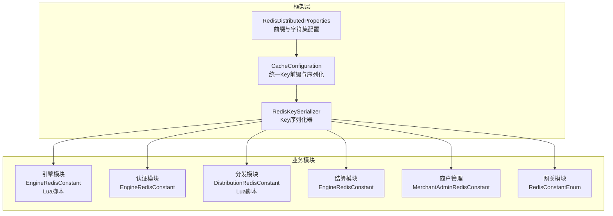
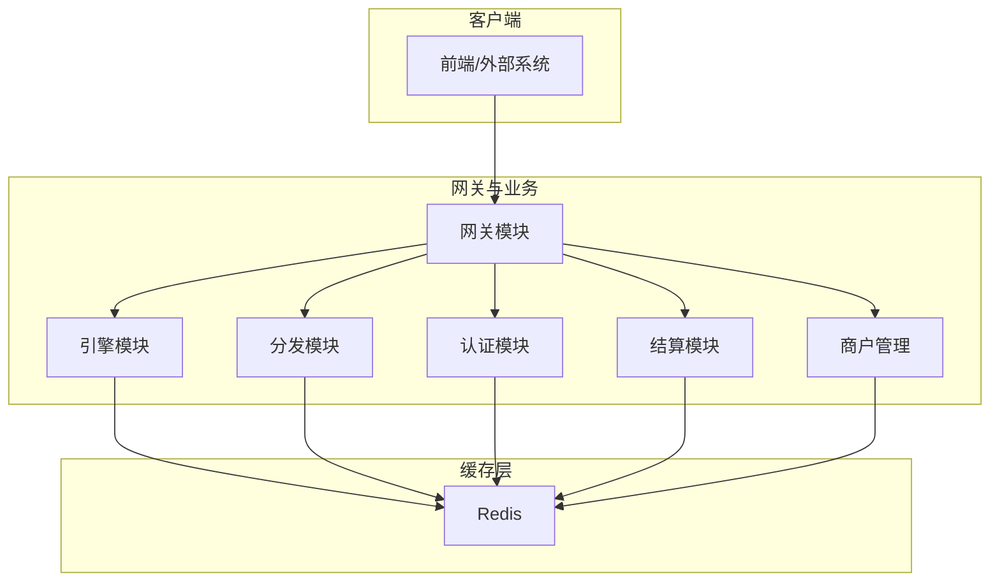
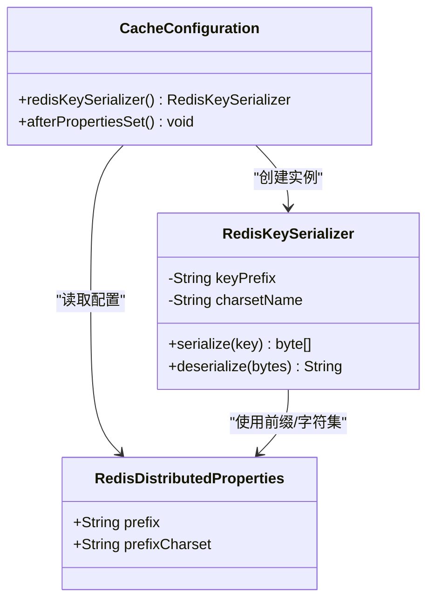
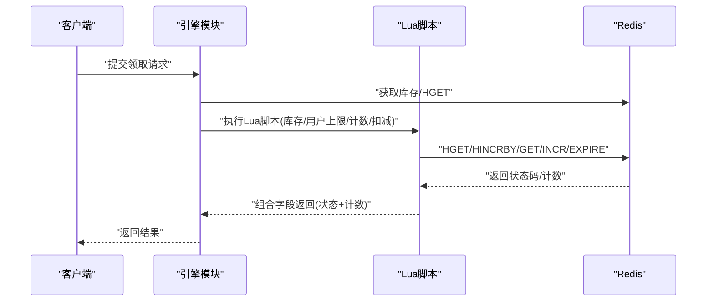
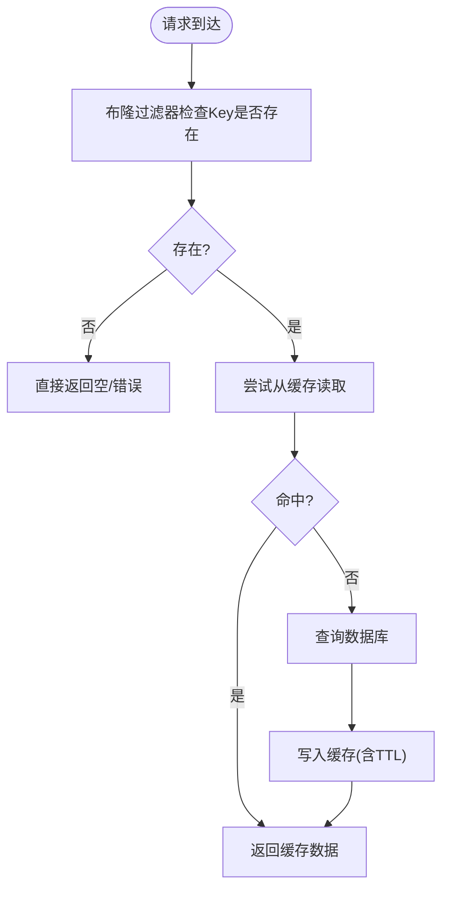
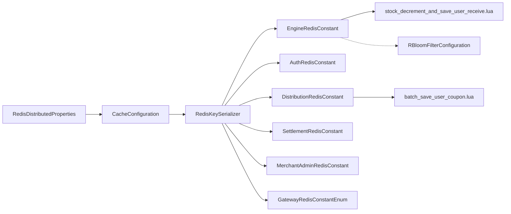

# 性能监控与分析

<cite>
**本文引用的文件**
- [CacheConfiguration.java](file://framework/src/main/java/com/fengxin/config/CacheConfiguration.java)
- [RedisDistributedProperties.java](file://framework/src/main/java/com/fengxin/config/RedisDistributedProperties.java)
- [RedisKeySerializer.java](file://framework/src/main/java/com/fengxin/config/RedisKeySerializer.java)
- [EngineRedisConstant.java（引擎模块）](file://engine/src/main/java/com/fengxin/maplecoupon/engine/common/constant/EngineRedisConstant.java)
- [EngineRedisConstant.java（认证模块）](file://auth/src/main/java/com/fengxin/maplecoupon/auth/common/constant/EngineRedisConstant.java)
- [EngineRedisConstant.java（结算模块）](file://settlement/src/main/java/com/fengxin/maplecoupon/settlement/common/constant/EngineRedisConstant.java)
- [EngineRedisConstant.java（分发模块）](file://distribution/src/main/java/com/fengxin/maplecoupon/distribution/common/constant/EngineRedisConstant.java)
- [DistributionRedisConstant.java](file://distribution/src/main/java/com/fengxin/maplecoupon/distribution/common/constant/DistributionRedisConstant.java)
- [RedisConstantEnum.java（网关模块）](file://gateway/src/main/java/com/fengxin/maplecoupon/gateway/common/RedisConstantEnum.java)
- [MerchantAdminRedisConstant.java](file://merchant-admin/src/main/java/com/fengxin/maplecoupon/merchantadmin/common/constant/MerchantAdminRedisConstant.java)
- [RBloomFilterConfiguration.java（引擎模块）](file://engine/src/main/java/com/fengxin/maplecoupon/engine/config/RBloomFilterConfiguration.java)
- [stock_decrement_and_save_user_receive.lua（引擎模块）](file://engine/src/main/resources/lua/stock_decrement_and_save_user_receive.lua)
- [batch_save_user_coupon.lua（分发模块）](file://distribution/src/main/resources/lua/batch_save_user_coupon.lua)
- [application.yaml（引擎模块）](file://engine/src/main/resources/application.yaml)
- [application.yaml（认证模块）](file://auth/src/main/resources/application.yaml)
- [application.yaml（分发模块）](file://distribution/src/main/resources/application.yaml)
</cite>

## 目录
1. [简介](#简介)
2. [项目结构](#项目结构)
3. [核心组件](#核心组件)
4. [架构总览](#架构总览)
5. [详细组件分析](#详细组件分析)
6. [依赖分析](#依赖分析)
7. [性能考量](#性能考量)
8. [故障排查指南](#故障排查指南)
9. [结论](#结论)
10. [附录](#附录)

## 简介
本文件聚焦于MapleCoupon中Redis缓存的性能监控与分析，围绕以下目标展开：
- 构建缓存命中率、响应时间与内存使用的监控体系
- 定义并计算缓存命中率、穿透率与失效率等关键指标
- 提供Redis性能分析工具（INFO、KEYS、内存分析）的使用方法
- 识别与优化缓存热点数据，实现热点key分布与负载均衡
- 诊断缓存性能瓶颈（慢查询、内存泄漏），并给出优化实践
- 设定监控告警阈值与异常应急处理方案

## 项目结构
MapleCoupon采用多模块微服务架构，Redis作为核心缓存层贯穿多个子系统。框架层负责统一的Redis配置与序列化；各业务模块（引擎、认证、分发、结算、商户管理、网关）通过常量定义规范缓存键命名空间，并在Lua脚本中实现原子性操作以降低网络往返与竞争条件。

图表来源
- [CacheConfiguration.java:14-35](file://framework/src/main/java/com/fengxin/config/CacheConfiguration.java#L14-L35)
- [RedisDistributedProperties.java:11-24](file://framework/src/main/java/com/fengxin/config/RedisDistributedProperties.java#L11-L24)
- [RedisKeySerializer.java:14-37](file://framework/src/main/java/com/fengxin/config/RedisKeySerializer.java#L14-L37)
- [EngineRedisConstant.java（引擎模块）:9-55](file://engine/src/main/java/com/fengxin/maplecoupon/engine/common/constant/EngineRedisConstant.java#L9-L55)
- [EngineRedisConstant.java（认证模块）:9-55](file://auth/src/main/java/com/fengxin/maplecoupon/auth/common/constant/EngineRedisConstant.java#L9-L55)
- [EngineRedisConstant.java（结算模块）:9-51](file://settlement/src/main/java/com/fengxin/maplecoupon/settlement/common/constant/EngineRedisConstant.java#L9-L51)
- [EngineRedisConstant.java（分发模块）:9-20](file://distribution/src/main/java/com/fengxin/maplecoupon/distribution/common/constant/EngineRedisConstant.java#L9-L20)
- [DistributionRedisConstant.java:9-21](file://distribution/src/main/java/com/fengxin/maplecoupon/distribution/common/constant/DistributionRedisConstant.java#L9-L21)
- [RedisConstantEnum.java（网关模块）:9-14](file://gateway/src/main/java/com/fengxin/maplecoupon/gateway/common/RedisConstantEnum.java#L9-L14)
- [MerchantAdminRedisConstant.java:9-16](file://merchant-admin/src/main/java/com/fengxin/maplecoupon/merchantadmin/common/constant/MerchantAdminRedisConstant.java#L9-L16)

章节来源
- [CacheConfiguration.java:14-35](file://framework/src/main/java/com/fengxin/config/CacheConfiguration.java#L14-L35)
- [RedisDistributedProperties.java:11-24](file://framework/src/main/java/com/fengxin/config/RedisDistributedProperties.java#L11-L24)
- [RedisKeySerializer.java:14-37](file://framework/src/main/java/com/fengxin/config/RedisKeySerializer.java#L14-L37)

## 核心组件
- 统一Key前缀与序列化：通过框架层的配置类与序列化器，为所有模块提供一致的Key命名前缀与字符集，便于跨模块监控与运维。
- Redis常量定义：各业务模块集中定义缓存键命名空间，避免冲突并提升可观测性。
- Lua脚本原子化：在引擎与分发模块中使用Lua脚本进行库存扣减与批量写入，减少网络往返与竞态，提高吞吐与稳定性。
- 布隆过滤器：在引擎模块中引入Redisson布隆过滤器，用于防止缓存穿透，降低后端压力。

章节来源
- [CacheConfiguration.java:24-34](file://framework/src/main/java/com/fengxin/config/CacheConfiguration.java#L24-L34)
- [RedisDistributedProperties.java:18-23](file://framework/src/main/java/com/fengxin/config/RedisDistributedProperties.java#L18-L23)
- [RedisKeySerializer.java:23-31](file://framework/src/main/java/com/fengxin/config/RedisKeySerializer.java#L23-L31)
- [EngineRedisConstant.java（引擎模块）:14-54](file://engine/src/main/java/com/fengxin/maplecoupon/engine/common/constant/EngineRedisConstant.java#L14-L54)
- [EngineRedisConstant.java（认证模块）:14-54](file://auth/src/main/java/com/fengxin/maplecoupon/auth/common/constant/EngineRedisConstant.java#L14-L54)
- [EngineRedisConstant.java（结算模块）:14-50](file://settlement/src/main/java/com/fengxin/maplecoupon/settlement/common/constant/EngineRedisConstant.java#L14-L50)
- [EngineRedisConstant.java（分发模块）:13-18](file://distribution/src/main/java/com/fengxin/maplecoupon/distribution/common/constant/EngineRedisConstant.java#L13-L18)
- [DistributionRedisConstant.java:13-18](file://distribution/src/main/java/com/fengxin/maplecoupon/distribution/common/constant/DistributionRedisConstant.java#L13-L18)
- [RBloomFilterConfiguration.java（引擎模块）:40-45](file://engine/src/main/java/com/fengxin/maplecoupon/engine/config/RBloomFilterConfiguration.java#L40-L45)

## 架构总览
下图展示Redis在MapleCoupon中的角色与交互路径，强调缓存层对业务模块的支持与Lua原子化操作带来的性能收益。

图表来源
- [RedisConstantEnum.java（网关模块）:13-13](file://gateway/src/main/java/com/fengxin/maplecoupon/gateway/common/RedisConstantEnum.java#L13-L13)
- [EngineRedisConstant.java（引擎模块）:14-54](file://engine/src/main/java/com/fengxin/maplecoupon/engine/common/constant/EngineRedisConstant.java#L14-L54)
- [DistributionRedisConstant.java:13-18](file://distribution/src/main/java/com/fengxin/maplecoupon/distribution/common/constant/DistributionRedisConstant.java#L13-L18)
- [EngineRedisConstant.java（认证模块）:53-53](file://auth/src/main/java/com/fengxin/maplecoupon/auth/common/constant/EngineRedisConstant.java#L53-L53)
- [EngineRedisConstant.java（结算模块）:14-50](file://settlement/src/main/java/com/fengxin/maplecoupon/settlement/common/constant/EngineRedisConstant.java#L14-L50)
- [MerchantAdminRedisConstant.java:13-13](file://merchant-admin/src/main/java/com/fengxin/maplecoupon/merchantadmin/common/constant/MerchantAdminRedisConstant.java#L13-L13)

## 详细组件分析

### 缓存键命名与前缀策略
- 统一前缀：通过配置类注入前缀与字符集，序列化器在Key序列化时拼接前缀，保证键空间隔离与可维护性。
- 模块化命名：各模块在常量类中定义清晰的命名空间，如“引擎:模板”“分发:任务进度”等，便于按模块维度统计与告警。

图表来源
- [RedisDistributedProperties.java:18-23](file://framework/src/main/java/com/fengxin/config/RedisDistributedProperties.java#L18-L23)
- [RedisKeySerializer.java:16-31](file://framework/src/main/java/com/fengxin/config/RedisKeySerializer.java#L16-L31)
- [CacheConfiguration.java:24-34](file://framework/src/main/java/com/fengxin/config/CacheConfiguration.java#L24-L34)

章节来源
- [CacheConfiguration.java:24-34](file://framework/src/main/java/com/fengxin/config/CacheConfiguration.java#L24-L34)
- [RedisDistributedProperties.java:18-23](file://framework/src/main/java/com/fengxin/config/RedisDistributedProperties.java#L18-L23)
- [RedisKeySerializer.java:23-31](file://framework/src/main/java/com/fengxin/config/RedisKeySerializer.java#L23-L31)

### Lua原子化操作与性能收益
- 引擎模块库存扣减与用户领取次数记录：通过单条Lua脚本完成库存检查、用户上限判断、计数递增与库存扣减，减少网络往返与竞态风险。
- 分发模块批量保存用户券：Lua遍历用户集合，原子化写入有序集合并设置过期时间，提升批量写入吞吐。

图表来源
- [stock_decrement_and_save_user_receive.lua（引擎模块）:24-58](file://engine/src/main/resources/lua/stock_decrement_and_save_user_receive.lua#L24-L58)

章节来源
- [stock_decrement_and_save_user_receive.lua（引擎模块）:1-58](file://engine/src/main/resources/lua/stock_decrement_and_save_user_receive.lua#L1-L58)
- [batch_save_user_coupon.lua（分发模块）:1-15](file://distribution/src/main/resources/lua/batch_save_user_coupon.lua#L1-L15)

### 缓存穿透与热点识别
- 缓存穿透防护：通过Redisson布隆过滤器在进入后端数据库前拦截不存在的Key，显著降低穿透带来的压力。
- 热点识别：结合业务键模式（如“模板:ID”“用户:ID”）与访问频次统计，定位热点Key；必要时对热点Key进行拆分或增加副本。

图表来源
- [RBloomFilterConfiguration.java（引擎模块）:40-45](file://engine/src/main/java/com/fengxin/maplecoupon/engine/config/RBloomFilterConfiguration.java#L40-L45)

章节来源
- [RBloomFilterConfiguration.java（引擎模块）:40-45](file://engine/src/main/java/com/fengxin/maplecoupon/engine/config/RBloomFilterConfiguration.java#L40-L45)

### 缓存指标定义与计算方法
- 缓存命中率 = 命中次数 / (命中次数 + 未命中次数)
- 缓存穿透率 = 穿透请求次数 / 总请求次数
- 失效率 = 未命中次数 / 总请求次数
- 建议采集维度：按模块（引擎/分发/认证/结算/商户管理）与键前缀聚合统计，结合慢查询与内存指标综合评估。

章节来源
- [EngineRedisConstant.java（引擎模块）:14-54](file://engine/src/main/java/com/fengxin/maplecoupon/engine/common/constant/EngineRedisConstant.java#L14-L54)
- [DistributionRedisConstant.java:13-18](file://distribution/src/main/java/com/fengxin/maplecoupon/distribution/common/constant/DistributionRedisConstant.java#L13-L18)
- [EngineRedisConstant.java（认证模块）:53-53](file://auth/src/main/java/com/fengxin/maplecoupon/auth/common/constant/EngineRedisConstant.java#L53-L53)
- [EngineRedisConstant.java（结算模块）:14-50](file://settlement/src/main/java/com/fengxin/maplecoupon/settlement/common/constant/EngineRedisConstant.java#L14-L50)
- [MerchantAdminRedisConstant.java:13-13](file://merchant-admin/src/main/java/com/fengxin/maplecoupon/merchantadmin/common/constant/MerchantAdminRedisConstant.java#L13-L13)

### Redis性能分析工具使用
- INFO命令：采集连接数、内存使用、命中率、慢查询、过期键等关键指标，用于整体健康度评估。
- KEYS命令：谨慎使用，建议配合SCAN迭代扫描，定位特定前缀的键并估算数量，避免阻塞。
- 内存分析：结合内存淘汰策略、对象大小分布与碎片率，识别内存瓶颈与异常增长。

章节来源
- [application.yaml（引擎模块）:1-22](file://engine/src/main/resources/application.yaml#L1-L22)
- [application.yaml（认证模块）:1-19](file://auth/src/main/resources/application.yaml#L1-L19)
- [application.yaml（分发模块）:1-15](file://distribution/src/main/resources/application.yaml#L1-L15)

### 缓存热点数据识别与优化
- 识别：统计各模块键的访问频次，关注“模板:ID”“用户:ID”等高频键；观察响应时间与CPU占用的峰值关联。
- 优化：
  - 拆分热点：对单一热点键进行分片（如按用户ID哈希分桶），分散到多个子键。
  - 增加副本：在多节点部署中复制热点键，降低单点压力。
  - TTL与预热：合理设置过期时间并进行热点预热，避免冷启动抖动。
  - 读写分离：热点读多写少场景下，考虑只读副本或本地缓存。

章节来源
- [EngineRedisConstant.java（引擎模块）:14-54](file://engine/src/main/java/com/fengxin/maplecoupon/engine/common/constant/EngineRedisConstant.java#L14-L54)
- [DistributionRedisConstant.java:13-18](file://distribution/src/main/java/com/fengxin/maplecoupon/distribution/common/constant/DistributionRedisConstant.java#L13-L18)

### 缓存性能瓶颈诊断
- 慢查询分析：利用Redis慢查询日志定位耗时命令与键，结合Lua脚本执行路径与键规模评估。
- 内存泄漏检测：持续监控键数量与内存使用趋势，排查未设置TTL或异常增长的键族。
- 并发竞争：检查Lua脚本执行是否频繁回退（如库存不足/上限已达），优化业务流程与阈值。

章节来源
- [stock_decrement_and_save_user_receive.lua（引擎模块）:24-58](file://engine/src/main/resources/lua/stock_decrement_and_save_user_receive.lua#L24-L58)
- [batch_save_user_coupon.lua（分发模块）:1-15](file://distribution/src/main/resources/lua/batch_save_user_coupon.lua#L1-L15)

### 缓存优化实践案例
- 配置调优：统一Key前缀与字符集，启用合适的序列化策略；根据业务调整过期策略与内存淘汰策略。
- 架构改进：在热点场景引入布隆过滤器与本地缓存；对批量写入使用Lua脚本；对高并发读取场景增加副本与分片。
- 运维手段：定期巡检INFO输出，结合业务维度统计命中率与穿透率，动态调整阈值与容量。

章节来源
- [CacheConfiguration.java:24-34](file://framework/src/main/java/com/fengxin/config/CacheConfiguration.java#L24-L34)
- [RedisDistributedProperties.java:18-23](file://framework/src/main/java/com/fengxin/config/RedisDistributedProperties.java#L18-L23)
- [RBloomFilterConfiguration.java（引擎模块）:40-45](file://engine/src/main/java/com/fengxin/maplecoupon/engine/config/RBloomFilterConfiguration.java#L40-L45)

### 监控告警与应急处理
- 告警阈值建议：
  - 命中率低于阈值（如85%）触发预警
  - 穿透率高于阈值（如0.1%）触发告警
  - 内存使用率超过阈值（如80%）触发预警
  - 慢查询条目数超过阈值（如每分钟超过N条）触发告警
- 应急处理：
  - 立即冻结热点键的写入或降级为只读
  - 启用备用副本或临时扩容
  - 对异常键族进行TTL修正与清理
  - 回滚最近变更并复盘

章节来源
- [EngineRedisConstant.java（引擎模块）:14-54](file://engine/src/main/java/com/fengxin/maplecoupon/engine/common/constant/EngineRedisConstant.java#L14-L54)
- [DistributionRedisConstant.java:13-18](file://distribution/src/main/java/com/fengxin/maplecoupon/distribution/common/constant/DistributionRedisConstant.java#L13-L18)

## 依赖分析
- 模块耦合：框架层提供统一配置与序列化，业务模块仅依赖常量定义与Lua脚本，耦合度低、可维护性强。
- 外部依赖：Redis与Redisson（布隆过滤器），Lua脚本依赖Redis原生命令。
- 潜在风险：KEYS命令可能造成阻塞，需替换为SCAN；Lua脚本逻辑复杂度上升时需加强测试与监控。

图表来源
- [CacheConfiguration.java:24-34](file://framework/src/main/java/com/fengxin/config/CacheConfiguration.java#L24-L34)
- [RedisDistributedProperties.java:18-23](file://framework/src/main/java/com/fengxin/config/RedisDistributedProperties.java#L18-L23)
- [RedisKeySerializer.java:23-31](file://framework/src/main/java/com/fengxin/config/RedisKeySerializer.java#L23-L31)
- [EngineRedisConstant.java（引擎模块）:14-54](file://engine/src/main/java/com/fengxin/maplecoupon/engine/common/constant/EngineRedisConstant.java#L14-L54)
- [EngineRedisConstant.java（认证模块）:14-54](file://auth/src/main/java/com/fengxin/maplecoupon/auth/common/constant/EngineRedisConstant.java#L14-L54)
- [EngineRedisConstant.java（结算模块）:14-50](file://settlement/src/main/java/com/fengxin/maplecoupon/settlement/common/constant/EngineRedisConstant.java#L14-L50)
- [EngineRedisConstant.java（分发模块）:13-18](file://distribution/src/main/java/com/fengxin/maplecoupon/distribution/common/constant/EngineRedisConstant.java#L13-L18)
- [DistributionRedisConstant.java:13-18](file://distribution/src/main/java/com/fengxin/maplecoupon/distribution/common/constant/DistributionRedisConstant.java#L13-L18)
- [RedisConstantEnum.java（网关模块）:13-13](file://gateway/src/main/java/com/fengxin/maplecoupon/gateway/common/RedisConstantEnum.java#L13-L13)
- [MerchantAdminRedisConstant.java:13-13](file://merchant-admin/src/main/java/com/fengxin/maplecoupon/merchantadmin/common/constant/MerchantAdminRedisConstant.java#L13-L13)
- [RBloomFilterConfiguration.java（引擎模块）:40-45](file://engine/src/main/java/com/fengxin/maplecoupon/engine/config/RBloomFilterConfiguration.java#L40-L45)
- [stock_decrement_and_save_user_receive.lua（引擎模块）:24-58](file://engine/src/main/resources/lua/stock_decrement_and_save_user_receive.lua#L24-L58)
- [batch_save_user_coupon.lua（分发模块）:1-15](file://distribution/src/main/resources/lua/batch_save_user_coupon.lua#L1-L15)

## 性能考量
- 原子性与网络开销：Lua脚本减少RTT与竞态，提升吞吐与一致性。
- 命名空间与前缀：统一前缀与字符集，便于跨模块统计与容量规划。
- 热点治理：拆分、副本与预热相结合，避免单点过载。
- 工具与巡检：定期使用INFO与SCAN进行健康度与键规模评估，及时发现异常。

## 故障排查指南
- 命中率骤降：检查Lua脚本执行路径与键TTL设置，确认是否存在大量未命中导致的回源。
- 穿透增多：核查布隆过滤器是否生效，是否存在未覆盖的Key族。
- 内存飙升：使用内存分析工具定位异常键族，检查过期策略与碎片率。
- 慢查询激增：审查热点键与批量写入路径，优化Lua脚本与键规模。

章节来源
- [RBloomFilterConfiguration.java（引擎模块）:40-45](file://engine/src/main/java/com/fengxin/maplecoupon/engine/config/RBloomFilterConfiguration.java#L40-L45)
- [stock_decrement_and_save_user_receive.lua（引擎模块）:24-58](file://engine/src/main/resources/lua/stock_decrement_and_save_user_receive.lua#L24-L58)
- [batch_save_user_coupon.lua（分发模块）:1-15](file://distribution/src/main/resources/lua/batch_save_user_coupon.lua#L1-L15)

## 结论
通过统一的Redis配置与序列化、模块化的键命名空间、Lua原子化脚本与布隆过滤器，MapleCoupon在高并发场景下实现了稳定且可观测的缓存体系。结合本文提供的指标定义、工具使用、热点治理与告警阈值建议，可进一步完善性能监控与分析闭环，确保系统在业务高峰下的可靠运行。

## 附录
- 配置项参考
  - 前缀与字符集：framework.cache.redis.prefix、framework.cache.redis.prefixCharset
  - 模块键命名：各模块EngineRedisConstant与DistributionRedisConstant中定义
  - Lua脚本：引擎与分发模块resources/lua目录下的脚本文件

章节来源
- [RedisDistributedProperties.java:18-23](file://framework/src/main/java/com/fengxin/config/RedisDistributedProperties.java#L18-L23)
- [EngineRedisConstant.java（引擎模块）:14-54](file://engine/src/main/java/com/fengxin/maplecoupon/engine/common/constant/EngineRedisConstant.java#L14-L54)
- [DistributionRedisConstant.java:13-18](file://distribution/src/main/java/com/fengxin/maplecoupon/distribution/common/constant/DistributionRedisConstant.java#L13-L18)
- [stock_decrement_and_save_user_receive.lua（引擎模块）:1-58](file://engine/src/main/resources/lua/stock_decrement_and_save_user_receive.lua#L1-L58)
- [batch_save_user_coupon.lua（分发模块）:1-15](file://distribution/src/main/resources/lua/batch_save_user_coupon.lua#L1-L15)