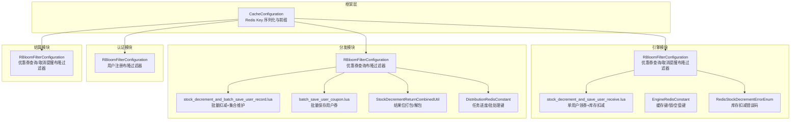
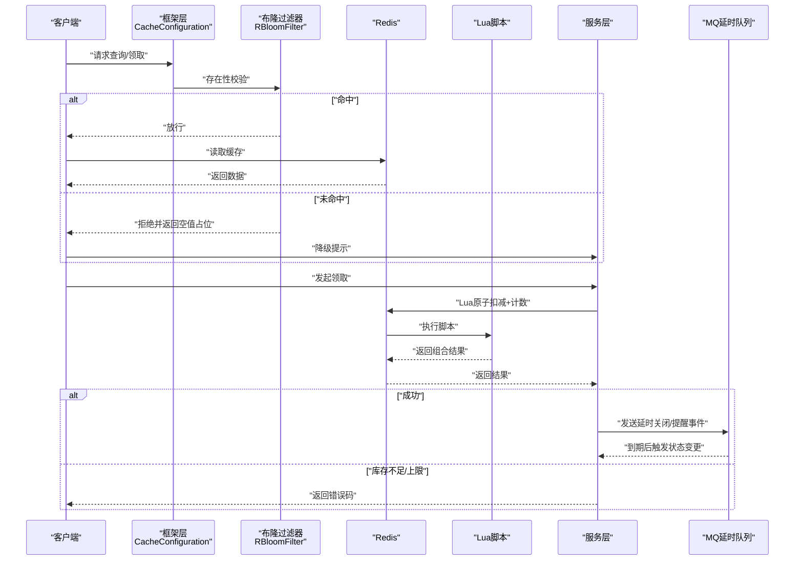
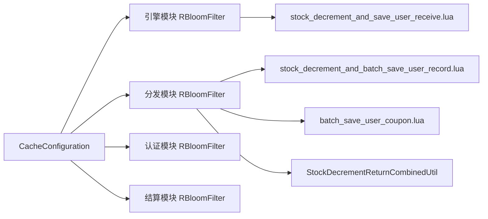

# 缓存一致性策略

<cite>
**本文引用的文件**
- [CacheConfiguration.java](file://framework/src/main/java/com/fengxin/config/CacheConfiguration.java)
- [RBloomFilterConfiguration.java（引擎模块）](file://engine/src/main/java/com/fengxin/maplecoupon/engine/config/RBloomFilterConfiguration.java)
- [RBloomFilterConfiguration.java（认证模块）](file://auth/src/main/java/com/fengxin/maplecoupon/auth/config/RBloomFilterConfiguration.java)
- [RBloomFilterConfiguration.java（商户后台模块）](file://merchant-admin/src/main/java/com/fengxin/maplecoupon/merchantadmin/config/RBloomFilterConfiguration.java)
- [RBloomFilterConfiguration.java（结算模块）](file://settlement/src/main/java/com/fengxin/maplecoupon/settlement/config/RBloomFilterConfiguration.java)
- [EngineRedisConstant.java（引擎模块）](file://engine/src/main/java/com/fengxin/maplecoupon/engine/common/constant/EngineRedisConstant.java)
- [EngineRedisConstant.java（认证模块）](file://auth/src/main/java/com/fengxin/maplecoupon/auth/common/constant/EngineRedisConstant.java)
- [DistributionRedisConstant.java](file://distribution/src/main/java/com/fengxin/maplecoupon/distribution/common/constant/DistributionRedisConstant.java)
- [RedisStockDecrementErrorEnum.java（引擎模块）](file://engine/src/main/java/com/fengxin/maplecoupon/engine/common/enums/RedisStockDecrementErrorEnum.java)
- [RedisStockDecrementErrorEnum.java（认证模块）](file://auth/src/main/java/com/fengxin/maplecoupon/auth/common/enums/RedisStockDecrementErrorEnum.java)
- [RedisStockDecrementErrorEnum.java（结算模块）](file://settlement/src/main/java/com/fengxin/maplecoupon/settlement/common/enums/RedisStockDecrementErrorEnum.java)
- [stock_decrement_and_save_user_receive.lua](file://engine/src/main/resources/lua/stock_decrement_and_save_user_receive.lua)
- [stock_decrement_and_batch_save_user_record.lua](file://distribution/src/main/resources/lua/stock_decrement_and_batch_save_user_record.lua)
- [batch_save_user_coupon.lua](file://distribution/src/main/resources/lua/batch_save_user_coupon.lua)
- [StockDecrementReturnCombinedUtil.java（引擎模块）](file://engine/src/main/java/com/fengxin/maplecoupon/engine/util/StockDecrementReturnCombinedUtil.java)
- [StockDecrementReturnCombinedUtil.java（分发模块）](file://distribution/src/main/java/com/fengxin/maplecoupon/distribution/util/StockDecrementReturnCombinedUtil.java)
- [UserCouponRedeemConsumer.java](file://engine/src/main/java/com/fengxin/maplecoupon/engine/mq/consumer/UserCouponRedeemConsumer.java)
</cite>

## 目录
1. [简介](#简介)
2. [项目结构](#项目结构)
3. [核心组件](#核心组件)
4. [架构总览](#架构总览)
5. [详细组件分析](#详细组件分析)
6. [依赖分析](#依赖分析)
7. [性能考量](#性能考量)
8. [故障排查指南](#故障排查指南)
9. [结论](#结论)
10. [附录](#附录)

## 简介
本文件系统性梳理 MapleCoupon 中缓存与数据库的一致性策略，覆盖读写与更新策略、失效策略、穿透与雪崩/击穿防护、库存一致性与回滚、版本与冲突控制、失效时机选择、监控与告警、诊断与修复方法，以及最佳实践与性能权衡。内容基于仓库中的 Redis 配置、布隆过滤器、Lua 脚本、常量与枚举等实现进行归纳总结。

## 项目结构
MapleCoupon 采用多模块架构，缓存相关能力主要分布在以下模块：
- 引擎模块：负责优惠券模板查询、用户领券、提醒与到期处理等，包含布隆过滤器与库存扣减 Lua 脚本。
- 分发模块：负责批量推送与用户券集合维护，包含库存扣减与批量保存 Lua 脚本。
- 认证模块：包含布隆过滤器，用于防止用户注册查询导致的缓存穿透。
- 结算模块：包含布隆过滤器，用于防止取消提醒等查询导致的缓存穿透。
- 框架模块：提供统一的 Redis Key 序列化与前缀配置。

图表来源
- [CacheConfiguration.java:16-35](file://framework/src/main/java/com/fengxin/config/CacheConfiguration.java#L16-L35)
- [RBloomFilterConfiguration.java（引擎模块）:15-46](file://engine/src/main/java/com/fengxin/maplecoupon/engine/config/RBloomFilterConfiguration.java#L15-L46)
- [RBloomFilterConfiguration.java（认证模块）:15-27](file://auth/src/main/java/com/fengxin/maplecoupon/auth/config/RBloomFilterConfiguration.java#L15-L27)
- [RBloomFilterConfiguration.java（商户后台模块）:15-26](file://merchant-admin/src/main/java/com/fengxin/maplecoupon/merchantadmin/config/RBloomFilterConfiguration.java#L15-L26)
- [RBloomFilterConfiguration.java（结算模块）:15-36](file://settlement/src/main/java/com/fengxin/maplecoupon/settlement/config/RBloomFilterConfiguration.java#L15-L36)
- [stock_decrement_and_save_user_receive.lua:1-58](file://engine/src/main/resources/lua/stock_decrement_and_save_user_receive.lua#L1-L58)
- [stock_decrement_and_batch_save_user_record.lua:1-33](file://distribution/src/main/resources/lua/stock_decrement_and_batch_save_user_record.lua#L1-L33)
- [batch_save_user_coupon.lua:1-16](file://distribution/src/main/resources/lua/batch_save_user_coupon.lua#L1-L16)
- [EngineRedisConstant.java（引擎模块）:9-55](file://engine/src/main/java/com/fengxin/maplecoupon/engine/common/constant/EngineRedisConstant.java#L9-L55)
- [DistributionRedisConstant.java:9-21](file://distribution/src/main/java/com/fengxin/maplecoupon/distribution/common/constant/DistributionRedisConstant.java#L9-L21)

章节来源
- [CacheConfiguration.java:16-35](file://framework/src/main/java/com/fengxin/config/CacheConfiguration.java#L16-L35)

## 核心组件
- Redis Key 序列化与前缀：通过框架层统一设置 Key 序列化器，支持可配置前缀，确保各模块键空间隔离与可维护性。
- 布隆过滤器：在引擎、认证、商户后台、结算模块分别配置布隆过滤器，用于拦截不存在的查询请求，避免穿透数据库。
- 库存扣减与状态返回：通过 Lua 脚本原子性地完成库存检查、用户上限校验、计数递增与库存自减；返回值采用位打包，区分“是否成功”和“第二字段”（如用户已领次数或集合长度）。
- 错误码与一致性语义：定义统一的库存扣减错误码，明确“成功/库存不足/用户已达上限”，作为上层决策依据。
- 失效与空值键：使用“空值占位键”避免缓存穿透；使用分布式锁保护关键写路径。
- 批量处理：分发模块提供批量扣减与批量保存用户券的 Lua 脚本，提升吞吐并保持一致性。

章节来源
- [CacheConfiguration.java:24-34](file://framework/src/main/java/com/fengxin/config/CacheConfiguration.java#L24-L34)
- [RBloomFilterConfiguration.java（引擎模块）:20-45](file://engine/src/main/java/com/fengxin/maplecoupon/engine/config/RBloomFilterConfiguration.java#L20-L45)
- [RBloomFilterConfiguration.java（认证模块）:21-26](file://auth/src/main/java/com/fengxin/maplecoupon/auth/config/RBloomFilterConfiguration.java#L21-L26)
- [RBloomFilterConfiguration.java（商户后台模块）:20-25](file://merchant-admin/src/main/java/com/fengxin/maplecoupon/merchantadmin/config/RBloomFilterConfiguration.java#L20-L25)
- [RBloomFilterConfiguration.java（结算模块）:20-35](file://settlement/src/main/java/com/fengxin/maplecoupon/settlement/config/RBloomFilterConfiguration.java#L20-L35)
- [EngineRedisConstant.java（引擎模块）:14-24](file://engine/src/main/java/com/fengxin/maplecoupon/engine/common/constant/EngineRedisConstant.java#L14-L24)
- [EngineRedisConstant.java（引擎模块）:17-19](file://engine/src/main/java/com/fengxin/maplecoupon/engine/common/constant/EngineRedisConstant.java#L17-L19)
- [EngineRedisConstant.java（引擎模块）:21-24](file://engine/src/main/java/com/fengxin/maplecoupon/engine/common/constant/EngineRedisConstant.java#L21-L24)
- [RedisStockDecrementErrorEnum.java（引擎模块）:15-48](file://engine/src/main/java/com/fengxin/maplecoupon/engine/common/enums/RedisStockDecrementErrorEnum.java#L15-L48)
- [stock_decrement_and_save_user_receive.lua:24-58](file://engine/src/main/resources/lua/stock_decrement_and_save_user_receive.lua#L24-L58)
- [stock_decrement_and_batch_save_user_record.lua:15-33](file://distribution/src/main/resources/lua/stock_decrement_and_batch_save_user_record.lua#L15-L33)
- [batch_save_user_coupon.lua:7-15](file://distribution/src/main/resources/lua/batch_save_user_coupon.lua#L7-L15)

## 架构总览
下图展示缓存一致性在“查询—库存扣减—落库/通知”的关键链路中如何通过布隆过滤器、Lua 原子脚本、空值键与锁保障一致性，并结合 MQ 延时消息实现最终一致。

图表来源
- [RBloomFilterConfiguration.java（引擎模块）:20-25](file://engine/src/main/java/com/fengxin/maplecoupon/engine/config/RBloomFilterConfiguration.java#L20-L25)
- [EngineRedisConstant.java（引擎模块）:21-24](file://engine/src/main/java/com/fengxin/maplecoupon/engine/common/constant/EngineRedisConstant.java#L21-L24)
- [stock_decrement_and_save_user_receive.lua:24-58](file://engine/src/main/resources/lua/stock_decrement_and_save_user_receive.lua#L24-L58)
- [RedisStockDecrementErrorEnum.java（引擎模块）:15-48](file://engine/src/main/java/com/fengxin/maplecoupon/engine/common/enums/RedisStockDecrementErrorEnum.java#L15-L48)
- [UserCouponRedeemConsumer.java:97-117](file://engine/src/main/java/com/fengxin/maplecoupon/engine/mq/consumer/UserCouponRedeemConsumer.java#L97-L117)

## 详细组件分析

### 读写策略
- 查询侧：
  - 使用布隆过滤器拦截不存在的 Key，避免穿透数据库；对未命中的 Key 返回空值占位键，防止缓存穿透风暴。
  - 空值占位键与业务键采用不同前缀，便于识别与治理。
- 写侧：
  - 使用 Lua 原子脚本完成库存检查、用户上限校验、计数递增与库存自减，保证并发安全。
  - 对批量场景提供批量扣减与批量保存用户券脚本，减少网络往返与提升一致性。

章节来源
- [RBloomFilterConfiguration.java（引擎模块）:20-25](file://engine/src/main/java/com/fengxin/maplecoupon/engine/config/RBloomFilterConfiguration.java#L20-L25)
- [EngineRedisConstant.java（引擎模块）:21-24](file://engine/src/main/java/com/fengxin/maplecoupon/engine/common/constant/EngineRedisConstant.java#L21-L24)
- [stock_decrement_and_save_user_receive.lua:24-58](file://engine/src/main/resources/lua/stock_decrement_and_save_user_receive.lua#L24-L58)
- [stock_decrement_and_batch_save_user_record.lua:15-33](file://distribution/src/main/resources/lua/stock_decrement_and_batch_save_user_record.lua#L15-L33)
- [batch_save_user_coupon.lua:7-15](file://distribution/src/main/resources/lua/batch_save_user_coupon.lua#L7-L15)

### 更新策略
- 原子更新：通过 Lua 脚本在单次调用内完成库存与计数的更新，避免竞态条件。
- 组合返回值：使用位打包返回“是否成功”和“第二字段”（如用户已领次数或集合长度），上层据此决定后续动作。
- 事务与幂等：对关键写路径采用分布式锁，结合幂等键与重复消费拦截，降低并发风险。

章节来源
- [stock_decrement_and_save_user_receive.lua:9-22](file://engine/src/main/resources/lua/stock_decrement_and_save_user_receive.lua#L9-L22)
- [StockDecrementReturnCombinedUtil.java（引擎模块）:10-28](file://engine/src/main/java/com/fengxin/maplecoupon/engine/util/StockDecrementReturnCombinedUtil.java#L10-L28)
- [StockDecrementReturnCombinedUtil.java（分发模块）:10-34](file://distribution/src/main/java/com/fengxin/maplecoupon/distribution/util/StockDecrementReturnCombinedUtil.java#L10-L34)
- [EngineRedisConstant.java（引擎模块）:17-19](file://engine/src/main/java/com/fengxin/maplecoupon/engine/common/constant/EngineRedisConstant.java#L17-L19)

### 失效策略
- 主动失效：
  - 模板状态变更、库存变化、用户限额调整等事件发生时，主动删除或更新对应缓存键。
  - 使用空值占位键快速阻断后续无效查询。
- 被动失效：
  - 通过 TTL 控制缓存生命周期，结合 MQ 延时消息在到期后清理或变更状态。
  - 对用户券列表采用有序集合与过期时间，到期自动清理。

章节来源
- [EngineRedisConstant.java（引擎模块）:21-24](file://engine/src/main/java/com/fengxin/maplecoupon/engine/common/constant/EngineRedisConstant.java#L21-L24)
- [EngineRedisConstant.java（引擎模块）:49-54](file://engine/src/main/java/com/fengxin/maplecoupon/engine/common/constant/EngineRedisConstant.java#L49-L54)
- [UserCouponRedeemConsumer.java:111-117](file://engine/src/main/java/com/fengxin/maplecoupon/engine/mq/consumer/UserCouponRedeemConsumer.java#L111-L117)

### 穿透、雪崩与击穿防护
- 缓存穿透：
  - 布隆过滤器拦截不存在 Key 的请求；对未命中返回空值占位键，避免穿透数据库。
- 缓存雪崩：
  - TTL 均匀化与过期时间抖动；热点 Key 设置互斥锁，仅允许单点加载；对空值占位键设置短 TTL。
- 缓存击穿：
  - 热点 Key 加分布式锁；加载期间拒绝并发穿透；加载完成后写入缓存并释放锁。

章节来源
- [RBloomFilterConfiguration.java（引擎模块）:20-25](file://engine/src/main/java/com/fengxin/maplecoupon/engine/config/RBloomFilterConfiguration.java#L20-L25)
- [RBloomFilterConfiguration.java（认证模块）:21-26](file://auth/src/main/java/com/fengxin/maplecoupon/auth/config/RBloomFilterConfiguration.java#L21-L26)
- [RBloomFilterConfiguration.java（商户后台模块）:20-25](file://merchant-admin/src/main/java/com/fengxin/maplecoupon/merchantadmin/config/RBloomFilterConfiguration.java#L20-L25)
- [RBloomFilterConfiguration.java（结算模块）:20-35](file://settlement/src/main/java/com/fengxin/maplecoupon/settlement/config/RBloomFilterConfiguration.java#L20-L35)
- [EngineRedisConstant.java（引擎模块）:21-24](file://engine/src/main/java/com/fengxin/maplecoupon/engine/common/constant/EngineRedisConstant.java#L21-L24)
- [EngineRedisConstant.java（引擎模块）:17-19](file://engine/src/main/java/com/fengxin/maplecoupon/engine/common/constant/EngineRedisConstant.java#L17-L19)

### 库存数据一致性与回滚
- 原子性与错误码：
  - Lua 脚本返回组合结果，上层根据错误码判断“库存不足/用户已达上限”，并终止后续流程。
  - 统一错误码枚举，便于跨模块一致处理。
- 回滚与补偿：
  - 当库存扣减失败或异常时，不产生副作用；必要时通过 MQ 补偿或人工干预恢复。
  - 对用户券列表写入失败，采用重试与延时队列兜底，确保最终一致。

章节来源
- [RedisStockDecrementErrorEnum.java（引擎模块）:15-48](file://engine/src/main/java/com/fengxin/maplecoupon/engine/common/enums/RedisStockDecrementErrorEnum.java#L15-L48)
- [stock_decrement_and_save_user_receive.lua:28-43](file://engine/src/main/resources/lua/stock_decrement_and_save_user_receive.lua#L28-L43)
- [UserCouponRedeemConsumer.java:97-110](file://engine/src/main/java/com/fengxin/maplecoupon/engine/mq/consumer/UserCouponRedeemConsumer.java#L97-L110)

### 版本控制与冲突解决
- 版本字段：
  - 在库存与用户记录中引入版本号或时间戳，配合 Lua 脚本进行 CAS 比较，避免旧版本覆盖新版本。
- 冲突解决：
  - 冲突时返回错误码并重试；对批量场景采用“先检查再写入”的策略，失败即回滚。

章节来源
- [stock_decrement_and_save_user_receive.lua:24-58](file://engine/src/main/resources/lua/stock_decrement_and_save_user_receive.lua#L24-L58)
- [stock_decrement_and_batch_save_user_record.lua:15-33](file://distribution/src/main/resources/lua/stock_decrement_and_batch_save_user_record.lua#L15-L33)

### 失效时机选择
- 主动失效：
  - 模板状态变更、库存变动、用户限额调整、提醒状态变更等事件驱动。
- 被动失效：
  - TTL 到期、到期任务触发、MQ 延时消息到期。

章节来源
- [EngineRedisConstant.java（引擎模块）:49-54](file://engine/src/main/java/com/fengxin/maplecoupon/engine/common/constant/EngineRedisConstant.java#L49-L54)
- [UserCouponRedeemConsumer.java:111-117](file://engine/src/main/java/com/fengxin/maplecoupon/engine/mq/consumer/UserCouponRedeemConsumer.java#L111-L117)

### 监控与告警
- 指标建议：
  - 命中率、穿透率、超时率、Lua 执行耗时、库存扣减成功率、MQ 延时队列积压。
- 告警阈值：
  - 穿透率超过阈值、库存扣减失败率上升、MQ 延时队列堆积、Redis 连接池耗尽。
- 诊断方法：
  - 关联日志与埋点，定位热点 Key、慢查询与异常节点；核对布隆过滤器容量与误判率。

章节来源
- [RBloomFilterConfiguration.java（引擎模块）:20-25](file://engine/src/main/java/com/fengxin/maplecoupon/engine/config/RBloomFilterConfiguration.java#L20-L25)
- [RBloomFilterConfiguration.java（结算模块）:20-35](file://settlement/src/main/java/com/fengxin/maplecoupon/settlement/config/RBloomFilterConfiguration.java#L20-L35)

### 诊断与修复
- 常见问题：
  - 布隆过滤器容量不足导致误判率升高；Lua 脚本返回值解析错误；MQ 延时队列异常。
- 修复步骤：
  - 调整布隆过滤器初始化参数；校验组合返回值位宽；检查 MQ 配置与消费者幂等逻辑。

章节来源
- [StockDecrementReturnCombinedUtil.java（引擎模块）:10-28](file://engine/src/main/java/com/fengxin/maplecoupon/engine/util/StockDecrementReturnCombinedUtil.java#L10-L28)
- [StockDecrementReturnCombinedUtil.java（分发模块）:10-34](file://distribution/src/main/java/com/fengxin/maplecoupon/distribution/util/StockDecrementReturnCombinedUtil.java#L10-L34)
- [UserCouponRedeemConsumer.java:97-110](file://engine/src/main/java/com/fengxin/maplecoupon/engine/mq/consumer/UserCouponRedeemConsumer.java#L97-L110)

## 依赖分析
- 模块耦合：
  - 引擎模块与分发模块共享库存扣减与用户券集合维护的 Lua 能力；认证与结算模块各自独立配置布隆过滤器。
- 外部依赖：
  - Redisson 提供 RBloomFilter；Spring Redis Template 提供 Lua 执行与序列化。
- 循环依赖：
  - 无循环依赖，配置类仅注入 Redis 客户端与属性。

图表来源
- [CacheConfiguration.java:16-35](file://framework/src/main/java/com/fengxin/config/CacheConfiguration.java#L16-L35)
- [RBloomFilterConfiguration.java（引擎模块）:15-46](file://engine/src/main/java/com/fengxin/maplecoupon/engine/config/RBloomFilterConfiguration.java#L15-L46)
- [RBloomFilterConfiguration.java（分发模块）:15-26](file://distribution/src/main/java/com/fengxin/maplecoupon/distribution/config/RBloomFilterConfiguration.java#L15-L26)
- [RBloomFilterConfiguration.java（认证模块）:15-27](file://auth/src/main/java/com/fengxin/maplecoupon/auth/config/RBloomFilterConfiguration.java#L15-L27)
- [RBloomFilterConfiguration.java（结算模块）:15-36](file://settlement/src/main/java/com/fengxin/maplecoupon/settlement/config/RBloomFilterConfiguration.java#L15-L36)
- [stock_decrement_and_save_user_receive.lua:1-58](file://engine/src/main/resources/lua/stock_decrement_and_save_user_receive.lua#L1-L58)
- [stock_decrement_and_batch_save_user_record.lua:1-33](file://distribution/src/main/resources/lua/stock_decrement_and_batch_save_user_record.lua#L1-L33)
- [batch_save_user_coupon.lua:1-16](file://distribution/src/main/resources/lua/batch_save_user_coupon.lua#L1-L16)
- [StockDecrementReturnCombinedUtil.java（分发模块）:10-34](file://distribution/src/main/java/com/fengxin/maplecoupon/distribution/util/StockDecrementReturnCombinedUtil.java#L10-L34)

## 性能考量
- 原子性与吞吐：
  - Lua 脚本减少网络往返，提升高并发下的吞吐与一致性。
- 键设计与序列化：
  - 统一 Key 前缀与序列化器，降低键冲突与序列化开销。
- 布隆过滤器容量与误判率：
  - 合理设置容量与误判率，平衡内存占用与命中效果。
- TTL 与过期抖动：
  - 对热点 Key 设置过期抖动，避免集中过期引发的瞬时压力。

章节来源
- [CacheConfiguration.java:24-34](file://framework/src/main/java/com/fengxin/config/CacheConfiguration.java#L24-L34)
- [RBloomFilterConfiguration.java（引擎模块）:20-25](file://engine/src/main/java/com/fengxin/maplecoupon/engine/config/RBloomFilterConfiguration.java#L20-L25)

## 故障排查指南
- 常见症状与定位：
  - 穿透：大量未命中请求打到数据库；检查布隆过滤器初始化参数与 Key 前缀。
  - 雪崩：流量洪峰导致缓存同时过期；检查 TTL 与过期抖动策略。
  - 击穿：热点 Key 高并发访问；检查分布式锁与互斥加载。
  - 库存不一致：Lua 返回值解析错误；检查组合位宽与工具类。
- 修复建议：
  - 调整布隆过滤器容量与误判率；优化 Lua 脚本返回值解析；完善 MQ 补偿与重试。

章节来源
- [RBloomFilterConfiguration.java（引擎模块）:20-25](file://engine/src/main/java/com/fengxin/maplecoupon/engine/config/RBloomFilterConfiguration.java#L20-L25)
- [StockDecrementReturnCombinedUtil.java（引擎模块）:10-28](file://engine/src/main/java/com/fengxin/maplecoupon/engine/util/StockDecrementReturnCombinedUtil.java#L10-L28)
- [UserCouponRedeemConsumer.java:97-110](file://engine/src/main/java/com/fengxin/maplecoupon/engine/mq/consumer/UserCouponRedeemConsumer.java#L97-L110)

## 结论
MapleCoupon 通过布隆过滤器、Lua 原子脚本、空值占位键与分布式锁构建了完整的缓存一致性体系；结合错误码与 MQ 延时队列实现最终一致。建议持续优化布隆过滤器参数、Lua 返回值解析与 TTL 抖动策略，并完善监控与告警，以应对高并发与复杂业务场景。

## 附录
- 最佳实践清单：
  - 使用布隆过滤器拦截不存在 Key；对热点 Key 加分布式锁；统一 Key 前缀与序列化；Lua 原子化处理库存与计数；对失败场景采用幂等与补偿；合理设置 TTL 与过期抖动；完善监控与告警。