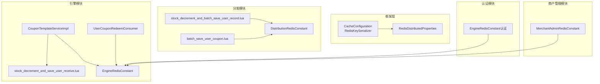
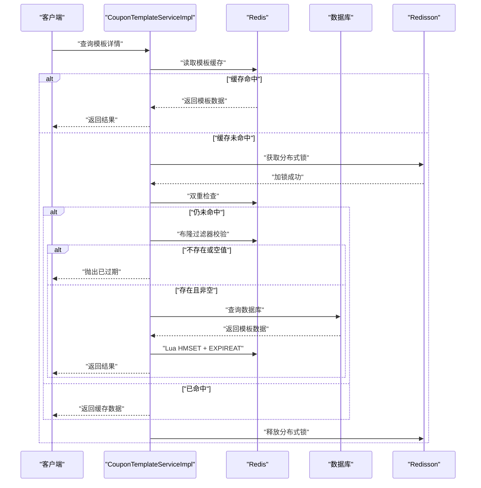
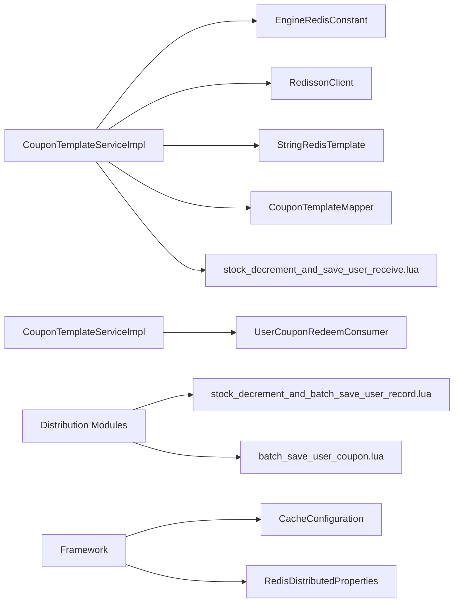
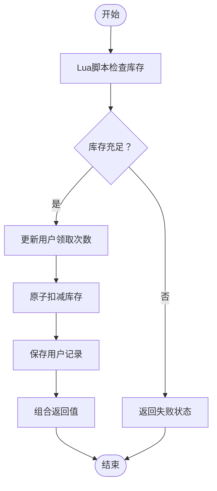

# 缓存策略

<cite>
**本文引用的文件**
- [CacheConfiguration.java](file://framework/src/main/java/com/fengxin/config/CacheConfiguration.java)
- [RedisDistributedProperties.java](file://framework/src/main/java/com/fengxin/config/RedisDistributedProperties.java)
- [EngineRedisConstant.java](file://engine/src/main/java/com/fengxin/maplecoupon/engine/common/constant/EngineRedisConstant.java)
- [DistributionRedisConstant.java](file://distribution/src/main/java/com/fengxin/maplecoupon/distribution/common/constant/DistributionRedisConstant.java)
- [EngineRedisConstant.java（认证模块）](file://auth/src/main/java/com/fengxin/maplecoupon/auth/common/constant/EngineRedisConstant.java)
- [MerchantAdminRedisConstant.java](file://merchant-admin/src/main/java/com/fengxin/maplecoupon/merchantadmin/common/constant/MerchantAdminRedisConstant.java)
- [CouponTemplateServiceImpl.java](file://engine/src/main/java/com/fengxin/maplecoupon/engine/service/impl/CouponTemplateServiceImpl.java)
- [UserCouponRedeemConsumer.java](file://engine/src/main/java/com/fengxin/maplecoupon/engine/mq/consumer/UserCouponRedeemConsumer.java)
- [stock_decrement_and_save_user_receive.lua](file://engine/src/main/resources/lua/stock_decrement_and_save_user_receive.lua)
- [stock_decrement_and_batch_save_user_record.lua](file://distribution/src/main/resources/lua/stock_decrement_and_batch_save_user_record.lua)
- [batch_save_user_coupon.lua](file://distribution/src/main/resources/lua/batch_save_user_coupon.lua)
- [StockDecrementReturnCombinedUtil.java（引擎）](file://engine/src/main/java/com/fengxin/maplecoupon/engine/util/StockDecrementReturnCombinedUtil.java)
- [StockDecrementReturnCombinedUtil.java（分发）](file://distribution/src/main/java/com/fengxin/maplecoupon/distribution/util/StockDecrementReturnCombinedUtil.java)
- [application.yaml（引擎）](file://engine/src/main/resources/application.yaml)
</cite>

## 目录
1. [简介](#简介)
2. [项目结构](#项目结构)
3. [核心组件](#核心组件)
4. [架构总览](#架构总览)
5. [详细组件分析](#详细组件分析)
6. [依赖关系分析](#依赖关系分析)
7. [性能考量](#性能考量)
8. [故障排查指南](#故障排查指南)
9. [结论](#结论)
10. [附录](#附录)

## 简介
本文件面向MapleCoupon项目的缓存策略，围绕基于Redis的多层缓存架构进行系统化梳理，涵盖本地缓存、分布式缓存与数据库缓存的协同机制；深入讲解Lua脚本在缓存中的原子性与性能优化；明确缓存键设计原则（命名规范、过期策略、内存管理）；给出库存扣减的乐观锁与悲观锁使用场景；覆盖缓存穿透、缓存雪崩、缓存击穿的防护；说明Redisson分布式锁（公平锁、读写锁）的使用；提供缓存监控与性能分析方法（命中率统计、内存优化）；最后阐述缓存一致性与失效策略。

## 项目结构
MapleCoupon采用多模块微服务架构，缓存相关能力主要分布在以下模块：
- 引擎模块（engine）：负责优惠券模板查询、库存扣减、用户券记录等核心逻辑，广泛使用Redis与Lua脚本。
- 分发模块（distribution）：负责优惠券批量派发、库存扣减与用户记录落盘，大量使用Lua脚本与Redisson。
- 认证模块（auth）：用户登录、注册等场景下的缓存键与分布式锁。
- 商户管理模块（merchant-admin）：模板管理、任务派发等场景下的缓存键。
- 框架模块（framework）：统一的Redis配置、Key序列化器与分布式属性配置。

图表来源
- [CacheConfiguration.java:1-35](file://framework/src/main/java/com/fengxin/config/CacheConfiguration.java#L1-L35)
- [RedisDistributedProperties.java:1-24](file://framework/src/main/java/com/fengxin/config/RedisDistributedProperties.java#L1-L24)
- [CouponTemplateServiceImpl.java:1-179](file://engine/src/main/java/com/fengxin/maplecoupon/engine/service/impl/CouponTemplateServiceImpl.java#L1-L179)
- [stock_decrement_and_save_user_receive.lua:1-58](file://engine/src/main/resources/lua/stock_decrement_and_save_user_receive.lua#L1-L58)
- [UserCouponRedeemConsumer.java:97-117](file://engine/src/main/java/com/fengxin/maplecoupon/engine/mq/consumer/UserCouponRedeemConsumer.java#L97-L117)
- [stock_decrement_and_batch_save_user_record.lua:1-33](file://distribution/src/main/resources/lua/stock_decrement_and_batch_save_user_record.lua#L1-L33)
- [batch_save_user_coupon.lua:1-16](file://distribution/src/main/resources/lua/batch_save_user_coupon.lua#L1-L16)
- [EngineRedisConstant.java:1-56](file://engine/src/main/java/com/fengxin/maplecoupon/engine/common/constant/EngineRedisConstant.java#L1-L56)
- [DistributionRedisConstant.java:1-21](file://distribution/src/main/java/com/fengxin/maplecoupon/distribution/common/constant/DistributionRedisConstant.java#L1-L21)
- [EngineRedisConstant.java（认证模块）:1-55](file://auth/src/main/java/com/fengxin/maplecoupon/auth/common/constant/EngineRedisConstant.java#L1-L55)
- [MerchantAdminRedisConstant.java:1-16](file://merchant-admin/src/main/java/com/fengxin/maplecoupon/merchantadmin/common/constant/MerchantAdminRedisConstant.java#L1-L16)

章节来源
- [CacheConfiguration.java:1-35](file://framework/src/main/java/com/fengxin/config/CacheConfiguration.java#L1-L35)
- [RedisDistributedProperties.java:1-24](file://framework/src/main/java/com/fengxin/config/RedisDistributedProperties.java#L1-L24)
- [CouponTemplateServiceImpl.java:1-179](file://engine/src/main/java/com/fengxin/maplecoupon/engine/service/impl/CouponTemplateServiceImpl.java#L1-L179)

## 核心组件
- Redis键前缀与序列化：通过统一的RedisKeySerializer与prefix配置，确保各模块键空间隔离与可维护性。
- 缓存键常量：各模块定义了模板缓存、分布式锁、空值缓存、用户领取限制、用户券列表等键模板，便于集中管理与复用。
- Lua脚本：在引擎与分发模块中广泛使用，实现库存扣减、用户记录落盘、批量派发等原子性操作。
- 分布式锁：使用Redisson实现分布式互斥，结合布隆过滤器与双重检查，降低热点数据穿透数据库的风险。
- 消息与重试：对Redis异常进行兜底写入与延时重试，增强系统韧性。

章节来源
- [CacheConfiguration.java:1-35](file://framework/src/main/java/com/fengxin/config/CacheConfiguration.java#L1-L35)
- [RedisDistributedProperties.java:1-24](file://framework/src/main/java/com/fengxin/config/RedisDistributedProperties.java#L1-L24)
- [EngineRedisConstant.java:1-56](file://engine/src/main/java/com/fengxin/maplecoupon/engine/common/constant/EngineRedisConstant.java#L1-L56)
- [DistributionRedisConstant.java:1-21](file://distribution/src/main/java/com/fengxin/maplecoupon/distribution/common/constant/DistributionRedisConstant.java#L1-L21)
- [EngineRedisConstant.java（认证模块）:1-55](file://auth/src/main/java/com/fengxin/maplecoupon/auth/common/constant/EngineRedisConstant.java#L1-L55)
- [MerchantAdminRedisConstant.java:1-16](file://merchant-admin/src/main/java/com/fengxin/maplecoupon/merchantadmin/common/constant/MerchantAdminRedisConstant.java#L1-L16)
- [CouponTemplateServiceImpl.java:1-179](file://engine/src/main/java/com/fengxin/maplecoupon/engine/service/impl/CouponTemplateServiceImpl.java#L1-L179)
- [UserCouponRedeemConsumer.java:97-117](file://engine/src/main/java/com/fengxin/maplecoupon/engine/mq/consumer/UserCouponRedeemConsumer.java#L97-L117)

## 架构总览
MapleCoupon的缓存架构采用“多级缓存 + 原子Lua脚本 + 分布式锁”的组合策略：
- 本地缓存：由StringRedisTemplate与脚本执行构成，避免网络往返。
- 分布式缓存：以Redis为主，承载模板缓存、用户券列表、空值缓存、布隆过滤器等。
- 数据库缓存：通过布隆过滤器与空值缓存键，减少无效查询与热点穿透风险。
- 原子操作：Lua脚本保证库存扣减、用户记录落盘等操作的原子性与一致性。
- 分布式锁：Redisson锁保护热点资源，避免缓存击穿与超卖。

图表来源
- [CouponTemplateServiceImpl.java:49-132](file://engine/src/main/java/com/fengxin/maplecoupon/engine/service/impl/CouponTemplateServiceImpl.java#L49-L132)

## 详细组件分析

### 缓存键设计与命名规范
- 命名规范：采用“模块前缀:业务域:子域:标识”的层级化命名，如模板缓存、分布式锁、空值缓存、用户领取限制、用户券列表等，确保键空间清晰、可读性强。
- 过期策略：模板缓存使用绝对过期时间（Unix秒级），空值缓存使用短期过期（分钟级），用户领取次数键按有效期设置过期。
- 内存管理：优先使用Hash存储结构存放模板完整数据，减少键数量；对ZSet、Set等结构设置合理过期时间，避免长期占用内存。

章节来源
- [EngineRedisConstant.java:1-56](file://engine/src/main/java/com/fengxin/maplecoupon/engine/common/constant/EngineRedisConstant.java#L1-L56)
- [DistributionRedisConstant.java:1-21](file://distribution/src/main/java/com/fengxin/maplecoupon/distribution/common/constant/DistributionRedisConstant.java#L1-L21)
- [EngineRedisConstant.java（认证模块）:1-55](file://auth/src/main/java/com/fengxin/maplecoupon/auth/common/constant/EngineRedisConstant.java#L1-L55)
- [MerchantAdminRedisConstant.java:1-16](file://merchant-admin/src/main/java/com/fengxin/maplecoupon/merchantadmin/common/constant/MerchantAdminRedisConstant.java#L1-L16)
- [CouponTemplateServiceImpl.java:95-122](file://engine/src/main/java/com/fengxin/maplecoupon/engine/service/impl/CouponTemplateServiceImpl.java#L95-L122)

### 多级缓存与协同机制
- 本地缓存：通过StringRedisTemplate与Lua脚本在单机内完成读写，降低延迟。
- 分布式缓存：模板缓存、用户券列表、空值缓存共同组成分布式缓存层。
- 数据库缓存：布隆过滤器与空值键协同，防止缓存穿透与击穿。

章节来源
- [CouponTemplateServiceImpl.java:49-132](file://engine/src/main/java/com/fengxin/maplecoupon/engine/service/impl/CouponTemplateServiceImpl.java#L49-L132)

### Lua脚本在缓存中的应用
- 原子性操作：库存扣减、用户领取次数更新、模板数据落盘等均通过Lua脚本保证原子性。
- 性能优化：减少网络往返，合并命令，避免多次往返导致的竞态与不一致。
- 结果编码：通过位运算将多个状态打包为单一整型返回，便于上层解码与分支处理。

章节来源
- [stock_decrement_and_save_user_receive.lua:1-58](file://engine/src/main/resources/lua/stock_decrement_and_save_user_receive.lua#L1-L58)
- [stock_decrement_and_batch_save_user_record.lua:1-33](file://distribution/src/main/resources/lua/stock_decrement_and_batch_save_user_record.lua#L1-L33)
- [batch_save_user_coupon.lua:1-16](file://distribution/src/main/resources/lua/batch_save_user_coupon.lua#L1-L16)
- [StockDecrementReturnCombinedUtil.java（引擎）:1-30](file://engine/src/main/java/com/fengxin/maplecoupon/engine/util/StockDecrementReturnCombinedUtil.java#L1-L30)
- [StockDecrementReturnCombinedUtil.java（分发）:1-35](file://distribution/src/main/java/com/fengxin/maplecoupon/distribution/util/StockDecrementReturnCombinedUtil.java#L1-L35)

### 库存扣减的缓存实现方案
- 引擎模块：使用Lua脚本原子扣减库存，并记录用户领取次数与上限，返回组合状态供上层判断。
- 分发模块：批量派发场景下，先扣减库存，再将用户加入集合，记录集合长度作为返回值，便于后续处理。

章节来源
- [stock_decrement_and_save_user_receive.lua:1-58](file://engine/src/main/resources/lua/stock_decrement_and_save_user_receive.lua#L1-L58)
- [stock_decrement_and_batch_save_user_record.lua:1-33](file://distribution/src/main/resources/lua/stock_decrement_and_batch_save_user_record.lua#L1-L33)
- [StockDecrementReturnCombinedUtil.java（引擎）:1-30](file://engine/src/main/java/com/fengxin/maplecoupon/engine/util/StockDecrementReturnCombinedUtil.java#L1-L30)
- [StockDecrementReturnCombinedUtil.java（分发）:1-35](file://distribution/src/main/java/com/fengxin/maplecoupon/distribution/util/StockDecrementReturnCombinedUtil.java#L1-L35)

### 缓存穿透、缓存雪崩、缓存击穿的防护
- 缓存穿透：布隆过滤器校验模板ID是否存在，不存在直接返回；同时使用空值缓存键短时保护，避免数据库压力。
- 缓存雪崩：模板缓存采用绝对过期时间（含随机抖动），空值缓存设置短期过期，避免大面积同时失效。
- 缓存击穿：热点模板通过分布式锁保护，仅允许单线程回源加载，其余请求等待或返回空值保护。

章节来源
- [CouponTemplateServiceImpl.java:49-132](file://engine/src/main/java/com/fengxin/maplecoupon/engine/service/impl/CouponTemplateServiceImpl.java#L49-L132)

### Redisson分布式锁的使用
- 锁类型：使用RLock实现互斥锁，结合布隆过滤器与双重检查，降低热点资源竞争。
- 场景：模板查询、库存扣减等关键路径使用分布式锁，确保一致性与原子性。
- 注意事项：锁粒度要小、持有时间要短、异常时务必释放锁。

章节来源
- [CouponTemplateServiceImpl.java:67-129](file://engine/src/main/java/com/fengxin/maplecoupon/engine/service/impl/CouponTemplateServiceImpl.java#L67-L129)

### 缓存监控与性能分析
- 命中率统计：可通过Redis INFO命令或第三方监控工具采集命中率、内存使用、连接数等指标。
- 内存优化：优先Hash结构存储模板完整数据；对ZSet/Set设置合理过期；定期清理空值缓存键。
- 异常兜底：对Redis异常进行降级处理（如延时重试、本地缓存回退），保障系统可用性。

章节来源
- [UserCouponRedeemConsumer.java:97-117](file://engine/src/main/java/com/fengxin/maplecoupon/engine/mq/consumer/UserCouponRedeemConsumer.java#L97-L117)
- [application.yaml（引擎）:1-22](file://engine/src/main/resources/application.yaml#L1-L22)

### 缓存一致性与失效策略
- 一致性：通过Lua脚本与Redisson锁保证原子性；对数据库变更采用消息或Binlog同步，维持最终一致。
- 失效策略：模板缓存采用绝对过期；空值缓存采用短期过期；用户领取次数按有效期过期；ZSet/Set按业务到期时间过期。

章节来源
- [CouponTemplateServiceImpl.java:90-122](file://engine/src/main/java/com/fengxin/maplecoupon/engine/service/impl/CouponTemplateServiceImpl.java#L90-L122)
- [UserCouponRedeemConsumer.java:97-117](file://engine/src/main/java/com/fengxin/maplecoupon/engine/mq/consumer/UserCouponRedeemConsumer.java#L97-L117)

## 依赖关系分析
- 组件耦合：缓存键常量在各模块间共享，形成低耦合高内聚的键管理；Lua脚本与服务类松耦合，便于扩展。
- 外部依赖：Redisson、StringRedisTemplate、MyBatis-Plus、ShardingSphere等。
- 循环依赖：未发现循环依赖迹象，模块边界清晰。

图表来源
- [CouponTemplateServiceImpl.java:1-179](file://engine/src/main/java/com/fengxin/maplecoupon/engine/service/impl/CouponTemplateServiceImpl.java#L1-L179)
- [EngineRedisConstant.java:1-56](file://engine/src/main/java/com/fengxin/maplecoupon/engine/common/constant/EngineRedisConstant.java#L1-L56)
- [UserCouponRedeemConsumer.java:97-117](file://engine/src/main/java/com/fengxin/maplecoupon/engine/mq/consumer/UserCouponRedeemConsumer.java#L97-L117)
- [stock_decrement_and_batch_save_user_record.lua:1-33](file://distribution/src/main/resources/lua/stock_decrement_and_batch_save_user_record.lua#L1-L33)
- [batch_save_user_coupon.lua:1-16](file://distribution/src/main/resources/lua/batch_save_user_coupon.lua#L1-L16)
- [CacheConfiguration.java:1-35](file://framework/src/main/java/com/fengxin/config/CacheConfiguration.java#L1-L35)
- [RedisDistributedProperties.java:1-24](file://framework/src/main/java/com/fengxin/config/RedisDistributedProperties.java#L1-L24)

## 性能考量
- 原子性与一致性：Lua脚本减少网络往返，提高吞吐；Redisson锁避免超卖与脏写。
- 键设计：Hash结构存储模板数据，减少键数量；ZSet/Set设置合理过期，避免长期占用内存。
- 并发控制：热点资源加分布式锁，其他请求等待或返回空值保护，避免缓存击穿。
- 监控与调优：关注命中率、内存使用、慢查询与阻塞命令，定期评估过期策略与键结构。

## 故障排查指南
- 缓存未命中：检查布隆过滤器与空值缓存键；确认Lua脚本参数与键拼接是否正确。
- 库存异常：核对Lua脚本返回值编码与上层解码逻辑；检查库存初始值与扣减顺序。
- Redis异常：查看消费者对Redis异常的兜底写入与重试逻辑；必要时启用延时队列。
- 分布式锁问题：确认锁粒度与持有时间；排查异常释放与死锁场景。

章节来源
- [CouponTemplateServiceImpl.java:49-132](file://engine/src/main/java/com/fengxin/maplecoupon/engine/service/impl/CouponTemplateServiceImpl.java#L49-L132)
- [UserCouponRedeemConsumer.java:97-117](file://engine/src/main/java/com/fengxin/maplecoupon/engine/mq/consumer/UserCouponRedeemConsumer.java#L97-L117)

## 结论
MapleCoupon的缓存策略通过多级缓存、Lua原子脚本、Redisson分布式锁与布隆过滤器等手段，有效解决了高并发下的缓存穿透、雪崩与击穿问题，并在库存扣减等关键路径上实现了强一致与高性能。建议持续完善监控体系，定期评估键结构与过期策略，以适应业务增长与流量波动。

## 附录
- 关键流程图（库存扣减与用户记录落盘）

图表来源
- [stock_decrement_and_save_user_receive.lua:1-58](file://engine/src/main/resources/lua/stock_decrement_and_save_user_receive.lua#L1-L58)
- [StockDecrementReturnCombinedUtil.java（引擎）:1-30](file://engine/src/main/java/com/fengxin/maplecoupon/engine/util/StockDecrementReturnCombinedUtil.java#L1-L30)