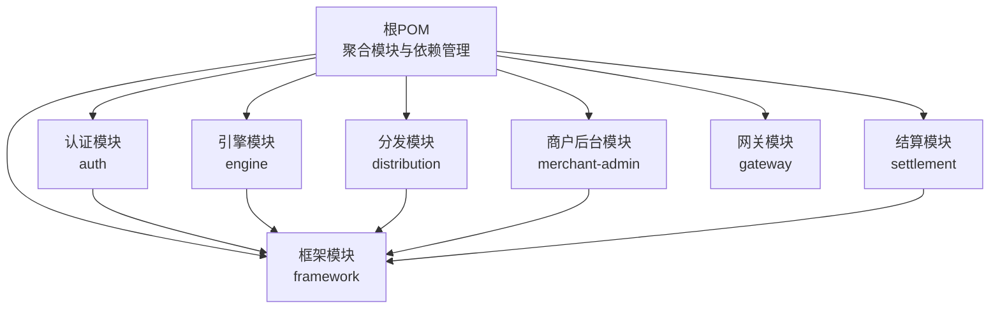
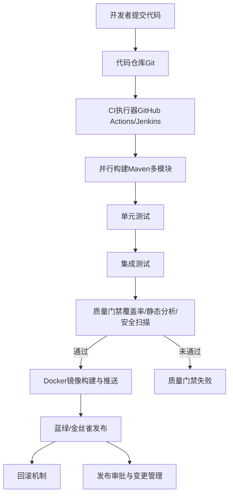
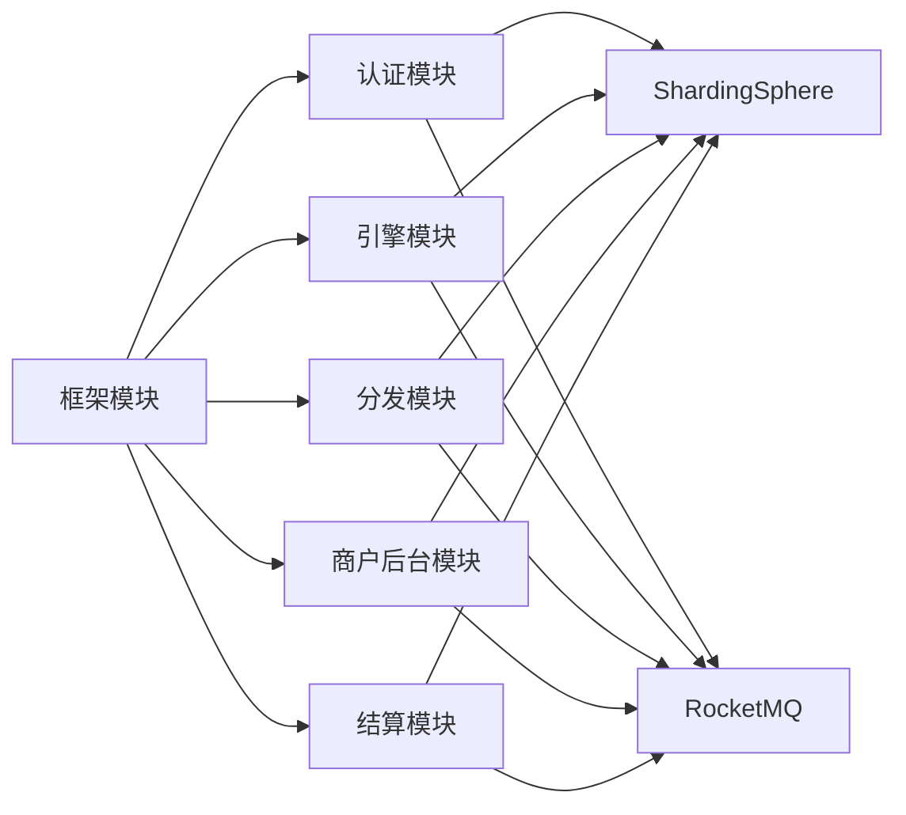

# CI/CD流水线

<cite>
**本文引用的文件**
- [根POM（pom.xml）](file://pom.xml)
- [认证模块POM（auth/pom.xml）](file://auth/pom.xml)
- [引擎模块POM（engine/pom.xml）](file://engine/pom.xml)
- [分发模块POM（distribution/pom.xml）](file://distribution/pom.xml)
- [商户后台模块POM（merchant-admin/pom.xml）](file://merchant-admin/pom.xml)
- [结算模块POM（settlement/pom.xml）](file://settlement/pom.xml)
- [网关模块POM（gateway/pom.xml）](file://gateway/pom.xml)
- [框架模块POM（framework/pom.xml）](file://framework/pom.xml)
- [认证模块应用配置（application.yaml）](file://auth/src/main/resources/application.yaml)
- [引擎模块应用配置（application.yaml）](file://engine/src/main/resources/application.yaml)
- [分发模块应用配置（application.yaml）](file://distribution/src/main/resources/application.yaml)
- [商户后台模块应用配置（application.yaml）](file://merchant-admin/src/main/resources/application.yaml)
- [结算模块应用配置（application.yaml）](file://settlement/src/main/resources/application.yaml)
- [网关模块应用配置（application.yml）](file://gateway/src/main/resources/application.yml)
- [README（README.md）](file://README.md)
</cite>

## 目录
1. [简介](#简介)
2. [项目结构](#项目结构)
3. [核心组件](#核心组件)
4. [架构总览](#架构总览)
5. [详细组件分析](#详细组件分析)
6. [依赖关系分析](#依赖关系分析)
7. [性能考虑](#性能考虑)
8. [故障排查指南](#故障排查指南)
9. [结论](#结论)
10. [附录](#附录)

## 简介
本指南面向MapleCoupon多模块Spring Boot微服务项目，提供从代码检出、依赖安装、单元与集成测试自动化，到多模块并行构建、依赖管理与版本控制、Docker镜像自动构建与推送、质量门禁（覆盖率、静态分析、安全扫描）、蓝绿/金丝雀发布策略、回滚机制、发布审批与变更管理流程，以及性能与压力测试在CI中的集成方案。目标是帮助团队建立稳定、可追溯、可扩展且可审计的CI/CD流水线。

## 项目结构
MapleCoupon采用Maven多模块聚合工程组织，顶层POM声明各子模块，模块间通过共享框架模块提供通用能力。每个微服务模块包含独立的Spring Boot应用配置与业务逻辑，便于独立构建、测试与部署。

图表来源
- [根POM（pom.xml）第17-34行:17-34](file://pom.xml#L17-L34)
- [认证模块POM（auth/pom.xml）第30-42行:30-42](file://auth/pom.xml#L30-L42)
- [引擎模块POM（engine/pom.xml）第30-42行:30-42](file://engine/pom.xml#L30-L42)
- [分发模块POM（distribution/pom.xml）第30-42行:30-42](file://distribution/pom.xml#L30-L42)
- [商户后台模块POM（merchant-admin/pom.xml）第30-42行:30-42](file://merchant-admin/pom.xml#L30-L42)
- [结算模块POM（settlement/pom.xml）第30-42行:30-42](file://settlement/pom.xml#L30-L42)

章节来源
- [根POM（pom.xml）第17-34行:17-34](file://pom.xml#L17-L34)
- [README（README.md）第1-10行:1-10](file://README.md#L1-L10)

## 核心组件
- 多模块聚合工程：通过顶层POM统一管理版本与依赖，子模块按领域拆分，降低耦合度。
- 微服务应用：每个模块包含独立的Spring Boot应用入口与配置，便于独立打包与部署。
- 共享框架：框架模块提供通用异常、结果封装、幂等、分布式缓存与Web自动装配等能力，被各业务模块复用。
- 配置管理：各模块通过application.yaml指定端口、数据源驱动、ShardingSphere配置与MyBatis日志输出等。

章节来源
- [根POM（pom.xml）第37-60行:37-60](file://pom.xml#L37-L60)
- [认证模块应用配置（application.yaml）第1-19行:1-19](file://auth/src/main/resources/application.yaml#L1-L19)
- [引擎模块应用配置（application.yaml）第1-22行:1-22](file://engine/src/main/resources/application.yaml#L1-L22)
- [分发模块应用配置（application.yaml）第1-15行:1-15](file://distribution/src/main/resources/application.yaml#L1-L15)
- [商户后台模块应用配置（application.yaml）第1-27行:1-27](file://merchant-admin/src/main/resources/application.yaml#L1-L27)
- [结算模块应用配置（application.yaml）第1-14行:1-14](file://settlement/src/main/resources/application.yaml#L1-L14)

## 架构总览
下图展示CI/CD流水线在多模块项目中的整体交互：代码检出后进行依赖安装与并行构建，随后执行单元测试与集成测试；通过质量门禁后进入镜像构建与推送阶段；最后根据发布策略进行蓝绿或金丝雀发布，并记录回滚点。

## 详细组件分析

### GitHub Actions流水线配置（示例）
以下为基于仓库结构与模块特性的流水线步骤设计，具体YAML文件应放置于.github/workflows目录中。该配置强调并行构建、测试、质量门禁与镜像推送。

- 触发条件
  - 主干分支：触发全量构建与测试
  - 功能分支：触发单元测试与基本质量检查
  - PR：触发单元测试与代码审查相关检查
- 步骤概览
  - 设置Java与Maven环境
  - 代码检出与缓存
  - 并行构建所有模块
  - 单元测试与覆盖率收集
  - 集成测试（可选）
  - 质量门禁（覆盖率阈值、静态分析、安全扫描）
  - Docker镜像构建与推送
  - 发布策略（蓝绿/金丝雀）
  - 回滚与审批记录

章节来源
- [根POM（pom.xml）第17-34行:17-34](file://pom.xml#L17-L34)

### Jenkins流水线配置（示例）
- 多分支流水线
  - 主干：全量构建、测试、质量门禁、镜像构建与发布
  - 功能分支：单元测试与基础质量检查
  - PR：触发快速测试与代码风格检查
- 并行阶段
  - 并行构建所有模块
  - 并行运行单元测试
  - 并行运行集成测试
- 质量门禁
  - 覆盖率阈值校验
  - SonarQube静态分析
  - SAST与容器镜像安全扫描
- 部署与回滚
  - 蓝绿/金丝雀发布
  - 回滚至上一稳定版本
  - 审批与变更记录

章节来源
- [根POM（pom.xml）第17-34行:17-34](file://pom.xml#L17-L34)

### 多模块构建策略与依赖管理
- 版本与依赖集中管理
  - 顶层POM统一声明Spring Boot、Spring Cloud、Spring Cloud Alibaba与常用组件版本，避免版本漂移
  - 子模块通过父POM继承依赖管理，减少重复声明
- 构建顺序与并行
  - Maven默认按依赖拓扑排序；对于无依赖的模块可并行构建以提升效率
  - 使用CI并行矩阵或Jenkins并行阶段加速构建
- 依赖传递与隔离
  - 框架模块作为公共依赖，业务模块显式引入
  - 避免在业务模块中重复声明相同版本的依赖

章节来源
- [根POM（pom.xml）第37-60行:37-60](file://pom.xml#L37-L60)
- [根POM（pom.xml）第61-182行:61-182](file://pom.xml#L61-L182)

### 代码检出与依赖安装
- 代码检出
  - 使用CI提供的checkout动作或插件，确保子模块完整拉取
- 依赖安装
  - Maven中央仓库与私有仓库配置
  - 依赖缓存（GitHub Actions缓存/Artifactory缓存），减少重复下载
- 工具链
  - Java 17（项目属性已设定）
  - Maven 3+

章节来源
- [根POM（pom.xml）第37-60行:37-60](file://pom.xml#L37-L60)

### 单元测试与集成测试自动化
- 单元测试
  - 各模块均包含spring-boot-starter-test依赖，适合编写JUnit测试
  - 建议在CI中生成覆盖率报告并纳入质量门禁
- 集成测试
  - 可选地在CI中启动最小化依赖栈（如嵌入式数据库、消息队列模拟）进行集成验证
  - 对关键路径（如优惠券核销、分发、结算）进行端到端验证
- 测试报告
  - 生成JUnit与覆盖率报告，供质量门禁与归档

章节来源
- [认证模块POM（auth/pom.xml）第20-24行:20-24](file://auth/pom.xml#L20-L24)
- [引擎模块POM（engine/pom.xml）第19-23行:19-23](file://engine/pom.xml#L19-L23)
- [分发模块POM（distribution/pom.xml）第18-23行:18-23](file://distribution/pom.xml#L18-L23)
- [商户后台模块POM（merchant-admin/pom.xml）第13-23行:13-23](file://merchant-admin/pom.xml#L13-L23)
- [结算模块POM（settlement/pom.xml）第14-23行:14-23](file://settlement/pom.xml#L14-L23)

### 自动化部署流程（环境分支管理）
- 环境分支策略
  - develop → staging（预生产）→ prod（生产）
  - 通过分支保护与PR合并策略保证质量
- 蓝绿部署
  - 新版本部署至备用实例，健康检查通过后切换流量
  - 回滚时切换回旧实例
- 金丝雀发布
  - 将新版本先对小部分流量放行，逐步扩大比例
  - 基于指标（错误率、延迟）动态调整流量

章节来源
- [认证模块应用配置（application.yaml）第1-19行:1-19](file://auth/src/main/resources/application.yaml#L1-L19)
- [引擎模块应用配置（application.yaml）第1-22行:1-22](file://engine/src/main/resources/application.yaml#L1-L22)
- [分发模块应用配置（application.yaml）第1-15行:1-15](file://distribution/src/main/resources/application.yaml#L1-L15)
- [商户后台模块应用配置（application.yaml）第1-27行:1-27](file://merchant-admin/src/main/resources/application.yaml#L1-L27)
- [结算模块应用配置（application.yaml）第1-14行:1-14](file://settlement/src/main/resources/application.yaml#L1-L14)

### Docker镜像自动构建与推送
- 镜像构建
  - 为每个微服务模块编写Dockerfile，基于Maven构建产物（fat jar）
  - 使用多阶段构建优化镜像体积
- 标签策略
  - 基于Git标签或分支名打标签（如v1.2.3、develop）
- 推送与编排
  - 推送至私有镜像仓库
  - 结合Kubernetes/Compose进行部署与滚动更新

章节来源
- [认证模块POM（auth/pom.xml）第113-131行:113-131](file://auth/pom.xml#L113-L131)
- [引擎模块POM（engine/pom.xml）第105-125行:105-125](file://engine/pom.xml#L105-L125)
- [分发模块POM（distribution/pom.xml）第106-126行:106-126](file://distribution/pom.xml#L106-L126)
- [商户后台模块POM（merchant-admin/pom.xml）第128-148行:128-148](file://merchant-admin/pom.xml#L128-L148)
- [结算模块POM（settlement/pom.xml）第95-115行:95-115](file://settlement/pom.xml#L95-L115)

### 质量门禁（覆盖率、静态分析、安全扫描）
- 覆盖率
  - 使用Jacoco生成覆盖率报告，设置阈值（如分支/指令覆盖率）
- 静态分析
  - SonarQube扫描代码质量与技术债
- 安全扫描
  - SAST（SonarQube/CodeQL）与容器镜像漏洞扫描（Trivy/Clair）
- 门禁规则
  - 未达阈值则阻断发布

章节来源
- [根POM（pom.xml）第185-193行:185-193](file://pom.xml#L185-L193)

### 回滚机制、发布审批与变更管理
- 回滚机制
  - 记录每次发布版本与镜像标签，支持一键回滚至上一稳定版本
- 发布审批
  - 生产发布需人工审批，结合变更窗口与风险评估
- 变更管理
  - PR与Issue关联，记录变更内容、影响面与测试情况

章节来源
- [README（README.md）第1-10行:1-10](file://README.md#L1-L10)

### 性能测试与压力测试在CI中的集成
- 场景设计
  - 基于JMeter/Gatling编写脚本，覆盖核心接口（如优惠券查询、核销、分发）
- 执行时机
  - 在集成测试后、质量门禁前执行，或在夜间流水线中执行
- 结果分析
  - 收集TPS、P95/P99延迟、错误率，与基线对比
- 报告与门禁
  - 将性能指标纳入质量门禁，不达标则阻断发布

## 依赖关系分析
MapleCoupon采用分层依赖：业务模块依赖框架模块，框架模块提供通用能力；各业务模块通过ShardingSphere与RocketMQ等中间件连接外部系统。

图表来源
- [根POM（pom.xml）第17-34行:17-34](file://pom.xml#L17-L34)
- [认证模块POM（auth/pom.xml）第30-42行:30-42](file://auth/pom.xml#L30-L42)
- [引擎模块POM（engine/pom.xml）第30-42行:30-42](file://engine/pom.xml#L30-L42)
- [分发模块POM（distribution/pom.xml）第30-42行:30-42](file://distribution/pom.xml#L30-L42)
- [商户后台模块POM（merchant-admin/pom.xml）第30-42行:30-42](file://merchant-admin/pom.xml#L30-L42)
- [结算模块POM（settlement/pom.xml）第30-42行:30-42](file://settlement/pom.xml#L30-L42)

章节来源
- [根POM（pom.xml）第17-34行:17-34](file://pom.xml#L17-L34)

## 性能考虑
- 并行构建
  - 利用CI并行与Maven并行参数，缩短构建时间
- 缓存策略
  - 依赖缓存与制品缓存，减少重复下载与构建
- 测试分层
  - 单元测试优先，集成测试在预生产执行，避免在主干流水线中过度耗时
- 镜像优化
  - 多阶段构建与精简基础镜像，降低部署与拉取时间

## 故障排查指南
- 构建失败
  - 检查Java版本与Maven版本是否匹配
  - 查看依赖冲突与版本不一致问题
- 测试失败
  - 单元测试失败：定位失败用例与边界条件
  - 集成测试失败：确认外部依赖（数据库、消息队列）可用性
- 质量门禁失败
  - 覆盖率不足：补充测试用例
  - 静态分析问题：修复代码异味与复杂度过高问题
  - 安全扫描告警：修复高危漏洞并升级依赖
- 部署异常
  - 蓝绿/金丝雀发布失败：检查健康检查与流量切换策略
  - 回滚失败：确认镜像标签与回滚清单

## 结论
通过在MapleCoupon项目中实施上述CI/CD流水线方案，可以实现多模块并行构建、严格的质量门禁、稳定的自动化部署与可观测的回滚机制。结合蓝绿与金丝雀发布策略，可在保障业务连续性的同时提升交付效率与质量。

## 附录
- 关键配置参考
  - 应用端口与数据源：各模块application.yaml
  - 依赖版本：根POM的dependencyManagement
  - 构建插件：spring-boot-maven-plugin在各模块中配置

章节来源
- [认证模块应用配置（application.yaml）第1-19行:1-19](file://auth/src/main/resources/application.yaml#L1-L19)
- [引擎模块应用配置（application.yaml）第1-22行:1-22](file://engine/src/main/resources/application.yaml#L1-L22)
- [分发模块应用配置（application.yaml）第1-15行:1-15](file://distribution/src/main/resources/application.yaml#L1-L15)
- [商户后台模块应用配置（application.yaml）第1-27行:1-27](file://merchant-admin/src/main/resources/application.yaml#L1-L27)
- [结算模块应用配置（application.yaml）第1-14行:1-14](file://settlement/src/main/resources/application.yaml#L1-L14)
- [根POM（pom.xml）第61-182行:61-182](file://pom.xml#L61-L182)
- [根POM（pom.xml）第185-193行:185-193](file://pom.xml#L185-L193)