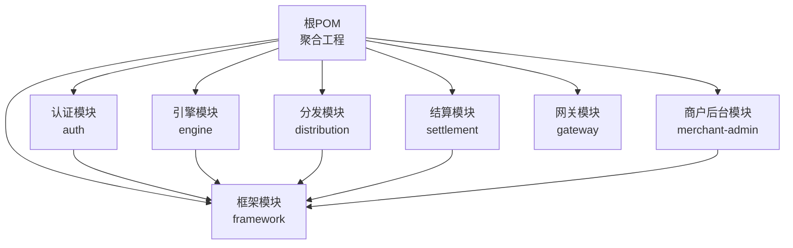
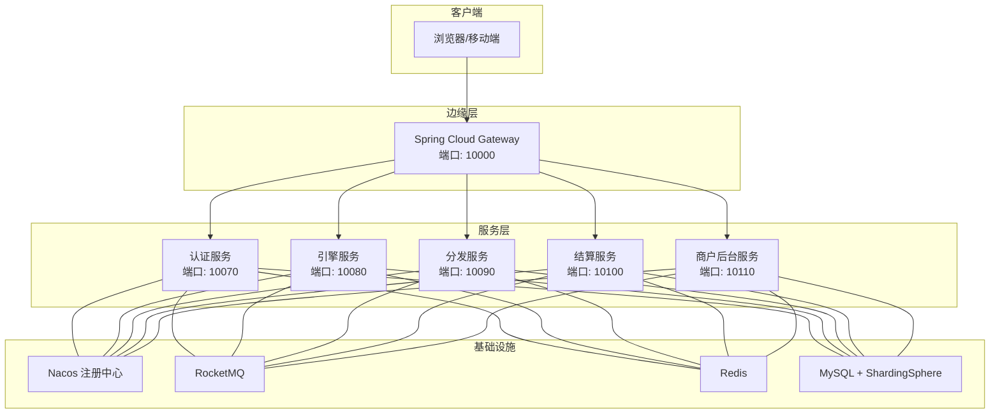
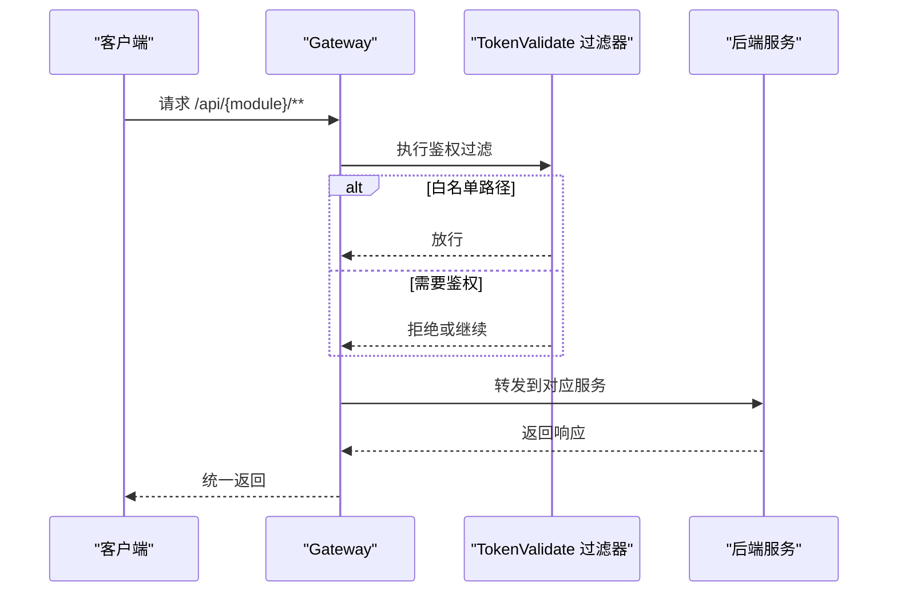
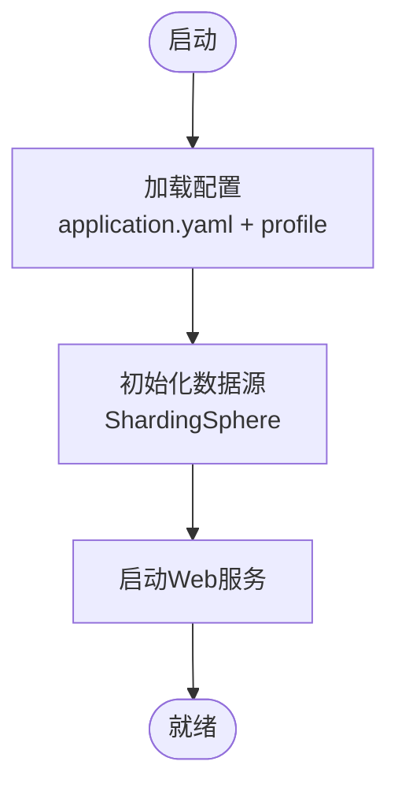
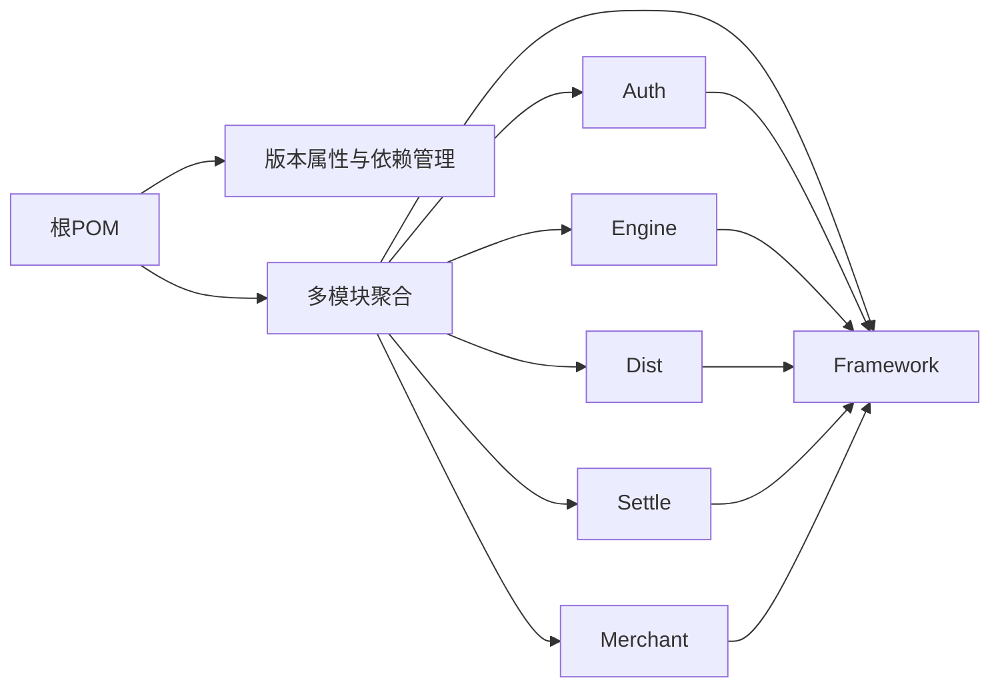

# 容器化部署

<cite>
**本文引用的文件**
- [根POM](file://pom.xml)
- [认证模块POM](file://auth/pom.xml)
- [引擎模块POM](file://engine/pom.xml)
- [网关模块YAML](file://gateway/src/main/resources/application.yml)
- [认证模块YAML](file://auth/src/main/resources/application.yaml)
- [认证模块开发配置](file://auth/src/main/resources/application-dev.yaml)
- [认证模块生产配置](file://auth/src/main/resources/application-prod.yaml)
- [分发模块YAML](file://distribution/src/main/resources/application.yaml)
- [引擎模块YAML](file://engine/src/main/resources/application.yaml)
- [结算模块YAML](file://settlement/src/main/resources/application.yaml)
- [商户后台模块YAML](file://merchant-admin/src/main/resources/application.yaml)
- [框架模块POM](file://framework/pom.xml)
- [网关模块Java](file://gateway/src/main/java/com/fengxin/maplecoupon/gateway/GateWayApplication.java)
- [认证模块Java](file://auth/src/main/java/com/fengxin/maplecoupon/auth/AuthApplication.java)
- [引擎模块Java](file://engine/src/main/java/com/fengxin/maplecoupon/engine/EngineApplication.java)
- [分发模块Java](file://distribution/src/main/java/com/fengxin/maplecoupon/distribution/DistributionApplication.java)
- [结算模块Java](file://settlement/src/main/java/com/fengxin/maplecoupon/settlement/SettlementApplication.java)
- [商户后台模块Java](file://merchant-admin/src/main/java/com/fengxin/maplecoupon/merchantadmin/MerchantAdminApplication.java)
</cite>

## 目录
1. [简介](#简介)
2. [项目结构](#项目结构)
3. [核心组件](#核心组件)
4. [架构总览](#架构总览)
5. [详细组件分析](#详细组件分析)
6. [依赖分析](#依赖分析)
7. [性能考虑](#性能考虑)
8. [故障排查指南](#故障排查指南)
9. [结论](#结论)
10. [附录](#附录)

## 简介
本指南面向MapleCoupon系统的容器化部署，覆盖Docker镜像构建最佳实践（多阶段构建、分层管理、安全加固）、Docker Compose编排（服务依赖、网络与数据卷）、Kubernetes部署策略（Deployment/Service/Ingress/ConfigMap/Secret）以及资源限制、扩缩容、健康检查、重启策略、故障恢复、环境变量与配置热更新、滚动升级、监控与日志集成等主题。目标是帮助读者以安全、稳定、可观测的方式交付与运维该系统。

## 项目结构
MapleCoupon采用多模块Maven聚合工程组织，包含网关、认证、引擎、分发、结算、商户后台与框架等子模块。每个模块均包含独立的Spring Boot应用入口类与配置文件，便于拆分打包与容器化部署。

图表来源
- [根POM:17-34](file://pom.xml#L17-L34)
- [认证模块POM:1-134](file://auth/pom.xml#L1-L134)
- [引擎模块POM:1-128](file://engine/pom.xml#L1-L128)
- [框架模块POM:1-200](file://framework/pom.xml#L1-L200)

章节来源
- [根POM:17-34](file://pom.xml#L17-L34)
- [认证模块POM:1-134](file://auth/pom.xml#L1-L134)
- [引擎模块POM:1-128](file://engine/pom.xml#L1-L128)
- [框架模块POM:1-200](file://framework/pom.xml#L1-L200)

## 核心组件
- 网关（gateway）：统一入口，基于Spring Cloud Gateway进行路由与过滤，内置CORS与鉴权过滤器。
- 认证（auth）：用户登录、注册与上下文传递，依赖ShardingSphere与RocketMQ。
- 引擎（engine）：优惠券模板与用户优惠券核心业务。
- 分发（distribution）：优惠券任务分发与MQ消费。
- 结算（settlement）：订单金额查询与结算辅助。
- 商户后台（merchant-admin）：优惠券模板管理、任务调度与日志记录。
- 框架（framework）：全局异常、幂等、Web自动装配与通用配置。

章节来源
- [网关模块YAML:1-72](file://gateway/src/main/resources/application.yml#L1-L72)
- [认证模块YAML:1-19](file://auth/src/main/resources/application.yaml#L1-L19)
- [引擎模块YAML:1-200](file://engine/src/main/resources/application.yaml#L1-L200)
- [分发模块YAML:1-200](file://distribution/src/main/resources/application.yaml#L1-L200)
- [结算模块YAML:1-200](file://settlement/src/main/resources/application.yaml#L1-L200)
- [商户后台模块YAML:1-200](file://merchant-admin/src/main/resources/application.yaml#L1-L200)

## 架构总览
下图展示容器化后的服务拓扑：网关作为统一入口，向下游各业务模块转发请求；各模块通过Nacos进行服务注册与发现；数据库使用ShardingSphere进行分库分表；消息队列RocketMQ用于异步解耦；Redis用于缓存与分布式锁；MySQL提供持久化存储。

图表来源
- [网关模块YAML:1-72](file://gateway/src/main/resources/application.yml#L1-L72)
- [认证模块YAML:1-19](file://auth/src/main/resources/application.yaml#L1-L19)
- [引擎模块YAML:1-200](file://engine/src/main/resources/application.yaml#L1-L200)
- [分发模块YAML:1-200](file://distribution/src/main/resources/application.yaml#L1-L200)
- [结算模块YAML:1-200](file://settlement/src/main/resources/application.yaml#L1-L200)
- [商户后台模块YAML:1-200](file://merchant-admin/src/main/resources/application.yaml#L1-L200)

## 详细组件分析

### 网关服务（Gateway）
- 应用入口：GateWayApplication
- 关键配置：路由规则、CORS、鉴权过滤器、Actuator暴露
- 端口：10000
- 依赖：Nacos服务发现、OpenFeign、LoadBalancer

图表来源
- [网关模块YAML:17-63](file://gateway/src/main/resources/application.yml#L17-L63)
- [网关模块Java:1-200](file://gateway/src/main/java/com/fengxin/maplecoupon/gateway/GateWayApplication.java#L1-L200)

章节来源
- [网关模块YAML:1-72](file://gateway/src/main/resources/application.yml#L1-L72)
- [网关模块Java:1-200](file://gateway/src/main/java/com/fengxin/maplecoupon/gateway/GateWayApplication.java#L1-L200)

### 认证服务（Auth）
- 应用入口：AuthApplication
- 关键配置：端口、数据源（ShardingSphere）、MyBatis Plus日志、数据库分片数量
- 端口：10070
- 依赖：Nacos、ShardingSphere、RocketMQ、Knife4j、MyBatis-Plus

图表来源
- [认证模块YAML:1-19](file://auth/src/main/resources/application.yaml#L1-L19)
- [认证模块开发配置:1-200](file://auth/src/main/resources/application-dev.yaml#L1-L200)
- [认证模块生产配置:1-200](file://auth/src/main/resources/application-prod.yaml#L1-L200)
- [认证模块Java:1-200](file://auth/src/main/java/com/fengxin/maplecoupon/auth/AuthApplication.java#L1-L200)

章节来源
- [认证模块YAML:1-19](file://auth/src/main/resources/application.yaml#L1-L19)
- [认证模块开发配置:1-200](file://auth/src/main/resources/application-dev.yaml#L1-L200)
- [认证模块生产配置:1-200](file://auth/src/main/resources/application-prod.yaml#L1-L200)
- [认证模块Java:1-200](file://auth/src/main/java/com/fengxin/maplecoupon/auth/AuthApplication.java#L1-L200)

### 引擎服务（Engine）
- 应用入口：EngineApplication
- 关键配置：端口、数据源（ShardingSphere）、数据库分片算法
- 端口：10080
- 依赖：Nacos、ShardingSphere、RocketMQ、Knife4j、MyBatis-Plus

章节来源
- [引擎模块YAML:1-200](file://engine/src/main/resources/application.yaml#L1-L200)
- [引擎模块Java:1-200](file://engine/src/main/java/com/fengxin/maplecoupon/engine/EngineApplication.java#L1-L200)

### 分发服务（Distribution）
- 应用入口：DistributionApplication
- 关键配置：端口、数据源（ShardingSphere）、Lua脚本、Excel解析
- 端口：10090
- 依赖：Nacos、ShardingSphere、RocketMQ、EasyExcel、MyBatis-Plus

章节来源
- [分发模块YAML:1-200](file://distribution/src/main/resources/application.yaml#L1-L200)
- [分发模块Java:1-200](file://distribution/src/main/java/com/fengxin/maplecoupon/distribution/DistributionApplication.java#L1-L200)

### 结算服务（Settlement）
- 应用入口：SettlementApplication
- 关键配置：端口、数据源（ShardingSphere）
- 端口：10100
- 依赖：Nacos、ShardingSphere、Knife4j、MyBatis-Plus

章节来源
- [结算模块YAML:1-200](file://settlement/src/main/resources/application.yaml#L1-L200)
- [结算模块Java:1-200](file://settlement/src/main/java/com/fengxin/maplecoupon/settlement/SettlementApplication.java#L1-L200)

### 商户后台服务（Merchant Admin）
- 应用入口：MerchantAdminApplication
- 关键配置：端口、数据源（ShardingSphere）、XXL-Job
- 端口：10110
- 依赖：Nacos、ShardingSphere、RocketMQ、XXL-Job、Knife4j、MyBatis-Plus

章节来源
- [商户后台模块YAML:1-200](file://merchant-admin/src/main/resources/application.yaml#L1-L200)
- [商户后台模块Java:1-200](file://merchant-admin/src/main/java/com/fengxin/maplecoupon/merchantadmin/MerchantAdminApplication.java#L1-L200)

## 依赖分析
- 版本管理：根POM集中管理Spring Boot、Spring Cloud、Spring Cloud Alibaba、ShardingSphere、RocketMQ、MyBatis-Plus等版本。
- 模块间依赖：各业务模块依赖框架模块，提供通用能力；模块之间通过Nacos进行服务发现与调用。
- 外部依赖：MySQL、Redis、RocketMQ、Nacos、ShardingSphere。

图表来源
- [根POM:37-183](file://pom.xml#L37-L183)
- [框架模块POM:1-200](file://framework/pom.xml#L1-L200)

章节来源
- [根POM:37-183](file://pom.xml#L37-L183)
- [框架模块POM:1-200](file://framework/pom.xml#L1-L200)

## 性能考虑
- 数据库分片：通过ShardingSphere对数据库进行分片，提升吞吐与扩展性。
- 缓存策略：利用Redis缓存热点数据与分布式锁，降低数据库压力。
- 消息异步：RocketMQ异步处理耗时操作，提高接口响应速度。
- 负载均衡：Gateway与Nacos配合实现服务级负载均衡。
- JVM参数：容器内建议设置合适的堆大小与GC策略，避免频繁Full GC。

## 故障排查指南
- 健康检查：启用Actuator的健康端点，结合Kubernetes readiness/liveness探针。
- 日志采集：统一输出到标准输出，结合日志收集系统（如EFK/ELK）集中检索。
- 配置热更新：优先使用外部化配置（ConfigMap/环境变量），避免重启。
- 限流降级：在Gateway层配置限流与熔断，保护下游服务。
- 事务一致性：对分布式事务场景使用RocketMQ事务消息或TCC模式。

## 结论
通过多阶段构建与最小化镜像、完善的编排与Kubernetes策略、严格的配置与安全加固，MapleCoupon可在容器环境中实现高可用、可观测与可扩展的交付。建议结合CI/CD流水线自动化构建与发布，并持续优化资源配额与扩缩容策略。

## 附录

### Docker镜像构建最佳实践
- 多阶段构建
  - 第一阶段：使用完整JDK与Maven构建可执行JAR。
  - 第二阶段：使用超轻量基础镜像（如distroless或alpine），仅拷贝最终JAR与必要依赖。
- 镜像分层管理
  - 将变动频率低的依赖（如JRE、依赖JAR）放在上层，变动频繁的应用代码放在下层，提升缓存命中率。
- 安全加固
  - 使用非root用户运行容器；禁用不必要的系统工具；定期扫描镜像漏洞；最小权限原则挂载卷。
- 入口命令与JVM参数
  - 在容器内设置JAVA_TOOL_OPTIONS或直接传入-D参数，控制堆大小、GC与日志级别。

### Docker Compose编排配置要点
- 服务依赖
  - 通过depends_on确保数据库、消息队列、注册中心先于业务服务启动。
- 网络设置
  - 自定义桥接网络，隔离不同环境；为Gateway暴露宿主端口。
- 数据卷管理
  - 日志目录映射到宿主机；配置文件挂载为只读；数据库数据卷持久化。
- 环境变量
  - 使用env_file或environment字段注入数据库连接、注册中心地址、RocketMQ地址等。

### Kubernetes部署策略
- Deployment
  - 设置副本数、滚动更新策略（maxUnavailable与maxSurge）、资源requests/limits。
  - 使用PodDisruptionBudget保障高可用。
- Service
  - ClusterIP暴露内部服务；NodePort或Ingress暴露给外部。
- Ingress
  - 配置域名与路径转发规则，结合TLS证书与WAF策略。
- ConfigMap/Secret
  - 将数据库连接、RocketMQ地址、JWT密钥等放入Secret；其他配置放入ConfigMap。
- 健康检查与重启策略
  - livenessProbe/readinessProbe探测Actuator健康端点；失败时自动重启（默认重启策略）。
- 横向扩缩容
  - HPA基于CPU/内存或自定义指标动态扩缩容；结合Vertical Pod Autoscaler优化资源分配。

### 容器资源限制与扩缩容
- CPU/内存
  - 为各模块设置合理的requests与limits，避免资源争抢。
- 垂直扩容
  - 根据QPS与延迟趋势调整JVM堆大小与线程池参数。
- 水平扩容
  - 通过副本数与HPA实现弹性伸缩；注意ShardingSphere分片策略与状态一致性。

### 环境变量管理与配置热更新
- 外部化配置
  - 将敏感信息放入Secret，非敏感配置放入ConfigMap；通过volumeMounts挂载到容器。
- 热更新
  - 对于无状态配置（如日志级别、开关），可通过ConfigMap热更新；对于数据库连接等需重启生效。

### 滚动升级流程
- 金丝雀发布
  - 先部署少量新版本实例，观察指标与日志，再逐步替换全部实例。
- 健康检查
  - 升级前确保新版本健康探针通过；升级过程中保持旧版本在位，直至新版本完全接管。
- 回滚策略
  - 若升级失败，回滚到上一个稳定版本；保留历史Deployment版本以便快速回退。

### 监控与日志集成
- 指标采集
  - 暴露Prometheus指标，结合Grafana可视化；关注QPS、错误率、P95延迟、GC频率。
- 日志采集
  - 标准输出日志统一收集；结构化日志便于检索；按天切割与压缩归档。
- 链路追踪
  - 集成分布式追踪（如SkyWalking/Zipkin），定位慢调用与异常链路。