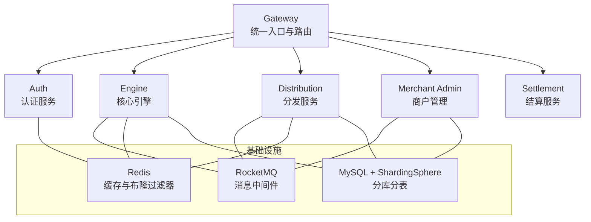
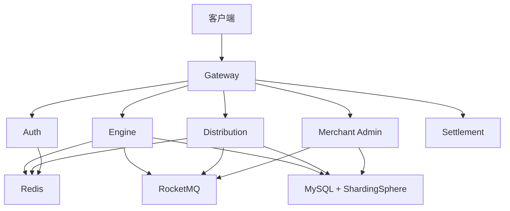
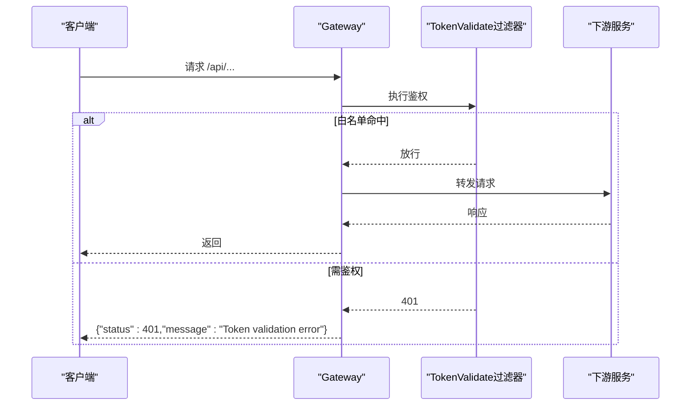
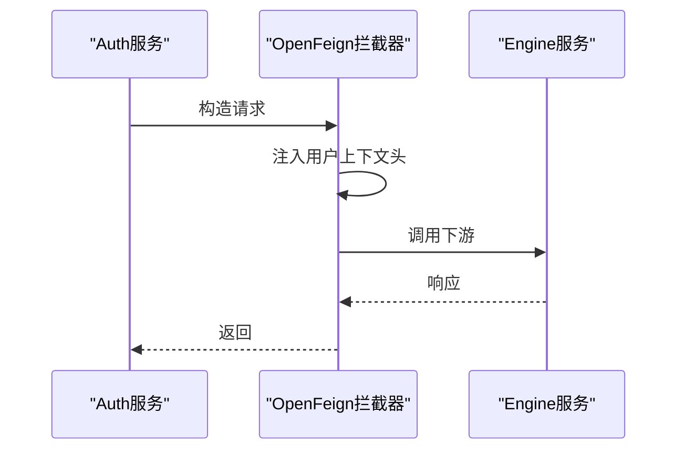
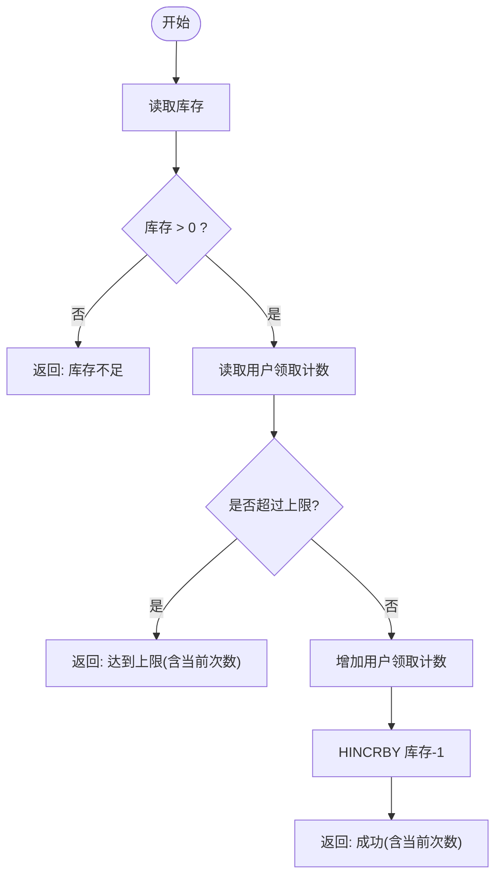
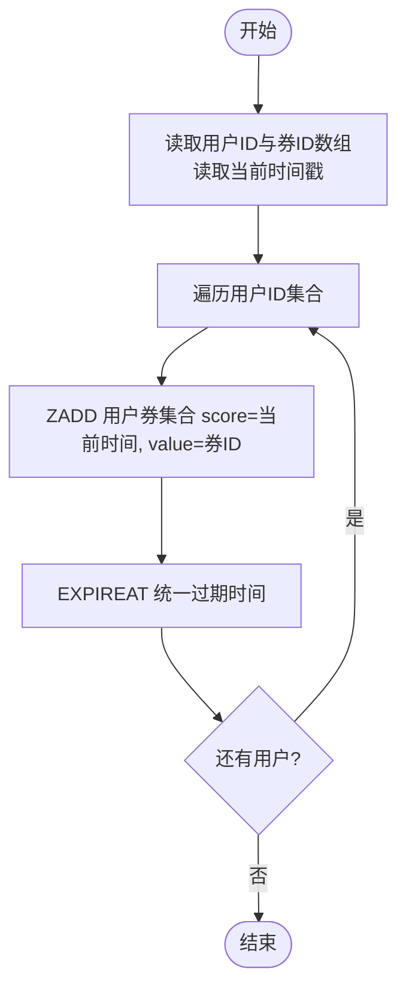
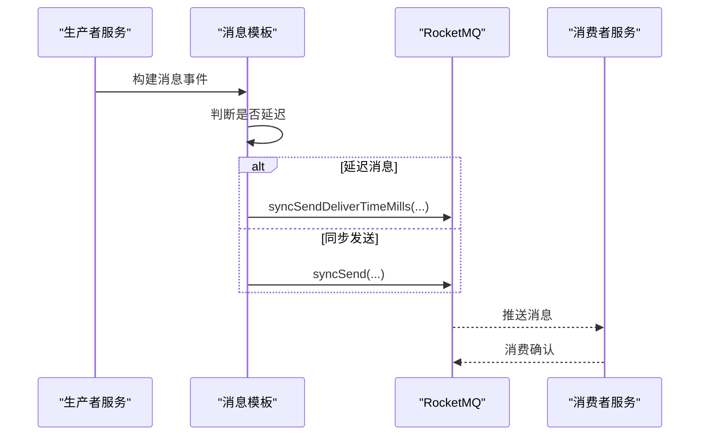
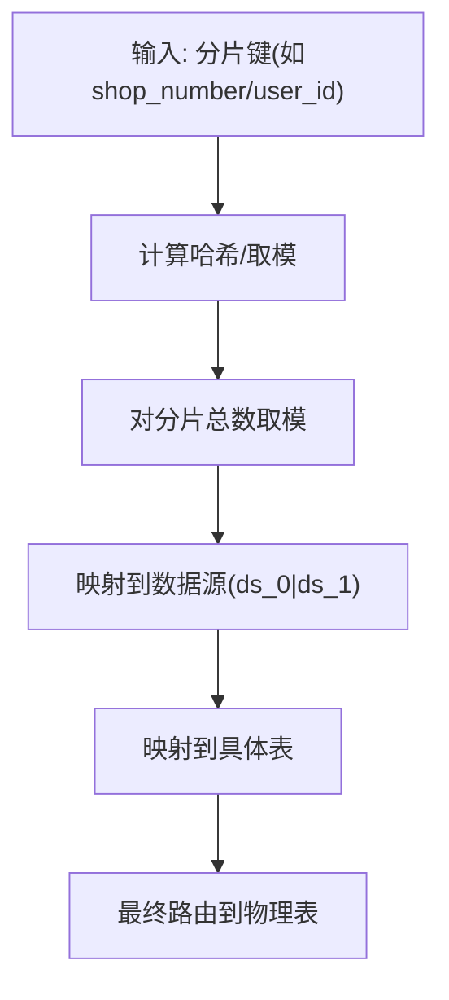
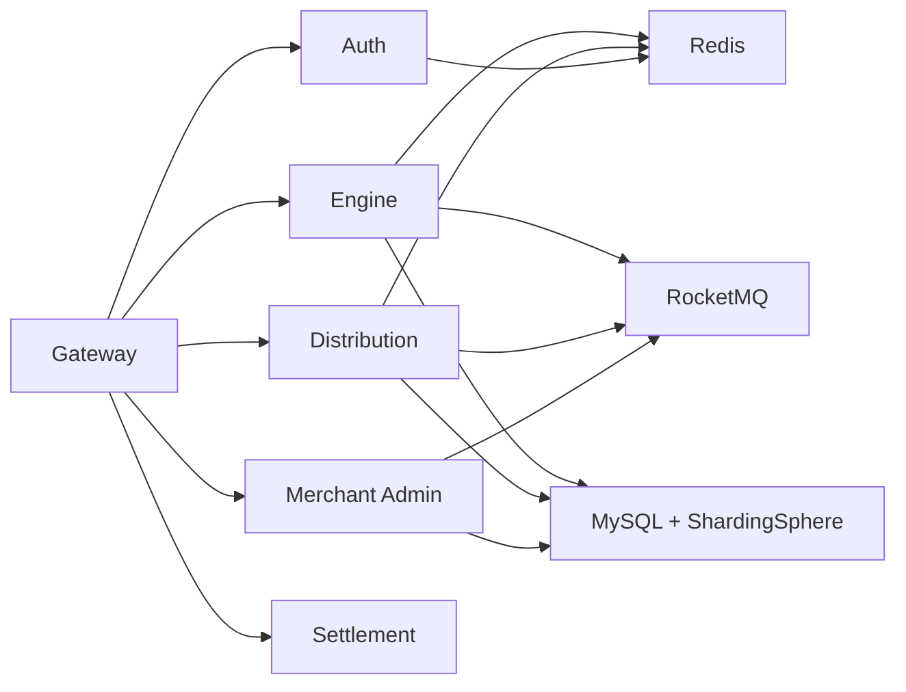

# 性能监控

<cite>
**本文引用的文件**   
- [README.md](file://README.md)
- [application.yaml](file://gateway/src/main/resources/application.yml)
- [application.yaml](file://auth/src/main/resources/application.yaml)
- [application.yaml](file://engine/src/main/resources/application.yaml)
- [application.yaml](file://distribution/src/main/resources/application.yaml)
- [shardingsphere-config-dev.yaml](file://auth/src/main/resources/shardingsphere-config-dev.yaml)
- [shardingsphere-config-dev.yaml](file://engine/src/main/resources/shardingsphere-config-dev.yaml)
- [DBShardingUtil.java](file://engine/src/main/java/com/fengxin/maplecoupon/engine/dao/sharding/DBShardingUtil.java)
- [DBHashModShardingAlgorithm.java](file://merchant-admin/src/main/java/com/fengxin/merchantadmin/dao/sharding/DBHashModShardingAlgorithm.java)
- [RBloomFilterConfiguration.java](file://engine/src/main/java/com/fengxin/maplecoupon/engine/config/RBloomFilterConfiguration.java)
- [CacheConfiguration.java](file://framework/src/main/java/com/fengxin/config/CacheConfiguration.java)
- [RedisConstantEnum.java](file://gateway/src/main/java/com/fengxin/maplecoupon/gateway/common/RedisConstantEnum.java)
- [AbstractCommonSendProduceTemplate.java](file://engine/src/main/java/com/fengxin/maplecoupon/engine/mq/design/AbstractCommonSendProduceTemplate.java)
- [AbstractCommonSendProduceTemplate.java](file://merchant-admin/src/main/java/com/fengxin/merchantadmin/mq/design/AbstractCommonSendProduceTemplate.java)
- [AbstractCommonSendProduceTemplate.java](file://distribution/src/main/java/com/fengxin/maplecoupon/distribution/mq/design/AbstractCommonSendProduceTemplate.java)
- [stock_decrement_and_save_user_receive.lua](file://engine/src/main/resources/lua/stock_decrement_and_save_user_receive.lua)
- [batch_save_user_coupon.lua](file://distribution/src/main/resources/lua/batch_save_user_coupon.lua)
- [TokenValidateGatewayFilterFactory.java](file://gateway/src/main/java/com/fengxin/maplecoupon/gateway/filter/TokenValidateGatewayFilterFactory.java)
- [GlobalExceptionHandler.java](file://framework/src/main/java/com/fengxin/web/GlobalExceptionHandler.java)
- [BaseErrorCode.java](file://framework/src/main/java/com/fengxin/errorcode/BaseErrorCode.java)
- [Results.java](file://framework/src/main/java/com/fengxin/web/Results.java)
- [OpenFeignConfiguration.java](file://auth/src/main/java/com/fengxin/maplecoupon/auth/config/OpenFeignConfiguration.java)
- [Home.vue](file://coupon/src/components/Home.vue)
- [Features.vue](file://coupon/src/views/Features.vue)
</cite>

## 目录
1. [简介](#简介)
2. [项目结构](#项目结构)
3. [核心组件](#核心组件)
4. [架构总览](#架构总览)
5. [详细组件分析](#详细组件分析)
6. [依赖分析](#依赖分析)
7. [性能考量](#性能考量)
8. [故障排查指南](#故障排查指南)
9. [结论](#结论)
10. [附录](#附录)

## 简介
本指南面向MapleCoupon系统的性能监控与优化，聚焦以下关键领域：
- 关键性能指标（KPI）：响应时间、吞吐量、错误率、资源利用率
- 数据库性能监控：慢查询分析、连接池监控、索引使用情况
- 缓存性能优化：Redis命中率、内存使用、过期策略监控
- 消息队列性能监控：消息积压、消费延迟、生产者性能
- 微服务间调用链监控与依赖关系分析
- 容量规划与扩容策略
- 瓶颈识别与优化实践
- 性能测试工具使用与结果分析

项目技术栈包含Spring Boot、Spring Cloud Alibaba、Spring Cloud Gateway、ShardingSphere、RocketMQ、Redis、MySQL、MyBatis-Plus等，整体采用微服务与消息驱动架构，具备良好的扩展性与可观测性基础。

章节来源
- [README.md:1-10](file://README.md#L1-L10)

## 项目结构
MapleCoupon采用多模块微服务架构，包含网关、认证、引擎、分发、商户管理、结算、框架公共层等模块。各服务通过Spring Cloud Gateway统一入口，内部通过RocketMQ异步解耦，使用ShardingSphere进行分库分表，Redis提供多级缓存与布隆过滤器能力。

图表来源
- [application.yml:17-58](file://gateway/src/main/resources/application.yml#L17-L58)
- [shardingsphere-config-dev.yaml:1-45](file://auth/src/main/resources/shardingsphere-config-dev.yaml#L1-L45)
- [shardingsphere-config-dev.yaml:1-100](file://engine/src/main/resources/shardingsphere-config-dev.yaml#L1-L100)

章节来源
- [application.yml:17-58](file://gateway/src/main/resources/application.yml#L17-L58)
- [application.yaml:1-19](file://auth/src/main/resources/application.yaml#L1-L19)
- [application.yaml:1-22](file://engine/src/main/resources/application.yaml#L1-L22)
- [application.yaml:1-15](file://distribution/src/main/resources/application.yaml#L1-L15)

## 核心组件
- 网关（Gateway）：统一路由、鉴权过滤、暴露Actuator端点用于监控
- 认证（Auth）：用户认证、上下文透传
- 引擎（Engine）：优惠券模板与用户券核心逻辑，Lua脚本原子扣减与限流
- 分发（Distribution）：批量保存用户券、ZSet去重与过期
- 商户管理（Merchant Admin）：任务调度、模板管理、消息生产
- 结算（Settlement）：查询与对账
- 框架（Framework）：全局异常、缓存序列化、幂等配置

章节来源
- [application.yml:65-72](file://gateway/src/main/resources/application.yml#L65-L72)
- [OpenFeignConfiguration.java:14-24](file://auth/src/main/java/com/fengxin/maplecoupon/auth/config/OpenFeignConfiguration.java#L14-L24)
- [RBloomFilterConfiguration.java:33-46](file://engine/src/main/java/com/fengxin/maplecoupon/engine/config/RBloomFilterConfiguration.java#L33-L46)
- [CacheConfiguration.java:16-35](file://framework/src/main/java/com/fengxin/config/CacheConfiguration.java#L16-L35)

## 架构总览
下图展示服务间调用与数据流路径，突出消息驱动与分库分表的关键节点。

图表来源
- [application.yml:17-58](file://gateway/src/main/resources/application.yml#L17-L58)
- [AbstractCommonSendProduceTemplate.java:37-66](file://engine/src/main/java/com/fengxin/maplecoupon/engine/mq/design/AbstractCommonSendProduceTemplate.java#L37-L66)
- [AbstractCommonSendProduceTemplate.java:37-66](file://merchant-admin/src/main/java/com/fengxin/merchantadmin/mq/design/AbstractCommonSendProduceTemplate.java#L37-L66)
- [AbstractCommonSendProduceTemplate.java:37-66](file://distribution/src/main/java/com/fengxin/maplecoupon/distribution/mq/design/AbstractCommonSendProduceTemplate.java#L37-L66)

## 详细组件分析

### 网关性能与可观测性
- 路由与白名单：针对特定路径设置白名单，减少无效鉴权开销
- 鉴权过滤：统一Token校验，失败直接返回，避免进入下游
- 监控端点：暴露Actuator端点，便于采集Prometheus指标

图表来源
- [application.yml:17-58](file://gateway/src/main/resources/application.yml#L17-L58)
- [TokenValidateGatewayFilterFactory.java:76-93](file://gateway/src/main/java/com/fengxin/maplecoupon/gateway/filter/TokenValidateGatewayFilterFactory.java#L76-L93)

章节来源
- [application.yml:65-72](file://gateway/src/main/resources/application.yml#L65-L72)
- [TokenValidateGatewayFilterFactory.java:76-93](file://gateway/src/main/java/com/fengxin/maplecoupon/gateway/filter/TokenValidateGatewayFilterFactory.java#L76-L93)

### 认证与上下文透传
- Feign拦截器：将用户上下文头透传至下游服务，保证链路一致性
- 缓存前缀：通过统一的RedisKeySerializer设置Key前缀，便于运维与容量规划

图表来源
- [OpenFeignConfiguration.java:14-24](file://auth/src/main/java/com/fengxin/maplecoupon/auth/config/OpenFeignConfiguration.java#L14-L24)

章节来源
- [OpenFeignConfiguration.java:14-24](file://auth/src/main/java/com/fengxin/maplecoupon/auth/config/OpenFeignConfiguration.java#L14-L24)
- [CacheConfiguration.java:24-29](file://framework/src/main/java/com/fengxin/config/CacheConfiguration.java#L24-L29)

### 引擎：Lua原子扣减与限流
- Lua脚本：库存检查、用户领取次数限制、原子性扣减与过期设置
- 布隆过滤器：防止缓存穿透，降低数据库压力

图表来源
- [stock_decrement_and_save_user_receive.lua:1-58](file://engine/src/main/resources/lua/stock_decrement_and_save_user_receive.lua#L1-L58)

章节来源
- [RBloomFilterConfiguration.java:33-46](file://engine/src/main/java/com/fengxin/maplecoupon/engine/config/RBloomFilterConfiguration.java#L33-L46)
- [stock_decrement_and_save_user_receive.lua:1-58](file://engine/src/main/resources/lua/stock_decrement_and_save_user_receive.lua#L1-L58)

### 分发：批量写入与ZSet去重
- Lua脚本：批量保存用户券，ZADD+EXPIREAT，按过期时间戳统一过期
- 适用场景：活动放量、秒杀预热

图表来源
- [batch_save_user_coupon.lua:1-15](file://distribution/src/main/resources/lua/batch_save_user_coupon.lua#L1-L15)

章节来源
- [batch_save_user_coupon.lua:1-15](file://distribution/src/main/resources/lua/batch_save_user_coupon.lua#L1-L15)

### 消息队列：生产与消费
- 生产模板：统一发送模板，支持同步发送与延迟消息
- 消费端：各服务消费者负责具体业务事件处理

图表来源
- [AbstractCommonSendProduceTemplate.java:37-66](file://engine/src/main/java/com/fengxin/maplecoupon/engine/mq/design/AbstractCommonSendProduceTemplate.java#L37-L66)
- [AbstractCommonSendProduceTemplate.java:37-66](file://merchant-admin/src/main/java/com/fengxin/merchantadmin/mq/design/AbstractCommonSendProduceTemplate.java#L37-L66)
- [AbstractCommonSendProduceTemplate.java:37-66](file://distribution/src/main/java/com/fengxin/maplecoupon/distribution/mq/design/AbstractCommonSendProduceTemplate.java#L37-L66)

章节来源
- [AbstractCommonSendProduceTemplate.java:37-66](file://engine/src/main/java/com/fengxin/maplecoupon/engine/mq/design/AbstractCommonSendProduceTemplate.java#L37-L66)
- [AbstractCommonSendProduceTemplate.java:37-66](file://merchant-admin/src/main/java/com/fengxin/merchantadmin/mq/design/AbstractCommonSendProduceTemplate.java#L37-L66)
- [AbstractCommonSendProduceTemplate.java:37-66](file://distribution/src/main/java/com/fengxin/maplecoupon/distribution/mq/design/AbstractCommonSendProduceTemplate.java#L37-L66)

### 数据库与分库分表
- ShardingSphere配置：按分片键进行库/表路由，SQL打印便于诊断
- 分片工具：根据分片键计算所在数据源，支撑复杂查询场景

图表来源
- [shardingsphere-config-dev.yaml:17-42](file://auth/src/main/resources/shardingsphere-config-dev.yaml#L17-L42)
- [shardingsphere-config-dev.yaml:17-97](file://engine/src/main/resources/shardingsphere-config-dev.yaml#L17-L97)
- [DBShardingUtil.java:15-37](file://engine/src/main/java/com/fengxin/maplecoupon/engine/dao/sharding/DBShardingUtil.java#L15-L37)
- [DBHashModShardingAlgorithm.java:31-66](file://merchant-admin/src/main/java/com/fengxin/merchantadmin/dao/sharding/DBHashModShardingAlgorithm.java#L31-L66)

章节来源
- [shardingsphere-config-dev.yaml:17-42](file://auth/src/main/resources/shardingsphere-config-dev.yaml#L17-L42)
- [shardingsphere-config-dev.yaml:17-97](file://engine/src/main/resources/shardingsphere-config-dev.yaml#L17-L97)
- [DBShardingUtil.java:15-37](file://engine/src/main/java/com/fengxin/maplecoupon/engine/dao/sharding/DBShardingUtil.java#L15-L37)
- [DBHashModShardingAlgorithm.java:31-66](file://merchant-admin/src/main/java/com/fengxin/merchantadmin/dao/sharding/DBHashModShardingAlgorithm.java#L31-L66)

### 缓存与布隆过滤器
- RedisKeySerializer：统一Key前缀，便于容量规划与运维
- 布隆过滤器：用户注册查询防穿透，降低数据库压力
- 登录态缓存Key常量：集中管理，避免硬编码

章节来源
- [CacheConfiguration.java:24-29](file://framework/src/main/java/com/fengxin/config/CacheConfiguration.java#L24-L29)
- [RBloomFilterConfiguration.java:33-46](file://engine/src/main/java/com/fengxin/maplecoupon/engine/config/RBloomFilterConfiguration.java#L33-L46)
- [RedisConstantEnum.java:9-14](file://gateway/src/main/java/com/fengxin/maplecoupon/gateway/common/RedisConstantEnum.java#L9-L14)

## 依赖分析
- 服务间依赖：Gateway路由到各业务服务；各服务通过RocketMQ异步通信
- 数据依赖：ShardingSphere分库分表，Redis作为缓存与布隆过滤器
- 外部依赖：MySQL、RocketMQ、Redis、HikariCP连接池

图表来源
- [application.yml:17-58](file://gateway/src/main/resources/application.yml#L17-L58)

章节来源
- [application.yml:17-58](file://gateway/src/main/resources/application.yml#L17-L58)

## 性能考量
- KPI定义与监控
  - 响应时间：P50/P95/P99延迟，区分网关、服务、数据库、缓存、消息队列
  - 吞吐量：QPS/RPS，按接口维度统计
  - 错误率：HTTP 4xx/5xx、业务异常、消息消费失败
  - 资源利用率：CPU、内存、线程池、连接池、Redis内存、磁盘IO
- 数据库性能
  - 慢查询：开启慢查询日志与SQL打印，结合分片键优化
  - 连接池：HikariCP参数调优，连接泄漏检测
  - 索引：分片键、常用过滤/排序字段建立合适索引
- 缓存性能
  - 命中率：Key前缀统一、合理TTL、热点Key分散
  - 内存：监控used_memory、maxmemory-policy
  - 过期策略：批量过期、过期风暴规避
- 消息队列
  - 积压：监控topic堆积量、消费速率
  - 延迟：消息从生产到消费耗时
  - 生产：发送延迟、失败重试策略
- 调用链与依赖
  - 链路追踪：服务名、接口、耗时、错误、上游调用方
  - 依赖关系：服务间调用频次、失败占比、RT分布
- 容量规划与扩容
  - 观察KPI趋势，确定CPU/内存/连接池/Redis/数据库/消息队列阈值
  - 优先横向扩展：服务副本、数据库分片、消息分区
- 瓶颈识别与优化
  - 以数据驱动：结合慢查询、链路追踪、指标告警定位
  - 以实验驱动：灰度变更、A/B对比、压测回归
- 性能测试
  - 工具：JMeter/Locust/Gatling/Siege
  - 场景：并发用户、Ramp-up、持续时间、混合场景
  - 指标：吞吐、延迟、错误率、资源占用

## 故障排查指南
- 全局异常处理：统一构造错误响应，保留错误码与消息
- 基础错误码：明确客户端错误、服务超时、远程调用错误等分类
- 网关鉴权失败：检查白名单与Token校验逻辑
- 业务异常：关注异常堆栈与第一条字段错误信息

章节来源
- [GlobalExceptionHandler.java:24-78](file://framework/src/main/java/com/fengxin/web/GlobalExceptionHandler.java#L24-L78)
- [BaseErrorCode.java:8-53](file://framework/src/main/java/com/fengxin/errorcode/BaseErrorCode.java#L8-L53)
- [Results.java:48-66](file://framework/src/main/java/com/fengxin/web/Results.java#L48-L66)
- [TokenValidateGatewayFilterFactory.java:76-93](file://gateway/src/main/java/com/fengxin/maplecoupon/gateway/filter/TokenValidateGatewayFilterFactory.java#L76-L93)

## 结论
MapleCoupon具备完善的微服务与消息驱动架构，结合ShardingSphere与Redis，可在高并发场景下保持稳定。通过本指南的KPI体系、数据库与缓存优化、消息队列监控、调用链分析与容量规划方法，可系统性提升系统性能与稳定性，并为后续演进提供量化依据。

## 附录
- 功能亮点与性能承诺：高性能架构、分布式设计、可靠性保障、性能监控等特性在前端页面中有明确描述，体现项目对性能与可观测性的重视。

章节来源
- [Home.vue:213-252](file://coupon/src/components/Home.vue#L213-L252)
- [Features.vue:42-765](file://coupon/src/views/Features.vue#L42-L765)