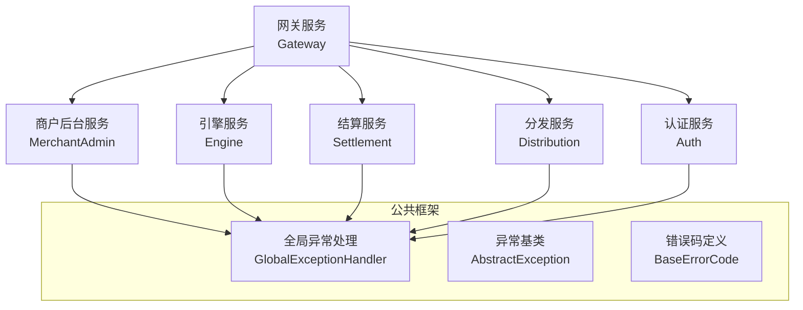
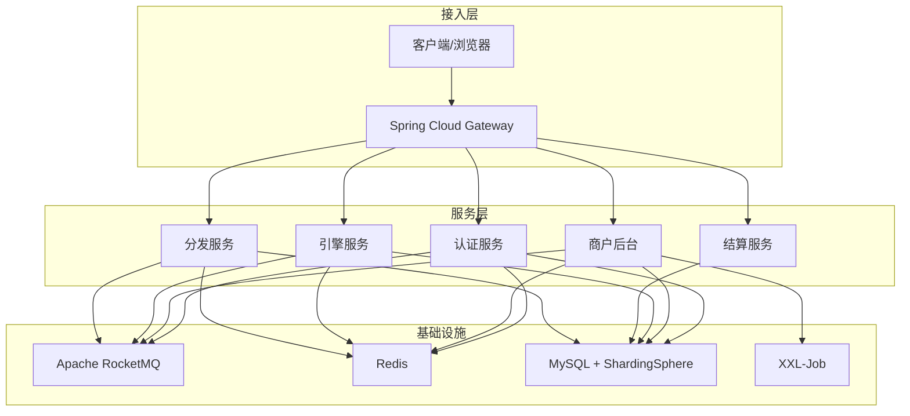
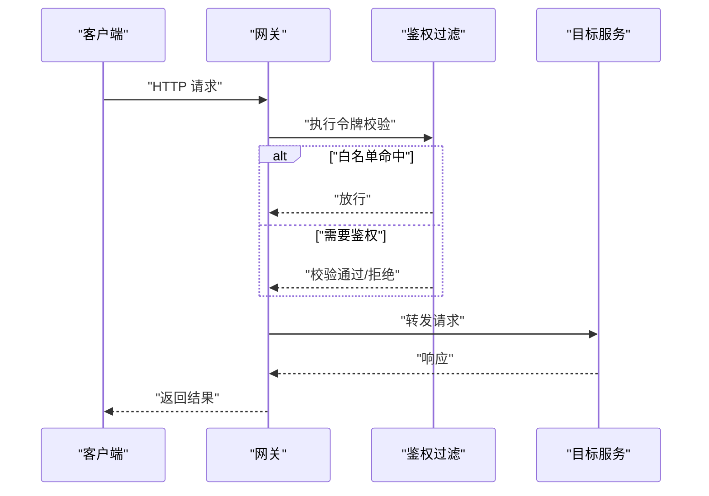
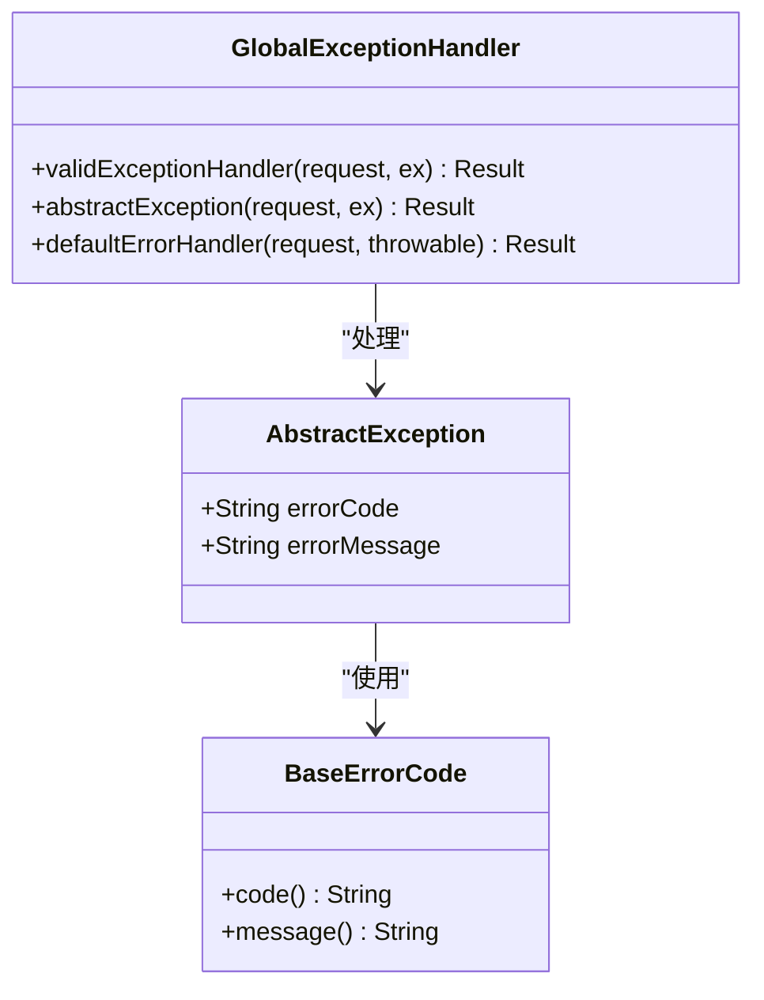
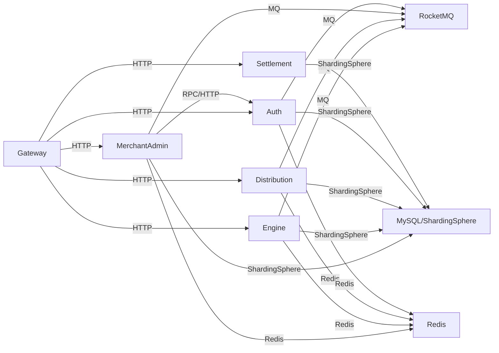

# 故障排查与应急

<cite>
**本文引用的文件**
- [README.md](file://README.md)
- [AuthApplication.java](file://auth/src/main/java/com/fengxin/maplecoupon/auth/AuthApplication.java)
- [EngineApplication.java](file://engine/src/main/java/com/fengxin/maplecoupon/engine/EngineApplication.java)
- [DistributionApplication.java](file://distribution/src/main/java/com/fengxin/maplecoupon/distribution/DistributionApplication.java)
- [MerchantAdminApplication.java](file://merchant-admin/src/main/java/com/fengxin/maplecoupon/merchantadmin/MerchantAdminApplication.java)
- [SettlementApplication.java](file://settlement/src/main/java/com/fengxin/maplecoupon/settlement/SettlementApplication.java)
- [GateWayApplication.java](file://gateway/src/main/java/com/fengxin/maplecoupon/gateway/GateWayApplication.java)
- [GlobalExceptionHandler.java](file://framework/src/main/java/com/fengxin/web/GlobalExceptionHandler.java)
- [AbstractException.java](file://framework/src/main/java/com/fengxin/exception/AbstractException.java)
- [BaseErrorCode.java](file://framework/src/main/java/com/fengxin/errorcode/BaseErrorCode.java)
- [application.yaml（认证）](file://auth/src/main/resources/application.yaml)
- [application.yaml（引擎）](file://engine/src/main/resources/application.yaml)
- [application.yaml（分发）](file://distribution/src/main/resources/application.yaml)
- [application.yaml（商户后台）](file://merchant-admin/src/main/resources/application.yaml)
- [application.yaml（结算）](file://settlement/src/main/resources/application.yaml)
- [application.yml（网关）](file://gateway/src/main/resources/application.yml)
</cite>

## 目录
1. [简介](#简介)
2. [项目结构](#项目结构)
3. [核心组件](#核心组件)
4. [架构总览](#架构总览)
5. [详细组件分析](#详细组件分析)
6. [依赖关系分析](#依赖关系分析)
7. [性能考量](#性能考量)
8. [故障排查指南](#故障排查指南)
9. [结论](#结论)
10. [附录](#附录)

## 简介
本SOP面向MapleCoupon系统的故障排查与应急响应，覆盖服务不可用、数据库连接失败、缓存异常、消息队列阻塞等常见问题；提供日志分析方法（错误定位、堆栈跟踪、性能瓶颈识别）；明确应急响应流程（故障分级、影响评估、临时方案与永久修复）、恢复策略（数据恢复、服务重启、系统回滚）与灾难恢复预案（备份策略、异地容灾、业务连续性），并给出团队协作与沟通机制及复盘改进流程。

## 项目结构
MapleCoupon采用多模块微服务架构，包含认证、引擎、分发、商户后台、结算、网关与公共框架层。各服务独立启动入口，统一通过网关进行路由与鉴权过滤，数据库访问通过ShardingSphere驱动与配置文件加载。

图表来源
- [GateWayApplication.java:1-18](file://gateway/src/main/java/com/fengxin/maplecoupon/gateway/GateWayApplication.java#L1-L18)
- [MerchantAdminApplication.java:1-22](file://merchant-admin/src/main/java/com/fengxin/maplecoupon/merchantadmin/MerchantAdminApplication.java#L1-L22)
- [EngineApplication.java:1-19](file://engine/src/main/java/com/fengxin/maplecoupon/engine/EngineApplication.java#L1-L19)
- [SettlementApplication.java:1-17](file://settlement/src/main/java/com/fengxin/maplecoupon/settlement/SettlementApplication.java#L1-L17)
- [DistributionApplication.java:1-19](file://distribution/src/main/java/com/fengxin/maplecoupon/distribution/DistributionApplication.java#L1-L19)
- [AuthApplication.java:1-26](file://auth/src/main/java/com/fengxin/maplecoupon/auth/AuthApplication.java#L1-L26)
- [GlobalExceptionHandler.java:1-78](file://framework/src/main/java/com/fengxin/web/GlobalExceptionHandler.java#L1-L78)

章节来源
- [README.md:1-10](file://README.md#L1-L10)
- [application.yml（网关）:17-58](file://gateway/src/main/resources/application.yml#L17-L58)

## 核心组件
- 网关服务：统一路由、跨域、鉴权白名单与黑名单控制，暴露管理端点用于健康检查与指标采集。
- 认证服务：用户登录、注册、上下文传递与远程调用。
- 引擎服务：券模板与用户券核心业务，含延迟关闭、提醒、核销等事件处理。
- 分发服务：券批次分发与通知，消费RocketMQ事件。
- 商户后台：券模板管理、任务调度与日志记录。
- 结算服务：订单金额计算，高并发场景。
- 公共框架：全局异常处理、错误码与异常基类，统一返回结构。

章节来源
- [GateWayApplication.java:1-18](file://gateway/src/main/java/com/fengxin/maplecoupon/gateway/GateWayApplication.java#L1-L18)
- [AuthApplication.java:1-26](file://auth/src/main/java/com/fengxin/maplecoupon/auth/AuthApplication.java#L1-L26)
- [EngineApplication.java:1-19](file://engine/src/main/java/com/fengxin/maplecoupon/engine/EngineApplication.java#L1-L19)
- [DistributionApplication.java:1-19](file://distribution/src/main/java/com/fengxin/maplecoupon/distribution/DistributionApplication.java#L1-L19)
- [MerchantAdminApplication.java:1-22](file://merchant-admin/src/main/java/com/fengxin/maplecoupon/merchantadmin/MerchantAdminApplication.java#L1-L22)
- [SettlementApplication.java:1-17](file://settlement/src/main/java/com/fengxin/maplecoupon/settlement/SettlementApplication.java#L1-L17)
- [GlobalExceptionHandler.java:1-78](file://framework/src/main/java/com/fengxin/web/GlobalExceptionHandler.java#L1-L78)
- [AbstractException.java:1-29](file://framework/src/main/java/com/fengxin/exception/AbstractException.java#L1-L29)
- [BaseErrorCode.java:1-54](file://framework/src/main/java/com/fengxin/errorcode/BaseErrorCode.java#L1-L54)

## 架构总览
系统基于Spring Boot + Spring Cloud Alibaba，使用ShardingSphere作为数据库驱动与分片配置，RocketMQ实现异步解耦，Redis用于缓存与布隆过滤，XXL-Job用于定时任务，网关统一接入。

图表来源
- [README.md:4-4](file://README.md#L4-L4)
- [application.yml（网关）:17-58](file://gateway/src/main/resources/application.yml#L17-L58)
- [application.yaml（认证）:6-10](file://auth/src/main/resources/application.yaml#L6-L10)
- [application.yaml（引擎）:6-10](file://engine/src/main/resources/application.yaml#L6-L10)
- [application.yaml（分发）:6-10](file://distribution/src/main/resources/application.yaml#L6-L10)
- [application.yaml（商户后台）:8-10](file://merchant-admin/src/main/resources/application.yaml#L8-L10)
- [application.yaml（结算）:8-10](file://settlement/src/main/resources/application.yaml#L8-L10)

## 详细组件分析

### 网关服务（Gateway）
- 路由规则：按路径前缀将请求转发至对应下游服务实例。
- 鉴权过滤：TokenValidate过滤器对受保护路径进行令牌校验，白名单允许特定公开接口。
- 管理端点：暴露全部Actuator端点，便于健康检查与指标监控。

图表来源
- [application.yml（网关）:17-63](file://gateway/src/main/resources/application.yml#L17-L63)
- [GateWayApplication.java:1-18](file://gateway/src/main/java/com/fengxin/maplecoupon/gateway/GateWayApplication.java#L1-L18)

章节来源
- [application.yml（网关）:1-72](file://gateway/src/main/resources/application.yml#L1-L72)

### 认证服务（Auth）
- 启动入口：扫描Mapper、启用服务发现与OpenFeign客户端。
- 数据源：通过ShardingSphere驱动加载分片配置，支持dev/prod环境切换。
- 配置：MyBatis输出SQL日志，便于问题定位。

章节来源
- [AuthApplication.java:1-26](file://auth/src/main/java/com/fengxin/maplecoupon/auth/AuthApplication.java#L1-L26)
- [application.yaml（认证）:1-19](file://auth/src/main/resources/application.yaml#L1-L19)

### 引擎服务（Engine）
- 启动入口：扫描Mapper。
- 数据源：ShardingSphere驱动与分片配置。
- 配置：用户券缓存写入策略可通过配置项选择直写或binlog解析模式。

章节来源
- [EngineApplication.java:1-19](file://engine/src/main/java/com/fengxin/maplecoupon/engine/EngineApplication.java#L1-L19)
- [application.yaml（引擎）:1-22](file://engine/src/main/resources/application.yaml#L1-L22)

### 分发服务（Distribution）
- 启动入口：扫描Mapper。
- 数据源：ShardingSphere驱动与分片配置。
- 配置：MyBatis SQL日志输出。

章节来源
- [DistributionApplication.java:1-19](file://distribution/src/main/java/com/fengxin/maplecoupon/distribution/DistributionApplication.java#L1-L19)
- [application.yaml（分发）:1-15](file://distribution/src/main/resources/application.yaml#L1-L15)

### 商户后台（MerchantAdmin）
- 启动入口：开启日志记录注解，扫描Mapper。
- 数据源：ShardingSphere驱动与分片配置。
- 配置：XXL-Job默认关闭，可按需启用。

章节来源
- [MerchantAdminApplication.java:1-22](file://merchant-admin/src/main/java/com/fengxin/maplecoupon/merchantadmin/MerchantAdminApplication.java#L1-L22)
- [application.yaml（商户后台）:1-27](file://merchant-admin/src/main/resources/application.yaml#L1-L27)

### 结算服务（Settlement）
- 启动入口：无额外注解。
- 数据源：ShardingSphere驱动与分片配置。
- 配置：MyBatis SQL日志输出。

章节来源
- [SettlementApplication.java:1-17](file://settlement/src/main/java/com/fengxin/maplecoupon/settlement/SettlementApplication.java#L1-L17)
- [application.yaml（结算）:1-14](file://settlement/src/main/resources/application.yaml#L1-L14)

### 公共框架（Framework）
- 全局异常处理：统一拦截参数校验、应用内异常与未捕获异常，记录请求URL与堆栈摘要，返回标准化结果。
- 错误码与异常基类：定义基础错误码与异常封装，便于服务间一致的错误表达。

图表来源
- [GlobalExceptionHandler.java:24-68](file://framework/src/main/java/com/fengxin/web/GlobalExceptionHandler.java#L24-L68)
- [AbstractException.java:17-28](file://framework/src/main/java/com/fengxin/exception/AbstractException.java#L17-L28)
- [BaseErrorCode.java:8-53](file://framework/src/main/java/com/fengxin/errorcode/BaseErrorCode.java#L8-L53)

章节来源
- [GlobalExceptionHandler.java:1-78](file://framework/src/main/java/com/fengxin/web/GlobalExceptionHandler.java#L1-L78)
- [AbstractException.java:1-29](file://framework/src/main/java/com/fengxin/exception/AbstractException.java#L1-L29)
- [BaseErrorCode.java:1-54](file://framework/src/main/java/com/fengxin/errorcode/BaseErrorCode.java#L1-L54)

## 依赖关系分析
- 组件耦合：服务间通过OpenFeign与RocketMQ解耦；数据库访问统一经ShardingSphere驱动。
- 外部依赖：网关依赖服务发现与负载均衡；各服务依赖Redis、MySQL、RocketMQ。
- 可能的环路：当前结构为单向路由与事件消费，未见明显循环依赖。

图表来源
- [application.yml（网关）:17-58](file://gateway/src/main/resources/application.yml#L17-L58)
- [application.yaml（认证）:6-10](file://auth/src/main/resources/application.yaml#L6-L10)
- [application.yaml（引擎）:6-10](file://engine/src/main/resources/application.yaml#L6-L10)
- [application.yaml（分发）:6-10](file://distribution/src/main/resources/application.yaml#L6-L10)
- [application.yaml（商户后台）:8-10](file://merchant-admin/src/main/resources/application.yaml#L8-L10)
- [application.yaml（结算）:8-10](file://settlement/src/main/resources/application.yaml#L8-L10)

## 性能考量
- SQL日志：各服务均开启MyBatis SQL日志输出，便于定位慢查询与异常SQL。
- 缓存策略：引擎侧提供“直写/解析binlog”两种用户券缓存写入策略，可根据场景调整。
- 并发与限流：网关提供限流与鉴权过滤，结合熔断与降级策略可进一步优化。
- 指标监控：网关暴露全部Actuator端点，建议结合Prometheus/Grafana进行指标采集与告警。

章节来源
- [application.yaml（引擎）:16-21](file://engine/src/main/resources/application.yaml#L16-L21)
- [application.yml（网关）:65-72](file://gateway/src/main/resources/application.yml#L65-L72)

## 故障排查指南

### 一、服务不可用
- 快速检查
  - 网关健康：访问网关管理端点，确认网关自身健康与路由配置。
  - 服务健康：访问各服务Actuator端点，确认服务存活与依赖可用。
  - 负载均衡：检查服务注册与实例状态，确认是否存在实例下线或网络分区。
- 诊断步骤
  - 网关路由：核对application.yml中的路由规则与过滤器配置。
  - 服务启动：确认各服务主类与Mapper扫描路径正确。
- 临时方案
  - 将故障实例从负载均衡剔除，切换到备用实例。
  - 临时关闭部分非关键过滤器以快速恢复。
- 永久修复
  - 补齐健康检查与自动恢复策略，完善熔断与降级。

章节来源
- [application.yml（网关）:17-63](file://gateway/src/main/resources/application.yml#L17-L63)
- [GateWayApplication.java:1-18](file://gateway/src/main/java/com/fengxin/maplecoupon/gateway/GateWayApplication.java#L1-L18)
- [AuthApplication.java:1-26](file://auth/src/main/java/com/fengxin/maplecoupon/auth/AuthApplication.java#L1-L26)
- [EngineApplication.java:1-19](file://engine/src/main/java/com/fengxin/maplecoupon/engine/EngineApplication.java#L1-L19)
- [DistributionApplication.java:1-19](file://distribution/src/main/java/com/fengxin/maplecoupon/distribution/DistributionApplication.java#L1-L19)
- [MerchantAdminApplication.java:1-22](file://merchant-admin/src/main/java/com/fengxin/maplecoupon/merchantadmin/MerchantAdminApplication.java#L1-L22)
- [SettlementApplication.java:1-17](file://settlement/src/main/java/com/fengxin/maplecoupon/settlement/SettlementApplication.java#L1-L17)

### 二、数据库连接失败
- 快速检查
  - 数据源配置：确认ShardingSphere驱动与配置文件路径正确，环境变量database.env是否生效。
  - 连接池：检查连接池参数与最大连接数限制。
- 诊断步骤
  - 查看服务启动日志中数据源初始化与SQL日志输出。
  - 使用数据库客户端验证连接与权限。
- 临时方案
  - 切换到备用数据库实例或临时关闭分片配置以定位问题。
- 永久修复
  - 优化连接池参数，完善数据库高可用与主从切换策略。

章节来源
- [application.yaml（认证）:6-10](file://auth/src/main/resources/application.yaml#L6-L10)
- [application.yaml（引擎）:6-10](file://engine/src/main/resources/application.yaml#L6-L10)
- [application.yaml（分发）:6-10](file://distribution/src/main/resources/application.yaml#L6-L10)
- [application.yaml（商户后台）:8-10](file://merchant-admin/src/main/resources/application.yaml#L8-L10)
- [application.yaml（结算）:8-10](file://settlement/src/main/resources/application.yaml#L8-L10)

### 三、缓存异常（Redis）
- 快速检查
  - 缓存可用性：确认Redis实例连通性与内存使用率。
  - 布隆过滤：检查布隆过滤配置与误判率。
- 诊断步骤
  - 关注服务侧缓存写入策略配置项，必要时切换为直写模式以排除binlog解析问题。
  - 查看异常日志与全局异常处理返回信息。
- 临时方案
  - 临时禁用缓存写入或切换为只读模式，保证核心功能可用。
- 永久修复
  - 优化缓存键设计与过期策略，完善缓存降级与重试机制。

章节来源
- [application.yaml（引擎）:16-21](file://engine/src/main/resources/application.yaml#L16-L21)
- [GlobalExceptionHandler.java:24-68](file://framework/src/main/java/com/fengxin/web/GlobalExceptionHandler.java#L24-L68)

### 四、消息队列阻塞（RocketMQ）
- 快速检查
  - 队列积压：检查消费者消费速率与生产者发送速率。
  - 消费异常：查看消费者日志与异常处理。
- 诊断步骤
  - 核查消费者实现与消息序列化/反序列化。
  - 使用消息追踪工具定位卡顿环节。
- 临时方案
  - 扩容消费者实例或临时屏蔽部分高耗时消费逻辑。
- 永久修复
  - 优化消息拆分与批量处理，完善死信队列与重试策略。

章节来源
- [README.md:4-4](file://README.md#L4-L4)

### 五、日志分析技巧
- 错误日志定位
  - 使用全局异常处理器记录请求方法、URL与异常摘要，快速定位问题接口。
  - 结合服务端SQL日志输出，定位慢查询与异常SQL。
- 堆栈跟踪分析
  - 全局异常处理器会输出异常类名、消息与前N个堆栈帧，优先关注业务异常与远程调用异常。
- 性能瓶颈识别
  - 结合网关与服务端指标端点，观察延迟、错误率与吞吐量趋势，配合慢查询日志定位热点接口。

章节来源
- [GlobalExceptionHandler.java:24-68](file://framework/src/main/java/com/fengxin/web/GlobalExceptionHandler.java#L24-L68)
- [application.yaml（认证）:12-14](file://auth/src/main/resources/application.yaml#L12-L14)
- [application.yaml（引擎）:12-14](file://engine/src/main/resources/application.yaml#L12-L14)
- [application.yaml（分发）:12-14](file://distribution/src/main/resources/application.yaml#L12-L14)
- [application.yaml（商户后台）:12-14](file://merchant-admin/src/main/resources/application.yaml#L12-L14)
- [application.yaml（结算）:12-14](file://settlement/src/main/resources/application.yaml#L12-L14)
- [application.yml（网关）:65-72](file://gateway/src/main/resources/application.yml#L65-L72)

### 六、应急响应流程
- 故障分级
  - P0：核心链路中断（如网关不可用、核心数据库不可用）。
  - P1：关键服务不可用（如引擎/结算服务）。
  - P2：一般服务异常（如分发/认证服务）。
  - P3：外围功能异常（如日志/报表）。
- 影响评估
  - 业务影响范围、用户规模、SLA影响程度。
- 临时方案
  - 网关：临时放行白名单接口或关闭非关键过滤器。
  - 服务：切换只读模式、禁用缓存、降级非关键接口。
  - 数据库：切换备用实例或临时关闭分片。
  - MQ：扩容消费者或屏蔽高耗时逻辑。
- 永久修复
  - 根因分析与修复，回归测试，发布上线。

### 七、故障恢复策略
- 数据恢复
  - 基于备份与binlog恢复，验证数据一致性。
- 服务重启
  - 有序重启，先启依赖服务（DB/Redis/MQ），再启上游服务。
- 系统回滚
  - 采用蓝绿/金丝雀发布策略，回滚至上一个稳定版本。

### 八、灾难恢复预案
- 备份策略
  - 数据库全量+增量备份，定期校验与异地存储。
- 异地容灾
  - 多机房部署，跨机房复制与自动切换。
- 业务连续性
  - 降级策略与人工干预通道，确保核心功能可用。

### 九、团队协作与沟通机制
- 岗位职责
  - 运维：监控告警、应急处置、恢复与回滚。
  - 开发：根因分析、修复与回归测试。
  - 产品：影响评估与用户沟通。
- 沟通机制
  - 故障群实时同步进展，定时更新状态。
  - 事后复盘会议，形成改进清单并跟踪闭环。

### 十、故障后的复盘与改进
- 复盘流程
  - 时间线梳理、根因分析、责任认定、改进措施。
- 改进措施
  - 代码层面：完善异常处理、增加断言与校验。
  - 运维层面：优化监控与告警、完善演练与预案。
  - 流程层面：固化SOP、提升跨团队协作效率。

## 结论
本SOP基于MapleCoupon现有架构与配置，提供了从故障定位、应急响应到恢复与复盘的完整流程。建议在生产环境中持续完善监控与自动化运维能力，强化演练与预案，确保系统在复杂场景下的稳定性与可靠性。

## 附录

### A. 关键配置要点
- 网关路由与过滤器：核对路由id、URI、Path与TokenValidate过滤器配置。
- 服务端点暴露：确认Actuator端点已按需开放。
- 数据源与分片：检查ShardingSphere驱动与配置文件路径、环境变量。
- SQL日志：确保MyBatis日志输出开启以便问题定位。

章节来源
- [application.yml（网关）:17-63](file://gateway/src/main/resources/application.yml#L17-L63)
- [application.yaml（认证）:6-10](file://auth/src/main/resources/application.yaml#L6-L10)
- [application.yaml（引擎）:12-14](file://engine/src/main/resources/application.yaml#L12-L14)
- [application.yaml（分发）:12-14](file://distribution/src/main/resources/application.yaml#L12-L14)
- [application.yaml（商户后台）:12-14](file://merchant-admin/src/main/resources/application.yaml#L12-L14)
- [application.yaml（结算）:12-14](file://settlement/src/main/resources/application.yaml#L12-L14)