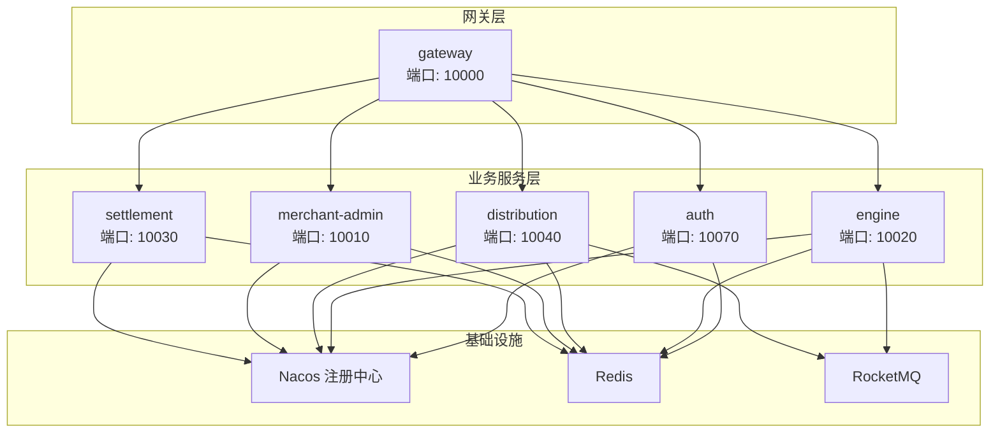
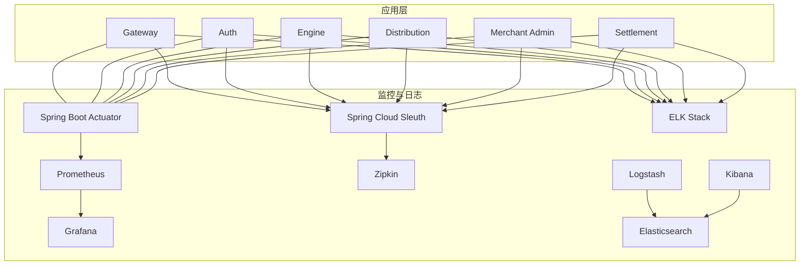
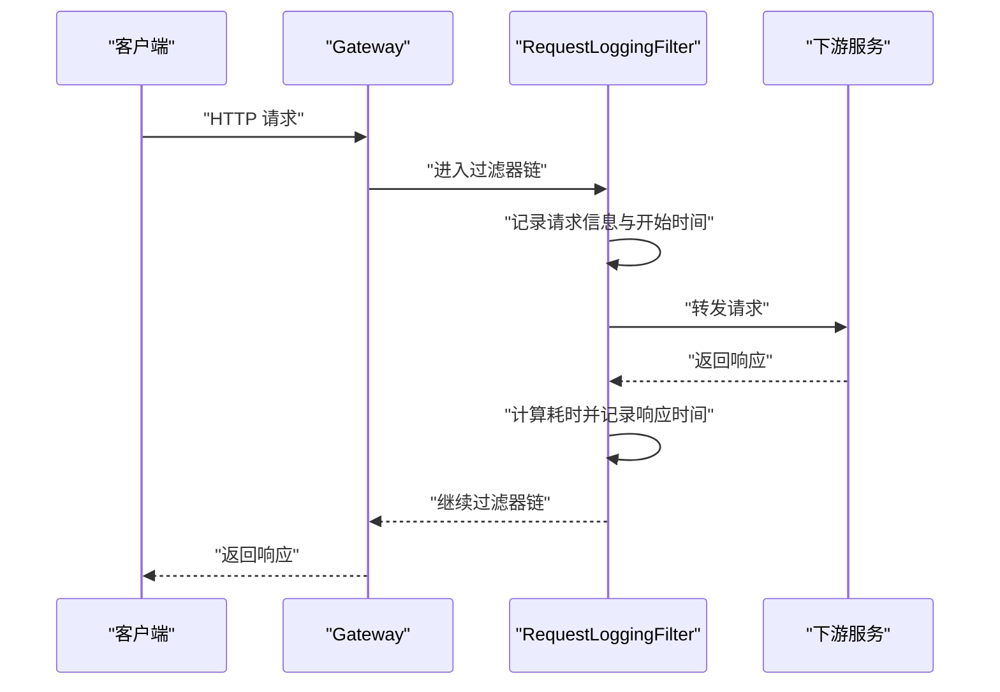
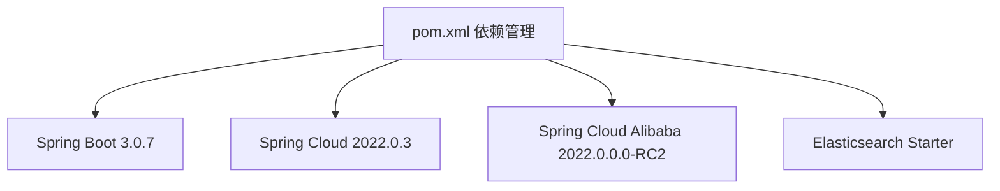

# 监控与日志

<cite>
**本文引用的文件**
- [gateway/src/main/resources/application.yml](file://gateway/src/main/resources/application.yml)
- [gateway/src/test/logback-spring.xml](file://gateway/src/test/logback-spring.xml)
- [gateway/src/main/java/com/fengxin/maplecoupon/gateway/filter/RequestLoggingFilter.java](file://gateway/src/main/java/com/fengxin/maplecoupon/gateway/filter/RequestLoggingFilter.java)
- [auth/src/main/resources/application.yaml](file://auth/src/main/resources/application.yaml)
- [auth/src/main/resources/application-dev.yaml](file://auth/src/main/resources/application-dev.yaml)
- [auth/src/main/resources/application-prod.yaml](file://auth/src/main/resources/application-prod.yaml)
- [engine/src/main/resources/application.yaml](file://engine/src/main/resources/application.yaml)
- [engine/src/main/resources/application-dev.yaml](file://engine/src/main/resources/application-dev.yaml)
- [engine/src/main/resources/application-prod.yaml](file://engine/src/main/resources/application-prod.yaml)
- [distribution/src/main/resources/application.yaml](file://distribution/src/main/resources/application.yaml)
- [distribution/src/main/resources/application-dev.yaml](file://distribution/src/main/resources/application-dev.yaml)
- [distribution/src/main/resources/application-prod.yaml](file://distribution/src/main/resources/application-prod.yaml)
- [merchant-admin/src/main/resources/application.yaml](file://merchant-admin/src/main/resources/application.yaml)
- [settlement/src/main/resources/application.yaml](file://settlement/src/main/resources/application.yaml)
- [pom.xml](file://pom.xml)
</cite>

## 目录
1. [简介](#简介)
2. [项目结构](#项目结构)
3. [核心组件](#核心组件)
4. [架构总览](#架构总览)
5. [详细组件分析](#详细组件分析)
6. [依赖分析](#依赖分析)
7. [性能考虑](#性能考虑)
8. [故障排查指南](#故障排查指南)
9. [结论](#结论)
10. [附录](#附录)

## 简介
本指南面向MapleCoupon微服务架构的监控与日志体系，聚焦以下目标：
- Prometheus监控指标的配置与采集：覆盖JVM指标、业务指标与自定义指标
- Grafana仪表板设计与配置：关键指标图表、告警面板与性能可视化
- ELK日志收集：Logstash配置、Elasticsearch索引管理与Kibana可视化
- 分布式链路追踪：Sleuth集成与Zipkin配置
- APM工具集成：SkyWalking或New Relic的落地方案
- 告警规则、通知渠道与故障自动恢复机制
- 日志聚合、搜索与分析能力实现

当前代码库已具备基础的Spring Boot Actuator暴露端点与日志配置，但未发现显式的Prometheus/Micrometer、Zipkin/Sleuth、ELK或APM集成配置。本指南将基于现有工程结构，给出可落地的实施建议与最佳实践。

## 项目结构
MapleCoupon采用多模块Maven聚合工程，包含网关、认证、引擎、分发、商户后台、结算等模块。每个模块均包含独立的application.yaml与环境配置文件，便于在不同环境中切换（开发/生产）。

图示来源
- [gateway/src/main/resources/application.yml:1-72](file://gateway/src/main/resources/application.yml#L1-L72)
- [auth/src/main/resources/application.yaml:1-19](file://auth/src/main/resources/application.yaml#L1-L19)
- [engine/src/main/resources/application.yaml:1-22](file://engine/src/main/resources/application.yaml#L1-L22)
- [distribution/src/main/resources/application.yaml:1-15](file://distribution/src/main/resources/application.yaml#L1-L15)
- [merchant-admin/src/main/resources/application.yaml:1-27](file://merchant-admin/src/main/resources/application.yaml#L1-L27)
- [settlement/src/main/resources/application.yaml:1-14](file://settlement/src/main/resources/application.yaml#L1-L14)

章节来源
- [gateway/src/main/resources/application.yml:1-72](file://gateway/src/main/resources/application.yml#L1-L72)
- [auth/src/main/resources/application.yaml:1-19](file://auth/src/main/resources/application.yaml#L1-L19)
- [engine/src/main/resources/application.yaml:1-22](file://engine/src/main/resources/application.yaml#L1-L22)
- [distribution/src/main/resources/application.yaml:1-15](file://distribution/src/main/resources/application.yaml#L1-L15)
- [merchant-admin/src/main/resources/application.yaml:1-27](file://merchant-admin/src/main/resources/application.yaml#L1-L27)
- [settlement/src/main/resources/application.yaml:1-14](file://settlement/src/main/resources/application.yaml#L1-L14)

## 核心组件
- 网关层：统一入口，路由到各业务模块；已开启Actuator端点暴露与应用级标签
- 认证、引擎、分发、商户后台、结算：各自独立运行，使用Nacos注册中心与Redis、RocketMQ等中间件
- 日志：网关模块提供基于Logback的滚动日志配置，支持traceId注入

章节来源
- [gateway/src/main/resources/application.yml:65-72](file://gateway/src/main/resources/application.yml#L65-L72)
- [gateway/src/test/logback-spring.xml:1-54](file://gateway/src/test/logback-spring.xml#L1-L54)
- [auth/src/main/resources/application-dev.yaml:1-30](file://auth/src/main/resources/application-dev.yaml#L1-L30)
- [engine/src/main/resources/application-dev.yaml:1-37](file://engine/src/main/resources/application-dev.yaml#L1-L37)
- [distribution/src/main/resources/application-dev.yaml:1-20](file://distribution/src/main/resources/application-dev.yaml#L1-L20)

## 架构总览
下图展示监控与日志在MapleCoupon中的位置与交互关系。当前工程已具备Actuator暴露与日志落盘能力，后续可扩展Prometheus、Zipkin、ELK与APM。

图示来源
- [gateway/src/main/resources/application.yml:65-72](file://gateway/src/main/resources/application.yml#L65-L72)
- [pom.xml:105-181](file://pom.xml#L105-L181)

## 详细组件分析

### 网关层监控与日志
- Actuator端点暴露：已启用全部端点，便于Prometheus抓取指标
- 应用级标签：为所有指标添加application标签，便于区分服务实例
- 请求日志：自定义过滤器记录URI、方法、参数与耗时；测试环境配置了Logback滚动日志，包含traceId字段

图示来源
- [gateway/src/main/resources/application.yml:65-72](file://gateway/src/main/resources/application.yml#L65-L72)
- [gateway/src/main/java/com/fengxin/maplecoupon/gateway/filter/RequestLoggingFilter.java:37-56](file://gateway/src/main/java/com/fengxin/maplecoupon/gateway/filter/RequestLoggingFilter.java#L37-L56)
- [gateway/src/test/logback-spring.xml:1-54](file://gateway/src/test/logback-spring.xml#L1-L54)

章节来源
- [gateway/src/main/resources/application.yml:65-72](file://gateway/src/main/resources/application.yml#L65-L72)
- [gateway/src/main/java/com/fengxin/maplecoupon/gateway/filter/RequestLoggingFilter.java:37-56](file://gateway/src/main/java/com/fengxin/maplecoupon/gateway/filter/RequestLoggingFilter.java#L37-L56)
- [gateway/src/test/logback-spring.xml:1-54](file://gateway/src/test/logback-spring.xml#L1-L54)

### 认证模块
- 应用名称与端口：用于标识服务与暴露指标
- 开发/生产环境配置：包含Nacos注册中心地址、Redis连接信息等

章节来源
- [auth/src/main/resources/application.yaml:1-19](file://auth/src/main/resources/application.yaml#L1-L19)
- [auth/src/main/resources/application-dev.yaml:1-30](file://auth/src/main/resources/application-dev.yaml#L1-L30)
- [auth/src/main/resources/application-prod.yaml:1-12](file://auth/src/main/resources/application-prod.yaml#L1-L12)

### 引擎模块
- RocketMQ生产者组名：区分开发/生产环境消息发送
- Swagger Knife4j：便于接口文档与调试

章节来源
- [engine/src/main/resources/application.yaml:1-22](file://engine/src/main/resources/application.yaml#L1-L22)
- [engine/src/main/resources/application-dev.yaml:1-37](file://engine/src/main/resources/application-dev.yaml#L1-L37)
- [engine/src/main/resources/application-prod.yaml:1-19](file://engine/src/main/resources/application-prod.yaml#L1-L19)

### 分发模块
- RocketMQ生产者组名：区分开发/生产环境消息发送

章节来源
- [distribution/src/main/resources/application.yaml:1-15](file://distribution/src/main/resources/application.yaml#L1-L15)
- [distribution/src/main/resources/application-dev.yaml:1-20](file://distribution/src/main/resources/application-dev.yaml#L1-L20)
- [distribution/src/main/resources/application-prod.yaml:1-20](file://distribution/src/main/resources/application-prod.yaml#L1-L20)

### 商户后台与结算模块
- 应用名称与端口：用于标识服务与暴露指标
- 开发/生产环境配置：包含Nacos注册中心地址、Redis连接信息等

章节来源
- [merchant-admin/src/main/resources/application.yaml:1-27](file://merchant-admin/src/main/resources/application.yaml#L1-L27)
- [settlement/src/main/resources/application.yaml:1-14](file://settlement/src/main/resources/application.yaml#L1-L14)

## 依赖分析
- Spring Boot版本：3.0.7，Spring Cloud版本：2022.0.3，Spring Cloud Alibaba版本：2022.0.0.0-RC2
- 已引入Elasticsearch Spring Boot Starter，具备接入ELK的基础依赖
- 未发现Micrometer、Prometheus、Zipkin、Sleuth、APM相关依赖

图示来源
- [pom.xml:61-181](file://pom.xml#L61-L181)

章节来源
- [pom.xml:61-181](file://pom.xml#L61-L181)

## 性能考虑
- JVM指标采集：通过Actuator暴露JVM内存、线程、GC等指标，结合Prometheus抓取
- 业务指标：建议在关键控制器与服务层增加Counter/Histogram指标，标注服务名与操作类型
- 自定义指标：对核心流程（如库存扣减、优惠券核销）增加计数与耗时指标
- 日志性能：避免在高频路径打印大量结构化日志；使用异步Appender与合理的滚动策略
- 链路追踪：在网关与服务间传递traceId，确保跨服务调用的连贯性

## 故障排查指南
- 端点可用性：确认Actuator端点已暴露，Prometheus可访问
- 日志定位：利用traceId快速定位一次请求在各服务间的流转
- 过滤器链：检查RequestLoggingFilter是否正确记录请求与耗时
- 环境配置：核对开发/生产环境的Nacos、Redis、RocketMQ地址与认证信息

章节来源
- [gateway/src/main/resources/application.yml:65-72](file://gateway/src/main/resources/application.yml#L65-L72)
- [gateway/src/test/logback-spring.xml:1-54](file://gateway/src/test/logback-spring.xml#L1-L54)
- [gateway/src/main/java/com/fengxin/maplecoupon/gateway/filter/RequestLoggingFilter.java:37-56](file://gateway/src/main/java/com/fengxin/maplecoupon/gateway/filter/RequestLoggingFilter.java#L37-L56)

## 结论
当前MapleCoupon已具备监控与日志的基础条件（Actuator与日志配置），但尚未集成Prometheus、Zipkin/Sleuth、ELK或APM。建议按本指南的实施步骤逐步完善，以实现全链路可观测性与高效运维。

## 附录

### Prometheus与Grafana集成建议
- 添加Micrometer与Prometheus依赖，启用Actuator指标暴露
- 配置Prometheus抓取规则，按服务名与实例维度聚合
- 在Grafana中创建仪表板：JVM堆/非堆内存、GC次数与耗时、HTTP请求QPS/延迟、RocketMQ发送/消费速率、业务关键指标（如库存扣减成功/失败）

章节来源
- [gateway/src/main/resources/application.yml:65-72](file://gateway/src/main/resources/application.yml#L65-L72)
- [pom.xml:105-181](file://pom.xml#L105-L181)

### ELK日志收集建议
- 在各模块引入Logstash或Filebeat，统一输出JSON格式日志
- Elasticsearch索引策略：按日滚动，保留90天；为traceId、服务名、级别建立索引模板
- Kibana可视化：构建请求链路视图、错误趋势、慢查询TopN、异常堆栈聚合

章节来源
- [gateway/src/test/logback-spring.xml:1-54](file://gateway/src/test/logback-spring.xml#L1-L54)
- [pom.xml:171-175](file://pom.xml#L171-L175)

### 分布式链路追踪建议
- 引入Spring Cloud Sleuth与Zipkin依赖
- 网关与服务间传递traceId，确保跨服务调用的连贯性
- Zipkin存储可选MySQL或Elasticsearch，按需配置采样率

章节来源
- [pom.xml:71-85](file://pom.xml#L71-L85)

### APM工具集成建议
- SkyWalking：Agent探针+后端OAP+UI，支持自动发现与指标采集
- New Relic：安装Agent，配置应用名与许可证，自动采集JVM与业务指标
- 与Sleuth/Zipkin互为补充，提供更丰富的业务分析视角

章节来源
- [pom.xml:61-181](file://pom.xml#L61-L181)

### 告警规则与通知
- 告警规则：HTTP错误率、P95/P99延迟、GC停顿、队列积压、库存扣减失败率
- 通知渠道：邮件、钉钉、企业微信机器人
- 自动恢复：超时重试、熔断降级、限流与隔离

### 日志聚合、搜索与分析
- 聚合：统一字段标准化（traceId、spanId、服务名、级别、时间戳）
- 搜索：基于关键词、时间范围、服务名、级别进行过滤
- 分析：慢请求TopN、异常堆栈统计、接口成功率与错误分布