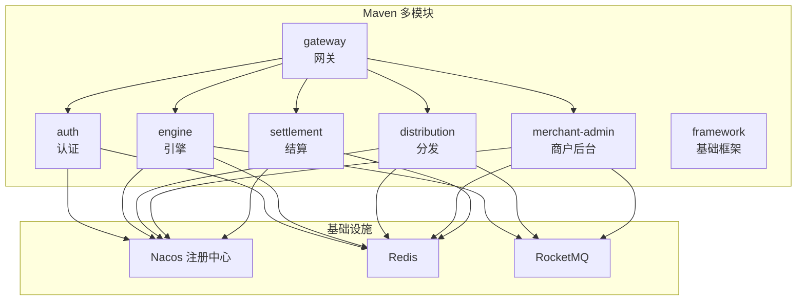
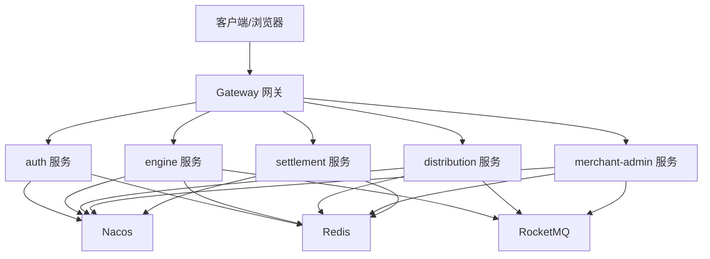
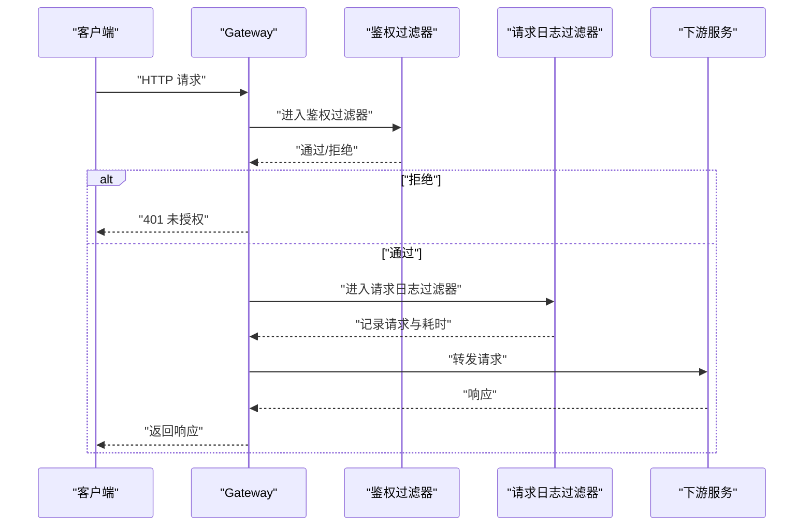
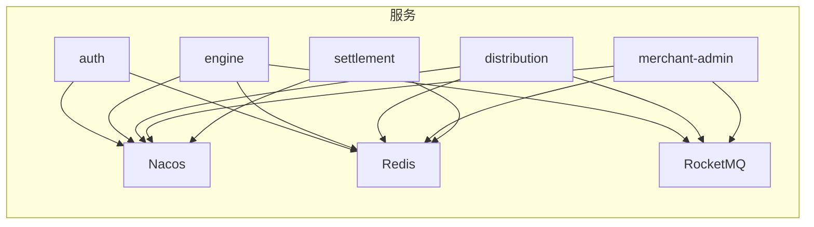

# 部署运维

<cite>
**本文引用的文件**
- [README.md](file://README.md)
- [pom.xml](file://pom.xml)
- [auth 应用生产配置](file://auth/src/main/resources/application-prod.yaml)
- [gateway 应用生产配置](file://gateway/src/main/resources/application-prod.yml)
- [distribution 应用生产配置](file://distribution/src/main/resources/application-prod.yaml)
- [engine 应用生产配置](file://engine/src/main/resources/application-prod.yaml)
- [merchant-admin 应用生产配置](file://merchant-admin/src/main/resources/application-prod.yaml)
- [settlement 应用生产配置](file://settlement/src/main/resources/application-prod.yaml)
- [网关过滤器：Token 校验](file://gateway/src/main/java/com/fengxin/maplecoupon/gateway/filter/TokenValidateGatewayFilterFactory.java)
- [网关过滤器：请求日志](file://gateway/src/main/java/com/fengxin/maplecoupon/gateway/filter/RequestLoggingFilter.java)
- [网关测试日志配置](file://gateway/src/test/logback-spring.xml)
</cite>

## 目录
1. [简介](#简介)
2. [项目结构](#项目结构)
3. [核心组件](#核心组件)
4. [架构总览](#架构总览)
5. [详细组件分析](#详细组件分析)
6. [依赖关系分析](#依赖关系分析)
7. [性能与容量规划](#性能与容量规划)
8. [故障排查与应急响应](#故障排查与应急响应)
9. [安全加固与合规](#安全加固与合规)
10. [结论](#结论)
11. [附录](#附录)

## 简介
本指南面向 MapleCoupon 的部署与运维团队，围绕容器化与 Kubernetes 编排、K8s 资源清单（Deployment/Service/ConfigMap/Secret）、负载均衡与高可用、监控与日志、CI/CD 流水线、性能与容量规划、故障排查与应急响应、安全加固与合规等方面，提供从零到一的落地实践路径。项目采用多模块 Maven 工程，后端基于 Spring Boot 3 + Spring Cloud Alibaba，前端为 Vue 应用，整体技术栈见项目说明。

章节来源
- [README.md:1-10](file://README.md#L1-L10)

## 项目结构
MapleCoupon 为多模块 Maven 工程，包含网关、认证、引擎、分发、商户后台、结算、框架与前端等模块。各模块均提供生产环境配置文件，指向统一的 Nacos 注册中心与中间件（Redis/RocketMQ）。

图表来源
- [pom.xml:17-34](file://pom.xml#L17-L34)
- [auth 应用生产配置:1-12](file://auth/src/main/resources/application-prod.yaml#L1-L12)
- [gateway 应用生产配置:1-11](file://gateway/src/main/resources/application-prod.yml#L1-L11)
- [engine 应用生产配置:1-19](file://engine/src/main/resources/application-prod.yaml#L1-L19)
- [distribution 应用生产配置:1-20](file://distribution/src/main/resources/application-prod.yaml#L1-L20)
- [merchant-admin 应用生产配置:1-21](file://merchant-admin/src/main/resources/application-prod.yaml#L1-L21)
- [settlement 应用生产配置:1-11](file://settlement/src/main/resources/application-prod.yaml#L1-L11)

章节来源
- [pom.xml:17-34](file://pom.xml#L17-L34)
- [README.md:4](file://README.md#L4)

## 核心组件
- 网关（gateway）：统一入口，负责路由、鉴权、日志与限流等。
- 认证（auth）：用户登录注册、上下文传递与拦截器。
- 引擎（engine）：优惠券模板与用户优惠券核心能力，含 MQ 消费与事件处理。
- 分发（distribution）：按批次分发优惠券，MQ 生产与 Excel 导入。
- 商户后台（merchant-admin）：优惠券模板管理、任务调度与日志记录。
- 结算（settlement）：查询与结算相关接口。
- 基础框架（framework）：全局异常、幂等、Web 配置与自动装配。

章节来源
- [pom.xml:17-34](file://pom.xml#L17-L34)

## 架构总览
下图展示服务发现、注册与调用关系，以及 Redis 与 RocketMQ 的依赖。

图表来源
- [gateway 应用生产配置:1-11](file://gateway/src/main/resources/application-prod.yml#L1-L11)
- [auth 应用生产配置:1-12](file://auth/src/main/resources/application-prod.yaml#L1-L12)
- [engine 应用生产配置:1-19](file://engine/src/main/resources/application-prod.yaml#L1-L19)
- [distribution 应用生产配置:1-20](file://distribution/src/main/resources/application-prod.yaml#L1-L20)
- [merchant-admin 应用生产配置:1-21](file://merchant-admin/src/main/resources/application-prod.yaml#L1-L21)
- [settlement 应用生产配置:1-11](file://settlement/src/main/resources/application-prod.yaml#L1-L11)

## 详细组件分析

### 网关组件（Gateway）
- 职责：统一入口、鉴权、请求日志、路由转发。
- 关键点：
  - 鉴权过滤器对白名单路径放行，其余请求校验失败直接返回未授权。
  - 请求日志过滤器记录 URI、方法、头、参数与耗时。
  - 日志落盘路径与滚动策略在测试配置中可见，生产可按需映射卷。

图表来源
- [网关过滤器：Token 校验:76-93](file://gateway/src/main/java/com/fengxin/maplecoupon/gateway/filter/TokenValidateGatewayFilterFactory.java#L76-L93)
- [网关过滤器：请求日志:37-56](file://gateway/src/main/java/com/fengxin/maplecoupon/gateway/filter/RequestLoggingFilter.java#L37-L56)
- [网关测试日志配置:1-54](file://gateway/src/test/logback-spring.xml#L1-L54)

章节来源
- [网关过滤器：Token 校验:76-93](file://gateway/src/main/java/com/fengxin/maplecoupon/gateway/filter/TokenValidateGatewayFilterFactory.java#L76-L93)
- [网关过滤器：请求日志:37-56](file://gateway/src/main/java/com/fengxin/maplecoupon/gateway/filter/RequestLoggingFilter.java#L37-L56)
- [网关测试日志配置:1-54](file://gateway/src/test/logback-spring.xml#L1-L54)

### 认证组件（Auth）
- 职责：用户认证、上下文传递、拦截器。
- 配置要点：生产环境连接 Nacos 与 Redis，数据库配置位于对应模块资源目录。

章节来源
- [auth 应用生产配置:1-12](file://auth/src/main/resources/application-prod.yaml#L1-L12)

### 引擎组件（Engine）
- 职责：优惠券模板与用户优惠券核心逻辑，含 MQ 事件与延迟任务。
- 配置要点：生产环境连接 Nacos、Redis 与 RocketMQ。

章节来源
- [engine 应用生产配置:1-19](file://engine/src/main/resources/application-prod.yaml#L1-L19)

### 分发组件（Distribution）
- 职责：按批次分发优惠券，Excel 导入与 MQ 事件。
- 配置要点：生产环境连接 Nacos、Redis 与 RocketMQ。

章节来源
- [distribution 应用生产配置:1-20](file://distribution/src/main/resources/application-prod.yaml#L1-L20)

### 商户后台组件（Merchant Admin）
- 职责：优惠券模板管理、任务调度与日志记录。
- 配置要点：生产环境连接 Nacos、Redis 与 RocketMQ。

章节来源
- [merchant-admin 应用生产配置:1-21](file://merchant-admin/src/main/resources/application-prod.yaml#L1-L21)

### 结算组件（Settlement）
- 职责：查询与结算相关接口。
- 配置要点：生产环境连接 Nacos 与 Redis。

章节来源
- [settlement 应用生产配置:1-11](file://settlement/src/main/resources/application-prod.yaml#L1-L11)

## 依赖关系分析
- 服务发现：所有服务通过 Nacos 注册与发现。
- 中间件：
  - Redis：用于缓存、分布式锁与会话存储。
  - RocketMQ：异步解耦与事件驱动。
- 数据库：模块内包含 ShardingSphere 配置文件，表明存在分库分表策略。

图表来源
- [auth 应用生产配置:1-12](file://auth/src/main/resources/application-prod.yaml#L1-L12)
- [engine 应用生产配置:1-19](file://engine/src/main/resources/application-prod.yaml#L1-L19)
- [distribution 应用生产配置:1-20](file://distribution/src/main/resources/application-prod.yaml#L1-L20)
- [merchant-admin 应用生产配置:1-21](file://merchant-admin/src/main/resources/application-prod.yaml#L1-L21)
- [settlement 应用生产配置:1-11](file://settlement/src/main/resources/application-prod.yaml#L1-L11)

章节来源
- [auth 应用生产配置:1-12](file://auth/src/main/resources/application-prod.yaml#L1-L12)
- [engine 应用生产配置:1-19](file://engine/src/main/resources/application-prod.yaml#L1-L19)
- [distribution 应用生产配置:1-20](file://distribution/src/main/resources/application-prod.yaml#L1-L20)
- [merchant-admin 应用生产配置:1-21](file://merchant-admin/src/main/resources/application-prod.yaml#L1-L21)
- [settlement 应用生产配置:1-11](file://settlement/src/main/resources/application-prod.yaml#L1-L11)

## 性能与容量规划
- 指标建议：
  - CPU/内存使用率、GC 次数与停顿时间、请求延迟与 P95/P99、错误率、Redis 命中率、MQ 延迟与堆积。
  - 网关层面：QPS、路由命中率、鉴权失败率、下游超时与熔断次数。
- 规划方法：
  - 基于历史峰值与增长趋势设定基线；结合限流/熔断阈值进行压测验证。
  - 对热点接口（如优惠券核销、分发）进行专项压测，识别瓶颈（数据库/缓存/MQ）。
- 预警机制：
  - 设置多级阈值与静默窗口，区分偶发抖动与真实风险；联动告警平台与值班群。

## 故障排查与应急响应
- 快速定位：
  - 优先查看网关层日志与链路追踪，确认请求是否到达目标服务。
  - 检查 Redis 连接与键空间状态，关注过期与淘汰策略。
  - 检查 RocketMQ 消费位点与堆积情况，必要时隔离消费组。
- 应急处置：
  - 临时降级非核心接口；切换到只读数据库或缓存直通。
  - 回滚最近变更；启用备用中间件实例。
- 文档化：
  - 记录故障现象、根因、处置步骤与恢复时间，沉淀 SLO/SLA。

章节来源
- [网关过滤器：请求日志:37-56](file://gateway/src/main/java/com/fengxin/maplecoupon/gateway/filter/RequestLoggingFilter.java#L37-L56)
- [网关测试日志配置:1-54](file://gateway/src/test/logback-spring.xml#L1-L54)

## 安全加固与合规
- 认证与授权：
  - 网关层统一鉴权，白名单路径最小化；令牌失效与刷新策略明确。
- 传输与存储：
  - 所有服务间通信建议启用 TLS；敏感配置放入 Secret。
- 防护措施：
  - 限流/熔断/降级策略；输入校验与参数净化；审计日志保留周期符合合规要求。
- 合规要求：
  - 明确数据留存与删除策略；定期进行安全扫描与渗透测试。

章节来源
- [网关过滤器：Token 校验:76-93](file://gateway/src/main/java/com/fengxin/maplecoupon/gateway/filter/TokenValidateGatewayFilterFactory.java#L76-L93)

## 结论
本指南提供了从容器化到 K8s 编排、从监控日志到 CI/CD、从性能容量到安全合规的全栈运维方案。建议以模块为单位逐步落地，先完成网关与核心服务的容器化与注册发现，再扩展至分发与商户后台，最终形成可复制的标准化流水线与应急预案。

## 附录

### 容器化与 Kubernetes 部署（建议流程）
- Docker 镜像构建：
  - 使用 Maven 插件打包生成可执行 JAR，基于官方 JDK 基础镜像构建镜像，暴露健康检查端口。
- 集群管理：
  - 使用 Deployment 管理副本与滚动升级；Service 提供稳定网络接入；ConfigMap/Secret 管理配置与密钥。
- 高可用：
  - 多副本部署 + 健康检查探针；持久化日志挂载；Redis 与 RocketMQ 使用高可用实例。
- 负载均衡：
  - Ingress/NLB 暴露服务；网关层做路由与鉴权；服务间通过 Nacos 自动发现。

### 监控与日志（建议方案）
- Prometheus + Grafana：采集 JVM 指标与业务指标，建立仪表板与告警规则。
- ELK：集中收集网关与服务日志，支持检索与可视化。
- 链路追踪：结合业务埋点与统一日志格式，定位慢调用与异常。

### CI/CD 流水线（建议步骤）
- 触发条件：代码合并主分支或打标签。
- 步骤：代码检出 → 单元测试 → 构建镜像 → 推送仓库 → 应用发布（灰度/蓝绿） → 健康检查 → 回滚策略。