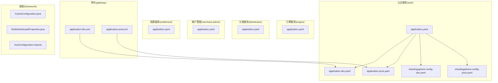
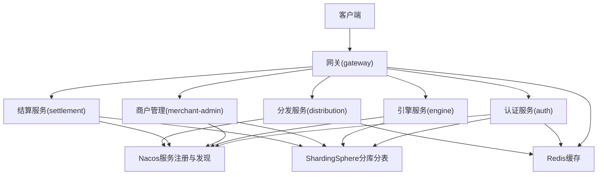
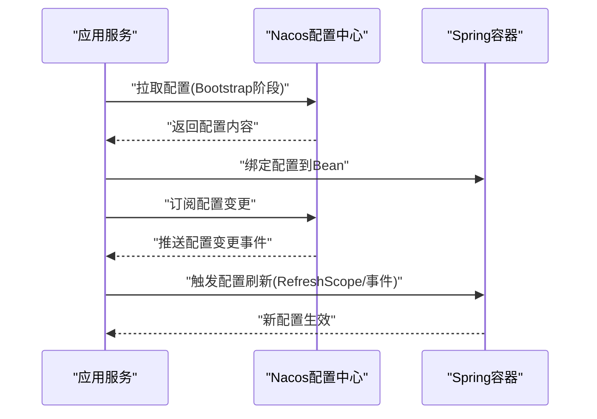
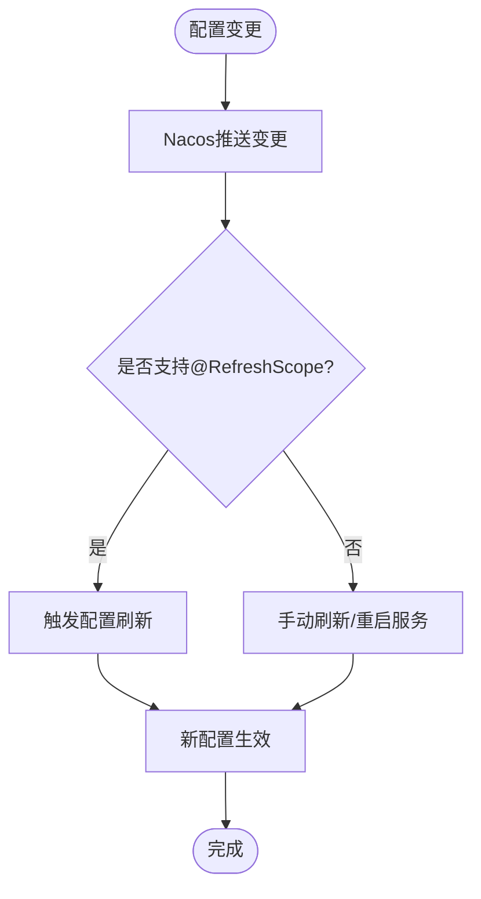
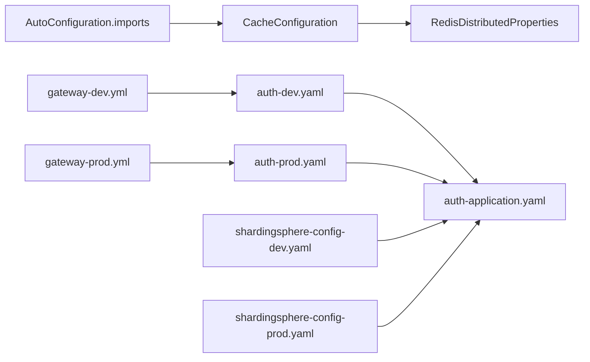

# 分布式配置

<cite>
**本文引用的文件**
- [application.yaml（认证服务）](file://auth/src/main/resources/application.yaml)
- [application-dev.yaml（认证服务）](file://auth/src/main/resources/application-dev.yaml)
- [application-prod.yaml（认证服务）](file://auth/src/main/resources/application-prod.yaml)
- [shardingsphere-config-dev.yaml（认证服务）](file://auth/src/main/resources/shardingsphere-config-dev.yaml)
- [shardingsphere-config-prod.yaml（认证服务）](file://auth/src/main/resources/shardingsphere-config-prod.yaml)
- [application.yaml（引擎服务）](file://engine/src/main/resources/application.yaml)
- [application.yaml（分发服务）](file://distribution/src/main/resources/application.yaml)
- [application-dev.yml（网关）](file://gateway/src/main/resources/application-dev.yml)
- [application-prod.yml（网关）](file://gateway/src/main/resources/application-prod.yml)
- [application.yaml（商户管理）](file://merchant-admin/src/main/resources/application.yaml)
- [application.yaml（结算服务）](file://settlement/src/main/resources/application.yaml)
- [CacheConfiguration.java（框架）](file://framework/src/main/java/com/fengxin/config/CacheConfiguration.java)
- [RedisDistributedProperties.java（框架）](file://framework/src/main/java/com/fengxin/config/RedisDistributedProperties.java)
- [org.springframework.boot.autoconfigure.AutoConfiguration.imports](file://framework/src/main/resources/META-INF/spring/org.springframework.boot.autoconfigure.AutoConfiguration.imports)
</cite>

## 目录
1. [简介](#简介)
2. [项目结构](#项目结构)
3. [核心组件](#核心组件)
4. [架构总览](#架构总览)
5. [详细组件分析](#详细组件分析)
6. [依赖关系分析](#依赖关系分析)
7. [性能考量](#性能考量)
8. [故障排查指南](#故障排查指南)
9. [结论](#结论)
10. [附录](#附录)

## 简介
本文件面向MapleCoupon分布式配置与配置中心集成，聚焦以下目标：
- 解释Nacos配置中心在各子服务中的配置与使用方式
- 说明配置的动态更新与热部署机制（通知与刷新策略）
- 阐述Spring Cloud Config在本项目中的适用性与最佳实践
- 提供配置文件的版本管理与变更审计机制的实现思路
- 说明配置的加密存储与敏感信息保护策略
- 介绍配置的分组管理与命名空间使用
- 给出配置的健康检查与故障恢复机制
- 说明配置的权限控制与访问安全管理
- 提供配置的备份与恢复策略

注意：当前仓库中未发现Spring Cloud Config相关依赖与配置；Nacos配置中心用于服务注册与发现，未见其作为配置中心的集中下发能力。本文将基于现有配置文件与框架组件，给出可落地的集成建议与实施路径。

## 项目结构
MapleCoupon采用多模块微服务架构，每个子服务均包含独立的Spring Boot配置文件，按环境区分（dev/prod），并通过Nacos进行服务注册与发现。分库分表规则由ShardingSphere配置文件统一管理。

**图表来源**
- [application.yaml（认证服务）:1-19](file://auth/src/main/resources/application.yaml#L1-L19)
- [application-dev.yaml（认证服务）:1-30](file://auth/src/main/resources/application-dev.yaml#L1-L30)
- [application-prod.yaml（认证服务）:1-12](file://auth/src/main/resources/application-prod.yaml#L1-L12)
- [shardingsphere-config-dev.yaml（认证服务）:1-45](file://auth/src/main/resources/shardingsphere-config-dev.yaml#L1-L45)
- [shardingsphere-config-prod.yaml（认证服务）:1-45](file://auth/src/main/resources/shardingsphere-config-prod.yaml#L1-L45)
- [application.yaml（引擎服务）:1-22](file://engine/src/main/resources/application.yaml#L1-L22)
- [application.yaml（分发服务）:1-15](file://distribution/src/main/resources/application.yaml#L1-L15)
- [application.yaml（商户管理）:1-27](file://merchant-admin/src/main/resources/application.yaml#L1-L27)
- [application.yaml（结算服务）:1-14](file://settlement/src/main/resources/application.yaml#L1-L14)
- [application-dev.yml（网关）:1-11](file://gateway/src/main/resources/application-dev.yml#L1-L11)
- [application-prod.yml（网关）:1-11](file://gateway/src/main/resources/application-prod.yml#L1-L11)
- [CacheConfiguration.java（框架）:1-35](file://framework/src/main/java/com/fengxin/config/CacheConfiguration.java#L1-L35)
- [RedisDistributedProperties.java（框架）:1-24](file://framework/src/main/java/com/fengxin/config/RedisDistributedProperties.java#L1-L24)
- [org.springframework.boot.autoconfigure.AutoConfiguration.imports:1-3](file://framework/src/main/resources/META-INF/spring/org.springframework.boot.autoconfigure.AutoConfiguration.imports#L1-L3)

**章节来源**
- [application.yaml（认证服务）:1-19](file://auth/src/main/resources/application.yaml#L1-L19)
- [application-dev.yaml（认证服务）:1-30](file://auth/src/main/resources/application-dev.yaml#L1-L30)
- [application-prod.yaml（认证服务）:1-12](file://auth/src/main/resources/application-prod.yaml#L1-L12)
- [shardingsphere-config-dev.yaml（认证服务）:1-45](file://auth/src/main/resources/shardingsphere-config-dev.yaml#L1-L45)
- [shardingsphere-config-prod.yaml（认证服务）:1-45](file://auth/src/main/resources/shardingsphere-config-prod.yaml#L1-L45)
- [application.yaml（引擎服务）:1-22](file://engine/src/main/resources/application.yaml#L1-L22)
- [application.yaml（分发服务）:1-15](file://distribution/src/main/resources/application.yaml#L1-L15)
- [application.yaml（商户管理）:1-27](file://merchant-admin/src/main/resources/application.yaml#L1-L27)
- [application.yaml（结算服务）:1-14](file://settlement/src/main/resources/application.yaml#L1-L14)
- [application-dev.yml（网关）:1-11](file://gateway/src/main/resources/application-dev.yml#L1-L11)
- [application-prod.yml（网关）:1-11](file://gateway/src/main/resources/application-prod.yml#L1-L11)
- [CacheConfiguration.java（框架）:1-35](file://framework/src/main/java/com/fengxin/config/CacheConfiguration.java#L1-L35)
- [RedisDistributedProperties.java（框架）:1-24](file://framework/src/main/java/com/fengxin/config/RedisDistributedProperties.java#L1-L24)
- [org.springframework.boot.autoconfigure.AutoConfiguration.imports:1-3](file://framework/src/main/resources/META-INF/spring/org.springframework.boot.autoconfigure.AutoConfiguration.imports#L1-L3)

## 核心组件
- Nacos服务注册与发现：各服务通过Nacos完成服务发现与路由转发，网关根据路由规则将请求转发至下游服务。
- ShardingSphere分库分表：通过独立的YAML配置文件定义数据源与分片规则，服务启动时加载对应环境配置。
- Redis缓存与序列化：框架层提供RedisKeySerializer与RedisDistributedProperties，统一Key前缀与序列化策略。
- 环境隔离：各服务提供application-dev.yaml与application-prod.yaml，实现开发与生产环境的差异化配置。

**章节来源**
- [application.yaml（认证服务）:1-19](file://auth/src/main/resources/application.yaml#L1-L19)
- [application-dev.yaml（认证服务）:1-30](file://auth/src/main/resources/application-dev.yaml#L1-L30)
- [application-prod.yaml（认证服务）:1-12](file://auth/src/main/resources/application-prod.yaml#L1-L12)
- [shardingsphere-config-dev.yaml（认证服务）:1-45](file://auth/src/main/resources/shardingsphere-config-dev.yaml#L1-L45)
- [shardingsphere-config-prod.yaml（认证服务）:1-45](file://auth/src/main/resources/shardingsphere-config-prod.yaml#L1-L45)
- [application-dev.yml（网关）:1-11](file://gateway/src/main/resources/application-dev.yml#L1-L11)
- [application-prod.yml（网关）:1-11](file://gateway/src/main/resources/application-prod.yml#L1-L11)
- [CacheConfiguration.java（框架）:1-35](file://framework/src/main/java/com/fengxin/config/CacheConfiguration.java#L1-L35)
- [RedisDistributedProperties.java（框架）:1-24](file://framework/src/main/java/com/fengxin/config/RedisDistributedProperties.java#L1-L24)

## 架构总览
下图展示了MapleCoupon的配置与服务发现关系：各子服务在不同环境下加载对应的配置文件，并通过Nacos完成服务注册与发现；网关负责路由与鉴权过滤；Redis用于缓存与分布式锁；ShardingSphere负责分库分表。

**图表来源**
- [application-dev.yml（网关）:1-11](file://gateway/src/main/resources/application-dev.yml#L1-L11)
- [application-prod.yml（网关）:1-11](file://gateway/src/main/resources/application-prod.yml#L1-L11)
- [application.yaml（认证服务）:1-19](file://auth/src/main/resources/application.yaml#L1-L19)
- [application.yaml（引擎服务）:1-22](file://engine/src/main/resources/application.yaml#L1-L22)
- [application.yaml（商户管理）:1-27](file://merchant-admin/src/main/resources/application.yaml#L1-L27)
- [application.yaml（结算服务）:1-14](file://settlement/src/main/resources/application.yaml#L1-L14)
- [application.yaml（分发服务）:1-15](file://distribution/src/main/resources/application.yaml#L1-L15)

## 详细组件分析

### Nacos配置中心集成方案
- 当前仓库中，Nacos仅用于服务注册与发现，未见其作为配置中心的集中下发能力。服务通过application-dev.yaml与application-prod.yaml加载Nacos地址与Redis连接参数。
- 若需引入Nacos配置中心进行集中配置管理，建议：
  - 在各服务引入Nacos Config依赖与Bootstrap阶段配置
  - 将敏感配置移出本地YAML，迁移到Nacos Config
  - 使用命名空间与分组进行环境与业务隔离
  - 结合配置监听与刷新策略，实现动态配置生效

**图表来源**
- [application-dev.yaml（认证服务）:1-30](file://auth/src/main/resources/application-dev.yaml#L1-L30)
- [application-prod.yaml（认证服务）:1-12](file://auth/src/main/resources/application-prod.yaml#L1-L12)
- [application-dev.yml（网关）:1-11](file://gateway/src/main/resources/application-dev.yml#L1-L11)
- [application-prod.yml（网关）:1-11](file://gateway/src/main/resources/application-prod.yml#L1-L11)

**章节来源**
- [application-dev.yaml（认证服务）:1-30](file://auth/src/main/resources/application-dev.yaml#L1-L30)
- [application-prod.yaml（认证服务）:1-12](file://auth/src/main/resources/application-prod.yaml#L1-L12)
- [application-dev.yml（网关）:1-11](file://gateway/src/main/resources/application-dev.yml#L1-L11)
- [application-prod.yml（网关）:1-11](file://gateway/src/main/resources/application-prod.yml#L1-L11)

### 配置的动态更新与热部署机制
- 当前项目未实现配置的自动刷新与热部署。建议：
  - 引入Nacos Config后，使用@RefreshScope注解或事件监听机制触发配置刷新
  - 对于非@RefreshScope的Bean，可通过事件监听手动刷新或重启服务
  - 对关键配置（如限流、开关、阈值）采用可热更新的策略

**图表来源**
- [application-dev.yaml（认证服务）:1-30](file://auth/src/main/resources/application-dev.yaml#L1-L30)
- [application-prod.yaml（认证服务）:1-12](file://auth/src/main/resources/application-prod.yaml#L1-L12)

**章节来源**
- [application-dev.yaml（认证服务）:1-30](file://auth/src/main/resources/application-dev.yaml#L1-L30)
- [application-prod.yaml（认证服务）:1-12](file://auth/src/main/resources/application-prod.yaml#L1-L12)

### Spring Cloud Config使用方法与最佳实践
- 本项目未包含Spring Cloud Config相关依赖与配置。若引入，建议：
  - 使用bootstrap阶段加载Config Server地址与命名空间
  - 将敏感配置迁移至Config Server，避免硬编码
  - 使用Git后端管理配置版本，结合分支与标签实现版本控制
  - 配置加密与访问控制，确保配置传输与存储安全

**章节来源**
- [org.springframework.boot.autoconfigure.AutoConfiguration.imports:1-3](file://framework/src/main/resources/META-INF/spring/org.springframework.boot.autoconfigure.AutoConfiguration.imports#L1-L3)

### 配置文件的版本管理与变更审计
- 版本管理：建议将配置文件纳入Git管理，使用分支与标签标记版本；对生产配置采用只读分支与受控合并。
- 变更审计：在Config Server侧启用变更审计日志，记录谁在何时修改了哪些配置项；对敏感配置变更增加审批流程。

**章节来源**
- [application.yaml（认证服务）:1-19](file://auth/src/main/resources/application.yaml#L1-L19)
- [application.yaml（引擎服务）:1-22](file://engine/src/main/resources/application.yaml#L1-L22)
- [application.yaml（分发服务）:1-15](file://distribution/src/main/resources/application.yaml#L1-L15)
- [application.yaml（商户管理）:1-27](file://merchant-admin/src/main/resources/application.yaml#L1-L27)
- [application.yaml（结算服务）:1-14](file://settlement/src/main/resources/application.yaml#L1-L14)

### 配置的加密存储与敏感信息保护
- 敏感信息：当前仓库中存在明文密码示例（开发环境）。建议：
  - 使用Config Server或Nacos的加密功能对密码、Token等敏感字段加密
  - 在CI/CD中使用密钥管理服务（KMS）注入密文，应用启动时解密
  - 对Redis、数据库连接串进行加密存储，避免泄露

**章节来源**
- [application-dev.yaml（认证服务）:1-30](file://auth/src/main/resources/application-dev.yaml#L1-L30)
- [application-prod.yaml（认证服务）:1-12](file://auth/src/main/resources/application-prod.yaml#L1-L12)
- [shardingsphere-config-dev.yaml（认证服务）:1-45](file://auth/src/main/resources/shardingsphere-config-dev.yaml#L1-L45)
- [shardingsphere-config-prod.yaml（认证服务）:1-45](file://auth/src/main/resources/shardingsphere-config-prod.yaml#L1-L45)

### 配置的分组管理与命名空间
- 建议：
  - 使用命名空间区分环境（dev、prod、uat）
  - 使用分组区分业务域（auth、engine、gateway等）
  - 对共享配置（如Redis、Nacos地址）放在公共命名空间或默认分组

**章节来源**
- [application-dev.yaml（认证服务）:1-30](file://auth/src/main/resources/application-dev.yaml#L1-L30)
- [application-prod.yaml（认证服务）:1-12](file://auth/src/main/resources/application-prod.yaml#L1-L12)
- [application-dev.yml（网关）:1-11](file://gateway/src/main/resources/application-dev.yml#L1-L11)
- [application-prod.yml（网关）:1-11](file://gateway/src/main/resources/application-prod.yml#L1-L11)

### 健康检查与故障恢复机制
- 健康检查：通过Actuator暴露健康端点，监控Nacos连接、Redis连接、数据库连接状态。
- 故障恢复：当配置中心不可用时，应用应具备降级策略（使用本地默认配置或只读模式），并在恢复后自动切换。

**章节来源**
- [application.yaml（认证服务）:1-19](file://auth/src/main/resources/application.yaml#L1-L19)
- [application.yaml（引擎服务）:1-22](file://engine/src/main/resources/application.yaml#L1-L22)
- [application.yaml（分发服务）:1-15](file://distribution/src/main/resources/application.yaml#L1-L15)
- [application.yaml（商户管理）:1-27](file://merchant-admin/src/main/resources/application.yaml#L1-L27)
- [application.yaml（结算服务）:1-14](file://settlement/src/main/resources/application.yaml#L1-L14)

### 权限控制与访问安全管理
- 访问控制：在Nacos侧开启鉴权，限制对配置的读写权限；对Config Server设置白名单与IP限制。
- 审计日志：记录配置变更操作，防止越权与误操作。

**章节来源**
- [application-dev.yaml（认证服务）:1-30](file://auth/src/main/resources/application-dev.yaml#L1-L30)
- [application-prod.yaml（认证服务）:1-12](file://auth/src/main/resources/application-prod.yaml#L1-L12)

### 备份与恢复策略
- 备份：定期导出Config Server或Nacos中的配置快照；对Git中的配置文件进行归档。
- 恢复：发生灾难时，从最近快照恢复配置；验证配置正确后再切换流量。

**章节来源**
- [application.yaml（认证服务）:1-19](file://auth/src/main/resources/application.yaml#L1-L19)
- [application.yaml（引擎服务）:1-22](file://engine/src/main/resources/application.yaml#L1-L22)
- [application.yaml（分发服务）:1-15](file://distribution/src/main/resources/application.yaml#L1-L15)
- [application.yaml（商户管理）:1-27](file://merchant-admin/src/main/resources/application.yaml#L1-L27)
- [application.yaml（结算服务）:1-14](file://settlement/src/main/resources/application.yaml#L1-L14)

## 依赖关系分析
- 框架层通过AutoConfiguration自动装配缓存配置，统一Redis Key序列化策略。
- 各服务通过application-dev.yaml与application-prod.yaml加载Nacos与Redis配置，实现环境隔离。
- ShardingSphere配置文件独立于服务配置，按环境选择加载。

**图表来源**
- [org.springframework.boot.autoconfigure.AutoConfiguration.imports:1-3](file://framework/src/main/resources/META-INF/spring/org.springframework.boot.autoconfigure.AutoConfiguration.imports#L1-L3)
- [CacheConfiguration.java（框架）:1-35](file://framework/src/main/java/com/fengxin/config/CacheConfiguration.java#L1-L35)
- [RedisDistributedProperties.java（框架）:1-24](file://framework/src/main/java/com/fengxin/config/RedisDistributedProperties.java#L1-L24)
- [application.yaml（认证服务）:1-19](file://auth/src/main/resources/application.yaml#L1-L19)
- [application-dev.yaml（认证服务）:1-30](file://auth/src/main/resources/application-dev.yaml#L1-L30)
- [application-prod.yaml（认证服务）:1-12](file://auth/src/main/resources/application-prod.yaml#L1-L12)
- [shardingsphere-config-dev.yaml（认证服务）:1-45](file://auth/src/main/resources/shardingsphere-config-dev.yaml#L1-L45)
- [shardingsphere-config-prod.yaml（认证服务）:1-45](file://auth/src/main/resources/shardingsphere-config-prod.yaml#L1-L45)
- [application-dev.yml（网关）:1-11](file://gateway/src/main/resources/application-dev.yml#L1-L11)
- [application-prod.yml（网关）:1-11](file://gateway/src/main/resources/application-prod.yml#L1-L11)

**章节来源**
- [org.springframework.boot.autoconfigure.AutoConfiguration.imports:1-3](file://framework/src/main/resources/META-INF/spring/org.springframework.boot.autoconfigure.AutoConfiguration.imports#L1-L3)
- [CacheConfiguration.java（框架）:1-35](file://framework/src/main/java/com/fengxin/config/CacheConfiguration.java#L1-L35)
- [RedisDistributedProperties.java（框架）:1-24](file://framework/src/main/java/com/fengxin/config/RedisDistributedProperties.java#L1-L24)
- [application.yaml（认证服务）:1-19](file://auth/src/main/resources/application.yaml#L1-L19)
- [application-dev.yaml（认证服务）:1-30](file://auth/src/main/resources/application-dev.yaml#L1-L30)
- [application-prod.yaml（认证服务）:1-12](file://auth/src/main/resources/application-prod.yaml#L1-L12)
- [shardingsphere-config-dev.yaml（认证服务）:1-45](file://auth/src/main/resources/shardingsphere-config-dev.yaml#L1-L45)
- [shardingsphere-config-prod.yaml（认证服务）:1-45](file://auth/src/main/resources/shardingsphere-config-prod.yaml#L1-L45)
- [application-dev.yml（网关）:1-11](file://gateway/src/main/resources/application-dev.yml#L1-L11)
- [application-prod.yml（网关）:1-11](file://gateway/src/main/resources/application-prod.yml#L1-L11)

## 性能考量
- 配置加载：将静态配置与动态配置分离，减少启动时长；对大体量配置采用懒加载或按需加载。
- 缓存策略：利用Redis缓存热点配置，降低配置中心压力；对频繁变更的配置设置合理的TTL。
- 并发与一致性：在高并发场景下，确保配置刷新的幂等性与一致性，避免“抖动”。

## 故障排查指南
- Nacos连接失败：检查Nacos地址与网络连通性；确认服务名与命名空间配置一致。
- Redis连接异常：核对host/port/password/database；检查防火墙与账号权限。
- ShardingSphere加载失败：确认数据源URL、用户名、密码与分片规则；检查SQL日志定位问题。
- 配置不生效：确认配置文件加载顺序与覆盖关系；检查@RefreshScope与事件监听是否正确配置。

**章节来源**
- [application-dev.yaml（认证服务）:1-30](file://auth/src/main/resources/application-dev.yaml#L1-L30)
- [application-prod.yaml（认证服务）:1-12](file://auth/src/main/resources/application-prod.yaml#L1-L12)
- [shardingsphere-config-dev.yaml（认证服务）:1-45](file://auth/src/main/resources/shardingsphere-config-dev.yaml#L1-L45)
- [shardingsphere-config-prod.yaml（认证服务）:1-45](file://auth/src/main/resources/shardingsphere-config-prod.yaml#L1-L45)

## 结论
- 当前MapleCoupon已具备基于Nacos的服务注册与发现能力，但未实现集中式配置中心的动态下发与热部署。
- 建议引入Nacos Config或Spring Cloud Config，结合命名空间与分组实现环境与业务隔离；完善配置加密、版本管理与审计机制；建立健康检查与故障恢复策略，确保配置系统的高可用与安全性。

## 附录
- 环境变量与配置映射建议：
  - database.env：决定ShardingSphere配置文件加载（dev/prod）
  - spring.profiles.active：决定应用加载的配置文件（dev/prod）

**章节来源**
- [application.yaml（认证服务）:1-19](file://auth/src/main/resources/application.yaml#L1-L19)
- [application.yaml（引擎服务）:1-22](file://engine/src/main/resources/application.yaml#L1-L22)
- [application.yaml（分发服务）:1-15](file://distribution/src/main/resources/application.yaml#L1-L15)
- [application.yaml（商户管理）:1-27](file://merchant-admin/src/main/resources/application.yaml#L1-L27)
- [application.yaml（结算服务）:1-14](file://settlement/src/main/resources/application.yaml#L1-L14)