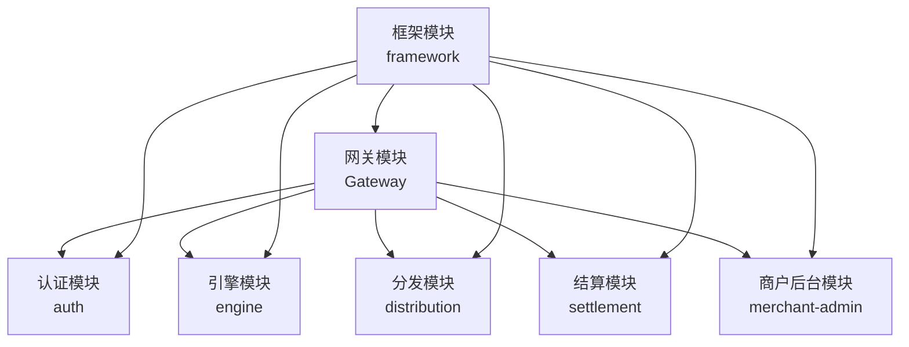
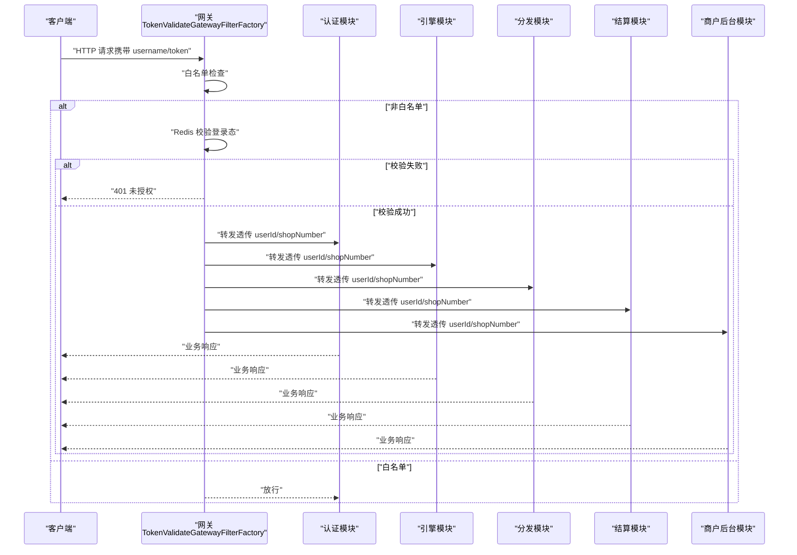
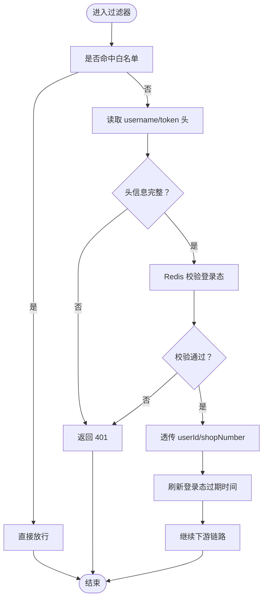
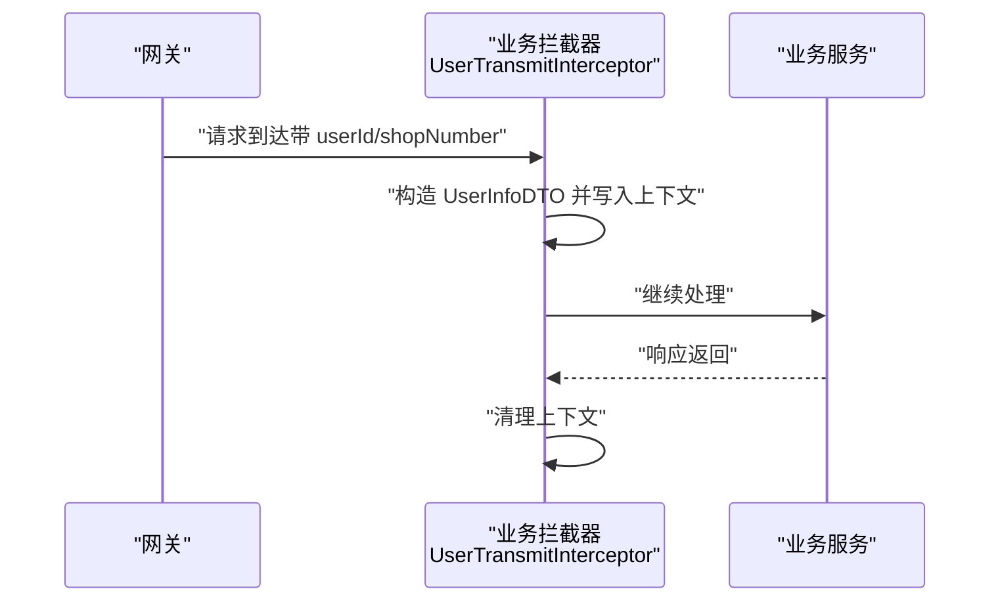
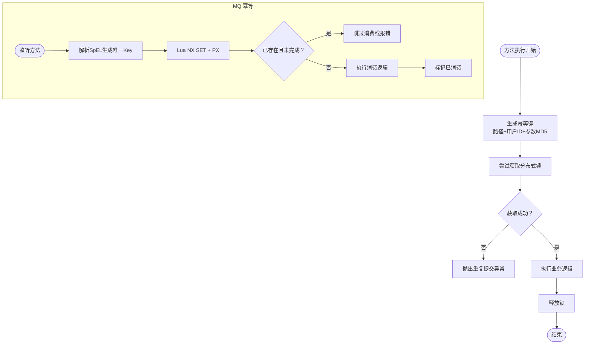
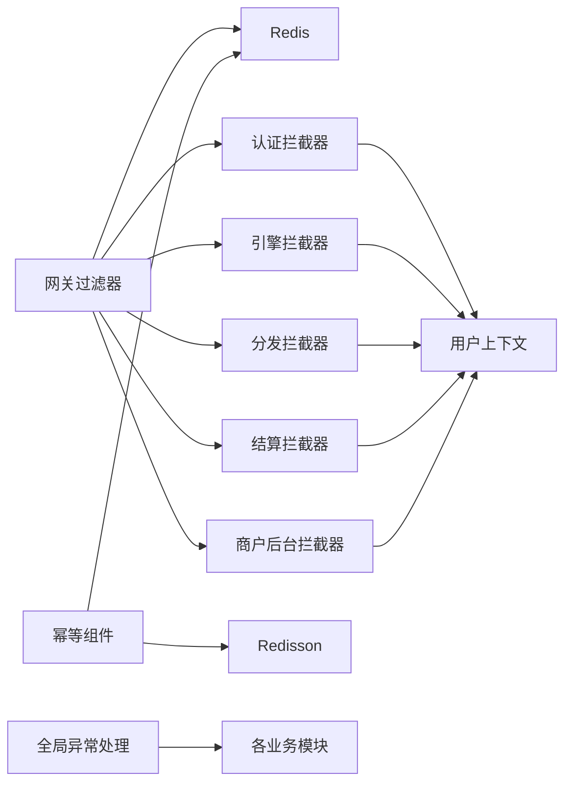

# 安全配置

<cite>
**本文引用的文件**
- [TokenValidateGatewayFilterFactory.java](file://gateway/src/main/java/com/fengxin/maplecoupon/gateway/filter/TokenValidateGatewayFilterFactory.java)
- [RequestLoggingFilter.java](file://gateway/src/main/java/com/fengxin/maplecoupon/gateway/filter/RequestLoggingFilter.java)
- [application.yml](file://gateway/src/main/resources/application.yml)
- [Config.java](file://gateway/src/main/java/com/fengxin/maplecoupon/gateway/config/Config.java)
- [WebAutoConfiguration.java](file://framework/src/main/java/com/fengxin/config/WebAutoConfiguration.java)
- [GlobalExceptionHandler.java](file://framework/src/main/java/com/fengxin/web/GlobalExceptionHandler.java)
- [IdempotentConfiguration.java](file://framework/src/main/java/com/fengxin/config/IdempotentConfiguration.java)
- [DuplicateSubmit.java](file://framework/src/main/java/com/fengxin/idempotent/DuplicateSubmit.java)
- [DuplicateSubmitAspect.java](file://framework/src/main/java/com/fengxin/idempotent/DuplicateSubmitAspect.java)
- [DuplicateMQConsume.java](file://framework/src/main/java/com/fengxin/idempotent/DuplicateMQConsume.java)
- [DuplicateMQConsumeAspect.java](file://framework/src/main/java/com/fengxin/idempotent/DuplicateMQConsumeAspect.java)
- [RedisDistributedProperties.java](file://framework/src/main/java/com/fengxin/config/RedisDistributedProperties.java)
- [UserConfiguration.java](file://auth/src/main/java/com/fengxin/maplecoupon/auth/config/UserConfiguration.java)
- [UserTransmitInterceptor.java](file://auth/src/main/java/com/fengxin/maplecoupon/auth/common/context/UserTransmitInterceptor.java)
- [UserLoginReqDTO.java](file://auth/src/main/java/com/fengxin/maplecoupon/auth/dto/req/UserLoginReqDTO.java)
- [UserConfiguration.java](file://engine/src/main/java/com/fengxin/maplecoupon/engine/config/UserConfiguration.java)
- [UserConfiguration.java](file://distribution/src/main/java/com/fengxin/maplecoupon/distribution/config/UserConfiguration.java)
- [UserConfiguration.java](file://settlement/src/main/java/com/fengxin/maplecoupon/settlement/config/UserConfiguration.java)
- [UserConfiguration.java](file://merchant-admin/src/main/java/com/fengxin/maplecoupon/merchantadmin/config/UserConfiguration.java)
</cite>

## 目录
1. [简介](#简介)
2. [项目结构](#项目结构)
3. [核心组件](#核心组件)
4. [架构总览](#架构总览)
5. [详细组件分析](#详细组件分析)
6. [依赖分析](#依赖分析)
7. [性能考虑](#性能考虑)
8. [故障排查指南](#故障排查指南)
9. [结论](#结论)
10. [附录](#附录)

## 简介
本文件面向MapleCoupon系统的安全配置，聚焦以下主题：
- 认证与授权：网关层Token校验、用户上下文传递、白名单策略
- 幂等性：重复提交防护、MQ重复消费防护、分布式锁配置
- 输入验证与数据安全：参数校验、异常统一处理
- HTTPS与证书：部署建议与最佳实践
- 敏感信息与密钥管理：配置项与策略建议
- 审计与日志：请求日志、错误日志与追踪
- CORS与跨域：网关全局CORS配置
- 安全加固与攻击检测：建议与实践

## 项目结构
MapleCoupon采用多模块微服务架构，安全相关能力主要分布在：
- 网关模块：负责统一入口、路由、Token校验、CORS与日志
- 各业务模块（auth/engine/distribution/settlement/merchant-admin）：负责用户上下文传递与业务逻辑
- 框架模块：提供幂等性、全局异常处理、Redis分布式配置等通用能力

图表来源
- [application.yml:1-72](file://gateway/src/main/resources/application.yml#L1-L72)
- [UserConfiguration.java:1-29](file://auth/src/main/java/com/fengxin/maplecoupon/auth/config/UserConfiguration.java#L1-L29)

章节来源
- [application.yml:1-72](file://gateway/src/main/resources/application.yml#L1-L72)
- [UserConfiguration.java:1-29](file://auth/src/main/java/com/fengxin/maplecoupon/auth/config/UserConfiguration.java#L1-L29)

## 核心组件
- 网关安全过滤器：TokenValidateGatewayFilterFactory，负责从请求头读取用户名与Token，校验Redis中的登录态，并透传用户信息到下游服务；支持白名单路径跳过校验
- 请求日志过滤器：RequestLoggingFilter，记录请求URI、方法、头信息、查询参数与耗时
- 用户上下文传递：各业务模块的UserConfiguration与UserTransmitInterceptor，将上游透传的用户信息写入本地线程上下文
- 幂等性：DuplicateSubmitAspect（分布式锁）、DuplicateMQConsumeAspect（Redis NX EX/PX 去重）
- 全局异常处理：GlobalExceptionHandler，统一拦截参数校验与业务异常，输出标准结果

章节来源
- [TokenValidateGatewayFilterFactory.java:1-93](file://gateway/src/main/java/com/fengxin/maplecoupon/gateway/filter/TokenValidateGatewayFilterFactory.java#L1-L93)
- [RequestLoggingFilter.java:1-57](file://gateway/src/main/java/com/fengxin/maplecoupon/gateway/filter/RequestLoggingFilter.java#L1-L57)
- [UserTransmitInterceptor.java:1-42](file://auth/src/main/java/com/fengxin/maplecoupon/auth/common/context/UserTransmitInterceptor.java#L1-L42)
- [DuplicateSubmitAspect.java:1-94](file://framework/src/main/java/com/fengxin/idempotent/DuplicateSubmitAspect.java#L1-L94)
- [DuplicateMQConsumeAspect.java:1-87](file://framework/src/main/java/com/fengxin/idempotent/DuplicateMQConsumeAspect.java#L1-L87)
- [GlobalExceptionHandler.java:1-78](file://framework/src/main/java/com/fengxin/web/GlobalExceptionHandler.java#L1-L78)

## 架构总览
下图展示了从客户端到各业务模块的调用链路与安全控制点。

图表来源
- [TokenValidateGatewayFilterFactory.java:43-88](file://gateway/src/main/java/com/fengxin/maplecoupon/gateway/filter/TokenValidateGatewayFilterFactory.java#L43-L88)
- [application.yml:17-63](file://gateway/src/main/resources/application.yml#L17-L63)

章节来源
- [TokenValidateGatewayFilterFactory.java:1-93](file://gateway/src/main/java/com/fengxin/maplecoupon/gateway/filter/TokenValidateGatewayFilterFactory.java#L1-L93)
- [application.yml:1-72](file://gateway/src/main/resources/application.yml#L1-L72)

## 详细组件分析

### 网关安全过滤器：Token验证、请求拦截与权限校验
- 功能要点
  - 从请求头读取用户名与Token
  - 校验Redis中的登录态键值，成功则透传userId与shopNumber到下游
  - 支持白名单路径，避免对注册/登录等接口重复校验
  - 未通过校验时返回401与统一错误体
- 关键行为
  - 白名单匹配：以路径前缀匹配
  - 登录态校验：基于Hash结构的键拼接与过期时间刷新
  - 上游透传：修改请求头，供下游拦截器读取

图表来源
- [TokenValidateGatewayFilterFactory.java:43-88](file://gateway/src/main/java/com/fengxin/maplecoupon/gateway/filter/TokenValidateGatewayFilterFactory.java#L43-L88)
- [Config.java:1-20](file://gateway/src/main/java/com/fengxin/maplecoupon/gateway/config/Config.java#L1-L20)

章节来源
- [TokenValidateGatewayFilterFactory.java:1-93](file://gateway/src/main/java/com/fengxin/maplecoupon/gateway/filter/TokenValidateGatewayFilterFactory.java#L1-L93)
- [Config.java:1-20](file://gateway/src/main/java/com/fengxin/maplecoupon/gateway/config/Config.java#L1-L20)
- [application.yml:58-63](file://gateway/src/main/resources/application.yml#L58-L63)

### 用户认证与上下文传递
- 认证流程
  - 网关侧完成Token校验与登录态刷新
  - 通过请求头透传userId与shopNumber
- 上下文传递
  - 各业务模块在WebMvc中注册拦截器，将上游透传的用户信息写入本地线程上下文
  - 在请求完成后清理上下文，避免内存泄漏

图表来源
- [UserTransmitInterceptor.java:19-41](file://auth/src/main/java/com/fengxin/maplecoupon/auth/common/context/UserTransmitInterceptor.java#L19-L41)
- [UserConfiguration.java:16-29](file://auth/src/main/java/com/fengxin/maplecoupon/auth/config/UserConfiguration.java#L16-L29)

章节来源
- [UserTransmitInterceptor.java:1-42](file://auth/src/main/java/com/fengxin/maplecoupon/auth/common/context/UserTransmitInterceptor.java#L1-L42)
- [UserConfiguration.java:1-29](file://auth/src/main/java/com/fengxin/maplecoupon/auth/config/UserConfiguration.java#L1-L29)
- [UserConfiguration.java:1-29](file://engine/src/main/java/com/fengxin/maplecoupon/engine/config/UserConfiguration.java#L1-L29)
- [UserConfiguration.java:1-29](file://distribution/src/main/java/com/fengxin/maplecoupon/distribution/config/UserConfiguration.java#L1-L29)
- [UserConfiguration.java:1-29](file://settlement/src/main/java/com/fengxin/maplecoupon/settlement/config/UserConfiguration.java#L1-L29)
- [UserConfiguration.java:1-29](file://merchant-admin/src/main/java/com/fengxin/maplecoupon/merchantadmin/config/UserConfiguration.java#L1-L29)

### 幂等性配置：重复提交与MQ重复消费
- 重复提交防护
  - 使用注解与AOP，在方法级别加分布式锁，避免同一用户对相同请求重复提交
  - 锁键由路径、当前用户ID与请求参数MD5组合，保证粒度与唯一性
- MQ重复消费防护
  - 使用Redis Lua脚本实现“仅一次”语义：NX SET + PX（毫秒过期），结合消费状态枚举
  - 成功消费设置已消费状态，异常时删除幂等Key以便重试

图表来源
- [DuplicateSubmitAspect.java:35-51](file://framework/src/main/java/com/fengxin/idempotent/DuplicateSubmitAspect.java#L35-L51)
- [DuplicateMQConsumeAspect.java:33-72](file://framework/src/main/java/com/fengxin/idempotent/DuplicateMQConsumeAspect.java#L33-L72)

章节来源
- [IdempotentConfiguration.java:1-40](file://framework/src/main/java/com/fengxin/config/IdempotentConfiguration.java#L1-L40)
- [DuplicateSubmit.java:1-19](file://framework/src/main/java/com/fengxin/idempotent/DuplicateSubmit.java#L1-L19)
- [DuplicateSubmitAspect.java:1-94](file://framework/src/main/java/com/fengxin/idempotent/DuplicateSubmitAspect.java#L1-L94)
- [DuplicateMQConsume.java:1-32](file://framework/src/main/java/com/fengxin/idempotent/DuplicateMQConsume.java#L1-L32)
- [DuplicateMQConsumeAspect.java:1-87](file://framework/src/main/java/com/fengxin/idempotent/DuplicateMQConsumeAspect.java#L1-L87)

### 输入验证与数据安全
- 参数校验
  - 使用全局异常处理器拦截参数校验异常，统一输出第一条错误信息
- 数据安全
  - 建议在DTO层增加字段长度、格式约束与必填校验
  - 对外部输入进行严格白名单与最小权限原则处理
- 异常处理
  - 统一返回标准结果结构，避免泄露内部堆栈细节

章节来源
- [GlobalExceptionHandler.java:1-78](file://framework/src/main/java/com/fengxin/web/GlobalExceptionHandler.java#L1-L78)
- [UserLoginReqDTO.java:1-23](file://auth/src/main/java/com/fengxin/maplecoupon/auth/dto/req/UserLoginReqDTO.java#L1-L23)

### HTTPS与SSL证书管理
- 部署建议
  - 在网关层启用HTTPS，统一终止TLS，便于集中管理证书与策略
  - 使用受信CA签发的证书，定期轮换
  - 配置强密码套件与协议版本，禁用弱算法
- 证书运维
  - 采用自动化证书申请与续期流程（如ACME）
  - 将私钥与证书分离存储，限制访问权限

[本节为通用实践建议，无需特定文件引用]

### 审计与日志记录
- 请求日志
  - 网关层记录请求URI、方法、头信息、查询参数与耗时
  - 建议引入TraceId串联链路，便于问题定位
- 错误日志
  - 全局异常处理器记录异常堆栈与URL，避免敏感信息泄露
- 建议
  - 结合链路追踪组件（如Zipkin/SkyWalking）与日志平台（ELK）统一采集与分析

章节来源
- [RequestLoggingFilter.java:1-57](file://gateway/src/main/java/com/fengxin/maplecoupon/gateway/filter/RequestLoggingFilter.java#L1-L57)
- [GlobalExceptionHandler.java:1-78](file://framework/src/main/java/com/fengxin/web/GlobalExceptionHandler.java#L1-L78)

### CORS与跨域安全策略
- 网关层CORS
  - 全局允许跨域请求，支持通配符方法与头，允许凭据
- 安全建议
  - 生产环境应限定allowedOriginPatterns与allowedMethods，避免过度宽松
  - 对关键接口关闭allowCredentials或限制具体来源

章节来源
- [application.yml:10-16](file://gateway/src/main/resources/application.yml#L10-L16)

### 敏感信息与密钥管理
- 配置项
  - Redis分布式前缀可通过配置类集中管理，便于隔离不同环境
- 密钥策略
  - 使用密钥管理系统（KMS）或Vault，分离配置与密钥
  - 严禁将密钥硬编码在代码或配置文件中

章节来源
- [RedisDistributedProperties.java:1-25](file://framework/src/main/java/com/fengxin/config/RedisDistributedProperties.java#L1-L25)

### 安全漏洞防护与攻击检测
- 建议措施
  - 限流与熔断：在网关层配置限流与熔断，抵御突发流量与攻击
  - WAF/IPS：在网关前部署WAF，识别与阻断常见攻击（SQL注入、XSS、CC等）
  - 审计日志：对鉴权、敏感操作进行强制审计
  - 定期渗透测试与漏洞扫描
- 与现有实现的协同
  - 网关白名单与CORS策略需与业务权限模型一致
  - 幂等性可降低重放与抖动带来的风险

[本节为通用实践建议，无需特定文件引用]

## 依赖分析
- 组件耦合
  - 网关过滤器依赖Redis进行登录态校验
  - 各业务模块拦截器依赖网关透传的用户信息
  - 幂等性组件依赖Redis与Redisson
  - 全局异常处理作为横切关注点被所有模块共享
- 外部依赖
  - Spring Cloud Gateway、Spring MVC、Redis、Redisson、Hutool

图表来源
- [TokenValidateGatewayFilterFactory.java:36-41](file://gateway/src/main/java/com/fengxin/maplecoupon/gateway/filter/TokenValidateGatewayFilterFactory.java#L36-L41)
- [UserTransmitInterceptor.java:19-41](file://auth/src/main/java/com/fengxin/maplecoupon/auth/common/context/UserTransmitInterceptor.java#L19-L41)
- [DuplicateSubmitAspect.java:24-26](file://framework/src/main/java/com/fengxin/idempotent/DuplicateSubmitAspect.java#L24-L26)
- [DuplicateMQConsumeAspect.java:31-32](file://framework/src/main/java/com/fengxin/idempotent/DuplicateMQConsumeAspect.java#L31-L32)
- [GlobalExceptionHandler.java:24-26](file://framework/src/main/java/com/fengxin/web/GlobalExceptionHandler.java#L24-L26)

章节来源
- [TokenValidateGatewayFilterFactory.java:1-93](file://gateway/src/main/java/com/fengxin/maplecoupon/gateway/filter/TokenValidateGatewayFilterFactory.java#L1-L93)
- [UserTransmitInterceptor.java:1-42](file://auth/src/main/java/com/fengxin/maplecoupon/auth/common/context/UserTransmitInterceptor.java#L1-L42)
- [DuplicateSubmitAspect.java:1-94](file://framework/src/main/java/com/fengxin/idempotent/DuplicateSubmitAspect.java#L1-L94)
- [DuplicateMQConsumeAspect.java:1-87](file://framework/src/main/java/com/fengxin/idempotent/DuplicateMQConsumeAspect.java#L1-L87)
- [GlobalExceptionHandler.java:1-78](file://framework/src/main/java/com/fengxin/web/GlobalExceptionHandler.java#L1-L78)

## 性能考虑
- 网关层Redis访问
  - 使用Hash结构存储登录态，减少Key数量；合理设置过期时间，避免长期占用
- 幂等锁粒度
  - 分布式锁键包含用户ID与请求参数MD5，避免跨用户干扰；锁超时与业务执行时长平衡
- MQ幂等
  - Lua脚本原子性保证NX SET与过期设置；消费完成及时更新状态，缩短锁持有时间
- 日志与追踪
  - 控制日志量，避免高频请求造成I/O压力；TraceId串联链路，便于定位热点

[本节提供通用指导，无需特定文件引用]

## 故障排查指南
- 401未授权
  - 检查请求头是否包含正确的username与token
  - 核对Redis中登录态是否存在且未过期
  - 确认请求路径是否命中白名单
- 参数校验失败
  - 查看全局异常处理器输出的第一条错误信息
  - 核对DTO字段约束与必填项
- 幂等冲突
  - 重复提交：等待锁释放或调整请求间隔
  - MQ重复消费：确认幂等Key是否正确生成与过期设置
- 日志与追踪
  - 网关日志查看请求URI、方法与耗时
  - 全局异常日志查看URL与异常堆栈

章节来源
- [TokenValidateGatewayFilterFactory.java:75-84](file://gateway/src/main/java/com/fengxin/maplecoupon/gateway/filter/TokenValidateGatewayFilterFactory.java#L75-L84)
- [GlobalExceptionHandler.java:30-68](file://framework/src/main/java/com/fengxin/web/GlobalExceptionHandler.java#L30-L68)
- [RequestLoggingFilter.java:28-50](file://gateway/src/main/java/com/fengxin/maplecoupon/gateway/filter/RequestLoggingFilter.java#L28-L50)

## 结论
MapleCoupon的安全体系以网关为中心，结合Redis登录态校验、用户上下文传递、全局异常处理与幂等性保障，形成从入口到业务的多层防护。建议在生产环境中进一步收紧CORS策略、启用HTTPS与WAF、完善密钥与证书管理，并持续进行安全审计与渗透测试，确保系统在高并发与复杂业务场景下的安全性与稳定性。

## 附录
- 配置清单与建议
  - 网关CORS：按需收紧allowedOriginPatterns与allowedMethods
  - Redis登录态：设置合理过期时间，避免长期有效
  - 幂等键：确保唯一性与可追踪性
  - 日志：开启TraceId，统一采集与告警

[本节为通用建议，无需特定文件引用]