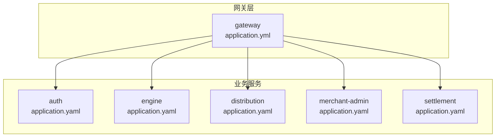
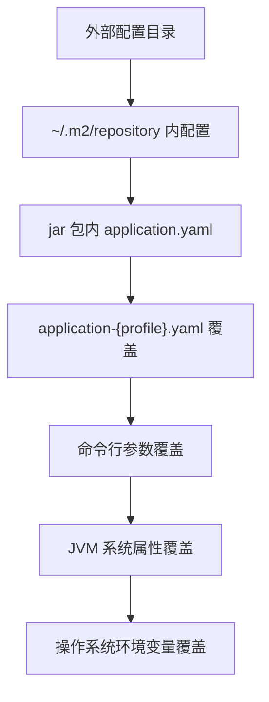

# 环境配置

<cite>
**本文引用的文件**
- [auth/application.yaml](file://auth/src/main/resources/application.yaml)
- [auth/application-dev.yaml](file://auth/src/main/resources/application-dev.yaml)
- [auth/application-prod.yaml](file://auth/src/main/resources/application-prod.yaml)
- [distribution/application.yaml](file://distribution/src/main/resources/application.yaml)
- [distribution/application-dev.yaml](file://distribution/src/main/resources/application-dev.yaml)
- [distribution/application-prod.yaml](file://distribution/src/main/resources/application-prod.yaml)
- [engine/application.yaml](file://engine/src/main/resources/application.yaml)
- [engine/application-dev.yaml](file://engine/src/main/resources/application-dev.yaml)
- [engine/application-prod.yaml](file://engine/src/main/resources/application-prod.yaml)
- [merchant-admin/application.yaml](file://merchant-admin/src/main/resources/application.yaml)
- [merchant-admin/application-dev.yaml](file://merchant-admin/src/main/resources/application-dev.yaml)
- [merchant-admin/application-prod.yaml](file://merchant-admin/src/main/resources/application-prod.yaml)
- [gateway/application.yml](file://gateway/src/main/resources/application.yml)
- [gateway/application-dev.yml](file://gateway/src/main/resources/application-dev.yml)
- [gateway/application-prod.yml](file://gateway/src/main/resources/application-prod.yml)
- [settlement/application.yaml](file://settlement/src/main/resources/application.yaml)
- [settlement/application-dev.yaml](file://settlement/src/main/resources/application-dev.yaml)
- [settlement/application-prod.yaml](file://settlement/src/main/resources/application-prod.yaml)
</cite>

## 目录
1. [简介](#简介)
2. [项目结构](#项目结构)
3. [核心组件](#核心组件)
4. [架构总览](#架构总览)
5. [详细组件分析](#详细组件分析)
6. [依赖分析](#依赖分析)
7. [性能考虑](#性能考虑)
8. [故障排查指南](#故障排查指南)
9. [结论](#结论)
10. [附录](#附录)

## 简介
本文件系统性梳理 MapleCoupon 的多环境配置策略与实现方式，覆盖开发(dev)、测试(test)与生产(prod)三类环境的配置差异与管理规范；详解 Spring Boot 配置文件组织（application.yaml 主配置与 application-{profile}.yaml 环境特定配置）；逐项说明各微服务模块（认证、分发、引擎、商户后台、结算、网关）的环境配置特点；给出数据库连接、Redis、消息队列等关键组件在不同环境下的设置要点；明确环境变量与配置优先级规则；总结配置加载顺序与覆盖机制；并提供环境切换最佳实践与配置验证方法。

## 项目结构
- 模块化组织：每个微服务均采用标准 Spring Boot 结构，resources 下包含 application.yaml 与 application-{profile}.yaml 文件，用于集中管理主配置与环境差异化配置。
- 网关模块：独立于业务模块，负责路由与统一鉴权过滤。
- 共享框架：提供全局异常、幂等、Web 自动装配、缓存与序列化等通用能力，供各模块复用。

图表来源
- [gateway/application.yml:1-72](file://gateway/src/main/resources/application.yml#L1-L72)
- [auth/application.yaml:1-19](file://auth/src/main/resources/application.yaml#L1-L19)
- [engine/application.yaml:1-22](file://engine/src/main/resources/application.yaml#L1-L22)
- [distribution/application.yaml:1-15](file://distribution/src/main/resources/application.yaml#L1-L15)
- [merchant-admin/application.yaml:1-27](file://merchant-admin/src/main/resources/application.yaml#L1-L27)
- [settlement/application.yaml:1-14](file://settlement/src/main/resources/application.yaml#L1-L14)

章节来源
- [gateway/application.yml:1-72](file://gateway/src/main/resources/application.yml#L1-L72)
- [auth/application.yaml:1-19](file://auth/src/main/resources/application.yaml#L1-L19)
- [engine/application.yaml:1-22](file://engine/src/main/resources/application.yaml#L1-L22)
- [distribution/application.yaml:1-15](file://distribution/src/main/resources/application.yaml#L1-L15)
- [merchant-admin/application.yaml:1-27](file://merchant-admin/src/main/resources/application.yaml#L1-L27)
- [settlement/application.yaml:1-14](file://settlement/src/main/resources/application.yaml#L1-L14)

## 核心组件
- 配置文件命名与激活
  - 主配置：application.yaml 定义默认值与基础属性，如端口、应用名、数据源驱动与 ShardingSphere 路径占位符、MyBatis 日志、以及各模块特有的开关或参数。
  - 环境配置：application-{profile}.yaml 用于覆盖主配置中的同名键，实现按环境差异化配置。
  - 激活方式：profiles.active 指定当前激活的 profile 名称（如 dev、prod），未显式指定时默认 dev。
- 数据库连接
  - 统一使用 ShardingSphere 驱动与 URL 协议，通过 classpath:shardingsphere-config-${database.env:dev}.yaml 动态加载对应环境的分片配置文件。
  - database.env 可通过环境变量或外部配置覆盖，默认 dev。
- 缓存与注册中心
  - Redis：host、port、password、database 等在各环境配置中分别指向不同实例与库。
  - Nacos：服务发现地址在各环境配置中分别指向不同集群。
- 消息队列
  - RocketMQ：name-server 地址与 producer 分组在各环境配置中分别指向不同集群，并设置发送超时与重试策略。
- 文档与工具
  - SpringDoc/Knife4j：在部分服务中启用 API 文档与本地化设置，便于开发与联调。

章节来源
- [auth/application.yaml:1-19](file://auth/src/main/resources/application.yaml#L1-L19)
- [auth/application-dev.yaml:1-30](file://auth/src/main/resources/application-dev.yaml#L1-L30)
- [auth/application-prod.yaml:1-12](file://auth/src/main/resources/application-prod.yaml#L1-L12)
- [engine/application.yaml:1-22](file://engine/src/main/resources/application.yaml#L1-L22)
- [engine/application-dev.yaml:1-37](file://engine/src/main/resources/application-dev.yaml#L1-L37)
- [engine/application-prod.yaml:1-19](file://engine/src/main/resources/application-prod.yaml#L1-L19)
- [distribution/application.yaml:1-15](file://distribution/src/main/resources/application.yaml#L1-L15)
- [distribution/application-dev.yaml:1-20](file://distribution/src/main/resources/application-dev.yaml#L1-L20)
- [distribution/application-prod.yaml:1-20](file://distribution/src/main/resources/application-prod.yaml#L1-L20)
- [merchant-admin/application.yaml:1-27](file://merchant-admin/src/main/resources/application.yaml#L1-L27)
- [merchant-admin/application-dev.yaml:1-36](file://merchant-admin/src/main/resources/application-dev.yaml#L1-L36)
- [merchant-admin/application-prod.yaml:1-21](file://merchant-admin/src/main/resources/application-prod.yaml#L1-L21)
- [settlement/application.yaml:1-14](file://settlement/src/main/resources/application.yaml#L1-L14)
- [settlement/application-dev.yaml:1-29](file://settlement/src/main/resources/application-dev.yaml#L1-L29)
- [settlement/application-prod.yaml:1-11](file://settlement/src/main/resources/application-prod.yaml#L1-L11)
- [gateway/application.yml:1-72](file://gateway/src/main/resources/application.yml#L1-L72)
- [gateway/application-dev.yml:1-11](file://gateway/src/main/resources/application-dev.yml#L1-L11)
- [gateway/application-prod.yml:1-11](file://gateway/src/main/resources/application-prod.yml#L1-L11)

## 架构总览
下图展示各微服务在不同环境下的配置映射关系，突出数据库、缓存与消息队列的关键差异。

```mermaid
graph TB
DEV["开发环境(dev)"]
PROD["生产环境(prod)"]
AUTH_DEV["auth-dev<br/>Redis/Nacos/RocketMQ"]
AUTH_PROD["auth-prod<br/>Redis/Nacos/RocketMQ"]
ENGINE_DEV["engine-dev<br/>Redis/Nacos/RocketMQ"]
ENGINE_PROD["engine-prod<br/>Redis/Nacos/RocketMQ"]
DIST_DEV["distribution-dev<br/>Redis/Nacos/RocketMQ"]
DIST_PROD["distribution-prod<br/>Redis/Nacos/RocketMQ"]
MERCHANT_DEV["merchant-admin-dev<br/>Redis/Nacos/RocketMQ"]
MERCHANT_PROD["merchant-admin-prod<br/>Redis/Nacos/RocketMQ"]
SETTLE_DEV["settlement-dev<br/>Redis/Nacos"]
SETTLE_PROD["settlement-prod<br/>Redis/Nacos"]
GATE_DEV["gateway-dev<br/>Redis/Nacos"]
GATE_PROD["gateway-prod<br/>Redis/Nacos"]
DEV --> AUTH_DEV
DEV --> ENGINE_DEV
DEV --> DIST_DEV
DEV --> MERCHANT_DEV
DEV --> SETTLE_DEV
DEV --> GATE_DEV
PROD --> AUTH_PROD
PROD --> ENGINE_PROD
PROD --> DIST_PROD
PROD --> MERCHANT_PROD
PROD --> SETTLE_PROD
PROD --> GATE_PROD
```

图表来源
- [auth/application-dev.yaml:1-30](file://auth/src/main/resources/application-dev.yaml#L1-L30)
- [auth/application-prod.yaml:1-12](file://auth/src/main/resources/application-prod.yaml#L1-L12)
- [engine/application-dev.yaml:1-37](file://engine/src/main/resources/application-dev.yaml#L1-L37)
- [engine/application-prod.yaml:1-19](file://engine/src/main/resources/application-prod.yaml#L1-L19)
- [distribution/application-dev.yaml:1-20](file://distribution/src/main/resources/application-dev.yaml#L1-L20)
- [distribution/application-prod.yaml:1-20](file://distribution/src/main/resources/application-prod.yaml#L1-L20)
- [merchant-admin/application-dev.yaml:1-36](file://merchant-admin/src/main/resources/application-dev.yaml#L1-L36)
- [merchant-admin/application-prod.yaml:1-21](file://merchant-admin/src/main/resources/application-prod.yaml#L1-L21)
- [settlement/application-dev.yaml:1-29](file://settlement/src/main/resources/application-dev.yaml#L1-L29)
- [settlement/application-prod.yaml:1-11](file://settlement/src/main/resources/application-prod.yaml#L1-L11)
- [gateway/application-dev.yml:1-11](file://gateway/src/main/resources/application-dev.yml#L1-L11)
- [gateway/application-prod.yml:1-11](file://gateway/src/main/resources/application-prod.yml#L1-L11)

## 详细组件分析

### 认证服务（auth）
- 配置要点
  - 端口与应用名：在主配置中定义。
  - 数据源：使用 ShardingSphere 驱动与 classpath 路径加载分片配置，支持通过 database.env 切换环境。
  - 激活 profile：默认 dev。
  - 开发环境：启用 Nacos 服务发现、Redis 连接与 Knife4j/SpringDoc 文档。
  - 生产环境：Nacos 与 Redis 指向生产集群。
- 关键差异
  - Redis 密码与数据库编号在 dev/prod 中不同。
  - Nacos 服务发现地址在 dev/prod 中不同。
  - 文档工具在 dev 环境启用。

章节来源
- [auth/application.yaml:1-19](file://auth/src/main/resources/application.yaml#L1-L19)
- [auth/application-dev.yaml:1-30](file://auth/src/main/resources/application-dev.yaml#L1-L30)
- [auth/application-prod.yaml:1-12](file://auth/src/main/resources/application-prod.yaml#L1-L12)

### 引擎服务（engine）
- 配置要点
  - 端口与应用名：在主配置中定义。
  - 数据源：使用 ShardingSphere 驱动与 classpath 路径加载分片配置，支持通过 database.env 切换环境。
  - 激活 profile：默认 dev。
  - 开发环境：启用 Nacos、Redis、RocketMQ、Knife4j/SpringDoc 文档。
  - 生产环境：Nacos 与 Redis、RocketMQ 指向生产集群。
- 关键差异
  - RocketMQ 生产者分组在 dev/prod 中不同，便于区分消息来源。
  - 文档工具在 dev 环境启用。

章节来源
- [engine/application.yaml:1-22](file://engine/src/main/resources/application.yaml#L1-L22)
- [engine/application-dev.yaml:1-37](file://engine/src/main/resources/application-dev.yaml#L1-L37)
- [engine/application-prod.yaml:1-19](file://engine/src/main/resources/application-prod.yaml#L1-L19)

### 分发服务（distribution）
- 配置要点
  - 端口与应用名：在主配置中定义。
  - 数据源：使用 ShardingSphere 驱动与 classpath 路径加载分片配置，支持通过 database.env 切换环境。
  - 激活 profile：默认 dev。
  - 开发环境：启用 Nacos、Redis、RocketMQ。
  - 生产环境：Nacos 与 Redis、RocketMQ 指向生产集群。
- 关键差异
  - RocketMQ 生产者分组在 dev/prod 中不同，便于区分消息来源。

章节来源
- [distribution/application.yaml:1-15](file://distribution/src/main/resources/application.yaml#L1-L15)
- [distribution/application-dev.yaml:1-20](file://distribution/src/main/resources/application-dev.yaml#L1-L20)
- [distribution/application-prod.yaml:1-20](file://distribution/src/main/resources/application-prod.yaml#L1-L20)

### 商户后台（merchant-admin）
- 配置要点
  - 端口与应用名：在主配置中定义。
  - 数据源：使用 ShardingSphere 驱动与 classpath 路径加载分片配置，支持通过 database.env 切换环境。
  - 激活 profile：默认 dev。
  - 开发环境：启用 Nacos、Redis、RocketMQ、Knife4j/SpringDoc 文档。
  - 生产环境：Nacos 与 Redis、RocketMQ 指向生产集群。
- 关键差异
  - RocketMQ 生产者分组在 dev/prod 中不同，便于区分消息来源。
  - XXL-Job 默认关闭，便于本地开发隔离。

章节来源
- [merchant-admin/application.yaml:1-27](file://merchant-admin/src/main/resources/application.yaml#L1-L27)
- [merchant-admin/application-dev.yaml:1-36](file://merchant-admin/src/main/resources/application-dev.yaml#L1-L36)
- [merchant-admin/application-prod.yaml:1-21](file://merchant-admin/src/main/resources/application-prod.yaml#L1-L21)

### 结算服务（settlement）
- 配置要点
  - 端口与应用名：在主配置中定义。
  - 数据源：使用 ShardingSphere 驱动与 classpath 路径加载分片配置，支持通过 database.env 切换环境。
  - 激活 profile：默认 dev。
  - 开发环境：启用 Nacos、Redis、Knife4j/SpringDoc 文档。
  - 生产环境：Nacos 与 Redis 指向生产集群。
- 关键差异
  - 无 RocketMQ 配置，专注于查询与结算相关功能。

章节来源
- [settlement/application.yaml:1-14](file://settlement/src/main/resources/application.yaml#L1-L14)
- [settlement/application-dev.yaml:1-29](file://settlement/src/main/resources/application-dev.yaml#L1-L29)
- [settlement/application-prod.yaml:1-11](file://settlement/src/main/resources/application-prod.yaml#L1-L11)

### 网关（gateway）
- 配置要点
  - 端口与应用名：在主配置中定义。
  - 激活 profile：默认 dev。
  - 路由：定义到各业务服务的路由规则与过滤器（TokenValidate）。
  - 开发环境：启用 Nacos、Redis。
  - 生产环境：Nacos、Redis 指向生产集群。
- 关键差异
  - 白名单路径在 dev 环境中对认证接口开放，便于登录与注册调试。

章节来源
- [gateway/application.yml:1-72](file://gateway/src/main/resources/application.yml#L1-L72)
- [gateway/application-dev.yml:1-11](file://gateway/src/main/resources/application-dev.yml#L1-L11)
- [gateway/application-prod.yml:1-11](file://gateway/src/main/resources/application-prod.yml#L1-L11)

## 依赖分析
- 配置耦合点
  - database.env：统一控制 ShardingSphere 配置文件选择，避免硬编码。
  - Nacos：服务发现地址在各环境配置中集中管理，确保服务间通信正确。
  - Redis：host/port/password/database 在各环境配置中分离，便于资源隔离。
  - RocketMQ：name-server 与 producer 分组在各环境配置中分离，便于消息追踪与隔离。
- 加载顺序与覆盖机制
  - Spring Boot 配置加载顺序（从低优先级到高优先级）：外部配置目录、~/.m2/repository、jar 包内配置、命令行参数、JVM 系统属性、操作系统环境变量。
  - application-{profile}.yaml 会覆盖 application.yaml 中同名键，实现“环境优先”。
  - 命令行参数与环境变量可进一步覆盖 YAML 中的值，形成“运行时优先”。

图表来源
- [auth/application.yaml:8](file://auth/src/main/resources/application.yaml#L8)
- [engine/application.yaml:8](file://engine/src/main/resources/application.yaml#L8)
- [distribution/application.yaml:8](file://distribution/src/main/resources/application.yaml#L8)
- [merchant-admin/application.yaml:10](file://merchant-admin/src/main/resources/application.yaml#L10)
- [settlement/application.yaml:10](file://settlement/src/main/resources/application.yaml#L10)

## 性能考虑
- Redis 连接池与网络延迟：在生产环境建议开启连接池优化与合理的超时设置，避免阻塞。
- RocketMQ 生产者重试与超时：根据业务吞吐量调整重试次数与发送超时，防止积压。
- Nacos 服务发现：合理设置心跳与健康检查间隔，降低注册中心压力。
- ShardingSphere 分片：在生产环境确保分片键设计与数据分布均衡，避免热点。

## 故障排查指南
- 环境未生效
  - 检查 profiles.active 是否正确设置；确认 application-{profile}.yaml 文件命名与激活值一致。
- 数据库无法连接
  - 检查 ShardingSphere 配置文件是否存在且可被 classpath 正确加载；核对 database.env 是否被正确注入。
- 缓存不可用
  - 核对 Redis host/port/password/database 是否与当前环境匹配；确认防火墙与网络连通性。
- 消息队列异常
  - 核对 RocketMQ name-server 地址与 producer 分组是否与当前环境一致；检查网络连通与权限。
- 网关路由失败
  - 核对路由 ID、URI 与服务名是否一致；确认 TokenValidate 过滤器白名单配置是否正确。

章节来源
- [auth/application.yaml:8](file://auth/src/main/resources/application.yaml#L8)
- [engine/application.yaml:8](file://engine/src/main/resources/application.yaml#L8)
- [distribution/application.yaml:8](file://distribution/src/main/resources/application.yaml#L8)
- [merchant-admin/application.yaml:10](file://merchant-admin/src/main/resources/application.yaml#L10)
- [settlement/application.yaml:10](file://settlement/src/main/resources/application.yaml#L10)
- [gateway/application.yml:17-63](file://gateway/src/main/resources/application.yml#L17-L63)

## 结论
MapleCoupon 通过“主配置 + 环境配置”的模式实现了清晰的多环境管理，配合 ShardingSphere、Nacos、Redis 与 RocketMQ 的环境化配置，满足了开发、测试与生产的差异化需求。遵循本文提供的加载顺序、覆盖机制与最佳实践，可有效提升配置一致性与运维效率。

## 附录

### 环境变量与配置优先级
- 推荐使用环境变量覆盖 database.env 以动态选择分片配置文件。
- 使用命令行参数或 CI/CD 注入覆盖敏感信息（如 Redis 密码、Nacos 地址）。
- 避免在代码中硬编码敏感值，统一通过配置文件与环境变量管理。

### 环境切换最佳实践
- 开发环境：使用本地或内网服务，开启文档工具与较宽松的日志级别。
- 测试环境：尽量模拟生产网络与资源，启用必要的监控与告警。
- 生产环境：最小化暴露面，严格控制权限与超时，启用健康检查与熔断降级。

### 配置验证方法
- 启动后访问 actuator 端点（如 /actuator/env）查看最终生效的配置。
- 对关键服务进行集成测试，验证数据库、缓存与消息队列连通性。
- 在网关层验证路由与过滤器行为，确保白名单与黑名单配置符合预期。