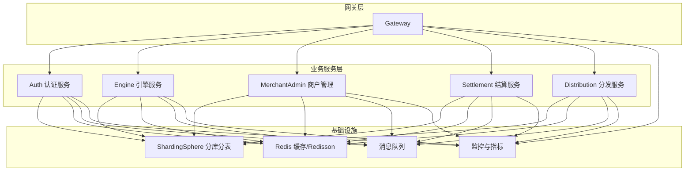
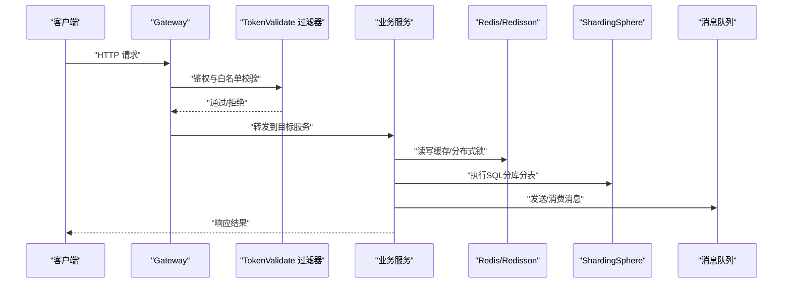
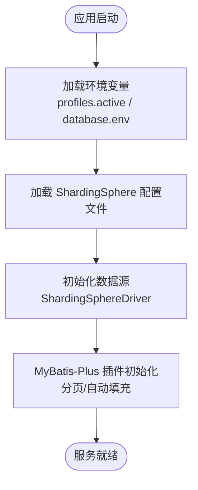
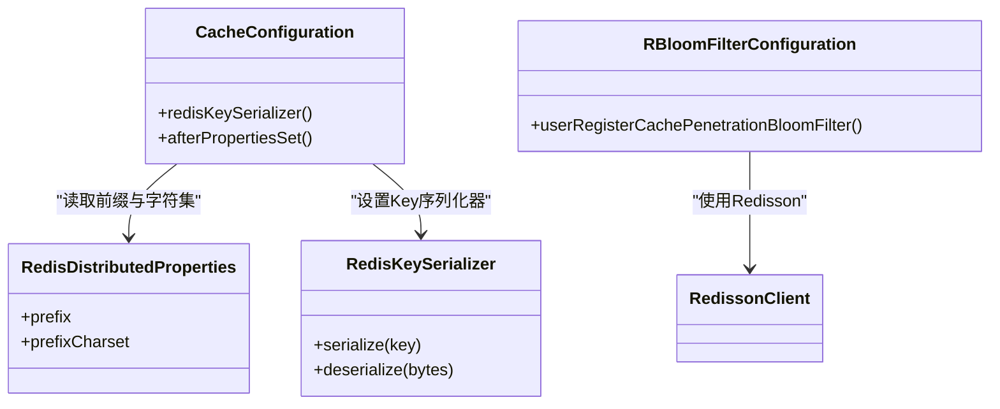
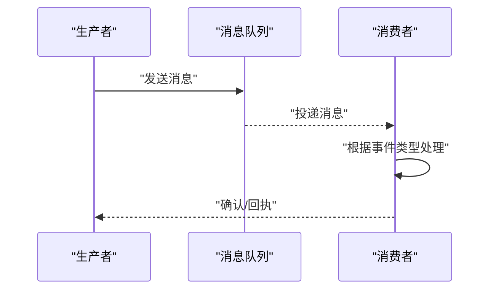
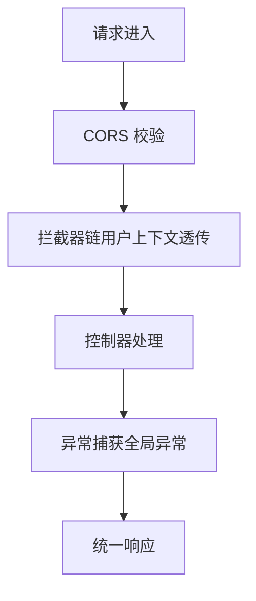
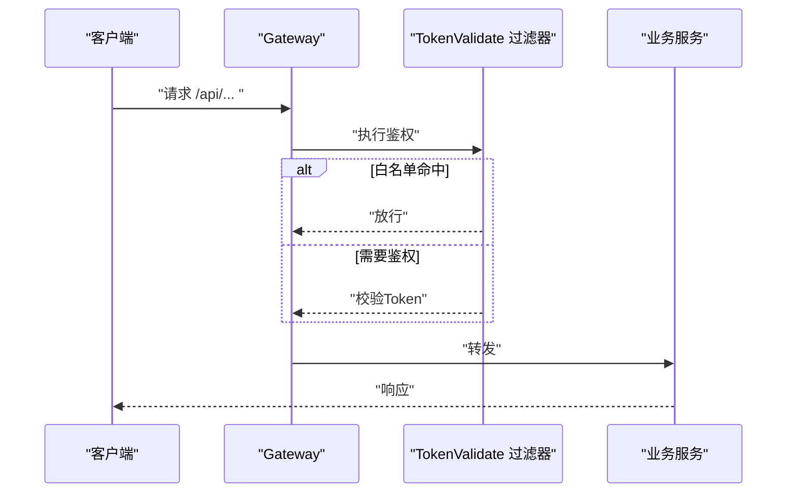
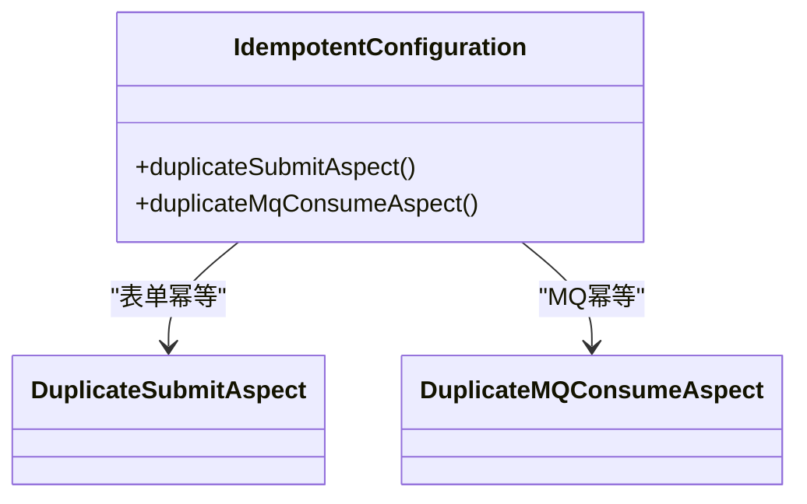
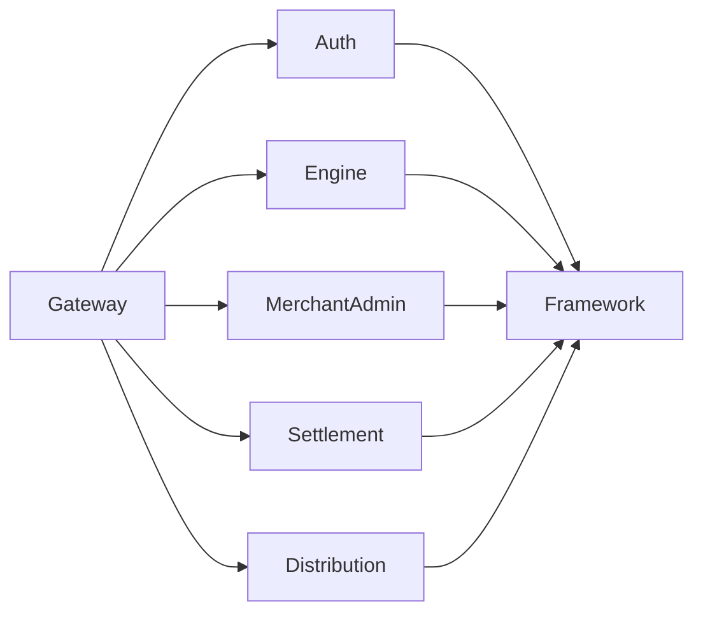

# 组件配置

<cite>
**本文引用的文件**
- [application.yaml（认证模块）](file://auth/src/main/resources/application.yaml)
- [application.yaml（引擎模块）](file://engine/src/main/resources/application.yaml)
- [application.yaml（商户管理模块）](file://merchant-admin/src/main/resources/application.yaml)
- [application.yaml（网关模块）](file://gateway/src/main/resources/application.yml)
- [CacheConfiguration.java](file://framework/src/main/java/com/fengxin/config/CacheConfiguration.java)
- [IdempotentConfiguration.java](file://framework/src/main/java/com/fengxin/config/IdempotentConfiguration.java)
- [RedisDistributedProperties.java](file://framework/src/main/java/com/fengxin/config/RedisDistributedProperties.java)
- [RedisKeySerializer.java](file://framework/src/main/java/com/fengxin/config/RedisKeySerializer.java)
- [WebAutoConfiguration.java](file://framework/src/main/java/com/fengxin/config/WebAutoConfiguration.java)
- [DataBaseConfiguration.java（认证模块）](file://auth/src/main/java/com/fengxin/maplecoupon/auth/config/DataBaseConfiguration.java)
- [UserConfiguration.java（认证模块）](file://auth/src/main/java/com/fengxin/maplecoupon/auth/config/UserConfiguration.java)
- [SwaggerConfiguration.java（认证模块）](file://auth/src/main/java/com/fengxin/maplecoupon/auth/config/SwaggerConfiguration.java)
- [RBloomFilterConfiguration.java（认证模块）](file://auth/src/main/java/com/fengxin/maplecoupon/auth/config/RBloomFilterConfiguration.java)
</cite>

## 目录
1. [简介](#简介)
2. [项目结构](#项目结构)
3. [核心组件](#核心组件)
4. [架构总览](#架构总览)
5. [详细组件分析](#详细组件分析)
6. [依赖分析](#依赖分析)
7. [性能考虑](#性能考虑)
8. [故障排查指南](#故障排查指南)
9. [结论](#结论)
10. [附录](#附录)

## 简介
本文件聚焦于MapleCoupon组件的配置体系，系统性梳理数据库连接池与分库分表、Redis与Redisson、消息队列、缓存策略、Web定制化、安全过滤器、分布式能力（锁、事务、幂等）、监控与指标等关键配置点，并结合源码给出可落地的配置建议与调优思路。

## 项目结构
- 模块化组织：认证(auth)、引擎(engine)、商户管理(merchant-admin)、结算(settlement)、分发(distribution)、网关(gateway)、框架(framework)。
- 配置来源：各业务模块以Spring Boot YAML为主；框架层提供通用配置与自动装配。
- 关键特性：统一使用ShardingSphere驱动进行分库分表；通过网关统一接入与鉴权；框架层提供缓存、幂等、Web全局异常等通用能力。

**图表来源**
- [application.yml（网关）:1-72](file://gateway/src/main/resources/application.yml#L1-L72)
- [application.yaml（认证模块）:1-19](file://auth/src/main/resources/application.yaml#L1-L19)
- [application.yaml（引擎模块）:1-22](file://engine/src/main/resources/application.yaml#L1-L22)
- [application.yaml（商户管理模块）:1-27](file://merchant-admin/src/main/resources/application.yaml#L1-L27)

**章节来源**
- [application.yml（网关）:1-72](file://gateway/src/main/resources/application.yml#L1-L72)
- [application.yaml（认证模块）:1-19](file://auth/src/main/resources/application.yaml#L1-L19)
- [application.yaml（引擎模块）:1-22](file://engine/src/main/resources/application.yaml#L1-L22)
- [application.yaml（商户管理模块）:1-27](file://merchant-admin/src/main/resources/application.yaml#L1-L27)

## 核心组件
- 数据库与分库分表：统一采用ShardingSphere驱动，通过YAML配置加载分片规则，支持多环境切换。
- 缓存与序列化：框架层提供RedisKeySerializer与RedisDistributedProperties，统一Key前缀与字符集。
- 幂等与分布式能力：框架层提供幂等切面与RedissonClient注入，支撑分布式锁与防重复消费。
- Web与全局异常：框架层提供全局异常处理器与Web自动装配，业务模块可按需扩展拦截器。
- 网关与安全：网关统一跨域、路由与鉴权过滤器，支持白名单路径配置。
- 监控与指标：网关暴露管理端点，业务模块可扩展Prometheus指标与自定义指标。

**章节来源**
- [CacheConfiguration.java:1-35](file://framework/src/main/java/com/fengxin/config/CacheConfiguration.java#L1-L35)
- [RedisDistributedProperties.java:1-25](file://framework/src/main/java/com/fengxin/config/RedisDistributedProperties.java#L1-L25)
- [RedisKeySerializer.java:1-38](file://framework/src/main/java/com/fengxin/config/RedisKeySerializer.java#L1-L38)
- [IdempotentConfiguration.java:1-40](file://framework/src/main/java/com/fengxin/config/IdempotentConfiguration.java#L1-L40)
- [WebAutoConfiguration.java:1-22](file://framework/src/main/java/com/fengxin/config/WebAutoConfiguration.java#L1-L22)

## 架构总览
下图展示从网关到各业务模块的请求链路、鉴权与跨域策略，以及与缓存、数据库、消息队列的交互关系。

**图表来源**
- [application.yml（网关）:1-72](file://gateway/src/main/resources/application.yml#L1-L72)
- [IdempotentConfiguration.java:1-40](file://framework/src/main/java/com/fengxin/config/IdempotentConfiguration.java#L1-L40)

## 详细组件分析

### 数据库连接池与分库分表配置
- 驱动与URL：所有业务模块均使用ShardingSphere驱动，通过classpath加载对应环境的分片配置文件。
- 环境切换：通过profiles.active与database.env变量控制加载的分片配置文件。
- MyBatis-Plus：开启日志输出，便于开发调试；分页与元对象自动填充在各模块配置类中启用。

**图表来源**
- [application.yaml（认证模块）:1-19](file://auth/src/main/resources/application.yaml#L1-L19)
- [application.yaml（引擎模块）:1-22](file://engine/src/main/resources/application.yaml#L1-L22)
- [application.yaml（商户管理模块）:1-27](file://merchant-admin/src/main/resources/application.yaml#L1-L27)
- [DataBaseConfiguration.java（认证模块）:1-57](file://auth/src/main/java/com/fengxin/maplecoupon/auth/config/DataBaseConfiguration.java#L1-L57)

**章节来源**
- [application.yaml（认证模块）:1-19](file://auth/src/main/resources/application.yaml#L1-L19)
- [application.yaml（引擎模块）:1-22](file://engine/src/main/resources/application.yaml#L1-L22)
- [application.yaml（商户管理模块）:1-27](file://merchant-admin/src/main/resources/application.yaml#L1-L27)
- [DataBaseConfiguration.java（认证模块）:1-57](file://auth/src/main/java/com/fengxin/maplecoupon/auth/config/DataBaseConfiguration.java#L1-L57)

### Redis与缓存配置
- Key前缀与字符集：通过RedisDistributedProperties与RedisKeySerializer统一管理，避免Key冲突与乱码。
- 框架级装配：CacheConfiguration在容器启动时设置StringRedisTemplate的key序列化器。
- 布隆过滤器：在认证模块配置RBloomFilter，用于防止缓存穿透（示例：用户注册查询）。

**图表来源**
- [RedisDistributedProperties.java:1-25](file://framework/src/main/java/com/fengxin/config/RedisDistributedProperties.java#L1-L25)
- [RedisKeySerializer.java:1-38](file://framework/src/main/java/com/fengxin/config/RedisKeySerializer.java#L1-L38)
- [CacheConfiguration.java:1-35](file://framework/src/main/java/com/fengxin/config/CacheConfiguration.java#L1-L35)
- [RBloomFilterConfiguration.java（认证模块）:1-28](file://auth/src/main/java/com/fengxin/maplecoupon/auth/config/RBloomFilterConfiguration.java#L1-L28)

**章节来源**
- [RedisDistributedProperties.java:1-25](file://framework/src/main/java/com/fengxin/config/RedisDistributedProperties.java#L1-L25)
- [RedisKeySerializer.java:1-38](file://framework/src/main/java/com/fengxin/config/RedisKeySerializer.java#L1-L38)
- [CacheConfiguration.java:1-35](file://framework/src/main/java/com/fengxin/config/CacheConfiguration.java#L1-L35)
- [RBloomFilterConfiguration.java（认证模块）:1-28](file://auth/src/main/java/com/fengxin/maplecoupon/auth/config/RBloomFilterConfiguration.java#L1-L28)

### 消息队列配置
- 路由与消费者：各模块在DAO/mq目录下定义生产者与消费者，遵循模块内职责划分。
- 事件模型：通过抽象模板与消息包装类实现生产与消费的解耦。
- 使用建议：生产端使用统一模板封装发送逻辑；消费端按事件类型解耦处理。

**图表来源**
- [CouponExecuteDistributionConsumer.java（分发模块）](file://distribution/src/main/java/com/fengxin/maplecoupon/distribution/mq/consumer/CouponExecuteDistributionConsumer.java)
- [CouponExecuteDistributionProducer.java（引擎模块）](file://engine/src/main/java/com/fengxin/maplecoupon/engine/mq/producer/UserCouponRedeemProducer.java)
- [MessageWrapper.java（引擎模块）](file://engine/src/main/java/com/fengxin/maplecoupon/engine/mq/design/MessageWrapper.java)

**章节来源**
- [CouponExecuteDistributionConsumer.java（分发模块）](file://distribution/src/main/java/com/fengxin/maplecoupon/distribution/mq/consumer/CouponExecuteDistributionConsumer.java)
- [CouponExecuteDistributionProducer.java（引擎模块）](file://engine/src/main/java/com/fengxin/maplecoupon/engine/mq/producer/UserCouponRedeemProducer.java)
- [MessageWrapper.java（引擎模块）](file://engine/src/main/java/com/fengxin/maplecoupon/engine/mq/design/MessageWrapper.java)

### 缓存策略与优化
- Key前缀策略：通过RedisDistributedProperties统一前缀，避免Key冲突；字符集默认UTF-8。
- 布隆过滤器：针对高频但不存在的查询场景（如用户注册），降低数据库压力。
- 本地缓存：建议在业务层按需引入Caffeine等本地缓存，结合LRU或TTL策略，减少热点Key抖动。
- 缓存更新：采用“先写缓存再写DB”的异步双写策略，配合消息队列最终一致性。

**章节来源**
- [RedisDistributedProperties.java:1-25](file://framework/src/main/java/com/fengxin/config/RedisDistributedProperties.java#L1-L25)
- [RBloomFilterConfiguration.java（认证模块）:1-28](file://auth/src/main/java/com/fengxin/maplecoupon/auth/config/RBloomFilterConfiguration.java#L1-L28)

### Web配置与定制化
- 跨域配置：网关统一配置全局CORS，允许任意来源、方法与头，支持凭据。
- 拦截器配置：认证模块通过UserConfiguration注册UserTransmitInterceptor，实现用户上下文透传。
- 全局异常：框架层提供GlobalExceptionHandler Bean，统一处理异常返回。
- 文档配置：认证模块使用SwaggerConfiguration生成OpenAPI文档并打印访问地址。

**图表来源**
- [application.yml（网关）:10-16](file://gateway/src/main/resources/application.yml#L10-L16)
- [UserConfiguration.java（认证模块）:1-30](file://auth/src/main/java/com/fengxin/maplecoupon/auth/config/UserConfiguration.java#L1-L30)
- [WebAutoConfiguration.java:1-22](file://framework/src/main/java/com/fengxin/config/WebAutoConfiguration.java#L1-L22)
- [SwaggerConfiguration.java（认证模块）:1-48](file://auth/src/main/java/com/fengxin/maplecoupon/auth/config/SwaggerConfiguration.java#L1-L48)

**章节来源**
- [application.yml（网关）:1-72](file://gateway/src/main/resources/application.yml#L1-L72)
- [UserConfiguration.java（认证模块）:1-30](file://auth/src/main/java/com/fengxin/maplecoupon/auth/config/UserConfiguration.java#L1-L30)
- [WebAutoConfiguration.java:1-22](file://framework/src/main/java/com/fengxin/config/WebAutoConfiguration.java#L1-L22)
- [SwaggerConfiguration.java（认证模块）:1-48](file://auth/src/main/java/com/fengxin/maplecoupon/auth/config/SwaggerConfiguration.java#L1-L48)

### 安全与鉴权配置
- 网关过滤器：网关为所有路由添加TokenValidate过滤器，并对认证模块开放部分白名单路径。
- 白名单策略：通过args.whitePathList配置无需鉴权的接口列表。
- 建议：结合JWT令牌签发与校验，在过滤器中完成签名算法、过期时间与黑名单校验。

**图表来源**
- [application.yml（网关）:53-63](file://gateway/src/main/resources/application.yml#L53-L63)

**章节来源**
- [application.yml（网关）:1-72](file://gateway/src/main/resources/application.yml#L1-L72)

### 分布式能力配置
- 分布式锁与幂等：框架层通过IdempotentConfiguration注入RedissonClient与StringRedisTemplate，分别用于表单重复提交与MQ重复消费防护。
- 事务：建议在业务层使用Spring声明式事务，结合RocketMQ事务消息实现最终一致。
- 幂等字段：建议在请求侧携带唯一幂等Key（如订单号、随机串），消费端基于Redis去重。

**图表来源**
- [IdempotentConfiguration.java:1-40](file://framework/src/main/java/com/fengxin/config/IdempotentConfiguration.java#L1-L40)

**章节来源**
- [IdempotentConfiguration.java:1-40](file://framework/src/main/java/com/fengxin/config/IdempotentConfiguration.java#L1-L40)

### 监控与指标配置
- Actuator：网关显式暴露所有管理端点，便于健康检查与运行态观测。
- 指标标签：为Prometheus指标添加应用名标签，便于多实例聚合。
- 建议：业务模块增加自定义指标（如优惠券核销成功率、库存扣减耗时），并结合告警规则。

**章节来源**
- [application.yml（网关）:65-72](file://gateway/src/main/resources/application.yml#L65-L72)

## 依赖分析
- 模块间依赖：网关作为统一入口，下游服务通过服务名路由；各业务模块共享框架层通用能力。
- 外部依赖：ShardingSphere（分库分表）、Redis/Redisson（缓存与分布式能力）、RocketMQ（消息队列）、Spring Cloud Gateway（网关）。

**图表来源**
- [application.yml（网关）:17-58](file://gateway/src/main/resources/application.yml#L17-L58)

**章节来源**
- [application.yml（网关）:1-72](file://gateway/src/main/resources/application.yml#L1-L72)

## 性能考虑
- 数据库层面
  - 合理设置分片键，避免热点；开启慢查询日志与索引优化。
  - 使用分页插件限制单页数量，避免大页扫描。
- 缓存层面
  - Key前缀隔离不同业务域；布隆过滤器降低空命中带来的DB压力。
  - 本地缓存与远程缓存结合，热点Key优先本地命中。
- 网关与网络
  - 合理设置CORS范围，避免通配符导致额外开销。
  - 过滤器链尽量轻量化，避免阻塞。
- 消息队列
  - 生产端批量发送、压缩消息体；消费端并发度与死信队列策略平衡。
- 监控与可观测
  - 指标粒度细化，结合Prometheus抓取与告警；埋点覆盖关键路径。

## 故障排查指南
- 数据库连接失败
  - 检查ShardingSphere配置文件是否存在、环境变量是否正确。
  - 确认驱动类名与URL格式。
- 缓存Key乱码或冲突
  - 校验RedisDistributedProperties的prefix与prefixCharset配置。
  - 确认RedisKeySerializer初始化成功。
- 幂等失效
  - 核对RedissonClient与StringRedisTemplate是否注入成功。
  - 检查幂等Key生成策略与过期时间。
- 网关鉴权异常
  - 核对TokenValidate过滤器是否生效，白名单路径是否正确。
  - 检查下游服务是否正确透传用户上下文。
- 监控不可用
  - 确认Actuator端点已暴露，Prometheus抓取地址可达。

**章节来源**
- [CacheConfiguration.java:1-35](file://framework/src/main/java/com/fengxin/config/CacheConfiguration.java#L1-L35)
- [RedisDistributedProperties.java:1-25](file://framework/src/main/java/com/fengxin/config/RedisDistributedProperties.java#L1-L25)
- [IdempotentConfiguration.java:1-40](file://framework/src/main/java/com/fengxin/config/IdempotentConfiguration.java#L1-L40)
- [application.yml（网关）:1-72](file://gateway/src/main/resources/application.yml#L1-L72)

## 结论
本项目通过框架层统一提供缓存、幂等、Web异常等通用能力，结合网关的跨域与鉴权策略，形成清晰的配置分层。数据库采用ShardingSphere实现分库分表，消息队列与Redisson支撑高并发下的缓存与分布式能力。建议在生产环境中进一步完善JWT鉴权、Prometheus指标与告警、限流熔断与灰度发布等治理能力。

## 附录
- 配置清单与建议
  - 数据库：确保分片配置文件存在且环境变量正确；分页与自动填充按需启用。
  - 缓存：统一Key前缀与字符集；对热点场景引入布隆过滤器与本地缓存。
  - 网关：最小化CORS范围；白名单路径明确；过滤器链保持轻量。
  - 幂等：表单与MQ双通道防护；幂等Key设计唯一且可追踪。
  - 监控：暴露必要端点；为指标打上应用标签；补充自定义指标。