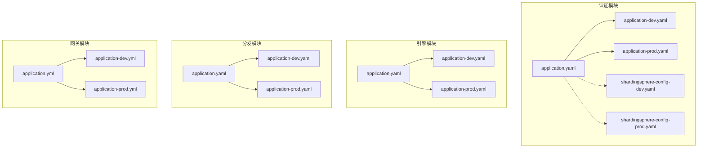
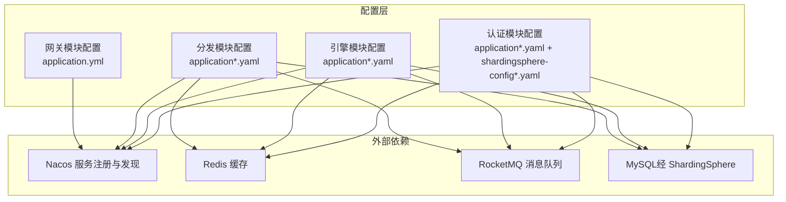
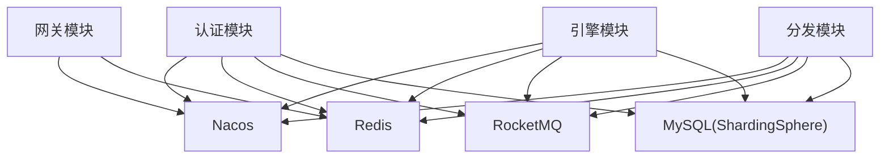

# 配置管理

<cite>
**本文引用的文件**
- [application.yaml（认证模块）](file://auth/src/main/resources/application.yaml)
- [application-dev.yaml（认证模块）](file://auth/src/main/resources/application-dev.yaml)
- [application-prod.yaml（认证模块）](file://auth/src/main/resources/application-prod.yaml)
- [shardingsphere-config-dev.yaml（认证模块）](file://auth/src/main/resources/shardingsphere-config-dev.yaml)
- [shardingsphere-config-prod.yaml（认证模块）](file://auth/src/main/resources/shardingsphere-config-prod.yaml)
- [application.yaml（引擎模块）](file://engine/src/main/resources/application.yaml)
- [application-dev.yaml（引擎模块）](file://engine/src/main/resources/application-dev.yaml)
- [application-prod.yaml（引擎模块）](file://engine/src/main/resources/application-prod.yaml)
- [application.yaml（分发模块）](file://distribution/src/main/resources/application.yaml)
- [application-dev.yaml（分发模块）](file://distribution/src/main/resources/application-dev.yaml)
- [application-prod.yaml（分发模块）](file://distribution/src/main/resources/application-prod.yaml)
- [application.yaml（网关模块）](file://gateway/src/main/resources/application.yml)
- [application-dev.yml（网关模块）](file://gateway/src/main/resources/application-dev.yml)
- [application-prod.yml（网关模块）](file://gateway/src/main/resources/application-prod.yml)
- [RedisDistributedProperties.java（框架模块）](file://framework/src/main/java/com/fengxin/config/RedisDistributedProperties.java)
- [CacheConfiguration.java（框架模块）](file://framework/src/main/java/com/fengxin/config/CacheConfiguration.java)
- [DataBaseConfiguration.java（认证模块）](file://auth/src/main/java/com/fengxin/maplecoupon/auth/config/DataBaseConfiguration.java)
- [DataBaseConfiguration.java（分发模块）](file://distribution/src/main/java/com/fengxin/maplecoupon/distribution/config/DataBaseConfiguration.java)
</cite>

## 目录
1. [简介](#简介)
2. [项目结构](#项目结构)
3. [核心组件](#核心组件)
4. [架构总览](#架构总览)
5. [详细组件分析](#详细组件分析)
6. [依赖分析](#依赖分析)
7. [性能考虑](#性能考虑)
8. [故障排除指南](#故障排除指南)
9. [结论](#结论)
10. [附录](#附录)

## 简介
本文件系统性梳理 MapleCoupon 的配置管理体系，覆盖多环境配置策略（开发、测试、生产）、Spring Boot 配置文件组织结构、分布式配置中心（Nacos）集成与动态更新、数据库连接与分库分表（ShardingSphere）配置、Redis 缓存配置、消息队列（RocketMQ）配置、安全与访问控制、日志与监控配置、配置验证与故障排除方法，以及配置版本管理与变更审计建议。

## 项目结构
- 模块化配置：每个业务模块（如认证、引擎、分发、网关、商户后台、结算、搜索）均包含独立的 application.yaml 及其环境特定配置文件（application-{env}.yaml 或 application-{env}.yml），用于按环境切换配置。
- 环境激活：通过 spring.profiles.active 激活 dev/prod 等环境；数据库配置通过 database.env 属性选择对应的 ShardingSphere 配置文件。
- 分布式配置中心：各模块在 application-{env}.yaml 中声明 Nacos 地址，实现服务注册与发现及外部化配置拉取。
- 关键基础设施：Redis 作为缓存与会话共享；RocketMQ 作为消息中间件；MyBatis-Plus 提供 ORM 能力与自动填充；ShardingSphere 实现读写分离与分库分表。

图表来源
- [application.yaml（认证模块）:1-19](file://auth/src/main/resources/application.yaml#L1-L19)
- [application-dev.yaml（认证模块）:1-30](file://auth/src/main/resources/application-dev.yaml#L1-L30)
- [application-prod.yaml（认证模块）:1-12](file://auth/src/main/resources/application-prod.yaml#L1-L12)
- [shardingsphere-config-dev.yaml（认证模块）:1-45](file://auth/src/main/resources/shardingsphere-config-dev.yaml#L1-L45)
- [shardingsphere-config-prod.yaml（认证模块）:1-45](file://auth/src/main/resources/shardingsphere-config-prod.yaml#L1-L45)
- [application.yaml（引擎模块）:1-22](file://engine/src/main/resources/application.yaml#L1-L22)
- [application-dev.yaml（引擎模块）:1-37](file://engine/src/main/resources/application-dev.yaml#L1-L37)
- [application-prod.yaml（引擎模块）:1-19](file://engine/src/main/resources/application-prod.yaml#L1-L19)
- [application.yaml（分发模块）:1-15](file://distribution/src/main/resources/application.yaml#L1-L15)
- [application-dev.yaml（分发模块）:1-20](file://distribution/src/main/resources/application-dev.yaml#L1-L20)
- [application-prod.yaml（分发模块）:1-20](file://distribution/src/main/resources/application-prod.yaml#L1-L20)
- [application.yml（网关模块）:1-72](file://gateway/src/main/resources/application.yml#L1-L72)
- [application-dev.yml（网关模块）:1-11](file://gateway/src/main/resources/application-dev.yml#L1-L11)
- [application-prod.yml（网关模块）:1-11](file://gateway/src/main/resources/application-prod.yml#L1-L11)

章节来源
- [application.yaml（认证模块）:1-19](file://auth/src/main/resources/application.yaml#L1-L19)
- [application.yaml（引擎模块）:1-22](file://engine/src/main/resources/application.yaml#L1-L22)
- [application.yaml（分发模块）:1-15](file://distribution/src/main/resources/application.yaml#L1-L15)
- [application.yml（网关模块）:1-72](file://gateway/src/main/resources/application.yml#L1-L72)

## 核心组件
- 多环境配置策略
  - 开发环境（dev）：本地或内网地址，便于联调与调试。
  - 生产环境（prod）：公网地址，强调高可用与安全。
  - 环境切换：通过 spring.profiles.active 激活；数据库通过 database.env 切换 shardingsphere-config-{env}.yaml。
- Spring Boot 配置文件组织
  - 主配置文件：application.yaml 定义端口、应用名、数据源驱动与 URL（指向 ShardingSphere 配置）、MyBatis 日志、以及模块特有参数（如 one-coupon.db-config.db-count）。
  - 环境特定配置：application-{env}.yaml 覆盖 Nacos、Redis、RocketMQ 等外部依赖地址与认证信息。
- 分布式配置中心（Nacos）
  - 认证、引擎、分发、网关模块均在 application-{env}.yaml 中声明 discovery.server-addr，实现服务注册与发现。
- 数据库与分库分表（ShardingSphere）
  - 使用 ShardingSphere 驱动与 YAML 配置，定义多数据源、分片规则与算法，支持 SQL 输出与调试。
- 缓存（Redis）
  - 通过 RedisDistributedProperties 与 CacheConfiguration 统一 Key 前缀与序列化策略，确保跨模块一致性。
- 消息队列（RocketMQ）
  - 各模块在 application-{env}.yaml 中配置 NameServer 与 Producer 组、超时与重试策略。
- 安全与访问控制
  - 网关通过 TokenValidate 过滤器统一鉴权；白名单路径在网关配置中维护。
- 日志与监控
  - 网关暴露 management endpoints，便于健康检查与指标采集。

章节来源
- [application.yaml（认证模块）:1-19](file://auth/src/main/resources/application.yaml#L1-L19)
- [application-dev.yaml（认证模块）:1-30](file://auth/src/main/resources/application-dev.yaml#L1-L30)
- [application-prod.yaml（认证模块）:1-12](file://auth/src/main/resources/application-prod.yaml#L1-L12)
- [application.yaml（引擎模块）:1-22](file://engine/src/main/resources/application.yaml#L1-L22)
- [application-dev.yaml（引擎模块）:1-37](file://engine/src/main/resources/application-dev.yaml#L1-L37)
- [application-prod.yaml（引擎模块）:1-19](file://engine/src/main/resources/application-prod.yaml#L1-L19)
- [application.yaml（分发模块）:1-15](file://distribution/src/main/resources/application.yaml#L1-L15)
- [application-dev.yaml（分发模块）:1-20](file://distribution/src/main/resources/application-dev.yaml#L1-L20)
- [application-prod.yaml（分发模块）:1-20](file://distribution/src/main/resources/application-prod.yaml#L1-L20)
- [application.yml（网关模块）:1-72](file://gateway/src/main/resources/application.yml#L1-L72)
- [application-dev.yml（网关模块）:1-11](file://gateway/src/main/resources/application-dev.yml#L1-L11)
- [application-prod.yml（网关模块）:1-11](file://gateway/src/main/resources/application-prod.yml#L1-L11)
- [RedisDistributedProperties.java（框架模块）:1-25](file://framework/src/main/java/com/fengxin/config/RedisDistributedProperties.java#L1-L25)
- [CacheConfiguration.java（框架模块）:1-35](file://framework/src/main/java/com/fengxin/config/CacheConfiguration.java#L1-L35)

## 架构总览
下图展示配置在各模块中的分布与交互关系，突出 Nacos 注册与发现、ShardingSphere 数据源、Redis 缓存与 RocketMQ 消息流。

图表来源
- [application.yaml（认证模块）:1-19](file://auth/src/main/resources/application.yaml#L1-L19)
- [application-dev.yaml（认证模块）:1-30](file://auth/src/main/resources/application-dev.yaml#L1-L30)
- [application-prod.yaml（认证模块）:1-12](file://auth/src/main/resources/application-prod.yaml#L1-L12)
- [application.yaml（引擎模块）:1-22](file://engine/src/main/resources/application.yaml#L1-L22)
- [application-dev.yaml（引擎模块）:1-37](file://engine/src/main/resources/application-dev.yaml#L1-L37)
- [application-prod.yaml（引擎模块）:1-19](file://engine/src/main/resources/application-prod.yaml#L1-L19)
- [application.yaml（分发模块）:1-15](file://distribution/src/main/resources/application.yaml#L1-L15)
- [application-dev.yaml（分发模块）:1-20](file://distribution/src/main/resources/application-dev.yaml#L1-L20)
- [application-prod.yaml（分发模块）:1-20](file://distribution/src/main/resources/application-prod.yaml#L1-L20)
- [application.yml（网关模块）:1-72](file://gateway/src/main/resources/application.yml#L1-L72)

## 详细组件分析

### 多环境配置策略与管理
- 环境变量与文件映射
  - database.env：决定加载 shardingsphere-config-{env}.yaml，从而切换数据库集群与账号密码。
  - spring.profiles.active：决定加载 application-{env}.yaml，从而切换 Nacos、Redis、RocketMQ 等外部依赖地址。
- 开发与生产差异
  - 认证模块：Redis 密码与数据库编号不同；RocketMQ Producer Group 不同；Swagger 文档配置一致。
  - 引擎模块：与认证模块类似，但 one-coupon.user-coupon-list.save-cache.type 为 direct。
  - 分发模块：与认证模块类似，但 RocketMQ Producer Group 以 distribution 命名。
  - 网关模块：路由与过滤器配置一致，但 Redis 与 Nacos 地址随 env 变更。
- 动态更新与热部署
  - 建议：将敏感配置（如 Redis 密码、数据库密码、Nacos 地址）托管至 Nacos，启用动态刷新与灰度发布，避免重启生效。

章节来源
- [application.yaml（认证模块）:1-19](file://auth/src/main/resources/application.yaml#L1-L19)
- [application-dev.yaml（认证模块）:1-30](file://auth/src/main/resources/application-dev.yaml#L1-L30)
- [application-prod.yaml（认证模块）:1-12](file://auth/src/main/resources/application-prod.yaml#L1-L12)
- [application.yaml（引擎模块）:1-22](file://engine/src/main/resources/application.yaml#L1-L22)
- [application-dev.yaml（引擎模块）:1-37](file://engine/src/main/resources/application-dev.yaml#L1-L37)
- [application-prod.yaml（引擎模块）:1-19](file://engine/src/main/resources/application-prod.yaml#L1-L19)
- [application.yaml（分发模块）:1-15](file://distribution/src/main/resources/application.yaml#L1-L15)
- [application-dev.yaml（分发模块）:1-20](file://distribution/src/main/resources/application-dev.yaml#L1-L20)
- [application-prod.yaml（分发模块）:1-20](file://distribution/src/main/resources/application-prod.yaml#L1-L20)
- [application.yml（网关模块）:1-72](file://gateway/src/main/resources/application.yml#L1-L72)
- [application-dev.yml（网关模块）:1-11](file://gateway/src/main/resources/application-dev.yml#L1-L11)
- [application-prod.yml（网关模块）:1-11](file://gateway/src/main/resources/application-prod.yml#L1-L11)

### Spring Boot 配置文件组织结构
- 主配置文件职责
  - 定义服务端口、应用名、数据源驱动与 URL（指向 ShardingSphere 配置）、MyBatis 日志实现。
  - 模块特有参数（如 one-coupon.db-config.db-count）集中在此。
- 环境特定配置文件职责
  - 覆盖 Nacos、Redis、RocketMQ 等外部依赖地址与认证信息。
  - Swagger/Knife4j 文档路径与扫描包在认证与引擎模块中配置。
- 配置优先级
  - application-{env}.yaml 覆盖 application.yaml；database.env 决定 shardingsphere-config 加载哪一个。

章节来源
- [application.yaml（认证模块）:1-19](file://auth/src/main/resources/application.yaml#L1-L19)
- [application-dev.yaml（认证模块）:1-30](file://auth/src/main/resources/application-dev.yaml#L1-L30)
- [application-prod.yaml（认证模块）:1-12](file://auth/src/main/resources/application-prod.yaml#L1-L12)
- [application.yaml（引擎模块）:1-22](file://engine/src/main/resources/application.yaml#L1-L22)
- [application-dev.yaml（引擎模块）:1-37](file://engine/src/main/resources/application-dev.yaml#L1-L37)
- [application-prod.yaml（引擎模块）:1-19](file://engine/src/main/resources/application-prod.yaml#L1-L19)
- [application.yaml（分发模块）:1-15](file://distribution/src/main/resources/application.yaml#L1-L15)
- [application-dev.yaml（分发模块）:1-20](file://distribution/src/main/resources/application-dev.yaml#L1-L20)
- [application-prod.yaml（分发模块）:1-20](file://distribution/src/main/resources/application-prod.yaml#L1-L20)

### 分布式配置中心（Nacos）集成
- 集成方式
  - 各模块在 application-{env}.yaml 中配置 spring.cloud.nacos.discovery.server-addr。
- 动态更新与热部署
  - 建议：将敏感配置迁移至 Nacos，结合 Spring Cloud Alibaba 生态实现动态刷新与灰度发布。
  - 对于非敏感配置（如 Swagger 路径），可在 Nacos 中按需调整并触发刷新。

章节来源
- [application-dev.yaml（认证模块）:1-30](file://auth/src/main/resources/application-dev.yaml#L1-L30)
- [application-prod.yaml（认证模块）:1-12](file://auth/src/main/resources/application-prod.yaml#L1-L12)
- [application-dev.yaml（引擎模块）:1-37](file://engine/src/main/resources/application-dev.yaml#L1-L37)
- [application-prod.yaml（引擎模块）:1-19](file://engine/src/main/resources/application-prod.yaml#L1-L19)
- [application-dev.yml（网关模块）:1-11](file://gateway/src/main/resources/application-dev.yml#L1-L11)
- [application-prod.yml（网关模块）:1-11](file://gateway/src/main/resources/application-prod.yml#L1-L11)

### 数据库连接与分库分表（ShardingSphere）
- 配置要点
  - 数据源：定义多个逻辑数据源（ds_0、ds_1），分别指向不同物理库。
  - 分片规则：针对 coupon_user 表进行库与表的分片，分片键为 username，采用基于类的分片算法。
  - SQL 输出：开启 sql-show 便于开发调试。
- 环境差异
  - 开发与生产使用不同的数据库主机与账号密码，保证隔离与安全。
- 最佳实践
  - 生产环境关闭 sql-show；为分片算法预留扩展点；对热点表与字段进行容量评估与扩容规划。

章节来源
- [shardingsphere-config-dev.yaml（认证模块）:1-45](file://auth/src/main/resources/shardingsphere-config-dev.yaml#L1-L45)
- [shardingsphere-config-prod.yaml（认证模块）:1-45](file://auth/src/main/resources/shardingsphere-config-prod.yaml#L1-L45)
- [application.yaml（认证模块）:1-19](file://auth/src/main/resources/application.yaml#L1-L19)
- [application.yaml（引擎模块）:1-22](file://engine/src/main/resources/application.yaml#L1-L22)
- [application.yaml（分发模块）:1-15](file://distribution/src/main/resources/application.yaml#L1-L15)

### Redis 配置与缓存策略
- 配置属性
  - Redis 主机、端口、密码、数据库索引在 application-{env}.yaml 中配置。
  - 通过 RedisDistributedProperties 与 CacheConfiguration 统一 Key 前缀与序列化策略。
- 使用建议
  - Key 前缀统一前缀策略，避免键冲突；根据业务划分数据库索引；生产环境开启密码与网络隔离。

章节来源
- [application-dev.yaml（认证模块）:1-30](file://auth/src/main/resources/application-dev.yaml#L1-L30)
- [application-prod.yaml（认证模块）:1-12](file://auth/src/main/resources/application-prod.yaml#L1-L12)
- [application-dev.yaml（引擎模块）:1-37](file://engine/src/main/resources/application-dev.yaml#L1-L37)
- [application-prod.yaml（引擎模块）:1-19](file://engine/src/main/resources/application-prod.yaml#L1-L19)
- [application-dev.yml（网关模块）:1-11](file://gateway/src/main/resources/application-dev.yml#L1-L11)
- [application-prod.yml（网关模块）:1-11](file://gateway/src/main/resources/application-prod.yml#L1-L11)
- [RedisDistributedProperties.java（框架模块）:1-25](file://framework/src/main/java/com/fengxin/config/RedisDistributedProperties.java#L1-L25)
- [CacheConfiguration.java（框架模块）:1-35](file://framework/src/main/java/com/fengxin/config/CacheConfiguration.java#L1-L35)

### 消息队列（RocketMQ）配置
- 配置要点
  - NameServer 地址与 Producer 组在 application-{env}.yaml 中配置。
  - 发送超时、同步/异步重试次数按模块需求设定。
- 环境差异
  - 开发与生产使用不同的 NameServer 与 Producer Group，便于隔离与追踪。
- 最佳实践
  - 为不同业务域划分 Producer Group；合理设置超时与重试；结合消费者组实现水平扩展。

章节来源
- [application-dev.yaml（认证模块）:1-30](file://auth/src/main/resources/application-dev.yaml#L1-L30)
- [application-prod.yaml（认证模块）:1-12](file://auth/src/main/resources/application-prod.yaml#L1-L12)
- [application-dev.yaml（引擎模块）:1-37](file://engine/src/main/resources/application-dev.yaml#L1-L37)
- [application-prod.yaml（引擎模块）:1-19](file://engine/src/main/resources/application-prod.yaml#L1-L19)
- [application-dev.yaml（分发模块）:1-20](file://distribution/src/main/resources/application-dev.yaml#L1-L20)
- [application-prod.yaml（分发模块）:1-20](file://distribution/src/main/resources/application-prod.yaml#L1-L20)

### 安全配置与访问控制
- 认证与授权
  - 网关通过 TokenValidate 过滤器统一鉴权；白名单路径在网关配置中维护，减少对登录接口的拦截成本。
- 敏感信息保护
  - 建议：将 Redis 密码、数据库密码、Nacos 地址等敏感信息迁移到 Nacos 并启用加密存储；生产环境严格限制网络访问。
- 最佳实践
  - 采用最小权限原则；定期轮换密钥；对关键接口启用限流与风控。

章节来源
- [application.yml（网关模块）:1-72](file://gateway/src/main/resources/application.yml#L1-L72)
- [application-dev.yml（网关模块）:1-11](file://gateway/src/main/resources/application-dev.yml#L1-L11)
- [application-prod.yml（网关模块）:1-11](file://gateway/src/main/resources/application-prod.yml#L1-L11)

### 日志与监控配置
- 网关监控
  - management.endpoints.web.exposure.include=* 暴露所有端点，便于健康检查与指标采集。
- 日志输出
  - 认证模块开启 MyBatis SQL 日志输出，便于开发调试；生产环境建议关闭或降级到 INFO。
- 建议
  - 统一日志格式与采集；结合 APM 工具实现链路追踪与告警。

章节来源
- [application.yml（网关模块）:65-72](file://gateway/src/main/resources/application.yml#L65-L72)
- [application.yaml（认证模块）:12-14](file://auth/src/main/resources/application.yaml#L12-L14)
- [application-dev.yaml（认证模块）:1-30](file://auth/src/main/resources/application-dev.yaml#L1-L30)

### 配置验证与故障排除
- 配置验证
  - 启动参数校验：确认 spring.profiles.active 与 database.env 是否正确。
  - 连通性验证：使用 curl/浏览器访问 Swagger/Knife4j 文档路径与 /actuator 端点。
  - 依赖连通性：验证 Nacos、Redis、RocketMQ、数据库连通性。
- 常见问题定位
  - 端口冲突：检查 server.port 是否被占用。
  - 环境错配：确认 application-{env}.yaml 与 shardingsphere-config-{env}.yaml 是否匹配。
  - 权限错误：核对 Redis 密码、数据库账号密码是否正确。
- 建议工具
  - Postman/JMeter：接口与压测验证。
  - Nacos 控制台：查看配置发布与订阅状态。
  - Prometheus/Grafana：结合 management.metrics 标签进行可视化。

章节来源
- [application.yml（网关模块）:1-72](file://gateway/src/main/resources/application.yml#L1-L72)
- [application-dev.yaml（认证模块）:1-30](file://auth/src/main/resources/application-dev.yaml#L1-L30)
- [application-prod.yaml（认证模块）:1-12](file://auth/src/main/resources/application-prod.yaml#L1-L12)
- [shardingsphere-config-dev.yaml（认证模块）:1-45](file://auth/src/main/resources/shardingsphere-config-dev.yaml#L1-L45)
- [shardingsphere-config-prod.yaml（认证模块）:1-45](file://auth/src/main/resources/shardingsphere-config-prod.yaml#L1-L45)

### 配置版本管理与变更审计
- 版本管理
  - 将 application*.yaml 与 shardingsphere-config*.yaml 纳入 Git 管理，分支策略区分 feature/dev/prod。
- 变更审计
  - 提交信息明确变更内容与影响范围；在 Nacos 中记录配置变更历史与责任人。
- 建议流程
  - 变更 → 测试验证 → Nacos 发布 → 灰度验证 → 全量发布 → 回滚预案。

章节来源
- [application.yaml（认证模块）:1-19](file://auth/src/main/resources/application.yaml#L1-L19)
- [application-dev.yaml（认证模块）:1-30](file://auth/src/main/resources/application-dev.yaml#L1-L30)
- [application-prod.yaml（认证模块）:1-12](file://auth/src/main/resources/application-prod.yaml#L1-L12)
- [application.yaml（引擎模块）:1-22](file://engine/src/main/resources/application.yaml#L1-L22)
- [application-dev.yaml（引擎模块）:1-37](file://engine/src/main/resources/application-dev.yaml#L1-L37)
- [application-prod.yaml（引擎模块）:1-19](file://engine/src/main/resources/application-prod.yaml#L1-L19)
- [application.yaml（分发模块）:1-15](file://distribution/src/main/resources/application.yaml#L1-L15)
- [application-dev.yaml（分发模块）:1-20](file://distribution/src/main/resources/application-dev.yaml#L1-L20)
- [application-prod.yaml（分发模块）:1-20](file://distribution/src/main/resources/application-prod.yaml#L1-L20)
- [application.yml（网关模块）:1-72](file://gateway/src/main/resources/application.yml#L1-L72)
- [application-dev.yml（网关模块）:1-11](file://gateway/src/main/resources/application-dev.yml#L1-L11)
- [application-prod.yml（网关模块）:1-11](file://gateway/src/main/resources/application-prod.yml#L1-L11)

## 依赖分析
- 模块间耦合
  - 认证、引擎、分发、网关模块均依赖 Nacos 与 Redis；引擎与分发模块额外依赖 RocketMQ。
  - 认证模块与引擎模块共享部分枚举与常量，但配置上相互独立。
- 外部依赖
  - ShardingSphere 驱动与 YAML 配置；MyBatis-Plus 插件；Spring Cloud Alibaba（Nacos）；RocketMQ 客户端。
- 优化建议
  - 统一依赖版本；对共享配置抽象为公共模块；对敏感配置进行集中化与加密存储。

图表来源
- [application.yaml（认证模块）:1-19](file://auth/src/main/resources/application.yaml#L1-L19)
- [application.yaml（引擎模块）:1-22](file://engine/src/main/resources/application.yaml#L1-L22)
- [application.yaml（分发模块）:1-15](file://distribution/src/main/resources/application.yaml#L1-L15)
- [application.yml（网关模块）:1-72](file://gateway/src/main/resources/application.yml#L1-L72)

章节来源
- [application.yaml（认证模块）:1-19](file://auth/src/main/resources/application.yaml#L1-L19)
- [application.yaml（引擎模块）:1-22](file://engine/src/main/resources/application.yaml#L1-L22)
- [application.yaml（分发模块）:1-15](file://distribution/src/main/resources/application.yaml#L1-L15)
- [application.yml（网关模块）:1-72](file://gateway/src/main/resources/application.yml#L1-L72)

## 性能考虑
- 数据库层面
  - 分片键选择与算法需与查询模式匹配；生产环境关闭 SQL 输出；对热点表建立索引与读写分离。
- 缓存层面
  - Key 前缀统一、TTL 合理设置；区分冷热数据；Redis 集群化与持久化策略。
- 消息层面
  - Producer Group 合理拆分；批量发送与压缩；消费者组水平扩展。
- 网关层面
  - 合理设置超时与重试；开启必要的限流与熔断；暴露必要端点以便监控。

## 故障排除指南
- 启动失败
  - 检查 spring.profiles.active 与 database.env 是否正确；确认 Nacos、Redis、NameServer 可达。
- 接口异常
  - 查看 Swagger/Knife4j 文档路径与扫描包配置；核对白名单与过滤器配置。
- 数据不一致
  - 检查分片规则与分片键；确认 ShardingSphere 配置与数据库实际结构一致。
- 性能问题
  - 关闭开发期 SQL 输出；优化查询与索引；评估分片算法与热点数据。

章节来源
- [application.yml（网关模块）:1-72](file://gateway/src/main/resources/application.yml#L1-L72)
- [application-dev.yaml（认证模块）:1-30](file://auth/src/main/resources/application-dev.yaml#L1-L30)
- [application-prod.yaml（认证模块）:1-12](file://auth/src/main/resources/application-prod.yaml#L1-L12)
- [shardingsphere-config-dev.yaml（认证模块）:1-45](file://auth/src/main/resources/shardingsphere-config-dev.yaml#L1-L45)
- [shardingsphere-config-prod.yaml（认证模块）:1-45](file://auth/src/main/resources/shardingsphere-config-prod.yaml#L1-L45)

## 结论
MapleCoupon 的配置体系以模块化与环境化为核心，结合 Nacos 实现外部化配置与动态更新，辅以 ShardingSphere、Redis、RocketMQ 等基础设施满足高并发场景下的性能与可靠性要求。建议进一步完善敏感配置的集中化与加密存储、灰度发布与回滚机制，以及统一的日志与监控体系，以提升整体运维效率与安全性。

## 附录
- 关键配置项速查
  - 环境激活：spring.profiles.active
  - 数据库配置：database.env 与 shardingsphere-config-{env}.yaml
  - Nacos 地址：spring.cloud.nacos.discovery.server-addr
  - Redis：spring.data.redis.host/port/password/database
  - RocketMQ：rocketmq.name-server 与 producer.group
  - Swagger/Knife4j：springdoc/knife4j 路径与扫描包
  - 管理端点：management.endpoints.web.exposure.include