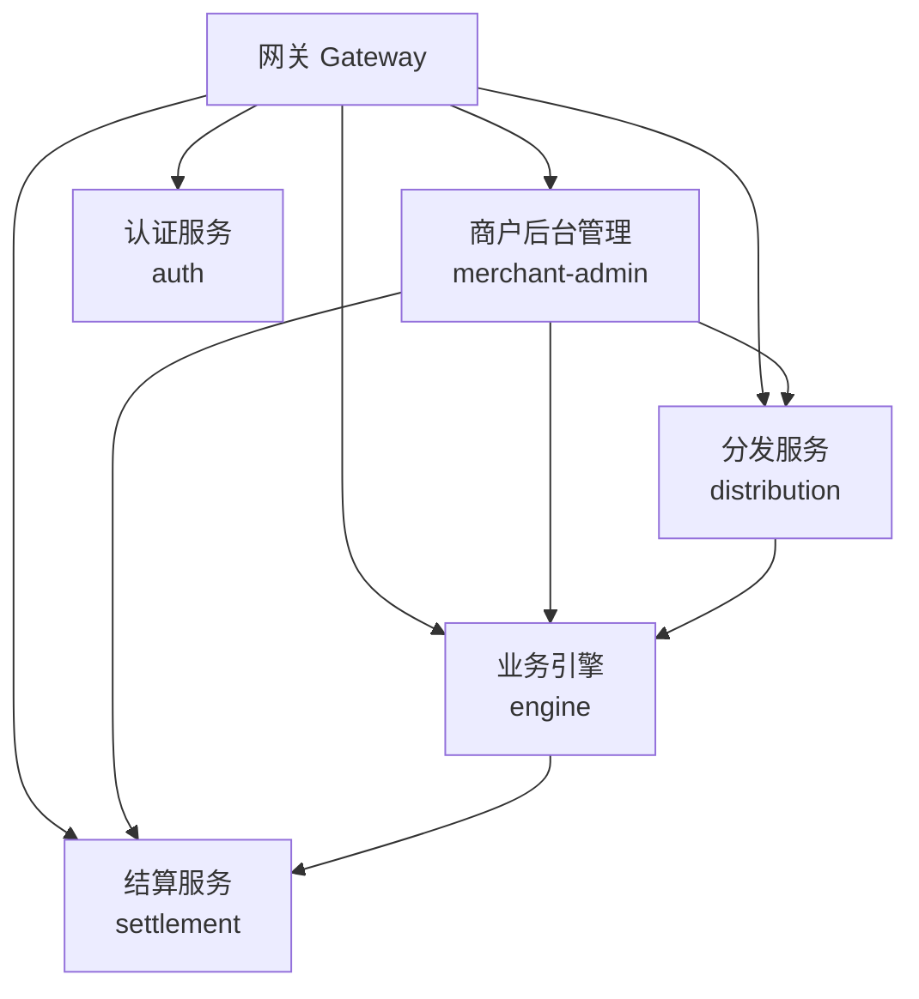
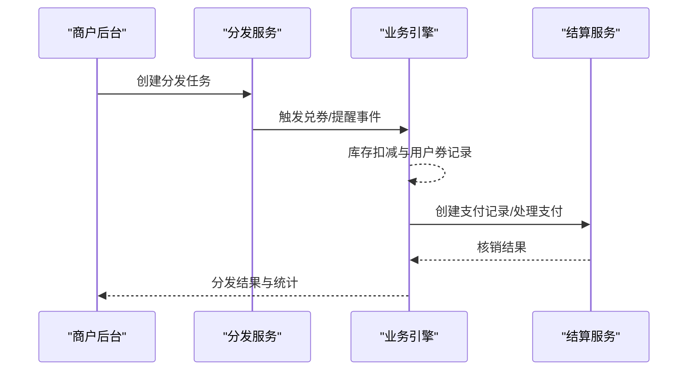
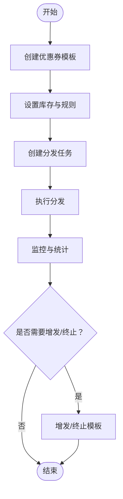
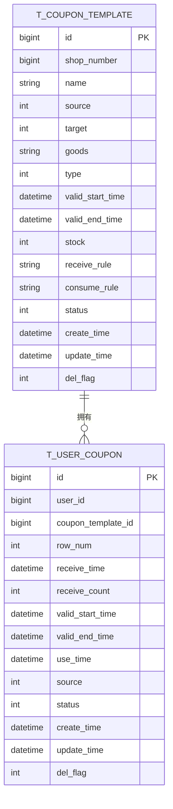
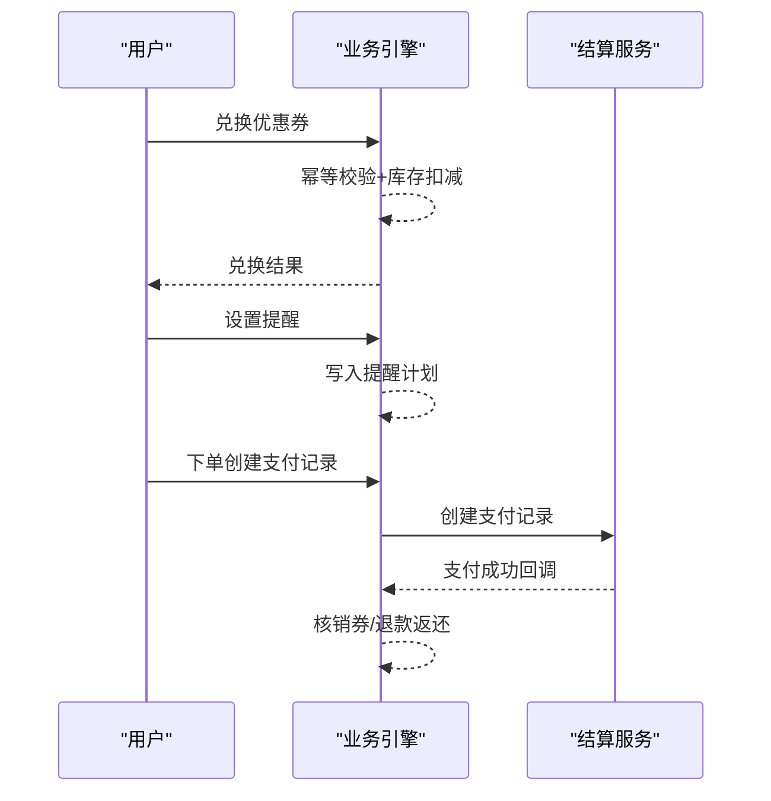
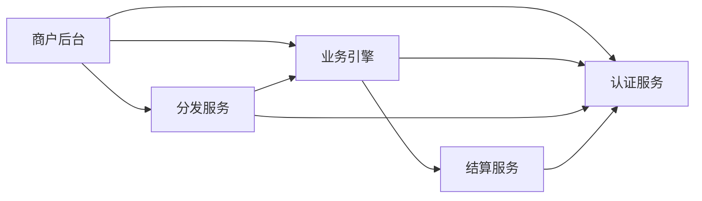

# 业务价值与应用场景

<cite>
**本文引用的文件**
- [README.md](file://README.md)
- [AuthApplication.java](file://auth/src/main/java/com/fengxin/maplecoupon/auth/AuthApplication.java)
- [EngineApplication.java](file://engine/src/main/java/com/fengxin/maplecoupon/engine/EngineApplication.java)
- [DistributionApplication.java](file://distribution/src/main/java/com/fengxin/maplecoupon/distribution/DistributionApplication.java)
- [MerchantAdminApplication.java](file://merchant-admin/src/main/java/com/fengxin/maplecoupon/merchantadmin/MerchantAdminApplication.java)
- [SettlementApplication.java](file://settlement/src/main/java/com/fengxin/maplecoupon/settlement/SettlementApplication.java)
- [CouponTemplateController.java（引擎）](file://engine/src/main/java/com/fengxin/maplecoupon/engine/controller/CouponTemplateController.java)
- [UserCouponController.java（引擎）](file://engine/src/main/java/com/fengxin/maplecoupon/engine/controller/UserCouponController.java)
- [CouponTemplateController（商户后台）](file://merchant-admin/src/main/java/com/fengxin/maplecoupon/merchantadmin/controller/CouponTemplateController.java)
- [CouponTaskController（商户后台）](file://merchant-admin/src/main/java/com/fengxin/maplecoupon/merchantadmin/controller/CouponTaskController.java)
- [CouponTemplateDO.java（分发）](file://distribution/src/main/java/com/fengxin/maplecoupon/distribution/dao/entity/CouponTemplateDO.java)
- [UserCouponDO.java（分发）](file://distribution/src/main/java/com/fengxin/maplecoupon/distribution/dao/entity/UserCouponDO.java)
</cite>

## 目录
1. [引言](#引言)
2. [项目结构](#项目结构)
3. [核心组件](#核心组件)
4. [架构总览](#架构总览)
5. [详细组件分析](#详细组件分析)
6. [依赖关系分析](#依赖关系分析)
7. [性能考量](#性能考量)
8. [故障排查指南](#故障排查指南)
9. [结论](#结论)
10. [附录](#附录)

## 引言
MapleCoupon是一个面向企业与商户的第三方优惠券系统，提供从模板创建、库存分发、用户领取、核销结算到提醒通知的全链路能力。系统通过多模块协同与高可用技术栈支撑百万级用户规模的优惠券分发与并发场景，具备降低运营成本、提升用户体验、增强营销效果的显著业务价值。

- 降低运营成本：通过标准化模板与自动化分发任务，减少人工干预；通过库存与并发控制保障资源不被超卖，避免损失。
- 提升用户体验：提供预约提醒、多渠道通知、灵活核销与退款处理，提升用户参与度与满意度。
- 增强营销效果：支持多种折扣类型与适用范围配置，结合库存与规则控制，实现精准营销与高效转化。

## 项目结构
系统采用微服务分层架构，围绕“商户后台管理—分发引擎—业务引擎—结算—认证网关”的职责划分，配合分布式缓存、消息队列、分库分表与幂等防护，形成高可用、高性能的优惠券业务平台。

图表来源
- [AuthApplication.java:1-26](file://auth/src/main/java/com/fengxin/maplecoupon/auth/AuthApplication.java#L1-L26)
- [EngineApplication.java:1-19](file://engine/src/main/java/com/fengxin/maplecoupon/engine/EngineApplication.java#L1-L19)
- [DistributionApplication.java:1-19](file://distribution/src/main/java/com/fengxin/maplecoupon/distribution/DistributionApplication.java#L1-L19)
- [MerchantAdminApplication.java:1-22](file://merchant-admin/src/main/java/com/fengxin/maplecoupon/merchantadmin/MerchantAdminApplication.java#L1-L22)
- [SettlementApplication.java:1-17](file://settlement/src/main/java/com/fengxin/maplecoupon/settlement/SettlementApplication.java#L1-L17)

章节来源
- [README.md:1-10](file://README.md#L1-L10)
- [AuthApplication.java:1-26](file://auth/src/main/java/com/fengxin/maplecoupon/auth/AuthApplication.java#L1-L26)
- [EngineApplication.java:1-19](file://engine/src/main/java/com/fengxin/maplecoupon/engine/EngineApplication.java#L1-L19)
- [DistributionApplication.java:1-19](file://distribution/src/main/java/com/fengxin/maplecoupon/distribution/DistributionApplication.java#L1-L19)
- [MerchantAdminApplication.java:1-22](file://merchant-admin/src/main/java/com/fengxin/maplecoupon/merchantadmin/MerchantAdminApplication.java#L1-L22)
- [SettlementApplication.java:1-17](file://settlement/src/main/java/com/fengxin/maplecoupon/settlement/SettlementApplication.java#L1-L17)

## 核心组件
- 商户后台管理（merchant-admin）
  - 职责：创建与管理优惠券模板、增发库存、终止模板、创建分发任务等。
  - 关键接口：模板创建、分页查询、详情查询、增发库存、终止模板、删除模板、创建分发任务。
- 分发服务（distribution）
  - 职责：按批次向用户分发优惠券，支持应用弹窗、站内信、短信等提醒方式。
  - 关键实体：优惠券模板、用户优惠券记录。
- 业务引擎（engine）
  - 职责：券模板查询、用户兑券、设置提醒、创建/处理/退款支付记录、监听延迟关闭与提醒事件。
  - 关键接口：兑券、设置提醒、查询提醒列表、取消提醒、创建支付记录、处理支付、处理退款。
- 结算服务（settlement）
  - 职责：订单金额计算与优惠券核销后的结算处理。
- 认证服务（auth）
  - 职责：统一认证与用户上下文传递，支撑跨服务鉴权与拦截。

章节来源
- [CouponTemplateController（商户后台）:1-74](file://merchant-admin/src/main/java/com/fengxin/maplecoupon/merchantadmin/controller/CouponTemplateController.java#L1-L74)
- [CouponTaskController（商户后台）:1-40](file://merchant-admin/src/main/java/com/fengxin/maplecoupon/merchantadmin/controller/CouponTaskController.java#L1-L40)
- [CouponTemplateController（引擎）:1-34](file://engine/src/main/java/com/fengxin/maplecoupon/engine/controller/CouponTemplateController.java#L1-L34)
- [UserCouponController.java（引擎）:1-83](file://engine/src/main/java/com/fengxin/maplecoupon/engine/controller/UserCouponController.java#L1-L83)
- [CouponTemplateDO.java（分发）:1-109](file://distribution/src/main/java/com/fengxin/maplecoupon/distribution/dao/entity/CouponTemplateDO.java#L1-L109)
- [UserCouponDO.java（分发）:1-100](file://distribution/src/main/java/com/fengxin/maplecoupon/distribution/dao/entity/UserCouponDO.java#L1-L100)

## 架构总览
系统以“模板—库存—用户持有—核销/退款—结算”为主线，贯穿商户侧的策略制定与运营，以及用户侧的领取体验与使用闭环。

图表来源
- [CouponTaskController（商户后台）:32-38](file://merchant-admin/src/main/java/com/fengxin/maplecoupon/merchantadmin/controller/CouponTaskController.java#L32-L38)
- [UserCouponController.java（引擎）:32-80](file://engine/src/main/java/com/fengxin/maplecoupon/engine/controller/UserCouponController.java#L32-L80)
- [CouponTemplateController（引擎）:27-31](file://engine/src/main/java/com/fengxin/maplecoupon/engine/controller/CouponTemplateController.java#L27-L31)

## 详细组件分析

### 组件一：商户后台管理（模板与任务）
- 业务价值
  - 快速上线：标准化模板创建与规则配置，缩短营销活动准备周期。
  - 精准运营：支持增发库存、终止模板、删除模板等操作，灵活应对活动节奏。
  - 自动化分发：通过任务创建与执行，降低人工成本并提高一致性。
- 典型流程
  - 创建模板 → 设置库存与规则 → 创建分发任务 → 观察分发结果与统计 → 终止/删除模板收尾。

图表来源
- [CouponTemplateController（商户后台）:31-64](file://merchant-admin/src/main/java/com/fengxin/maplecoupon/merchantadmin/controller/CouponTemplateController.java#L31-L64)
- [CouponTaskController（商户后台）:32-38](file://merchant-admin/src/main/java/com/fengxin/maplecoupon/merchantadmin/controller/CouponTaskController.java#L32-L38)

章节来源
- [CouponTemplateController（商户后台）:1-74](file://merchant-admin/src/main/java/com/fengxin/maplecoupon/merchantadmin/controller/CouponTemplateController.java#L1-L74)
- [CouponTaskController（商户后台）:1-40](file://merchant-admin/src/main/java/com/fengxin/maplecoupon/merchantadmin/controller/CouponTaskController.java#L1-L40)

### 组件二：分发服务（库存与用户券）
- 业务价值
  - 高并发安全：通过库存扣减与批量保存的组合机制，保证在高并发下不超发。
  - 多渠道提醒：支持应用弹窗、站内信、短信等提醒方式，提升用户触达率。
- 数据模型
  - 优惠券模板：包含来源、适用对象、有效期、库存、状态等字段。
  - 用户优惠券：包含用户ID、模板ID、有效期、状态、来源等字段。

图表来源
- [CouponTemplateDO.java（分发）:24-108](file://distribution/src/main/java/com/fengxin/maplecoupon/distribution/dao/entity/CouponTemplateDO.java#L24-L108)
- [UserCouponDO.java（分发）:24-96](file://distribution/src/main/java/com/fengxin/maplecoupon/distribution/dao/entity/UserCouponDO.java#L24-L96)

章节来源
- [CouponTemplateDO.java（分发）:1-109](file://distribution/src/main/java/com/fengxin/maplecoupon/distribution/dao/entity/CouponTemplateDO.java#L1-L109)
- [UserCouponDO.java（分发）:1-100](file://distribution/src/main/java/com/fengxin/maplecoupon/distribution/dao/entity/UserCouponDO.java#L1-L100)

### 组件三：业务引擎（兑券、提醒与结算）
- 业务价值
  - 兑券即秒杀：针对高并发兑券场景，提供幂等与库存扣减保障，确保用户体验与数据一致。
  - 提醒闭环：支持设置/查询/取消提醒，结合延迟消息与提醒事件，提升用户到店转化。
  - 结算联动：与订单系统对接，完成支付前锁定、支付后核销、退款后返还的完整闭环。
- 关键接口
  - 兑换优惠券模板、设置提醒、查询提醒列表、取消提醒、创建支付记录、处理支付、处理退款。

图表来源
- [UserCouponController.java（引擎）:32-80](file://engine/src/main/java/com/fengxin/maplecoupon/engine/controller/UserCouponController.java#L32-L80)
- [CouponTemplateController（引擎）:27-31](file://engine/src/main/java/com/fengxin/maplecoupon/engine/controller/CouponTemplateController.java#L27-L31)

章节来源
- [CouponTemplateController（引擎）:1-34](file://engine/src/main/java/com/fengxin/maplecoupon/engine/controller/CouponTemplateController.java#L1-L34)
- [UserCouponController.java（引擎）:1-83](file://engine/src/main/java/com/fengxin/maplecoupon/engine/controller/UserCouponController.java#L1-L83)

### 组件四：结算服务（订单金额计算与核销）
- 业务价值
  - 流量大但稳定：作为订单金额计算与核销结算的关键节点，保障交易准确性与一致性。
  - 与引擎解耦：通过消息或远程调用与引擎协作，降低耦合度与单点风险。
- 关键职责
  - 接收引擎创建的支付记录，完成核销与退款处理，输出结算结果。

章节来源
- [SettlementApplication.java:1-17](file://settlement/src/main/java/com/fengxin/maplecoupon/settlement/SettlementApplication.java#L1-L17)

### 组件五：认证服务（用户上下文与鉴权）
- 业务价值
  - 统一鉴权：为各服务提供用户上下文传递与鉴权拦截，保障接口安全与数据隔离。
  - 跨服务协作：通过OpenFeign与拦截器，实现用户信息在微服务间的透明传递。
- 关键职责
  - 启动与扫描、Feign客户端启用、拦截器装配。

章节来源
- [AuthApplication.java:1-26](file://auth/src/main/java/com/fengxin/maplecoupon/auth/AuthApplication.java#L1-L26)

## 依赖关系分析
- 模块间依赖
  - 商户后台管理依赖分发与业务引擎进行模板与任务编排。
  - 分发服务依赖业务引擎完成兑券与提醒事件处理。
  - 业务引擎与结算服务通过接口或消息交互，完成支付与核销闭环。
- 外部依赖
  - 缓存与消息队列用于高并发与异步解耦。
  - 分库分表与幂等注解用于数据一致性与性能优化。

图表来源
- [MerchantAdminApplication.java:1-22](file://merchant-admin/src/main/java/com/fengxin/maplecoupon/merchantadmin/MerchantAdminApplication.java#L1-L22)
- [DistributionApplication.java:1-19](file://distribution/src/main/java/com/fengxin/maplecoupon/distribution/DistributionApplication.java#L1-L19)
- [EngineApplication.java:1-19](file://engine/src/main/java/com/fengxin/maplecoupon/engine/EngineApplication.java#L1-L19)
- [SettlementApplication.java:1-17](file://settlement/src/main/java/com/fengxin/maplecoupon/settlement/SettlementApplication.java#L1-L17)
- [AuthApplication.java:1-26](file://auth/src/main/java/com/fengxin/maplecoupon/auth/AuthApplication.java#L1-L26)

## 性能考量
- 并发与库存
  - 兑券场景类似“秒杀”，需通过幂等、库存扣减与批量写入组合，避免超卖与抖动。
- 缓存与限流
  - 利用缓存降低热点模板查询压力，结合限流与降级策略保障系统稳定性。
- 异步与削峰
  - 通过消息队列异步处理兑券、提醒与结算事件，削峰填谷，提升整体吞吐。
- 分库分表
  - 对用户券与模板等关键表进行分片，缓解单表压力，提升查询与写入效率。

## 故障排查指南
- 兑券失败
  - 检查库存扣减是否成功、是否存在重复提交、是否命中缓存异常。
- 提醒未送达
  - 核对提醒任务是否正确创建、消息队列消费是否正常、通知渠道是否可用。
- 结算异常
  - 核对支付记录状态、核销与退款事件是否正确触发、与引擎的调用链路是否畅通。
- 用户态问题
  - 检查认证服务的拦截器与上下文传递是否正常，确认用户信息在各服务可见。

## 结论
MapleCoupon通过清晰的模块边界与高可用技术栈，为企业与商户提供了低成本、高可靠的优惠券全生命周期管理能力。其在库存安全、并发处理、提醒通知与结算闭环方面的设计，能够有效解决传统优惠券管理中的痛点，助力企业实现更高效、更精准的营销投放与用户运营。

## 附录
- 典型应用场景
  - 电商平台促销活动：大促期间的高并发兑券、限时抢购与库存风控。
  - 线下商户营销推广：到店核销、短信/站内信提醒与会员券池管理。
  - 连锁品牌会员管理：多门店通用券、分店券与跨店核销的统一治理。
- 市场定位与优势
  - 定位：中大型电商与连锁零售企业的优惠券基础设施。
  - 优势：模块化设计、高并发安全、多渠道提醒、与订单系统深度集成、可扩展的分发与统计能力。