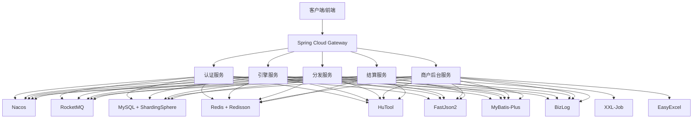
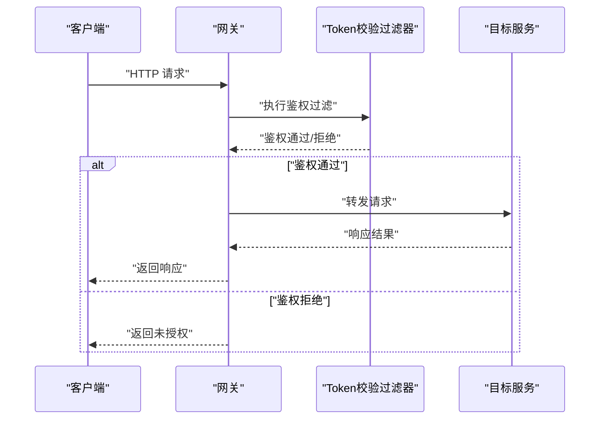
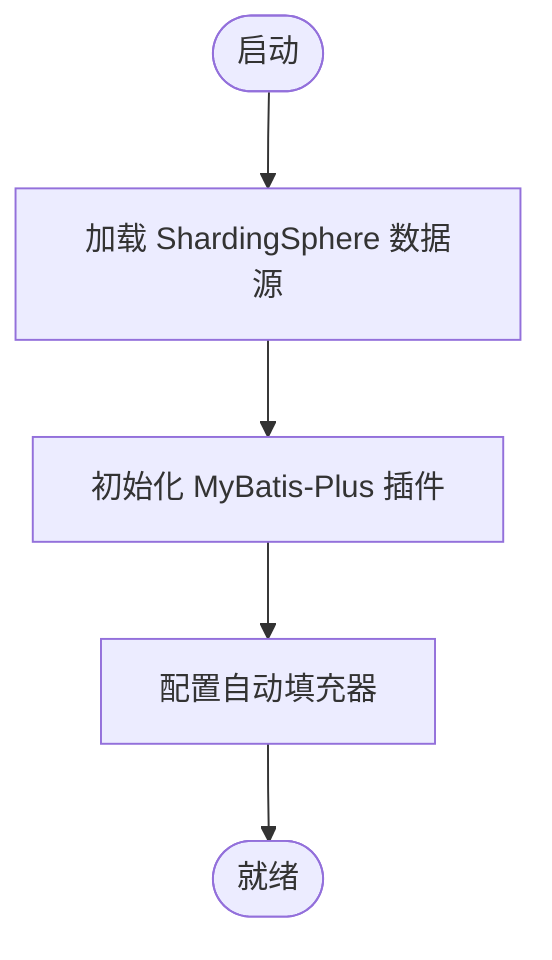
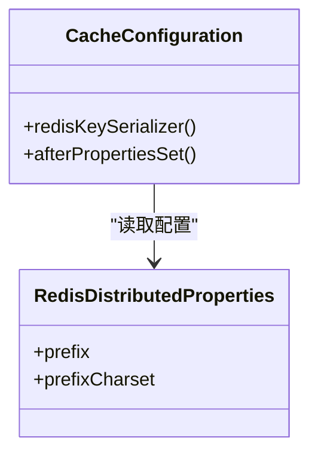
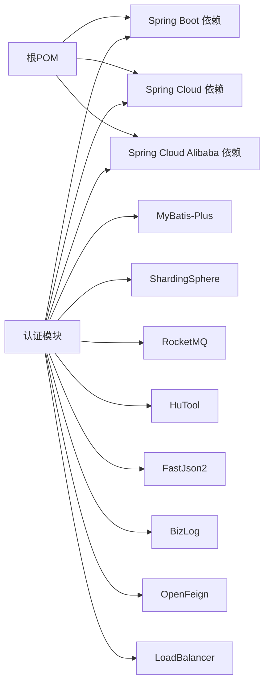

# 技术栈概览

<cite>
**本文档引用的文件**
- [README.md](file://README.md)
- [pom.xml](file://pom.xml)
- [auth/pom.xml](file://auth/pom.xml)
- [engine/pom.xml](file://engine/pom.xml)
- [distribution/pom.xml](file://distribution/pom.xml)
- [merchant-admin/pom.xml](file://merchant-admin/pom.xml)
- [settlement/pom.xml](file://settlement/pom.xml)
- [gateway/pom.xml](file://gateway/pom.xml)
- [auth/src/main/resources/application.yaml](file://auth/src/main/resources/application.yaml)
- [engine/src/main/resources/application.yaml](file://engine/src/main/resources/application.yaml)
- [distribution/src/main/resources/application.yaml](file://distribution/src/main/resources/application.yaml)
- [merchant-admin/src/main/resources/application.yaml](file://merchant-admin/src/main/resources/application.yaml)
- [settlement/src/main/resources/application.yaml](file://settlement/src/main/resources/application.yaml)
- [gateway/src/main/resources/application.yml](file://gateway/src/main/resources/application.yml)
- [framework/src/main/java/com/fengxin/config/CacheConfiguration.java](file://framework/src/main/java/com/fengxin/config/CacheConfiguration.java)
- [framework/src/main/java/com/fengxin/config/RedisDistributedProperties.java](file://framework/src/main/java/com/fengxin/config/RedisDistributedProperties.java)
- [auth/src/main/java/com/fengxin/maplecoupon/auth/config/DataBaseConfiguration.java](file://auth/src/main/java/com/fengxin/maplecoupon/auth/config/DataBaseConfiguration.java)
- [engine/src/main/java/com/fengxin/maplecoupon/engine/config/DataBaseConfiguration.java](file://engine/src/main/java/com/fengxin/maplecoupon/engine/config/DataBaseConfiguration.java)
- [distribution/src/main/java/com/fengxin/maplecoupon/distribution/config/DataBaseConfiguration.java](file://distribution/src/main/java/com/fengxin/maplecoupon/distribution/config/DataBaseConfiguration.java)
- [merchant-admin/src/main/java/com/fengxin/maplecoupon/merchantadmin/config/DataBaseConfiguration.java](file://merchant-admin/src/main/java/com/fengxin/maplecoupon/merchantadmin/config/DataBaseConfiguration.java)
</cite>

## 目录
1. [引言](#引言)
2. [项目结构](#项目结构)
3. [核心组件](#核心组件)
4. [架构总览](#架构总览)
5. [详细组件分析](#详细组件分析)
6. [依赖分析](#依赖分析)
7. [性能考虑](#性能考虑)
8. [故障排查指南](#故障排查指南)
9. [结论](#结论)
10. [附录](#附录)

## 引言
本项目是一个面向高并发场景的第三方优惠券系统，具备优惠券领取、预约提醒、结算服务与大规模用户分发能力。技术栈采用 Spring Boot 3.0.7、Spring Cloud 2022.0.3、Spring Cloud Gateway、ShardingSphere 5.3.2、RocketMQ 2.3.0、Redisson 3.27.2、MySQL、EasyExcel、HuTool、FastJson2、MyBatis-Plus、BizLog、XXL-Job、Docker 等主流技术，形成以网关为中心、多业务微服务协同、消息驱动与分布式缓存支撑的现代化架构。

## 项目结构
项目采用 Maven 多模块聚合结构，顶层 POM 统一管理版本与依赖，子模块按业务域拆分：
- 网关模块：统一入口与路由转发
- 认证模块：用户认证与上下文传递
- 引擎模块：优惠券模板与用户券核心能力
- 分发模块：优惠券批次分发与通知
- 商户后台模块：优惠券创建、管理与任务调度
- 结算模块：订单金额计算与查询
- 框架模块：通用配置、异常、幂等、日志等基础设施

```mermaid
graph TB
subgraph "网关层"
GATEWAY["网关模块<br/>Spring Cloud Gateway"]
end
subgraph "业务服务层"
AUTH["认证模块<br/>auth"]
ENGINE["引擎模块<br/>engine"]
DISTRIBUTION["分发模块<br/>distribution"]
MERCHANT_ADMIN["商户后台模块<br/>merchant-admin"]
SETTLEMENT["结算模块<br/>settlement"]
end
subgraph "基础设施层"
NACOS["Nacos 注册与配置中心"]
MYSQL["MySQL + ShardingSphere 分库分表"]
ROCKETMQ["RocketMQ 消息队列"]
REDIS["Redis + Redisson 分布式能力"]
REDIS_CACHE["Redis 缓存"]
EASYEXCEL["EasyExcel 导出导入"]
HUTOOL["HuTool 工具库"]
FASTJSON2["FastJson2 JSON 处理"]
MYBATIS_PLUS["MyBatis-Plus ORM"]
BIZLOG["BizLog 业务日志"]
XXLJOB["XXL-Job 定时任务"]
DOCKER["Docker 容器化"]
end
GATEWAY --> AUTH
GATEWAY --> ENGINE
GATEWAY --> DISTRIBUTION
GATEWAY --> MERCHANT_ADMIN
GATEWAY --> SETTLEMENT
AUTH --> MYSQL
ENGINE --> MYSQL
DISTRIBUTION --> MYSQL
MERCHANT_ADMIN --> MYSQL
SETTLEMENT --> MYSQL
AUTH --> ROCKETMQ
ENGINE --> ROCKETMQ
DISTRIBUTION --> ROCKETMQ
MERCHANT_ADMIN --> ROCKETMQ
SETTLEMENT --> ROCKETMQ
AUTH --> REDIS
ENGINE --> REDIS
DISTRIBUTION --> REDIS
MERCHANT_ADMIN --> REDIS
SETTLEMENT --> REDIS
MERCHANT_ADMIN --> EASYEXCEL
MERCHANT_ADMIN --> XXLJOB
AUTH --> HUTOOL
ENGINE --> HUTOOL
DISTRIBUTION --> HUTOOL
MERCHANT_ADMIN --> HUTOOL
SETTLEMENT --> HUTOOL
AUTH --> FASTJSON2
ENGINE --> FASTJSON2
DISTRIBUTION --> FASTJSON2
MERCHANT_ADMIN --> FASTJSON2
SETTLEMENT --> FASTJSON2
AUTH --> MYBATIS_PLUS
ENGINE --> MYBATIS_PLUS
DISTRIBUTION --> MYBATIS_PLUS
MERCHANT_ADMIN --> MYBATIS_PLUS
SETTLEMENT --> MYBATIS_PLUS
AUTH --> BIZLOG
ENGINE --> BIZLOG
DISTRIBUTION --> BIZLOG
MERCHANT_ADMIN --> BIZLOG
SETTLEMENT --> BIZLOG
GATEWAY --> NACOS
AUTH --> NACOS
ENGINE --> NACOS
DISTRIBUTION --> NACOS
MERCHANT_ADMIN --> NACOS
SETTLEMENT --> NACOS
GATEWAY --> REDIS_CACHE
```

图表来源
- [gateway/src/main/resources/application.yml:1-72](file://gateway/src/main/resources/application.yml#L1-L72)
- [auth/src/main/resources/application.yaml:1-19](file://auth/src/main/resources/application.yaml#L1-L19)
- [engine/src/main/resources/application.yaml:1-22](file://engine/src/main/resources/application.yaml#L1-L22)
- [distribution/src/main/resources/application.yaml:1-15](file://distribution/src/main/resources/application.yaml#L1-L15)
- [merchant-admin/src/main/resources/application.yaml:1-27](file://merchant-admin/src/main/resources/application.yaml#L1-L27)
- [settlement/src/main/resources/application.yaml:1-14](file://settlement/src/main/resources/application.yaml#L1-L14)

章节来源
- [pom.xml:17-34](file://pom.xml#L17-L34)
- [README.md:4](file://README.md#L4)

## 核心组件
- Spring Boot 3.0.7：提供自动配置、Starter 机制与容器化部署能力，统一版本管理与构建打包。
- Spring Cloud 2022.0.3：提供服务治理、负载均衡、配置中心与 OpenFeign 调用能力。
- Spring Cloud Gateway：统一入口，基于路由规则进行请求转发与鉴权过滤。
- ShardingSphere 5.3.2：数据库分片中间件，实现分库分表与读写分离，提升扩展性。
- RocketMQ 2.3.0：异步消息处理，解耦服务间调用，支撑事件驱动与削峰填谷。
- Redisson 3.27.2：分布式对象与原语，提供分布式锁、限流、布隆过滤器等能力。
- MySQL：关系型数据库存储，配合 ShardingSphere 实现水平扩展。
- EasyExcel：批量导入导出，提升商户后台数据处理效率。
- HuTool：常用工具类集合，简化日期、加密、随机数等操作。
- FastJson2：高性能 JSON 解析与序列化，降低序列化成本。
- MyBatis-Plus：增强 ORM 能力，内置分页、自动填充、逻辑删除等特性。
- BizLog：业务日志采集与上报，便于审计与问题追踪。
- XXL-Job 2.4.1：分布式任务调度，支撑优惠券任务执行与定时作业。
- Docker：容器化部署，统一环境与发布流程。

章节来源
- [pom.xml:37-60](file://pom.xml#L37-L60)
- [README.md:4](file://README.md#L4)

## 架构总览
整体架构以 Spring Cloud Gateway 作为统一入口，将不同业务域请求路由到对应微服务；服务间通过 Nacos 进行注册与发现，使用 RocketMQ 实现异步解耦；数据库通过 ShardingSphere 进行分库分表；Redis 与 Redisson 提供缓存与分布式能力；框架模块提供统一的配置、异常、幂等与日志能力。

图表来源
- [gateway/src/main/resources/application.yml:1-72](file://gateway/src/main/resources/application.yml#L1-L72)
- [auth/src/main/resources/application.yaml:1-19](file://auth/src/main/resources/application.yaml#L1-L19)
- [engine/src/main/resources/application.yaml:1-22](file://engine/src/main/resources/application.yaml#L1-L22)
- [distribution/src/main/resources/application.yaml:1-15](file://distribution/src/main/resources/application.yaml#L1-L15)
- [merchant-admin/src/main/resources/application.yaml:1-27](file://merchant-admin/src/main/resources/application.yaml#L1-L27)
- [settlement/src/main/resources/application.yaml:1-14](file://settlement/src/main/resources/application.yaml#L1-L14)

## 详细组件分析

### 网关模块（Spring Cloud Gateway）
- 路由规则：根据路径前缀将请求转发至对应微服务，并启用全局跨域配置。
- 鉴权过滤：通过自定义网关过滤器实现 Token 校验，白名单路径允许匿名访问。
- 负载均衡：结合 Nacos 与 Spring Cloud LoadBalancer 实现服务发现与轮询。

图表来源
- [gateway/src/main/resources/application.yml:17-63](file://gateway/src/main/resources/application.yml#L17-L63)

章节来源
- [gateway/pom.xml:14-54](file://gateway/pom.xml#L14-L54)
- [gateway/src/main/resources/application.yml:1-72](file://gateway/src/main/resources/application.yml#L1-L72)

### 认证模块（auth）
- 数据源：通过 ShardingSphere 驱动连接数据库，支持分库分表。
- ORM：MyBatis-Plus 提供分页与元对象自动填充。
- 工具链：HuTool、FastJson2、BizLog、OpenFeign、LoadBalancer 等。

图表来源
- [auth/src/main/resources/application.yaml:6-19](file://auth/src/main/resources/application.yaml#L6-L19)
- [auth/src/main/java/com/fengxin/maplecoupon/auth/config/DataBaseConfiguration.java:25-54](file://auth/src/main/java/com/fengxin/maplecoupon/auth/config/DataBaseConfiguration.java#L25-L54)

章节来源
- [auth/pom.xml:14-111](file://auth/pom.xml#L14-L111)
- [auth/src/main/resources/application.yaml:1-19](file://auth/src/main/resources/application.yaml#L1-L19)
- [auth/src/main/java/com/fengxin/maplecoupon/auth/config/DataBaseConfiguration.java:1-57](file://auth/src/main/java/com/fengxin/maplecoupon/auth/config/DataBaseConfiguration.java#L1-L57)

### 引擎模块（engine）
- 核心职责：优惠券模板与用户券的查询、核销、提醒等。
- 配置：分库分表、日志输出、用户券缓存策略等。

章节来源
- [engine/pom.xml:14-103](file://engine/pom.xml#L14-L103)
- [engine/src/main/resources/application.yaml:1-22](file://engine/src/main/resources/application.yaml#L1-L22)
- [engine/src/main/java/com/fengxin/maplecoupon/engine/config/DataBaseConfiguration.java:1-57](file://engine/src/main/java/com/fengxin/maplecoupon/engine/config/DataBaseConfiguration.java#L1-L57)

### 分发模块（distribution）
- 核心职责：优惠券批次分发与通知（短信、站内信等）。
- 工具：EasyExcel 批量导入导出。

章节来源
- [distribution/pom.xml:14-104](file://distribution/pom.xml#L14-L104)
- [distribution/src/main/resources/application.yaml:1-15](file://distribution/src/main/resources/application.yaml#L1-L15)
- [distribution/src/main/java/com/fengxin/maplecoupon/distribution/config/DataBaseConfiguration.java:1-57](file://distribution/src/main/java/com/fengxin/maplecoupon/distribution/config/DataBaseConfiguration.java#L1-L57)

### 商户后台模块（merchant-admin）
- 核心职责：优惠券创建、管理、任务调度与日志记录。
- 调度：XXL-Job 定时任务。
- 工具：EasyExcel、HuTool、BizLog。

章节来源
- [merchant-admin/pom.xml:13-125](file://merchant-admin/pom.xml#L13-L125)
- [merchant-admin/src/main/resources/application.yaml:1-27](file://merchant-admin/src/main/resources/application.yaml#L1-L27)
- [merchant-admin/src/main/java/com/fengxin/maplecoupon/merchantadmin/config/DataBaseConfiguration.java:1-57](file://merchant-admin/src/main/java/com/fengxin/maplecoupon/merchantadmin/config/DataBaseConfiguration.java#L1-L57)

### 结算模块（settlement）
- 核心职责：订单金额计算与查询。
- 配置：分库分表与日志输出。

章节来源
- [settlement/pom.xml:14-93](file://settlement/pom.xml#L14-L93)
- [settlement/src/main/resources/application.yaml:1-14](file://settlement/src/main/resources/application.yaml#L1-L14)
- [settlement/src/main/java/com/fengxin/maplecoupon/settlement/config/DataBaseConfiguration.java:1-57](file://settlement/src/main/java/com/fengxin/maplecoupon/settlement/config/DataBaseConfiguration.java#L1-L57)

### 框架模块（framework）
- 缓存配置：统一 Redis Key 序列化器，支持自定义前缀与字符集。
- 属性配置：集中管理 Redis 分布式属性。

图表来源
- [framework/src/main/java/com/fengxin/config/CacheConfiguration.java:16-34](file://framework/src/main/java/com/fengxin/config/CacheConfiguration.java#L16-L34)
- [framework/src/main/java/com/fengxin/config/RedisDistributedProperties.java:11-24](file://framework/src/main/java/com/fengxin/config/RedisDistributedProperties.java#L11-L24)

章节来源
- [framework/src/main/java/com/fengxin/config/CacheConfiguration.java:1-35](file://framework/src/main/java/com/fengxin/config/CacheConfiguration.java#L1-L35)
- [framework/src/main/java/com/fengxin/config/RedisDistributedProperties.java:1-25](file://framework/src/main/java/com/fengxin/config/RedisDistributedProperties.java#L1-L25)

## 依赖分析
- 版本管理：顶层 POM 使用 Spring Boot、Spring Cloud、Spring Cloud Alibaba 的版本坐标进行统一管理。
- 子模块依赖：各业务模块均引入 Spring Web、MyBatis-Plus、ShardingSphere、RocketMQ、HuTool、FastJson2、Knife4j 等依赖。
- 网关模块：引入 Spring Cloud Gateway、Nacos、Redis Starter 等。

图表来源
- [pom.xml:61-182](file://pom.xml#L61-L182)
- [auth/pom.xml:14-111](file://auth/pom.xml#L14-L111)

章节来源
- [pom.xml:37-60](file://pom.xml#L37-L60)
- [auth/pom.xml:14-111](file://auth/pom.xml#L14-L111)
- [engine/pom.xml:14-103](file://engine/pom.xml#L14-L103)
- [distribution/pom.xml:14-104](file://distribution/pom.xml#L14-L104)
- [merchant-admin/pom.xml:13-125](file://merchant-admin/pom.xml#L13-L125)
- [settlement/pom.xml:14-93](file://settlement/pom.xml#L14-L93)
- [gateway/pom.xml:14-54](file://gateway/pom.xml#L14-L54)

## 性能考虑
- 分库分表：通过 ShardingSphere 对用户与优惠券相关表进行分片，提升吞吐与扩展性。
- 缓存与分布式锁：Redisson 提供分布式锁、限流与布隆过滤器，降低数据库压力并保证一致性。
- 异步解耦：RocketMQ 消息队列用于削峰填谷与事件驱动，避免同步阻塞。
- ORM 优化：MyBatis-Plus 自动填充与分页插件减少重复代码与提升查询效率。
- 网关过滤：在网关层统一鉴权与跨域，减少下游服务负担。
- 工具库：HuTool、FastJson2、EasyExcel 提升数据处理与序列化效率。

## 故障排查指南
- 网关路由失败：检查路由配置与服务名是否一致，确认 Nacos 注册状态。
- 鉴权失败：核对白名单配置与 Token 校验逻辑。
- 数据库连接异常：确认 ShardingSphere 配置文件与数据库连通性。
- 消息消费异常：检查 RocketMQ Broker 状态与消费者组订阅情况。
- 缓存失效：验证 Redis Key 前缀与序列化器配置。
- 任务调度异常：检查 XXL-Job 控制台与执行器端口配置。

章节来源
- [gateway/src/main/resources/application.yml:17-63](file://gateway/src/main/resources/application.yml#L17-L63)
- [auth/src/main/resources/application.yaml:6-19](file://auth/src/main/resources/application.yaml#L6-L19)
- [merchant-admin/src/main/resources/application.yaml:16-27](file://merchant-admin/src/main/resources/application.yaml#L16-L27)

## 结论
该技术栈围绕高可用、高扩展与高并发目标设计，通过 Spring Cloud 生态实现服务治理，借助 ShardingSphere 与 Redisson 提升数据层性能与一致性，利用 RocketMQ 与 XXL-Job 构建异步与调度体系，辅以 HuTool、FastJson2、EasyExcel 等工具提升开发效率与数据处理能力。整体架构清晰、职责分明，适合在中大型业务场景下持续演进与迭代。

## 附录
- 技术选型建议
  - Spring Boot 3.x：获得更好的性能与模块化能力，建议保持与 Spring Cloud 版本兼容。
  - Spring Cloud Alibaba：提供 Nacos、Sentinel、OpenFeign 等生态能力，适配国内云原生实践。
  - ShardingSphere：根据业务规模选择合适的分片策略，注意幂等与一致性设计。
  - RocketMQ：结合业务场景选择消息类型与重试策略，避免重复消费与丢失。
  - Redisson：合理设置过期时间与布隆过滤器参数，平衡内存与命中率。
  - MyBatis-Plus：充分利用自动填充、分页与逻辑删除，减少样板代码。
  - BizLog：规范日志字段与上报格式，便于审计与问题定位。
  - XXL-Job：合理划分任务粒度与执行器资源，避免热点与抖动。
  - Docker：结合 CI/CD 流水线，确保镜像构建与部署一致性。