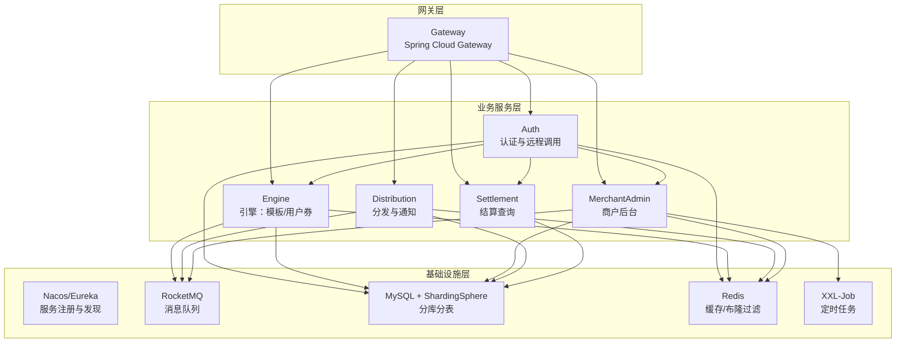
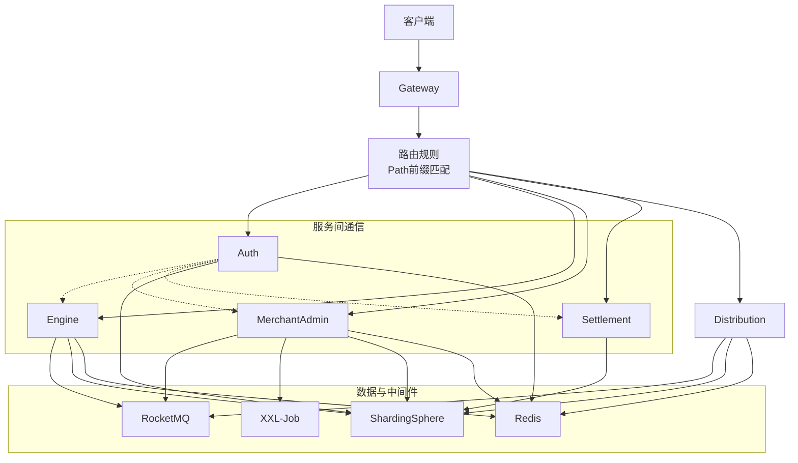
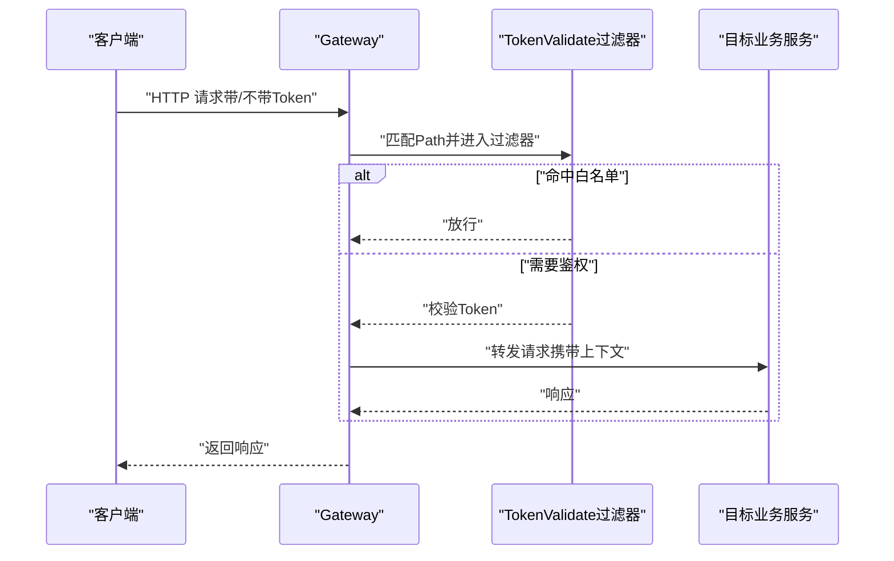
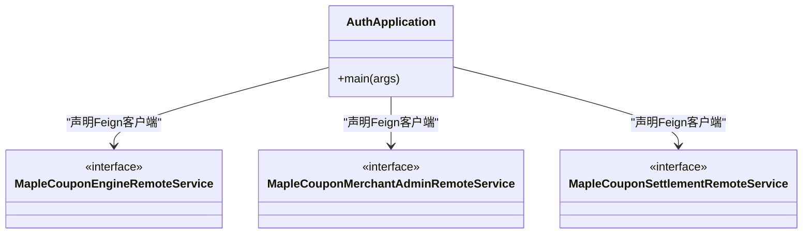
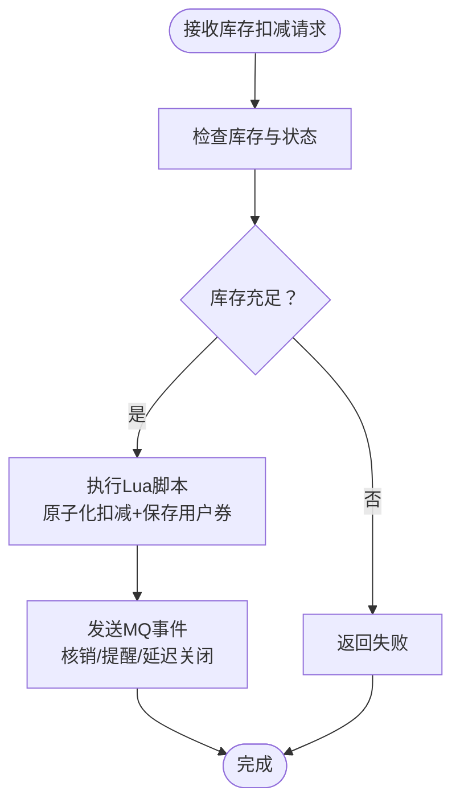
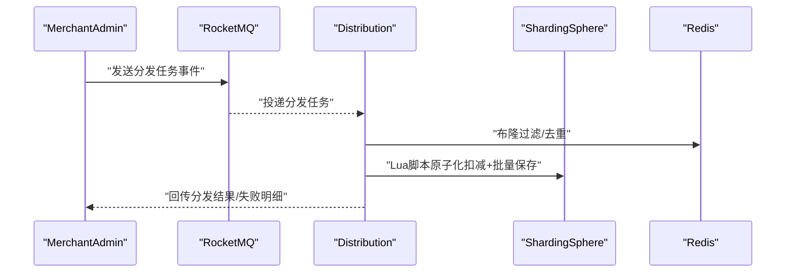
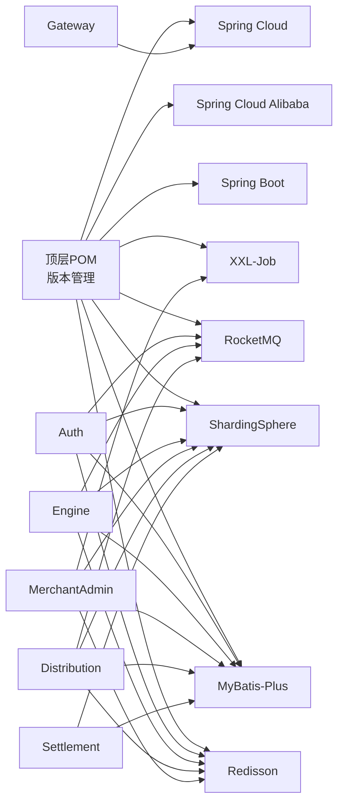

# 架构概览

<cite>
**本文引用的文件**
- [README.md](file://README.md)
- [pom.xml](file://pom.xml)
- [GateWayApplication.java](file://gateway/src/main/java/com/fengxin/maplecoupon/gateway/GateWayApplication.java)
- [application.yml](file://gateway/src/main/resources/application.yml)
- [AuthApplication.java](file://auth/src/main/java/com/fengxin/maplecoupon/auth/AuthApplication.java)
- [application.yaml](file://auth/src/main/resources/application.yaml)
- [EngineApplication.java](file://engine/src/main/java/com/fengxin/maplecoupon/engine/EngineApplication.java)
- [application.yaml](file://engine/src/main/resources/application.yaml)
- [MerchantAdminApplication.java](file://merchant-admin/src/main/java/com/fengxin/maplecoupon/merchantadmin/MerchantAdminApplication.java)
- [DistributionApplication.java](file://distribution/src/main/java/com/fengxin/maplecoupon/distribution/DistributionApplication.java)
- [SettlementApplication.java](file://settlement/src/main/java/com/fengxin/maplecoupon/settlement/SettlementApplication.java)
- [DBUserHashModShardingAlgorithm.java](file://auth/src/main/java/com/fengxin/maplecoupon/auth/dao/sharding/DBUserHashModShardingAlgorithm.java)
- [TableUserHashModShardingAlgorithm.java](file://auth/src/main/java/com/fengxin/maplecoupon/auth/dao/sharding/TableUserHashModShardingAlgorithm.java)
- [DBHashModShardingAlgorithm.java](file://engine/src/main/java/com/fengxin/maplecoupon/engine/dao/sharding/DBHashModShardingAlgorithm.java)
- [TableHashModShardingAlgorithm.java](file://engine/src/main/java/com/fengxin/maplecoupon/engine/dao/sharding/TableHashModShardingAlgorithm.java)
- [DBHashModShardingAlgorithm.java](file://distribution/src/main/java/com/fengxin/maplecoupon/distribution/dao/sharding/DBHashModShardingAlgorithm.java)
- [TableHashModShardingAlgorithm.java](file://distribution/src/main/java/com/fengxin/maplecoupon/distribution/dao/sharding/TableHashModShardingAlgorithm.java)
- [DBHashModShardingAlgorithm.java](file://merchant-admin/src/main/java/com/fengxin/maplecoupon/merchantadmin/dao/sharding/DBHashModShardingAlgorithm.java)
- [TableHashModShardingAlgorithm.java](file://merchant-admin/src/main/java/com/fengxin/maplecoupon/merchantadmin/dao/sharding/TableHashModShardingAlgorithm.java)
- [DBHashModShardingAlgorithm.java](file://settlement/src/main/java/com/fengxin/maplecoupon/settlement/dao/sharding/DBHashModShardingAlgorithm.java)
- [TableHashModShardingAlgorithm.java](file://settlement/src/main/java/com/fengxin/maplecoupon/settlement/dao/sharding/TableHashModShardingAlgorithm.java)
- [CouponExecuteDistributionConsumer.java](file://distribution/src/main/java/com/fengxin/maplecoupon/distribution/mq/consumer/CouponExecuteDistributionConsumer.java)
- [CouponTaskDistributionConsumer.java](file://distribution/src/main/java/com/fengxin/maplecoupon/distribution/mq/consumer/CouponTaskDistributionConsumer.java)
- [UserCouponDelayCloseConsumer.java](file://engine/src/main/java/com/fengxin/maplecoupon/engine/mq/consumer/UserCouponDelayCloseConsumer.java)
- [UserCouponRedeemConsumer.java](file://engine/src/main/java/com/fengxin/maplecoupon/engine/mq/consumer/UserCouponRedeemConsumer.java)
- [CanalBinlogSyncUserCouponConsumer.java](file://engine/src/main/java/com/fengxin/maplecoupon/engine/mq/consumer/CanalBinlogSyncUserCouponConsumer.java)
- [UserCouponRemindDelayConsumer.java](file://engine/src/main/java/com/fengxin/maplecoupon/engine/mq/consumer/UserCouponRemindDelayConsumer.java)
- [TokenValidateGatewayFilterFactory.java](file://gateway/src/main/java/com/fengxin/maplecoupon/gateway/filter/TokenValidateGatewayFilterFactory.java)
- [RequestLoggingFilter.java](file://gateway/src/main/java/com/fengxin/maplecoupon/gateway/filter/RequestLoggingFilter.java)
- [RocketMQConstant.java](file://auth/src/main/java/com/fengxin/maplecoupon/auth/common/constant/RocketMQConstant.java)
- [EngineRedisConstant.java](file://auth/src/main/java/com/fengxin/maplecoupon/auth/common/constant/EngineRedisConstant.java)
- [DistributionRedisConstant.java](file://auth/src/main/java/com/fengxin/maplecoupon/auth/common/constant/DistributionRedisConstant.java)
- [EngineRedisConstant.java](file://engine/src/main/java/com/fengxin/maplecoupon/engine/common/constant/EngineRedisConstant.java)
- [EngineRedisConstant.java](file://settlement/src/main/java/com/fengxin/maplecoupon/settlement/common/constant/EngineRedisConstant.java)
- [EngineRedisConstant.java](file://distribution/src/main/java/com/fengxin/maplecoupon/distribution/common/constant/EngineRedisConstant.java)
- [EngineRedisConstant.java](file://merchant-admin/src/main/java/com/fengxin/maplecoupon/merchantadmin/common/constant/EngineRedisConstant.java)
- [RocketMQConstant.java](file://distribution/src/main/java/com/fengxin/maplecoupon/distribution/common/constant/RocketMQConstant.java)
- [RocketMQConstant.java](file://engine/src/main/java/com/fengxin/maplecoupon/engine/common/constant/RocketMQConstant.java)
- [RocketMQConstant.java](file://merchant-admin/src/main/java/com/fengxin/maplecoupon/merchantadmin/common/constant/RocketMQConstant.java)
- [batch_save_user_coupon.lua](file://distribution/src/main/resources/lua/batch_save_user_coupon.lua)
- [stock_decrement_and_batch_save_user_record.lua](file://distribution/src/main/resources/lua/stock_decrement_and_batch_save_user_record.lua)
- [stock_decrement_and_save_user_receive.lua](file://engine/src/main/resources/lua/stock_decrement_and_save_user_receive.lua)
- [ExecuteTransaction.java](file://distribution/src/main/java/com/fengxin/maplecoupon/distribution/transation/ExecuteTransaction.java)
- [MapleCouponEngineRemoteService.java](file://auth/src/main/java/com/fengxin/maplecoupon/auth/remote/MapleCouponEngineRemoteService.java)
- [MapleCouponMerchantAdminRemoteService.java](file://auth/src/main/java/com/fengxin/maplecoupon/auth/remote/MapleCouponMerchantAdminRemoteService.java)
- [MapleCouponSettlementRemoteService.java](file://auth/src/main/java/com/fengxin/maplecoupon/auth/remote/MapleCouponSettlementRemoteService.java)
- [GlobalExceptionHandler.java](file://framework/src/main/java/com/fengxin/errorcode/BaseErrorCode.java)
- [BaseErrorCode.java](file://framework/src/main/java/com/fengxin/errorcode/BaseErrorCode.java)
- [IErrorCode.java](file://framework/src/main/java/com/fengxin/errorcode/IErrorCode.java)
- [AbstractException.java](file://framework/src/main/java/com/fengxin/exception/AbstractException.java)
- [ClientException.java](file://framework/src/main/java/com/fengxin/exception/ClientException.java)
- [RemoteException.java](file://framework/src/main/java/com/fengxin/exception/RemoteException.java)
- [ServiceException.java](file://framework/src/main/java/com/fengxin/exception/ServiceException.java)
- [Result.java](file://framework/src/main/java/com/fengxin/web/Result.java)
- [Results.java](file://framework/src/main/java/com/fengxin/web/Results.java)
</cite>

## 目录
1. [引言](#引言)
2. [项目结构](#项目结构)
3. [核心组件](#核心组件)
4. [架构总览](#架构总览)
5. [详细组件分析](#详细组件分析)
6. [依赖分析](#依赖分析)
7. [性能考虑](#性能考虑)
8. [故障排查指南](#故障排查指南)
9. [结论](#结论)
10. [附录](#附录)

## 引言
本项目是一个基于Spring Boot与Spring Cloud Alibaba构建的第三方优惠券系统，具备优惠券领取、预约提醒、结算与分发能力，并支持百万级用户规模的优惠券分发。系统采用微服务架构，围绕“网关 + 多个业务域微服务”的模式组织，结合ShardingSphere进行数据库分片、RocketMQ实现异步解耦、Redis支撑缓存与布隆过滤、XXL-Job执行定时任务等，形成高可用、高性能、可扩展的分布式架构。

## 项目结构
项目以Maven多模块方式组织，顶层聚合工程统一管理版本与依赖，各子模块对应一个独立的微服务或基础框架模块。核心模块包括：
- 网关模块：gateway，统一入口与路由控制
- 认证模块：auth，用户认证与授权、跨服务远程调用
- 引擎模块：engine，优惠券模板与用户券核心逻辑
- 商户后台模块：merchant-admin，优惠券创建、管理与任务调度
- 分发模块：distribution，优惠券批量分发与通知
- 结算模块：settlement，订单金额计算与查询
- 框架模块：framework，通用异常、结果封装与幂等性等基础设施

图表来源
- [pom.xml:17-34](file://pom.xml#L17-L34)
- [application.yml:17-63](file://gateway/src/main/resources/application.yml#L17-L63)
- [AuthApplication.java:15-18](file://auth/src/main/java/com/fengxin/maplecoupon/auth/AuthApplication.java#L15-L18)
- [EngineApplication.java:13-14](file://engine/src/main/java/com/fengxin/maplecoupon/engine/EngineApplication.java#L13-L14)
- [MerchantAdminApplication.java:14-15](file://merchant-admin/src/main/java/com/fengxin/maplecoupon/merchantadmin/MerchantAdminApplication.java#L14-L15)
- [DistributionApplication.java:13-14](file://distribution/src/main/java/com/fengxin/maplecoupon/distribution/DistributionApplication.java#L13-L14)
- [SettlementApplication.java:12-13](file://settlement/src/main/java/com/fengxin/maplecoupon/settlement/SettlementApplication.java#L12-L13)

章节来源
- [pom.xml:17-34](file://pom.xml#L17-L34)
- [README.md:1-10](file://README.md#L1-L10)

## 核心组件
- 网关服务（gateway）
  - 统一入口，负责路由转发、CORS、请求日志、令牌校验等
  - 配置了对五个业务域的路径前缀路由与白名单策略
- 认证服务（auth）
  - 用户认证与远程调用适配，提供OpenFeign客户端扫描与MyBatis Mapper扫描
  - 使用ShardingSphere驱动访问分库分表数据源
- 引擎服务（engine）
  - 优惠券模板与用户券核心逻辑，包含延迟关闭、核销、提醒等MQ事件处理
  - 使用ShardingSphere进行分库分表
- 商户后台（merchant-admin）
  - 优惠券模板管理、任务创建与调度、日志记录与参数链式校验
  - 使用ShardingSphere与XXL-Job
- 分发服务（distribution）
  - 批量分发优惠券、Excel导入导出、MQ事件消费与Lua脚本优化
  - 使用ShardingSphere与RocketMQ
- 结算服务（settlement）
  - 查询类服务，提供优惠券与商品查询能力
  - 使用ShardingSphere

章节来源
- [GateWayApplication.java:10-17](file://gateway/src/main/java/com/fengxin/maplecoupon/gateway/GateWayApplication.java#L10-L17)
- [application.yml:17-63](file://gateway/src/main/resources/application.yml#L17-L63)
- [AuthApplication.java:15-18](file://auth/src/main/java/com/fengxin/maplecoupon/auth/AuthApplication.java#L15-L18)
- [application.yaml:1-19](file://auth/src/main/resources/application.yaml#L1-19)
- [EngineApplication.java:13-14](file://engine/src/main/java/com/fengxin/maplecoupon/engine/EngineApplication.java#L13-L14)
- [application.yaml:1-22](file://engine/src/main/resources/application.yaml#L1-22)
- [MerchantAdminApplication.java:14-15](file://merchant-admin/src/main/java/com/fengxin/maplecoupon/merchantadmin/MerchantAdminApplication.java#L14-L15)
- [DistributionApplication.java:13-14](file://distribution/src/main/java/com/fengxin/maplecoupon/distribution/DistributionApplication.java#L13-L14)
- [SettlementApplication.java:12-13](file://settlement/src/main/java/com/fengxin/maplecoupon/settlement/SettlementApplication.java#L12-L13)

## 架构总览
系统采用“网关 + 微服务 + 分布式中间件”的三层架构：
- 网关层：Spring Cloud Gateway统一接入，基于路径前缀路由到各业务服务；内置CORS与请求日志；通过自定义过滤器实现令牌校验与白名单/黑名单策略
- 服务层：各微服务独立部署，内部通过OpenFeign进行远程调用；服务注册与发现默认启用
- 数据与中间件：ShardingSphere作为JDBC驱动实现分库分表；Redis用于缓存与布隆过滤；RocketMQ用于异步解耦；XXL-Job用于定时任务

图表来源
- [application.yml:17-63](file://gateway/src/main/resources/application.yml#L17-L63)
- [TokenValidateGatewayFilterFactory.java](file://gateway/src/main/java/com/fengxin/maplecoupon/gateway/filter/TokenValidateGatewayFilterFactory.java)
- [RequestLoggingFilter.java](file://gateway/src/main/java/com/fengxin/maplecoupon/gateway/filter/RequestLoggingFilter.java)
- [AuthApplication.java:17-18](file://auth/src/main/java/com/fengxin/maplecoupon/auth/AuthApplication.java#L17-L18)

## 详细组件分析

### 网关服务（Spring Cloud Gateway）
- 路由策略
  - 基于Path前缀将/api/merchant-admin、/api/engine、/api/settlement、/api/distribution、/api/auth等请求分别转发至对应服务
  - 对部分公开接口（如登录、注册、校验用户名）设置白名单放行
- 安全与过滤
  - 自定义TokenValidate过滤器工厂，支持白名单/黑名单路径配置
  - 全局CORS配置允许跨域
- 运维
  - 暴露管理端点，便于监控与指标采集

图表来源
- [application.yml:17-63](file://gateway/src/main/resources/application.yml#L17-L63)
- [TokenValidateGatewayFilterFactory.java](file://gateway/src/main/java/com/fengxin/maplecoupon/gateway/filter/TokenValidateGatewayFilterFactory.java)
- [RequestLoggingFilter.java](file://gateway/src/main/java/com/fengxin/maplecoupon/gateway/filter/RequestLoggingFilter.java)

章节来源
- [GateWayApplication.java:10-17](file://gateway/src/main/java/com/fengxin/maplecoupon/gateway/GateWayApplication.java#L10-L17)
- [application.yml:1-72](file://gateway/src/main/resources/application.yml#L1-72)

### 认证服务（auth）
- 角色与职责
  - 提供用户认证、远程调用适配（OpenFeign），并作为其他服务的鉴权入口
  - 通过ShardingSphere驱动访问分库分表数据源
- 远程接口
  - 定义与引擎、商户后台、结算服务的远程接口，便于跨服务调用
- 常量与工具
  - 统一的Redis与RocketMQ常量，便于跨模块共享

图表来源
- [AuthApplication.java:15-18](file://auth/src/main/java/com/fengxin/maplecoupon/auth/AuthApplication.java#L15-L18)
- [MapleCouponEngineRemoteService.java](file://auth/src/main/java/com/fengxin/maplecoupon/auth/remote/MapleCouponEngineRemoteService.java)
- [MapleCouponMerchantAdminRemoteService.java](file://auth/src/main/java/com/fengxin/maplecoupon/auth/remote/MapleCouponMerchantAdminRemoteService.java)
- [MapleCouponSettlementRemoteService.java](file://auth/src/main/java/com/fengxin/maplecoupon/auth/remote/MapleCouponSettlementRemoteService.java)

章节来源
- [AuthApplication.java:15-18](file://auth/src/main/java/com/fengxin/maplecoupon/auth/AuthApplication.java#L15-L18)
- [application.yaml:1-19](file://auth/src/main/resources/application.yaml#L1-19)

### 引擎服务（engine）
- 角色与职责
  - 优惠券模板与用户券核心逻辑，提供模板查询、用户券查询、锁定与核销等能力
  - 通过MQ事件实现延迟关闭、核销、提醒等异步处理
- 分片策略
  - 使用数据库与表的哈希取模分片算法，支持多库多表扩展
- Lua脚本优化
  - 使用Lua脚本原子化执行库存扣减与用户券保存，降低竞争条件

图表来源
- [stock_decrement_and_save_user_receive.lua](file://engine/src/main/resources/lua/stock_decrement_and_save_user_receive.lua)
- [UserCouponRedeemConsumer.java](file://engine/src/main/java/com/fengxin/maplecoupon/engine/mq/consumer/UserCouponRedeemConsumer.java)
- [UserCouponDelayCloseConsumer.java](file://engine/src/main/java/com/fengxin/maplecoupon/engine/mq/consumer/UserCouponDelayCloseConsumer.java)
- [UserCouponRemindDelayConsumer.java](file://engine/src/main/java/com/fengxin/maplecoupon/engine/mq/consumer/UserCouponRemindDelayConsumer.java)

章节来源
- [EngineApplication.java:13-14](file://engine/src/main/java/com/fengxin/maplecoupon/engine/EngineApplication.java#L13-L14)
- [application.yaml:1-22](file://engine/src/main/resources/application.yaml#L1-22)
- [DBHashModShardingAlgorithm.java](file://engine/src/main/java/com/fengxin/maplecoupon/engine/dao/sharding/DBHashModShardingAlgorithm.java)
- [TableHashModShardingAlgorithm.java](file://engine/src/main/java/com/fengxin/maplecoupon/engine/dao/sharding/TableHashModShardingAlgorithm.java)

### 商户后台（merchant-admin）
- 角色与职责
  - 优惠券模板的创建、编辑、分页查询、终止等；任务创建与调度；日志记录与参数链式校验
- 分片与定时任务
  - 使用ShardingSphere进行分库分表；集成XXL-Job执行定时任务
- 参数校验与日志
  - 通过链式过滤器与日志策略，确保参数合法性与操作审计

章节来源
- [MerchantAdminApplication.java:14-15](file://merchant-admin/src/main/java/com/fengxin/maplecoupon/merchantadmin/MerchantAdminApplication.java#L14-L15)
- [DBHashModShardingAlgorithm.java](file://merchant-admin/src/main/java/com/fengxin/maplecoupon/merchantadmin/dao/sharding/DBHashModShardingAlgorithm.java)
- [TableHashModShardingAlgorithm.java](file://merchant-admin/src/main/java/com/fengxin/maplecoupon/merchantadmin/dao/sharding/TableHashModShardingAlgorithm.java)

### 分发服务（distribution）
- 角色与职责
  - 优惠券批量分发、Excel导入导出、任务执行与失败重试、通知提醒
- 异步与幂等
  - 通过RocketMQ事件解耦，消费端使用幂等注解避免重复处理
- Lua优化
  - 使用Lua脚本原子化执行批量保存用户券与库存扣减，提升吞吐

图表来源
- [CouponTaskDistributionConsumer.java](file://distribution/src/main/java/com/fengxin/maplecoupon/distribution/mq/consumer/CouponTaskDistributionConsumer.java)
- [CouponExecuteDistributionConsumer.java](file://distribution/src/main/java/com/fengxin/maplecoupon/distribution/mq/consumer/CouponExecuteDistributionConsumer.java)
- [batch_save_user_coupon.lua](file://distribution/src/main/resources/lua/batch_save_user_coupon.lua)
- [stock_decrement_and_batch_save_user_record.lua](file://distribution/src/main/resources/lua/stock_decrement_and_batch_save_user_record.lua)

章节来源
- [DistributionApplication.java:13-14](file://distribution/src/main/java/com/fengxin/maplecoupon/distribution/DistributionApplication.java#L13-L14)
- [DBHashModShardingAlgorithm.java](file://distribution/src/main/java/com/fengxin/maplecoupon/distribution/dao/sharding/DBHashModShardingAlgorithm.java)
- [TableHashModShardingAlgorithm.java](file://distribution/src/main/java/com/fengxin/maplecoupon/distribution/dao/sharding/TableHashModShardingAlgorithm.java)

### 结算服务（settlement）
- 角色与职责
  - 提供优惠券与商品查询能力，作为下游服务的查询入口之一
- 分片策略
  - 使用ShardingSphere进行分库分表

章节来源
- [SettlementApplication.java:12-13](file://settlement/src/main/java/com/fengxin/maplecoupon/settlement/SettlementApplication.java#L12-L13)
- [DBHashModShardingAlgorithm.java](file://settlement/src/main/java/com/fengxin/maplecoupon/settlement/dao/sharding/DBHashModShardingAlgorithm.java)
- [TableHashModShardingAlgorithm.java](file://settlement/src/main/java/com/fengxin/maplecoupon/settlement/dao/sharding/TableHashModShardingAlgorithm.java)

## 依赖分析
- 版本与依赖管理
  - 顶层POM集中管理Spring Boot、Spring Cloud、Spring Cloud Alibaba、MyBatis-Plus、ShardingSphere、RocketMQ、Redisson、XXL-Job等版本
- 模块依赖
  - 网关模块依赖Spring Cloud Gateway；各业务模块依赖Spring Boot与MyBatis-Plus；认证模块启用OpenFeign与服务发现
- 数据与中间件
  - 所有业务模块均通过ShardingSphere驱动访问分库分表；Redis用于缓存与布隆过滤；RocketMQ用于异步解耦；XXL-Job用于定时任务

图表来源
- [pom.xml:61-182](file://pom.xml#L61-L182)
- [application.yml:17-63](file://gateway/src/main/resources/application.yml#L17-L63)
- [AuthApplication.java:15-18](file://auth/src/main/java/com/fengxin/maplecoupon/auth/AuthApplication.java#L15-L18)

章节来源
- [pom.xml:61-182](file://pom.xml#L61-L182)

## 性能考虑
- 分库分表
  - 通过ShardingSphere的数据库与表哈希取模算法，实现水平扩展与热点分散
- 缓存与布隆过滤
  - Redis用于热点数据缓存与布隆过滤，减少数据库压力与误查
- 异步解耦
  - RocketMQ异步处理分发、核销、提醒等高频事件，降低同步调用延迟
- 原子化脚本
  - Lua脚本在引擎与分发模块中用于库存扣减与批量保存，减少竞争条件与往返开销
- 路由与过滤
  - 网关层统一CORS与日志，减少重复配置；白名单策略降低鉴权成本

## 故障排查指南
- 网关层
  - 检查路由前缀是否匹配；确认白名单/黑名单配置是否正确；查看请求日志定位问题
- 服务层
  - 关注OpenFeign远程调用异常与超时；检查ShardingSphere分片配置与SQL执行计划
- MQ层
  - 查看RocketMQ消费堆积与失败重试；确认幂等注解与消息去重策略
- 数据层
  - 核对分片键与分片算法；关注Lua脚本执行结果与事务一致性
- 通用异常与结果
  - 使用框架模块中的统一异常与结果封装，便于快速定位错误码与错误信息

章节来源
- [application.yml:17-63](file://gateway/src/main/resources/application.yml#L17-L63)
- [AbstractException.java](file://framework/src/main/java/com/fengxin/exception/AbstractException.java)
- [BaseErrorCode.java](file://framework/src/main/java/com/fengxin/errorcode/BaseErrorCode.java)
- [IErrorCode.java](file://framework/src/main/java/com/fengxin/errorcode/IErrorCode.java)
- [Result.java](file://framework/src/main/java/com/fengxin/web/Result.java)
- [Results.java](file://framework/src/main/java/com/fengxin/web/Results.java)

## 结论
MapleCoupon项目通过清晰的微服务拆分与统一的网关入口，结合ShardingSphere、RocketMQ、Redis与XXL-Job等中间件，构建了高可用、高性能且易于扩展的优惠券系统。对于初学者，建议从网关与认证服务入手，逐步理解路由与远程调用；对于有经验的开发者，可深入分片策略、Lua脚本优化与MQ幂等处理等细节，以进一步提升系统稳定性与吞吐能力。

## 附录
- 术语
  - 分库分表：通过ShardingSphere实现数据库与表的水平拆分
  - 原子化：使用Lua脚本保证库存扣减与写入的原子性
  - 幂等：通过注解与消息去重避免重复处理
- 参考
  - 技术栈：Spring Boot、Spring Cloud Alibaba、Spring Cloud Gateway、ShardingSphere、RocketMQ、Redis、MySQL、EasyExcel、HuTool、FastJson2、MyBatis-Plus、BizLog、XXL-Job、Docker