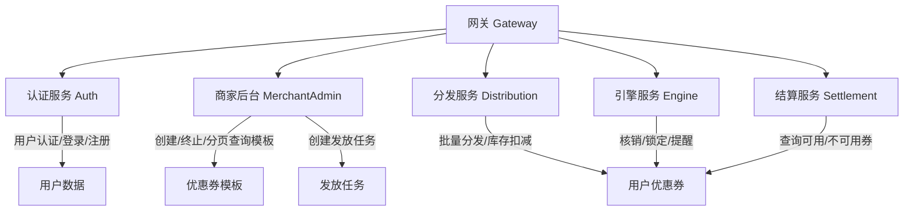
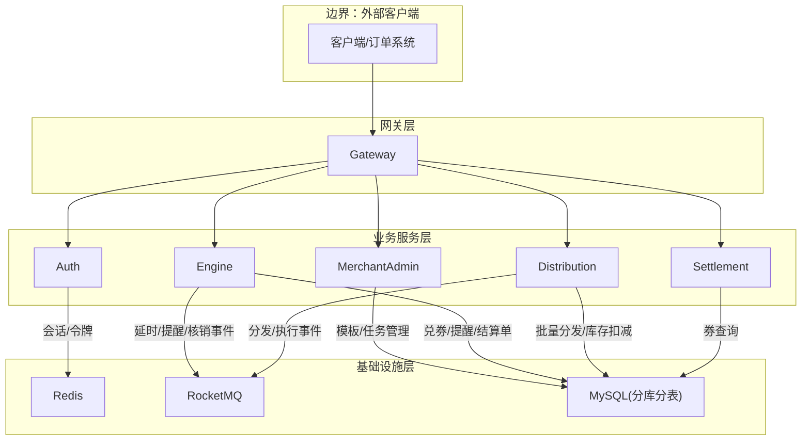
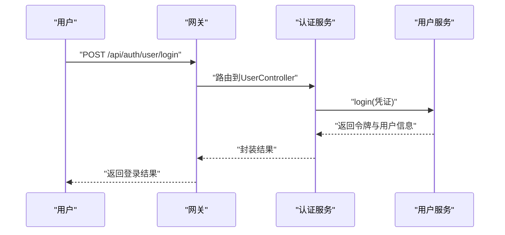
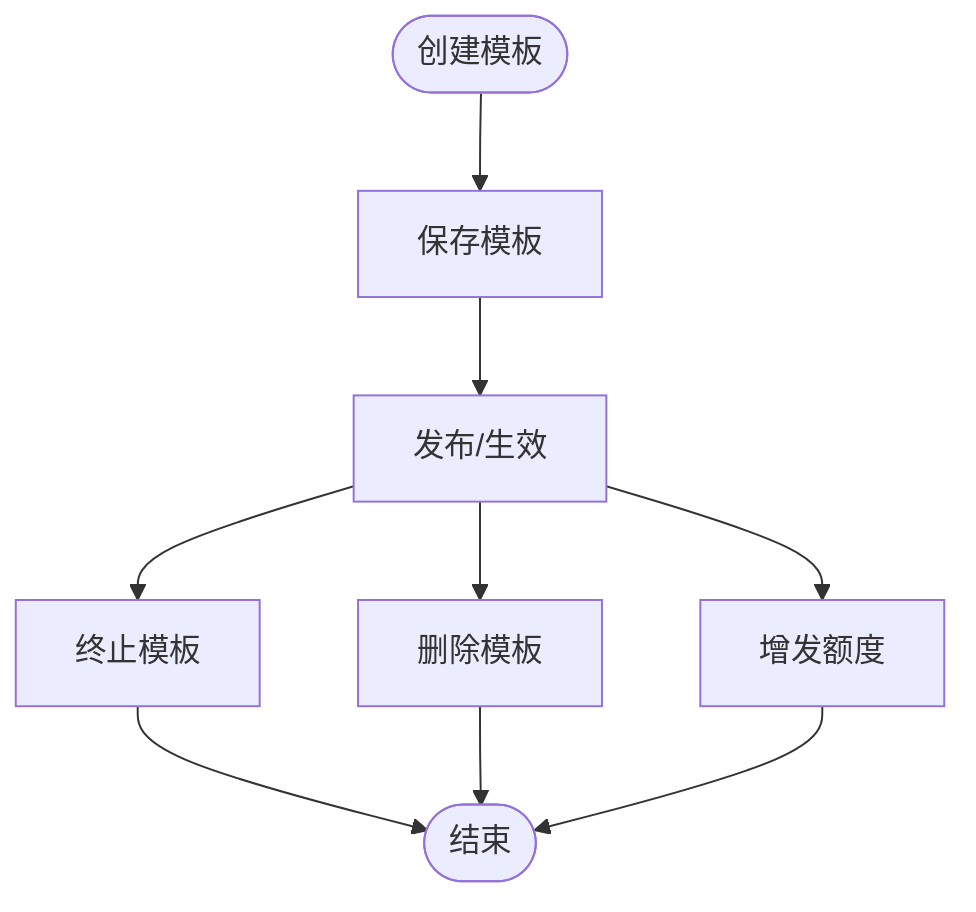
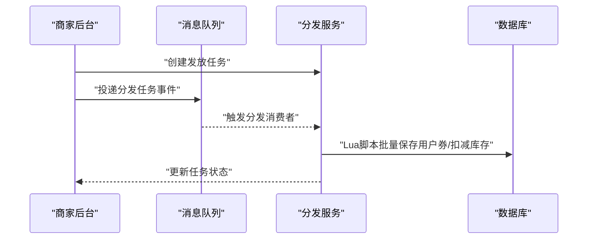
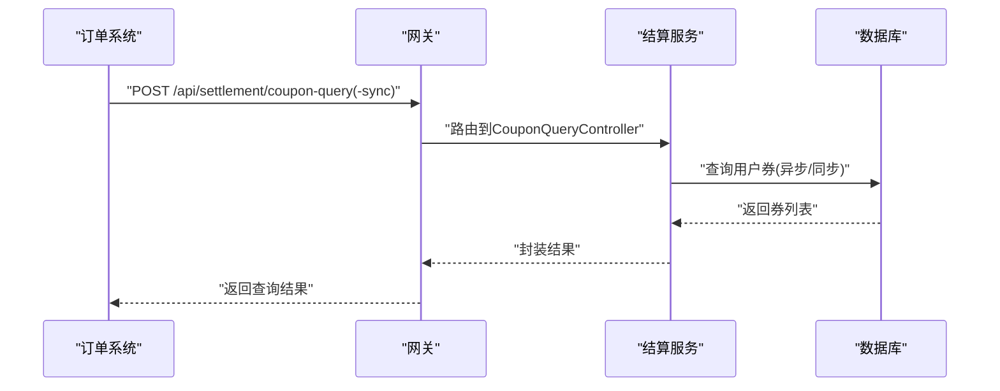
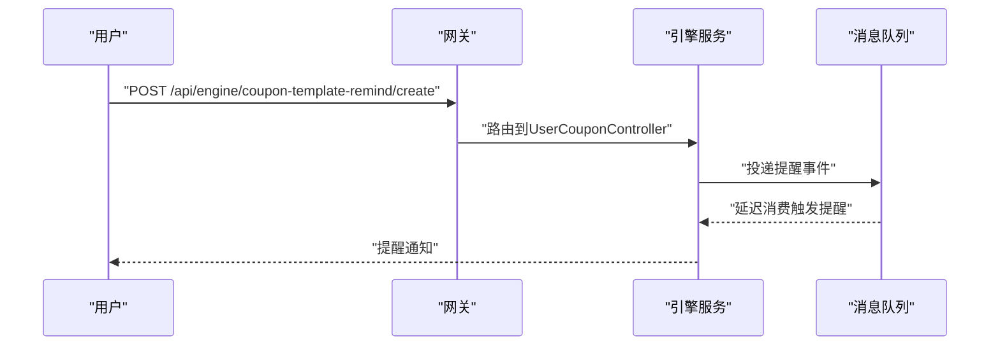
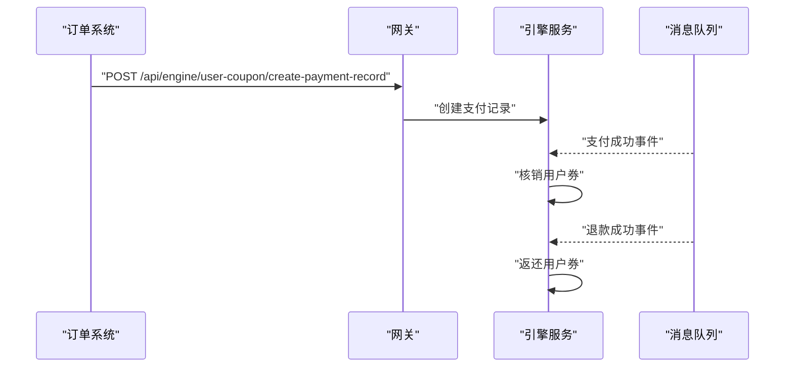
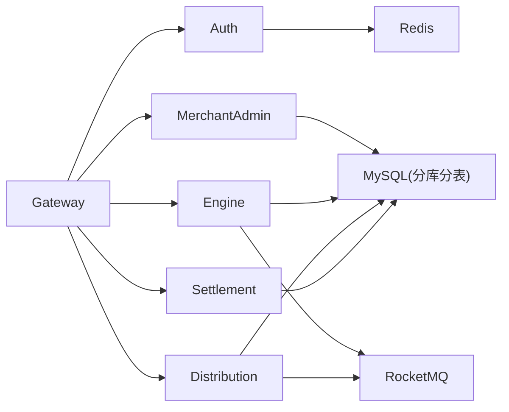

# 核心功能特性

<cite>
**本文引用的文件**
- [README.md](file://README.md)
- [AuthApplication.java](file://auth/src/main/java/com/fengxin/maplecoupon/auth/AuthApplication.java)
- [UserController.java](file://auth/src/main/java/com/fengxin/maplecoupon/auth/controller/UserController.java)
- [UserService.java](file://auth/src/main/java/com/fengxin/maplecoupon/auth/service/UserService.java)
- [MerchantAdminApplication.java](file://merchant-admin/src/main/java/com/fengxin/maplecoupon/merchantadmin/MerchantAdminApplication.java)
- [CouponTemplateController.java](file://merchant-admin/src/main/java/com/fengxin/maplecoupon/merchantadmin/controller/CouponTemplateController.java)
- [CouponTaskController.java](file://merchant-admin/src/main/java/com/fengxin/maplecoupon/merchantadmin/controller/CouponTaskController.java)
- [CouponTaskDO.java](file://merchant-admin/src/main/java/com/fengxin/maplecoupon/merchantadmin/dao/entity/CouponTaskDO.java)
- [EngineApplication.java](file://engine/src/main/java/com/fengxin/maplecoupon/engine/EngineApplication.java)
- [CouponTemplateController.java](file://engine/src/main/java/com/fengxin/maplecoupon/engine/controller/CouponTemplateController.java)
- [UserCouponController.java](file://engine/src/main/java/com/fengxin/maplecoupon/engine/controller/UserCouponController.java)
- [UserCouponDO（engine）.java](file://engine/src/main/java/com/fengxin/maplecoupon/engine/dao/entity/UserCouponDO.java)
- [DistributionApplication.java](file://distribution/src/main/java/com/fengxin/maplecoupon/distribution/DistributionApplication.java)
- [UserCouponDO（distribution）.java](file://distribution/src/main/java/com/fengxin/maplecoupon/distribution/dao/entity/UserCouponDO.java)
- [SettlementApplication.java](file://settlement/src/main/java/com/fengxin/maplecoupon/settlement/SettlementApplication.java)
- [CouponQueryController.java](file://settlement/src/main/java/com/fengxin/maplecoupon/settlement/controller/CouponQueryController.java)
- [GlobalExceptionHandler.java](file://framework/src/main/java/com/fengxin/web/GlobalExceptionHandler.java)
- [GateWayApplication.java](file://gateway/src/main/java/com/fengxin/maplecoupon/gateway/GateWayApplication.java)
</cite>

## 目录
1. [引言](#引言)
2. [项目结构](#项目结构)
3. [核心组件](#核心组件)
4. [架构总览](#架构总览)
5. [详细组件分析](#详细组件分析)
6. [依赖分析](#依赖分析)
7. [性能考虑](#性能考虑)
8. [故障排查指南](#故障排查指南)
9. [结论](#结论)
10. [附录](#附录)

## 引言
MapleCoupon是一个面向高并发场景的第三方优惠券系统，具备优惠券模板管理、批量分发与领取、用户优惠券查询、预约提醒、结算处理等核心能力。系统采用多模块微服务架构，结合分布式缓存、消息队列、分库分表与幂等保障，支撑百万级用户规模下的稳定运行。

## 项目结构
系统以模块化拆分，包含认证与用户管理、商家后台、引擎服务、分发服务、结算服务、网关与框架层等。各模块职责清晰，通过统一的全局异常与结果封装进行对外输出。

图表来源
- [GateWayApplication.java:1-18](file://gateway/src/main/java/com/fengxin/maplecoupon/gateway/GateWayApplication.java#L1-L18)
- [AuthApplication.java:1-26](file://auth/src/main/java/com/fengxin/maplecoupon/auth/AuthApplication.java#L1-L26)
- [MerchantAdminApplication.java:1-22](file://merchant-admin/src/main/java/com/fengxin/maplecoupon/merchantadmin/MerchantAdminApplication.java#L1-L22)
- [EngineApplication.java:1-19](file://engine/src/main/java/com/fengxin/maplecoupon/engine/EngineApplication.java#L1-L19)
- [DistributionApplication.java:1-19](file://distribution/src/main/java/com/fengxin/maplecoupon/distribution/DistributionApplication.java#L1-L19)
- [SettlementApplication.java:1-17](file://settlement/src/main/java/com/fengxin/maplecoupon/settlement/SettlementApplication.java#L1-L17)

章节来源
- [README.md:1-10](file://README.md#L1-L10)
- [GateWayApplication.java:1-18](file://gateway/src/main/java/com/fengxin/maplecoupon/gateway/GateWayApplication.java#L1-L18)
- [AuthApplication.java:1-26](file://auth/src/main/java/com/fengxin/maplecoupon/auth/AuthApplication.java#L1-L26)
- [MerchantAdminApplication.java:1-22](file://merchant-admin/src/main/java/com/fengxin/maplecoupon/merchantadmin/MerchantAdminApplication.java#L1-L22)
- [EngineApplication.java:1-19](file://engine/src/main/java/com/fengxin/maplecoupon/engine/EngineApplication.java#L1-L19)
- [DistributionApplication.java:1-19](file://distribution/src/main/java/com/fengxin/maplecoupon/distribution/DistributionApplication.java#L1-L19)
- [SettlementApplication.java:1-17](file://settlement/src/main/java/com/fengxin/maplecoupon/settlement/SettlementApplication.java#L1-L17)

## 核心组件
- 认证与用户管理：提供用户注册、登录、信息更新、登出与查询等能力，贯穿全链路鉴权与上下文传递。
- 商家后台：负责优惠券模板的创建、分页查询、增发、终止与删除；支持创建发放任务并调度分发。
- 引擎服务：负责模板查询、用户兑券、预约提醒、支付锁定/核销/退款等核心券生命周期管理。
- 分发服务：负责批量分发与库存扣减，结合Lua脚本与消息队列保障一致性与高性能。
- 结算服务：提供用户可用/不可用券的异步/同步查询，支撑下单结算场景。
- 网关与框架：统一路由、日志、限流与异常处理，保证系统可观测与稳定性。

章节来源
- [UserController.java:1-81](file://auth/src/main/java/com/fengxin/maplecoupon/auth/controller/UserController.java#L1-L81)
- [UserService.java:1-79](file://auth/src/main/java/com/fengxin/maplecoupon/auth/service/UserService.java#L1-L79)
- [CouponTemplateController.java:1-74](file://merchant-admin/src/main/java/com/fengxin/maplecoupon/merchantadmin/controller/CouponTemplateController.java#L1-L74)
- [CouponTaskController.java:1-40](file://merchant-admin/src/main/java/com/fengxin/maplecoupon/merchantadmin/controller/CouponTaskController.java#L1-L40)
- [CouponTemplateController.java:1-34](file://engine/src/main/java/com/fengxin/maplecoupon/engine/controller/CouponTemplateController.java#L1-L34)
- [UserCouponController.java:1-83](file://engine/src/main/java/com/fengxin/maplecoupon/engine/controller/UserCouponController.java#L1-L83)
- [CouponQueryController.java:1-40](file://settlement/src/main/java/com/fengxin/maplecoupon/settlement/controller/CouponQueryController.java#L1-L40)

## 架构总览
系统采用“网关+多微服务”的架构，服务间通过HTTP/Feign与消息队列交互，结合Redis与分库分表提升吞吐与扩展性。

图表来源
- [GateWayApplication.java:1-18](file://gateway/src/main/java/com/fengxin/maplecoupon/gateway/GateWayApplication.java#L1-L18)
- [AuthApplication.java:1-26](file://auth/src/main/java/com/fengxin/maplecoupon/auth/AuthApplication.java#L1-L26)
- [MerchantAdminApplication.java:1-22](file://merchant-admin/src/main/java/com/fengxin/maplecoupon/merchantadmin/MerchantAdminApplication.java#L1-L22)
- [EngineApplication.java:1-19](file://engine/src/main/java/com/fengxin/maplecoupon/engine/EngineApplication.java#L1-L19)
- [DistributionApplication.java:1-19](file://distribution/src/main/java/com/fengxin/maplecoupon/distribution/DistributionApplication.java#L1-L19)
- [SettlementApplication.java:1-17](file://settlement/src/main/java/com/fengxin/maplecoupon/settlement/SettlementApplication.java#L1-L17)

## 详细组件分析

### 用户认证与权限管理
- 功能要点
  - 提供用户注册、登录、信息更新、登出与查询接口，支持脱敏与非脱敏两种查询模式。
  - 通过上下文拦截器传递用户信息，结合布隆过滤器降低无效查询成本。
- 关键流程
  - 登录校验与令牌下发，登出时清理会话。
  - 查询用户信息时，区分敏感字段展示策略。
- 数据模型
  - 用户实体包含基础字段与时间戳，便于审计与追踪。

图表来源
- [UserController.java:62-72](file://auth/src/main/java/com/fengxin/maplecoupon/auth/controller/UserController.java#L62-L72)
- [UserService.java:57-77](file://auth/src/main/java/com/fengxin/maplecoupon/auth/service/UserService.java#L57-L77)

章节来源
- [UserController.java:1-81](file://auth/src/main/java/com/fengxin/maplecoupon/auth/controller/UserController.java#L1-L81)
- [UserService.java:1-79](file://auth/src/main/java/com/fengxin/maplecoupon/auth/service/UserService.java#L1-L79)

### 优惠券模板管理
- 功能要点
  - 商家可创建模板、分页查询、查看详情、增发额度、终止模板与删除模板。
  - 支持幂等提交，避免重复操作引发副作用。
- 关键流程
  - 创建模板后进入可分发状态；增发用于扩大总量；终止后不再允许新领取。
- 数据模型
  - 模板实体包含基础属性与状态标记，配合状态枚举保障一致性。

图表来源
- [CouponTemplateController.java:31-71](file://merchant-admin/src/main/java/com/fengxin/maplecoupon/merchantadmin/controller/CouponTemplateController.java#L31-L71)

章节来源
- [CouponTemplateController.java:1-74](file://merchant-admin/src/main/java/com/fengxin/maplecoupon/merchantadmin/controller/CouponTemplateController.java#L1-L74)

### 优惠券分发与领取
- 功能要点
  - 商家创建发放任务，支持立即/定时发送；任务实体记录通知方式、发送类型与状态。
  - 分发服务基于库存扣减与Lua脚本，确保高并发下的一致性与原子性。
- 关键流程
  - 任务创建 -> 触发分发 -> 扣减库存 -> 写入用户券 -> 通知用户。
- 数据模型
  - 用户券实体包含有效期、来源、状态与时间戳，支持后续核销与过期处理。

图表来源
- [CouponTaskController.java:32-38](file://merchant-admin/src/main/java/com/fengxin/maplecoupon/merchantadmin/controller/CouponTaskController.java#L32-L38)
- [CouponTaskDO.java:1-115](file://merchant-admin/src/main/java/com/fengxin/maplecoupon/merchantadmin/dao/entity/CouponTaskDO.java#L1-L115)
- [UserCouponDO（distribution）.java:1-100](file://distribution/src/main/java/com/fengxin/maplecoupon/distribution/dao/entity/UserCouponDO.java#L1-L100)

章节来源
- [CouponTaskController.java:1-40](file://merchant-admin/src/main/java/com/fengxin/maplecoupon/merchantadmin/controller/CouponTaskController.java#L1-L40)
- [CouponTaskDO.java:1-115](file://merchant-admin/src/main/java/com/fengxin/maplecoupon/merchantadmin/dao/entity/CouponTaskDO.java#L1-L115)
- [UserCouponDO（distribution）.java:1-100](file://distribution/src/main/java/com/fengxin/maplecoupon/distribution/dao/entity/UserCouponDO.java#L1-L100)

### 用户优惠券查询
- 功能要点
  - 提供异步与同步两种查询方式，满足不同性能与实时性需求。
  - 支持查询用户可用/不可用券列表，便于订单结算时筛选。
- 关键流程
  - 接收查询请求 -> 异步/同步聚合 -> 返回结果。

图表来源
- [CouponQueryController.java:28-38](file://settlement/src/main/java/com/fengxin/maplecoupon/settlement/controller/CouponQueryController.java#L28-L38)

章节来源
- [CouponQueryController.java:1-40](file://settlement/src/main/java/com/fengxin/maplecoupon/settlement/controller/CouponQueryController.java#L1-L40)

### 预约提醒服务
- 功能要点
  - 用户可设置优惠券到期提醒时间，支持查询与取消提醒。
  - 引擎侧提供提醒事件与延迟消费机制，保障提醒的准确性与时效性。
- 关键流程
  - 设置提醒 -> 记录提醒事件 -> 延迟消息触发 -> 推送提醒。

图表来源
- [UserCouponController.java:39-59](file://engine/src/main/java/com/fengxin/maplecoupon/engine/controller/UserCouponController.java#L39-L59)

章节来源
- [UserCouponController.java:1-83](file://engine/src/main/java/com/fengxin/maplecoupon/engine/controller/UserCouponController.java#L1-L83)

### 结算处理
- 功能要点
  - 下单时锁定用户券，支付完成后核销；退款时返还券并更新状态。
  - 与支付系统解耦，通过事件驱动实现最终一致。
- 关键流程
  - 创建支付记录 -> 支付成功事件 -> 核销券 -> 退款事件 -> 返还券。

图表来源
- [UserCouponController.java:61-80](file://engine/src/main/java/com/fengxin/maplecoupon/engine/controller/UserCouponController.java#L61-L80)

章节来源
- [UserCouponController.java:1-83](file://engine/src/main/java/com/fengxin/maplecoupon/engine/controller/UserCouponController.java#L1-L83)

## 依赖分析
- 组件耦合
  - 网关作为统一入口，向各业务服务转发请求；服务间通过HTTP/Feign与消息队列交互。
  - 引擎与分发服务共享用户券实体模型，确保跨模块数据一致性。
- 外部依赖
  - Redis：会话与布隆过滤器等缓存能力。
  - RocketMQ：事件驱动与削峰填谷。
  - ShardingSphere：分库分表，提升数据库扩展性。
- 幂等与一致性
  - 通过幂等注解与消息去重，避免重复提交与重复消费。

图表来源
- [GateWayApplication.java:1-18](file://gateway/src/main/java/com/fengxin/maplecoupon/gateway/GateWayApplication.java#L1-L18)
- [AuthApplication.java:1-26](file://auth/src/main/java/com/fengxin/maplecoupon/auth/AuthApplication.java#L1-L26)
- [MerchantAdminApplication.java:1-22](file://merchant-admin/src/main/java/com/fengxin/maplecoupon/merchantadmin/MerchantAdminApplication.java#L1-L22)
- [EngineApplication.java:1-19](file://engine/src/main/java/com/fengxin/maplecoupon/engine/EngineApplication.java#L1-L19)
- [DistributionApplication.java:1-19](file://distribution/src/main/java/com/fengxin/maplecoupon/distribution/DistributionApplication.java#L1-L19)
- [SettlementApplication.java:1-17](file://settlement/src/main/java/com/fengxin/maplecoupon/settlement/SettlementApplication.java#L1-L17)

## 性能考虑
- 并发与吞吐
  - 兑券场景类比“秒杀”，通过Lua脚本与消息队列削峰填谷，保障高并发一致性。
  - 分库分表策略降低热点写入，提升整体吞吐。
- 缓存与索引
  - Redis用于会话与布隆过滤器，减少无效查询与数据库压力。
- 异步化
  - 预约提醒、分发任务与核销/退款均采用消息队列异步处理，降低请求链路延迟。
- 可观测性
  - 全局异常处理器统一捕获与返回，便于问题定位与快速恢复。

章节来源
- [GlobalExceptionHandler.java:1-78](file://framework/src/main/java/com/fengxin/web/GlobalExceptionHandler.java#L1-L78)

## 故障排查指南
- 常见问题
  - 参数校验失败：检查请求体与字段约束，查看全局异常返回的具体错误信息。
  - 业务异常：确认业务分支与状态机，关注异常栈与日志定位根因。
  - 未知异常：默认异常处理器统一返回，结合请求URL与方法定位问题。
- 排查步骤
  - 通过网关日志定位请求路径与参数。
  - 检查对应服务的业务日志与异常栈。
  - 核对Redis/消息队列状态与数据库一致性。

章节来源
- [GlobalExceptionHandler.java:24-78](file://framework/src/main/java/com/fengxin/web/GlobalExceptionHandler.java#L1-L78)

## 结论
MapleCoupon围绕“模板—分发—兑券—结算—提醒”的完整链路构建，通过微服务拆分、消息队列与分库分表实现高并发与高可用，同时以幂等与全局异常处理保障系统稳健性。开发者可据此快速理解系统能力与实现要点，用户可据此掌握使用路径与最佳实践。

## 附录
- 快速上手建议
  - 新用户：先完成注册与登录，再进行模板创建与分发任务配置。
  - 商户：优先创建模板并增发额度，再通过任务批量分发。
  - 开发者：关注兑券与结算接口的幂等与事件一致性设计。