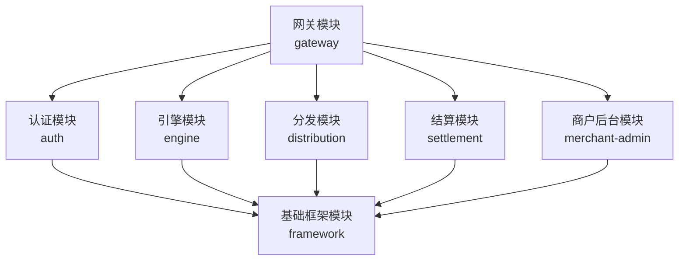
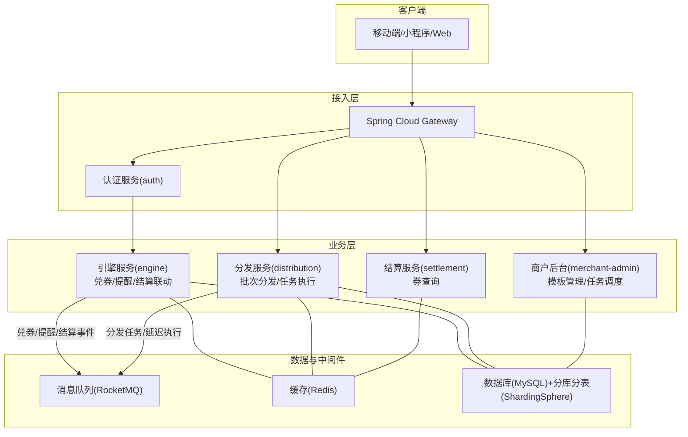
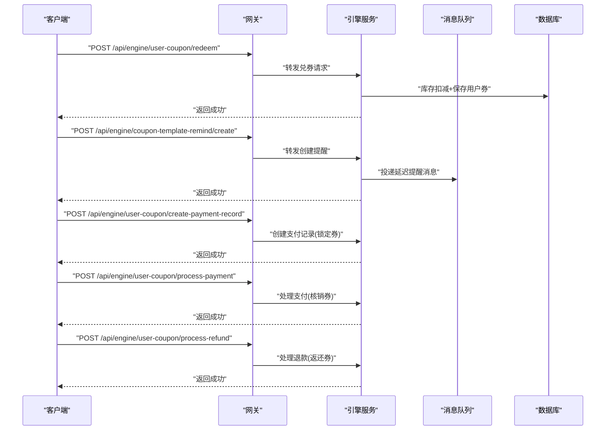
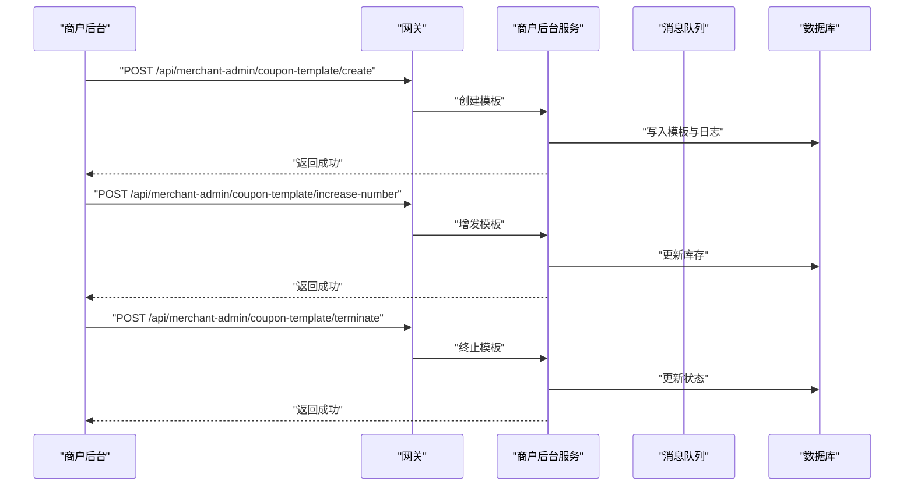
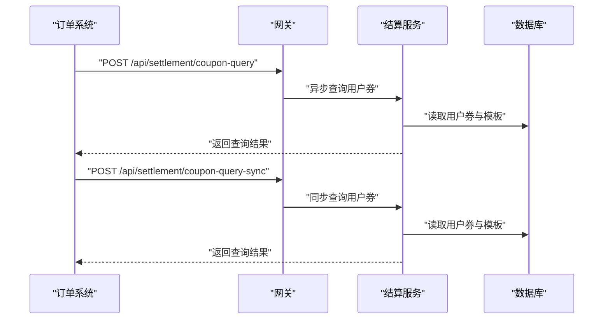
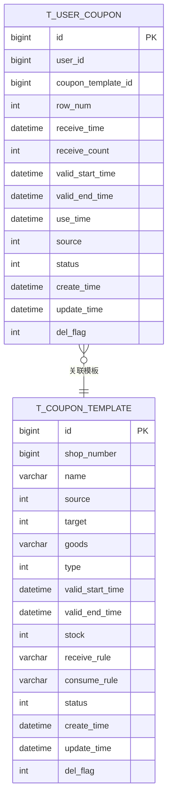
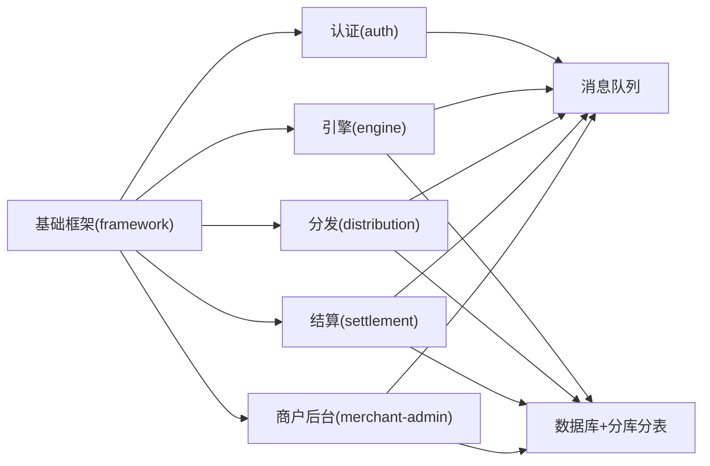

# 项目介绍

<cite>
**本文引用的文件**
- [README.md](file://README.md)
- [pom.xml](file://pom.xml)
- [AuthApplication.java](file://auth/src/main/java/com/fengxin/maplecoupon/auth/AuthApplication.java)
- [EngineApplication.java](file://engine/src/main/java/com/fengxin/maplecoupon/engine/EngineApplication.java)
- [DistributionApplication.java](file://distribution/src/main/java/com/fengxin/maplecoupon/distribution/DistributionApplication.java)
- [CouponTemplateController.java（引擎）](file://engine/src/main/java/com/fengxin/maplecoupon/engine/controller/CouponTemplateController.java)
- [UserCouponController.java（引擎）](file://engine/src/main/java/com/fengxin/maplecoupon/engine/controller/UserCouponController.java)
- [CouponTemplateController.java（商户后台）](file://merchant-admin/src/main/java/com/fengxin/maplecoupon/merchantadmin/controller/CouponTemplateController.java)
- [CouponQueryController.java（结算）](file://settlement/src/main/java/com/fengxin/maplecoupon/settlement/controller/CouponQueryController.java)
- [UserCouponService.java（引擎）](file://engine/src/main/java/com/fengxin/maplecoupon/engine/service/UserCouponService.java)
- [CouponTemplateService.java（商户后台）](file://merchant-admin/src/main/java/com/fengxin/maplecoupon/merchantadmin/service/CouponTemplateService.java)
- [UserCouponDO.java（引擎实体）](file://engine/src/main/java/com/fengxin/maplecoupon/engine/dao/entity/UserCouponDO.java)
- [CouponTemplateDO.java（引擎实体）](file://engine/src/main/java/com/fengxin/maplecoupon/engine/dao/entity/CouponTemplateDO.java)
</cite>

## 目录
1. [引言](#引言)
2. [项目结构](#项目结构)
3. [核心组件](#核心组件)
4. [架构总览](#架构总览)
5. [详细组件分析](#详细组件分析)
6. [依赖分析](#依赖分析)
7. [性能考虑](#性能考虑)
8. [故障排查指南](#故障排查指南)
9. [结论](#结论)
10. [附录](#附录)

## 引言
MapleCoupon 是一个面向第三方平台的优惠券管理系统，定位于为千万级用户提供稳定、高并发的优惠券分发与核销能力。项目以“秒杀式”领券为核心场景，同时覆盖预约提醒、结算联动、商户后台管理与批量分发等完整闭环，具备百万级用户规模下的高可用与高性能支撑能力。

- 平台定位与业务价值
  - 第三方优惠券平台：为品牌方、平台方与商户提供统一的优惠券生命周期管理能力。
  - 核心业务能力：优惠券领取、预约提醒、结算服务、商户模板管理、批量分发与任务调度。
  - 技术目标：通过多模块解耦、分布式中间件与分库分表策略，支撑高并发、低延迟与强一致性的业务诉求。

- 开源背景与作者动机
  - 作者基于行业最佳实践与技术博客沉淀，自研并开源该系统，旨在提供可复用、可扩展的优惠券解决方案，欢迎社区共建与演进。

- 业界应用场景与竞争优势
  - 场景：电商促销、品牌营销、平台补贴、连锁零售等高频领券与核销场景。
  - 竞争优势：模块化设计、完善的幂等与防重机制、消息驱动的异步处理、分库分表与缓存策略，兼顾一致性与吞吐量。

**章节来源**
- [README.md:1-10](file://README.md#L1-L10)

## 项目结构
项目采用 Maven 多模块聚合结构，围绕“网关—认证—引擎—分发—结算—商户后台—基础框架”进行分层与职责划分，便于独立部署与横向扩展。

**图示来源**
- [pom.xml:17-34](file://pom.xml#L17-L34)

**章节来源**
- [pom.xml:17-34](file://pom.xml#L17-L34)

## 核心组件
- 认证与网关
  - 网关负责统一鉴权与路由转发；认证模块提供用户身份校验与上下文传递。
- 引擎模块
  - 提供优惠券模板查询、用户兑券、预约提醒、支付/退款联动等核心能力。
- 分发模块
  - 支持按批次分发优惠券与多种提醒方式（站内信/短信/应用弹窗），并具备任务执行与失败重试能力。
- 商户后台模块
  - 提供优惠券模板的创建、分页查询、增发、终止与删除等管理能力。
- 结算模块
  - 提供用户优惠券的异步/同步查询能力，支撑订单侧的券可用性判断。
- 基础框架模块
  - 提供全局异常、结果封装、幂等、分布式缓存与配置等通用能力。

**章节来源**
- [AuthApplication.java:15-19](file://auth/src/main/java/com/fengxin/maplecoupon/auth/AuthApplication.java#L15-L19)
- [EngineApplication.java:13-15](file://engine/src/main/java/com/fengxin/maplecoupon/engine/EngineApplication.java#L13-L15)
- [DistributionApplication.java:13-15](file://distribution/src/main/java/com/fengxin/maplecoupon/distribution/DistributionApplication.java#L13-L15)

## 架构总览
系统采用“网关+多业务微服务”的架构，结合消息队列、缓存与分库分表，形成高可用、高扩展的优惠券处理链路。

**图示来源**
- [README.md:4](file://README.md#L4)
- [pom.xml:61-182](file://pom.xml#L61-L182)

## 详细组件分析

### 引擎模块（核心业务中枢）
- 职责边界
  - 优惠券模板管理与查询
  - 用户兑券（高并发场景）
  - 预约提醒（创建/查询/取消）
  - 结算联动（创建支付记录、处理支付、处理退款）

- 关键接口与流程
  - 兑券接口：面向高并发的“秒杀式”兑券，需结合库存扣减与幂等控制。
  - 预约提醒：支持设置提醒时间、查询与取消，配合延迟消息实现精准提醒。
  - 结算联动：与订单系统协作，先创建支付记录（锁定券），再处理支付（核销券），最后处理退款（返还券）。

**图示来源**
- [UserCouponController.java（引擎）:32-80](file://engine/src/main/java/com/fengxin/maplecoupon/engine/controller/UserCouponController.java#L32-L80)
- [UserCouponService.java（引擎）:15-80](file://engine/src/main/java/com/fengxin/maplecoupon/engine/service/UserCouponService.java#L15-L80)

**章节来源**
- [CouponTemplateController.java（引擎）:27-31](file://engine/src/main/java/com/fengxin/maplecoupon/engine/controller/CouponTemplateController.java#L27-L31)
- [UserCouponController.java（引擎）:32-80](file://engine/src/main/java/com/fengxin/maplecoupon/engine/controller/UserCouponController.java#L32-L80)
- [UserCouponService.java（引擎）:15-80](file://engine/src/main/java/com/fengxin/maplecoupon/engine/service/UserCouponService.java#L15-L80)

### 商户后台模块（模板与任务管理）
- 职责边界
  - 优惠券模板的创建、分页查询、详情查询、增发、终止与删除。
  - 优惠券发放任务的创建与调度，支持延迟执行与批量导入导出。

- 关键接口与流程
  - 创建模板：校验参数与幂等控制，确保模板状态与规则合法。
  - 增发模板：在原库存基础上追加发行量，避免并发超发。
  - 终止模板：标记模板状态为已结束，停止新领券与提醒。

**图示来源**
- [CouponTemplateController.java（商户后台）:32-64](file://merchant-admin/src/main/java/com/fengxin/maplecoupon/merchantadmin/controller/CouponTemplateController.java#L32-L64)
- [CouponTemplateService.java（商户后台）:19-50](file://merchant-admin/src/main/java/com/fengxin/maplecoupon/merchantadmin/service/CouponTemplateService.java#L19-L50)

**章节来源**
- [CouponTemplateController.java（商户后台）:32-71](file://merchant-admin/src/main/java/com/fengxin/maplecoupon/merchantadmin/controller/CouponTemplateController.java#L32-L71)
- [CouponTemplateService.java（商户后台）:19-50](file://merchant-admin/src/main/java/com/fengxin/maplecoupon/merchantadmin/service/CouponTemplateService.java#L19-L50)

### 结算模块（券查询与对账）
- 职责边界
  - 提供用户可用/不可用优惠券的异步/同步查询能力，支撑订单侧的券可用性判断与对账。

- 关键接口与流程
  - 异步查询：适合大批量与复杂筛选条件，降低订单链路阻塞风险。
  - 同步查询：适合实时性要求高的场景，保证订单决策的即时性。

**图示来源**
- [CouponQueryController.java（结算）:29-38](file://settlement/src/main/java/com/fengxin/maplecoupon/settlement/controller/CouponQueryController.java#L29-L38)

**章节来源**
- [CouponQueryController.java（结算）:28-38](file://settlement/src/main/java/com/fengxin/maplecoupon/settlement/controller/CouponQueryController.java#L28-L38)

### 数据模型（核心实体）
- 用户优惠券实体
  - 字段涵盖用户ID、模板ID、来源、状态、有效期、创建/更新时间等，支撑兑券、锁定、使用、过期与撤回等状态流转。
- 优惠券模板实体
  - 字段涵盖模板ID、店铺编号、名称、来源、适用对象、优惠类型、有效期、库存、规则与状态等，支撑模板管理与兑券校验。

**图示来源**
- [UserCouponDO.java（引擎实体）:24-96](file://engine/src/main/java/com/fengxin/maplecoupon/engine/dao/entity/UserCouponDO.java#L24-L96)
- [CouponTemplateDO.java（引擎实体）:24-106](file://engine/src/main/java/com/fengxin/maplecoupon/engine/dao/entity/CouponTemplateDO.java#L24-L106)

**章节来源**
- [UserCouponDO.java（引擎实体）:19-96](file://engine/src/main/java/com/fengxin/maplecoupon/engine/dao/entity/UserCouponDO.java#L19-L96)
- [CouponTemplateDO.java（引擎实体）:19-106](file://engine/src/main/java/com/fengxin/maplecoupon/engine/dao/entity/CouponTemplateDO.java#L19-L106)

## 依赖分析
- 技术栈与版本
  - 运行环境：Java 17、Spring Boot 3.0.7、Spring Cloud 2022.0.3、Spring Cloud Alibaba 2022.0.0.0-RC2。
  - ORM与分库分表：MyBatis-Plus、ShardingSphere 5.3.2。
  - 中间件：RocketMQ 2.3.0、Redisson、XXL-Job 2.4.1、EasyExcel 4.0.1、HuTool 5.8.20、FastJSON2 2.0.36、Knife4j 4.5.0、BizLog SDK 3.0.6。
- 模块依赖关系
  - 所有业务模块均依赖基础框架模块，提供统一的异常、结果封装、幂等与配置能力。
  - 引擎与分发模块通过消息队列进行事件解耦，提升系统弹性与可观测性。

**图示来源**
- [pom.xml:61-182](file://pom.xml#L61-L182)

**章节来源**
- [pom.xml:37-60](file://pom.xml#L37-L60)
- [pom.xml:61-182](file://pom.xml#L61-L182)

## 性能考虑
- 高并发兑券
  - 采用库存扣减与用户券落库的原子操作，结合缓存与消息异步处理，降低主流程阻塞。
- 预约提醒
  - 延迟消息与定时任务结合，避免集中提醒导致的峰值压力。
- 查询优化
  - 异步查询用于大批量场景，同步查询用于实时性要求高的场景，平衡延迟与一致性。
- 存储扩展
  - 分库分表策略与索引优化，保障模板与用户券的高并发读写性能。
- 幂等与防重
  - 接口级幂等注解与消息去重，避免重复兑券与重复提醒。

## 故障排查指南
- 常见问题定位
  - 兑券失败：检查库存扣减逻辑、用户券落库事务与消息发送状态。
  - 预约提醒未触发：检查延迟消息投递、消费者消费状态与任务调度。
  - 结算查询慢：确认查询条件与索引、异步/同步模式选择是否合理。
- 错误码与异常
  - 统一通过基础框架模块的结果封装与异常处理，便于定位与追踪。
- 日志与监控
  - 借助 BizLog SDK 与 Knife4j 接口文档，完善链路日志与接口可观测性。

**章节来源**
- [README.md:4](file://README.md#L4)

## 结论
MapleCoupon 以模块化、事件驱动与分库分表为核心设计理念，构建了从“模板管理—批量分发—用户兑券—预约提醒—结算联动”的完整链路。其在高并发兑券、消息解耦与查询优化方面的设计，使其能够支撑百万级用户的优惠券分发与核销需求，既适合初学者理解优惠券系统的关键路径，也为生产环境提供了可落地的工程方案。

## 附录
- 快速理解框架
  - 从“模板—分发—兑券—提醒—结算”五条主线入手，逐步掌握各模块职责与交互。
- 开发建议
  - 在兑券与提醒等高并发场景下，优先采用异步消息与幂等控制；在订单链路中谨慎选择同步/异步查询模式。