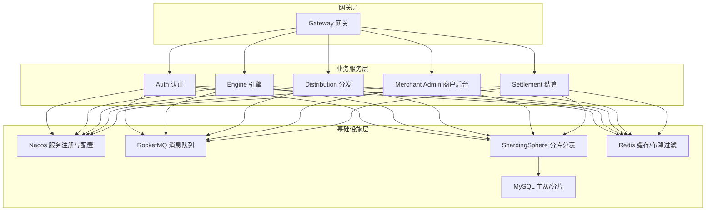
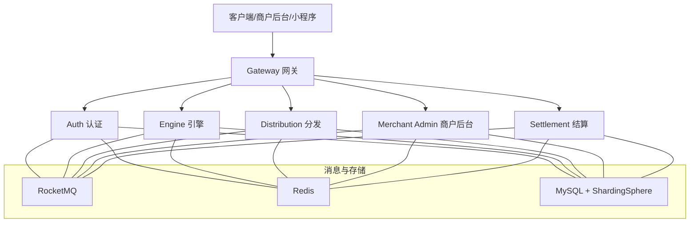
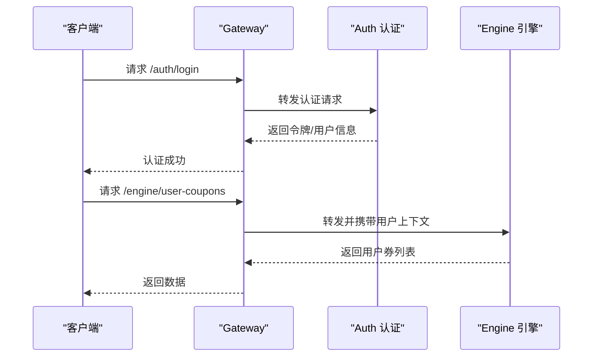
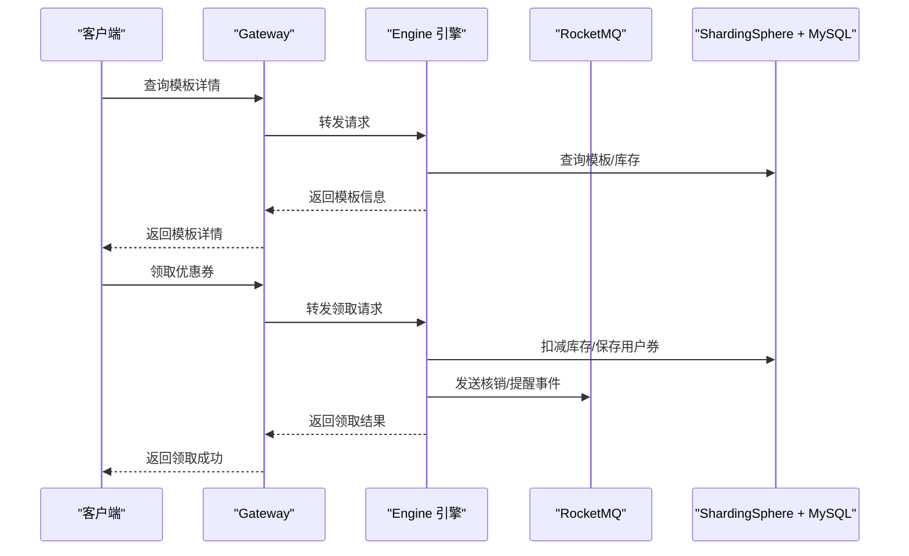
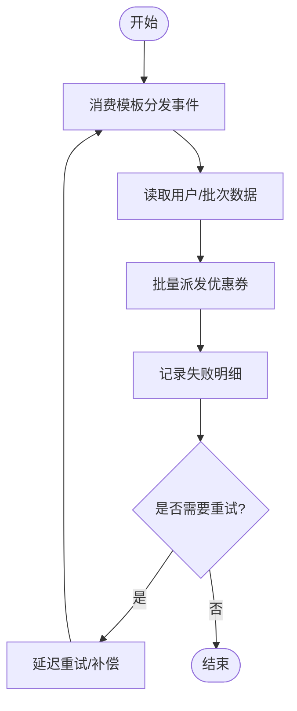
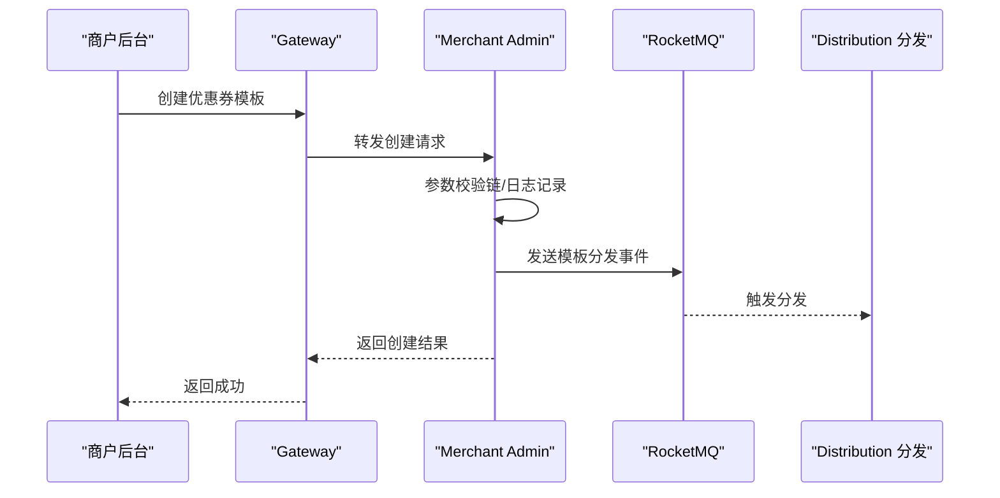
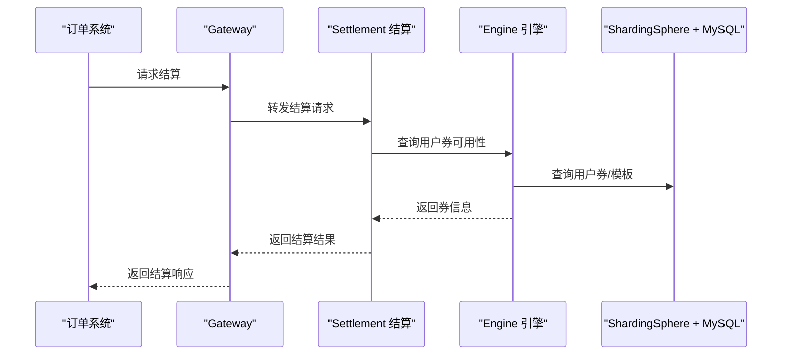
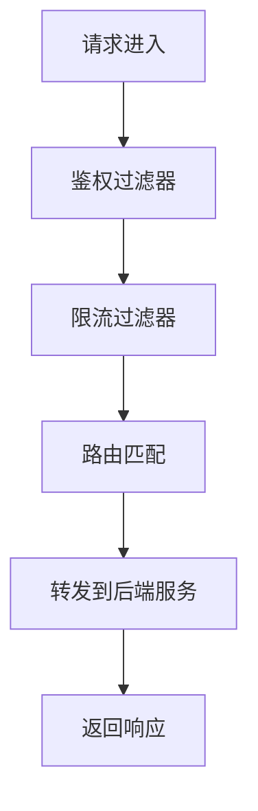
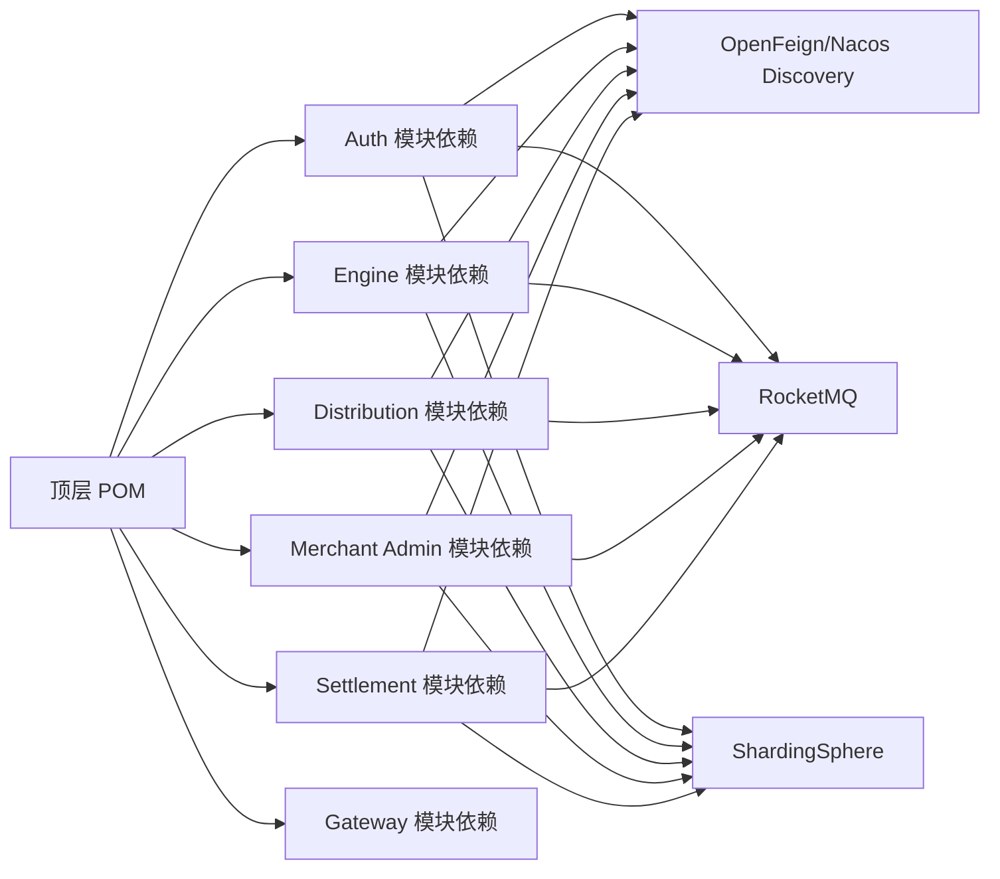

# 项目概述

<cite>
**本文引用的文件**   
- [README.md](file://README.md)
- [pom.xml](file://pom.xml)
- [auth/pom.xml](file://auth/pom.xml)
- [engine/pom.xml](file://engine/pom.xml)
- [distribution/pom.xml](file://distribution/pom.xml)
- [merchant-admin/pom.xml](file://merchant-admin/pom.xml)
- [settlement/pom.xml](file://settlement/pom.xml)
- [gateway/pom.xml](file://gateway/pom.xml)
- [auth/src/main/java/com/fengxin/maplecoupon/auth/AuthApplication.java](file://auth/src/main/java/com/fengxin/maplecoupon/auth/AuthApplication.java)
- [engine/src/main/java/com/fengxin/maplecoupon/engine/EngineApplication.java](file://engine/src/main/java/com/fengxin/maplecoupon/engine/EngineApplication.java)
- [distribution/src/main/java/com/fengxin/maplecoupon/distribution/DistributionApplication.java](file://distribution/src/main/java/com/fengxin/maplecoupon/distribution/DistributionApplication.java)
- [merchant-admin/src/main/java/com/fengxin/maplecoupon/merchantadmin/MerchantAdminApplication.java](file://merchant-admin/src/main/java/com/fengxin/maplecoupon/merchantadmin/MerchantAdminApplication.java)
- [settlement/src/main/java/com/fengxin/maplecoupon/settlement/SettlementApplication.java](file://settlement/src/main/java/com/fengxin/maplecoupon/settlement/SettlementApplication.java)
- [gateway/src/main/java/com/fengxin/maplecoupon/gateway/GateWayApplication.java](file://gateway/src/main/java/com/fengxin/maplecoupon/gateway/GateWayApplication.java)
- [framework/src/main/java/com/fengxin/web/GlobalExceptionHandler.java](file://framework/src/main/java/com/fengxin/web/GlobalExceptionHandler.java)
- [framework/src/main/java/com/fengxin/config/WebAutoConfiguration.java](file://framework/src/main/java/com/fengxin/config/WebAutoConfiguration.java)
</cite>

## 目录
1. [引言](#引言)
2. [项目结构](#项目结构)
3. [核心组件](#核心组件)
4. [架构总览](#架构总览)
5. [详细组件分析](#详细组件分析)
6. [依赖分析](#依赖分析)
7. [性能考虑](#性能考虑)
8. [故障排查指南](#故障排查指南)
9. [结论](#结论)
10. [附录](#附录)

## 引言
MapleCoupon是一个面向第三方平台的优惠券管理系统，旨在提供优惠券的创建、分发、核销与结算能力，覆盖“领取—提醒—核销—结算”的完整业务闭环。系统通过微服务拆分与消息驱动解耦，结合分库分表与分布式事务策略，支撑高并发场景下的稳定运行。

- 核心目标
  - 提供高可用、高性能的优惠券生命周期管理能力
  - 支持多渠道分发（弹窗推送、站内信、短信）与多维度提醒（到期、可用）
  - 提供订单级结算计算能力，保障核销与对账一致性
- 主要特性
  - 优惠券模板管理与批量分发
  - 领取库存扣减与幂等控制
  - 到期与可用提醒（消息队列+定时任务）
  - 订单结算与优惠抵扣计算
- 技术优势
  - 微服务化与服务治理（Nacos、OpenFeign、Gateway）
  - 分库分表（ShardingSphere）与读写分离
  - 消息驱动（RocketMQ）与事件溯源
  - 全局异常统一处理与链路可观测性

**章节来源**
- [README.md:1-10](file://README.md#L1-L10)

## 项目结构
项目采用Maven多模块聚合结构，顶层POM集中管理版本与依赖，各子模块按业务域划分，形成清晰的边界与复用。

- 模块划分
  - 分发模块：负责按批次分发用户优惠券与通知
  - 引擎模块：负责优惠券模板与用户券的查询、锁定、核销
  - 结算模块：负责订单金额计算与优惠抵扣
  - 商户后台模块：负责优惠券创建、管理与任务调度
  - 认证模块：提供用户认证与远程调用能力
  - 网关模块：统一入口、路由、鉴权与限流
  - 基础框架模块：全局异常、配置与通用能力
- 依赖与版本
  - Spring Boot 3.0.7、Spring Cloud 2022.0.3、Spring Cloud Alibaba 2022.0.0.0-RC2
  - ShardingSphere 5.3.2、RocketMQ 2.3.0、MyBatis-Plus 3.5.3.1、FastJSON2、EasyExcel、XXL-Job、Redisson、HuTool、Knife4j、BizLog

**图表来源**
- [pom.xml:17-34](file://pom.xml#L17-L34)
- [auth/pom.xml:25-29](file://auth/pom.xml#L25-L29)
- [engine/pom.xml:25-29](file://engine/pom.xml#L25-L29)
- [distribution/pom.xml:25-29](file://distribution/pom.xml#L25-L29)
- [merchant-admin/pom.xml:24-28](file://merchant-admin/pom.xml#L24-L28)
- [settlement/pom.xml:24-28](file://settlement/pom.xml#L24-L28)
- [gateway/pom.xml:18-30](file://gateway/pom.xml#L18-L30)

**章节来源**
- [pom.xml:17-34](file://pom.xml#L17-L34)
- [auth/pom.xml:14-111](file://auth/pom.xml#L14-L111)
- [engine/pom.xml:14-103](file://engine/pom.xml#L14-L103)
- [distribution/pom.xml:14-104](file://distribution/pom.xml#L14-L104)
- [merchant-admin/pom.xml:13-126](file://merchant-admin/pom.xml#L13-L126)
- [settlement/pom.xml:14-93](file://settlement/pom.xml#L14-L93)
- [gateway/pom.xml:14-54](file://gateway/pom.xml#L14-L54)

## 核心组件
- 应用入口与扫描
  - 各模块均以Spring Boot应用入口启动，启用服务注册、数据访问层扫描与必要组件
  - 示例：认证、引擎、分发、商户后台、结算、网关的应用类分别位于对应模块
- 全局异常处理
  - 基础框架提供统一异常拦截与结果封装，覆盖参数校验、业务异常与未捕获异常
  - 自动装配Bean确保全局生效

**章节来源**
- [auth/src/main/java/com/fengxin/maplecoupon/auth/AuthApplication.java:15-18](file://auth/src/main/java/com/fengxin/maplecoupon/auth/AuthApplication.java#L15-L18)
- [engine/src/main/java/com/fengxin/maplecoupon/engine/EngineApplication.java:13-14](file://engine/src/main/java/com/fengxin/maplecoupon/engine/EngineApplication.java#L13-L14)
- [distribution/src/main/java/com/fengxin/maplecoupon/distribution/DistributionApplication.java:13-14](file://distribution/src/main/java/com/fengxin/maplecoupon/distribution/DistributionApplication.java#L13-L14)
- [merchant-admin/src/main/java/com/fengxin/maplecoupon/merchantadmin/MerchantAdminApplication.java:14-15](file://merchant-admin/src/main/java/com/fengxin/maplecoupon/merchantadmin/MerchantAdminApplication.java#L14-L15)
- [settlement/src/main/java/com/fengxin/maplecoupon/settlement/SettlementApplication.java:12-13](file://settlement/src/main/java/com/fengxin/maplecoupon/settlement/SettlementApplication.java#L12-L13)
- [gateway/src/main/java/com/fengxin/maplecoupon/gateway/GateWayApplication.java:12-13](file://gateway/src/main/java/com/fengxin/maplecoupon/gateway/GateWayApplication.java#L12-L13)
- [framework/src/main/java/com/fengxin/web/GlobalExceptionHandler.java:24-68](file://framework/src/main/java/com/fengxin/web/GlobalExceptionHandler.java#L24-L68)
- [framework/src/main/java/com/fengxin/config/WebAutoConfiguration.java:12-19](file://framework/src/main/java/com/fengxin/config/WebAutoConfiguration.java#L12-L19)

## 架构总览
系统采用“网关+微服务+消息中间件+分库分表+缓存”的整体架构，强调：
- 服务自治与边界清晰：认证、引擎、分发、商户后台、结算各自独立部署
- 统一入口与安全：Gateway统一路由、鉴权与限流
- 异步解耦与削峰填谷：RocketMQ承载事件与通知
- 数据一致性与扩展性：ShardingSphere实现水平分片与读写分离
- 可观测与稳定性：全局异常、日志与监控贯穿全链路

**图表来源**
- [gateway/src/main/java/com/fengxin/maplecoupon/gateway/GateWayApplication.java:12-13](file://gateway/src/main/java/com/fengxin/maplecoupon/gateway/GateWayApplication.java#L12-L13)
- [auth/src/main/java/com/fengxin/maplecoupon/auth/AuthApplication.java:15-18](file://auth/src/main/java/com/fengxin/maplecoupon/auth/AuthApplication.java#L15-L18)
- [engine/src/main/java/com/fengxin/maplecoupon/engine/EngineApplication.java:13-14](file://engine/src/main/java/com/fengxin/maplecoupon/engine/EngineApplication.java#L13-L14)
- [distribution/src/main/java/com/fengxin/maplecoupon/distribution/DistributionApplication.java:13-14](file://distribution/src/main/java/com/fengxin/maplecoupon/distribution/DistributionApplication.java#L13-L14)
- [merchant-admin/src/main/java/com/fengxin/maplecoupon/merchantadmin/MerchantAdminApplication.java:14-15](file://merchant-admin/src/main/java/com/fengxin/maplecoupon/merchantadmin/MerchantAdminApplication.java#L14-L15)
- [settlement/src/main/java/com/fengxin/maplecoupon/settlement/SettlementApplication.java:12-13](file://settlement/src/main/java/com/fengxin/maplecoupon/settlement/SettlementApplication.java#L12-L13)

## 详细组件分析

### 认证模块（Auth）
- 角色定位：统一用户认证与远程调用入口
- 关键点
  - 开启服务注册、Feign客户端扫描，便于跨模块调用
  - 集成ShardingSphere与RocketMQ等基础设施依赖
- 典型流程：用户登录/注册 → 用户信息上下文传递 → 远程调用引擎/结算等下游服务

**图表来源**
- [auth/src/main/java/com/fengxin/maplecoupon/auth/AuthApplication.java:15-18](file://auth/src/main/java/com/fengxin/maplecoupon/auth/AuthApplication.java#L15-L18)
- [engine/src/main/java/com/fengxin/maplecoupon/engine/EngineApplication.java:13-14](file://engine/src/main/java/com/fengxin/maplecoupon/engine/EngineApplication.java#L13-L14)

**章节来源**
- [auth/pom.xml:25-29](file://auth/pom.xml#L25-L29)
- [auth/pom.xml:30-35](file://auth/pom.xml#L30-L35)

### 引擎模块（Engine）
- 角色定位：优惠券核心业务引擎，负责模板、用户券的查询、锁定、核销与提醒
- 关键点
  - 与ShardingSphere集成，支持按模板/用户维度分片
  - 使用RocketMQ进行异步提醒与状态变更事件传播
- 典型流程：查询模板 → 校验可用性 → 扣减库存与生成用户券 → 发送核销/到期提醒事件

**图表来源**
- [engine/src/main/java/com/fengxin/maplecoupon/engine/EngineApplication.java:13-14](file://engine/src/main/java/com/fengxin/maplecoupon/engine/EngineApplication.java#L13-L14)
- [engine/pom.xml:88-97](file://engine/pom.xml#L88-L97)

**章节来源**
- [engine/pom.xml:88-97](file://engine/pom.xml#L88-L97)

### 分发模块（Distribution）
- 角色定位：按批次分发优惠券，支持多种通知渠道（弹窗、站内信、短信），并处理Excel导入导出
- 关键点
  - 与RocketMQ协作，消费模板分发事件并执行批量派发
  - 提供失败重试与Excel解析能力
- 典型流程：接收模板分发事件 → 读取Excel/用户集合 → 批量派发 → 记录失败明细

**图表来源**
- [distribution/src/main/java/com/fengxin/maplecoupon/distribution/DistributionApplication.java:13-14](file://distribution/src/main/java/com/fengxin/maplecoupon/distribution/DistributionApplication.java#L13-L14)
- [distribution/pom.xml:93-103](file://distribution/pom.xml#L93-L103)

**章节来源**
- [distribution/pom.xml:93-103](file://distribution/pom.xml#L93-L103)

### 商户后台模块（Merchant Admin）
- 角色定位：优惠券创建、编辑、终止与任务调度，支持日志审计与参数校验链
- 关键点
  - 集成XXL-Job进行定时任务编排
  - 使用BizLog记录操作日志，保证合规与可追溯
- 典型流程：创建模板 → 参数校验链 → 写入模板与日志 → 触发分发任务

**图表来源**
- [merchant-admin/src/main/java/com/fengxin/maplecoupon/merchantadmin/MerchantAdminApplication.java:14-15](file://merchant-admin/src/main/java/com/fengxin/maplecoupon/merchantadmin/MerchantAdminApplication.java#L14-L15)
- [merchant-admin/pom.xml:120-125](file://merchant-admin/pom.xml#L120-L125)

**章节来源**
- [merchant-admin/pom.xml:120-125](file://merchant-admin/pom.xml#L120-L125)

### 结算模块（Settlement）
- 角色定位：订单结算与优惠抵扣计算，对接引擎与上游订单系统
- 关键点
  - 与引擎交互查询用户券可用性与规则
  - 通过ShardingSphere保障高并发下的数据一致性
- 典型流程：接收订单信息 → 查询用户券 → 计算抵扣 → 返回结算结果

**图表来源**
- [settlement/src/main/java/com/fengxin/maplecoupon/settlement/SettlementApplication.java:12-13](file://settlement/src/main/java/com/fengxin/maplecoupon/settlement/SettlementApplication.java#L12-L13)
- [settlement/pom.xml:82-86](file://settlement/pom.xml#L82-L86)

**章节来源**
- [settlement/pom.xml:82-86](file://settlement/pom.xml#L82-L86)

### 网关模块（Gateway）
- 角色定位：统一入口、路由、鉴权、限流与请求日志
- 关键点
  - 基于Spring Cloud Gateway实现动态路由与过滤器链
  - 集成Redis用于限流与令牌校验
- 典型流程：请求进入 → 鉴权/限流 → 路由到具体服务 → 返回响应

**图表来源**
- [gateway/src/main/java/com/fengxin/maplecoupon/gateway/GateWayApplication.java:12-13](file://gateway/src/main/java/com/fengxin/maplecoupon/gateway/GateWayApplication.java#L12-L13)
- [gateway/pom.xml:18-30](file://gateway/pom.xml#L18-L30)

**章节来源**
- [gateway/pom.xml:18-30](file://gateway/pom.xml#L18-L30)

## 依赖分析
- 版本与依赖管理
  - 顶层POM集中声明Spring Boot、Spring Cloud、Spring Cloud Alibaba版本，以及ShardingSphere、RocketMQ、MyBatis-Plus、FastJSON2、EasyExcel、XXL-Job、Redisson、HuTool、Knife4j、BizLog等生态组件
- 子模块依赖
  - 各模块按需引入Web、JDBC、MyBatis-Plus、ShardingSphere、RocketMQ、Redisson、Knife4j、BizLog等依赖
  - 认证与引擎模块额外引入OpenFeign与Nacos Discovery，实现服务间调用与注册发现
- 依赖关系图

**图表来源**
- [pom.xml:61-182](file://pom.xml#L61-L182)
- [auth/pom.xml:25-109](file://auth/pom.xml#L25-L109)
- [engine/pom.xml:25-101](file://engine/pom.xml#L25-L101)
- [distribution/pom.xml:25-103](file://distribution/pom.xml#L25-L103)
- [merchant-admin/pom.xml:24-124](file://merchant-admin/pom.xml#L24-L124)
- [settlement/pom.xml:24-91](file://settlement/pom.xml#L24-L91)
- [gateway/pom.xml:18-53](file://gateway/pom.xml#L18-L53)

**章节来源**
- [pom.xml:61-182](file://pom.xml#L61-L182)
- [auth/pom.xml:25-109](file://auth/pom.xml#L25-L109)
- [engine/pom.xml:25-101](file://engine/pom.xml#L25-L101)
- [distribution/pom.xml:25-103](file://distribution/pom.xml#L25-L103)
- [merchant-admin/pom.xml:24-124](file://merchant-admin/pom.xml#L24-L124)
- [settlement/pom.xml:24-91](file://settlement/pom.xml#L24-L91)
- [gateway/pom.xml:18-53](file://gateway/pom.xml#L18-L53)

## 性能考虑
- 分库分表与读写分离
  - 通过ShardingSphere对用户、模板、用户券等表进行按库/按表分片，降低热点与单表压力
- 缓存与布隆过滤
  - Redis用于热点数据缓存与布隆过滤，减少数据库压力与误查询
- 异步解耦与削峰填谷
  - RocketMQ承担事件与通知，避免同步阻塞，提升吞吐
- 幂等与重复消费控制
  - 通过幂等注解与消息去重策略，保障重复消费不会造成业务副作用
- 全局异常与可观测性
  - 统一异常处理与日志埋点，快速定位问题根因

[本节为通用性能指导，无需特定文件引用]

## 故障排查指南
- 全局异常处理
  - 参数校验异常、业务异常与未捕获异常均有统一拦截与返回格式，便于前端与运维快速定位
- 常见问题定位思路
  - 接口报错：检查全局异常日志与错误码映射
  - 服务不可用：确认Nacos注册状态与负载均衡配置
  - 消息堆积：检查RocketMQ消费进度与消费者线程池配置
  - 数据不一致：核查ShardingSphere分片规则与事务边界
- 建议
  - 在网关层增加请求追踪ID，串联链路日志
  - 对高频接口开启缓存与降级策略

**章节来源**
- [framework/src/main/java/com/fengxin/web/GlobalExceptionHandler.java:24-68](file://framework/src/main/java/com/fengxin/web/GlobalExceptionHandler.java#L24-L68)
- [framework/src/main/java/com/fengxin/config/WebAutoConfiguration.java:12-19](file://framework/src/main/java/com/fengxin/config/WebAutoConfiguration.java#L12-L19)

## 结论
MapleCoupon以微服务为核心，结合消息驱动与分库分表，构建了高可用、高扩展的优惠券平台。通过统一网关、全局异常与可观测性体系，系统在复杂业务场景下仍能保持稳定与高效。对于初学者，建议先从网关与认证模块入手，逐步深入引擎与分发；对于有经验的开发者，可在消息幂等、分片策略与分布式事务上进一步优化。

[本节为总结性内容，无需特定文件引用]

## 附录
- 业务价值
  - 降低优惠券运营成本，提升用户体验与转化率
  - 支撑大规模用户与高并发场景，具备商业化落地能力
- 应用场景
  - 电商、零售、连锁品牌等多渠道营销活动
- 竞争优势
  - 完整的优惠券生命周期管理与多渠道通知
  - 微服务化与消息驱动，具备良好的扩展性与稳定性

[本节为概念性内容，无需特定文件引用]