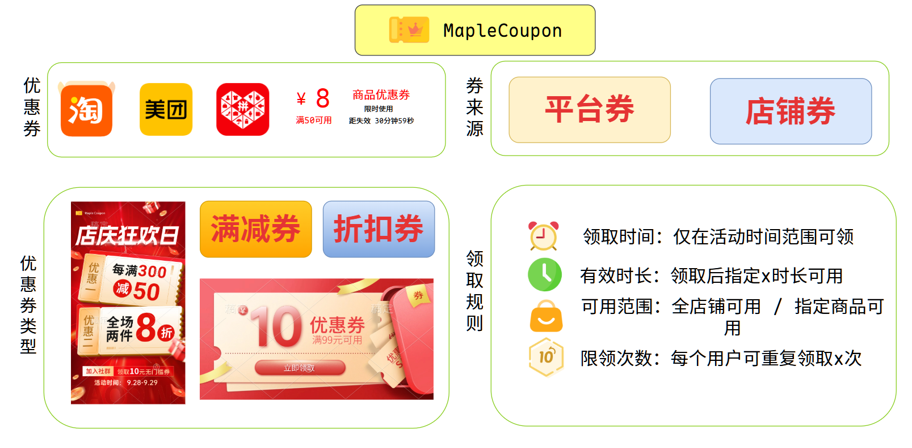
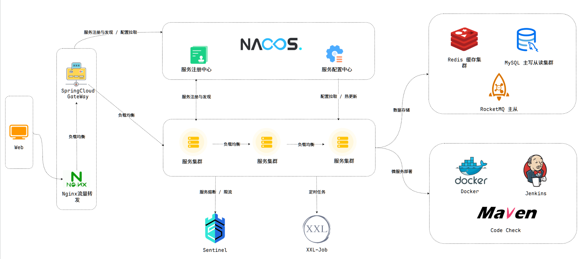
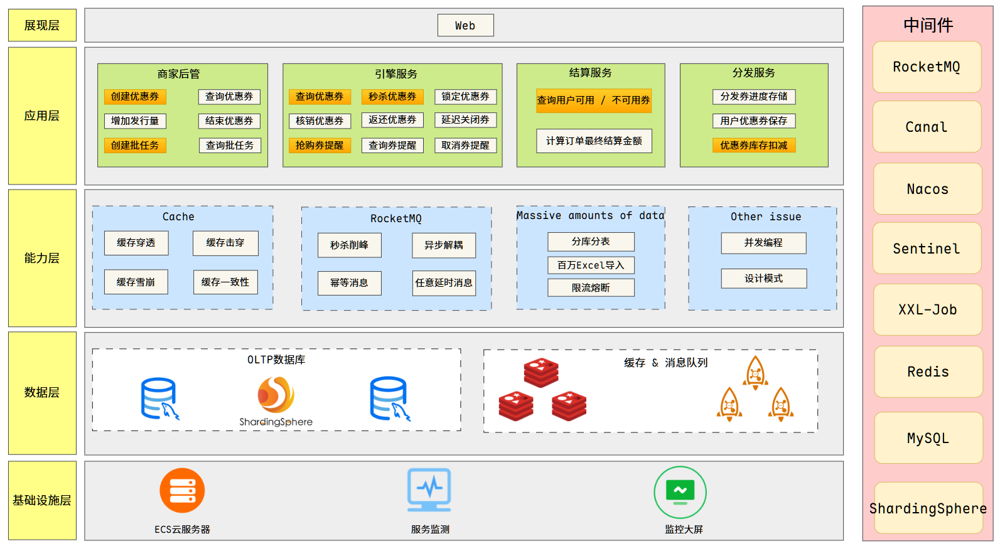
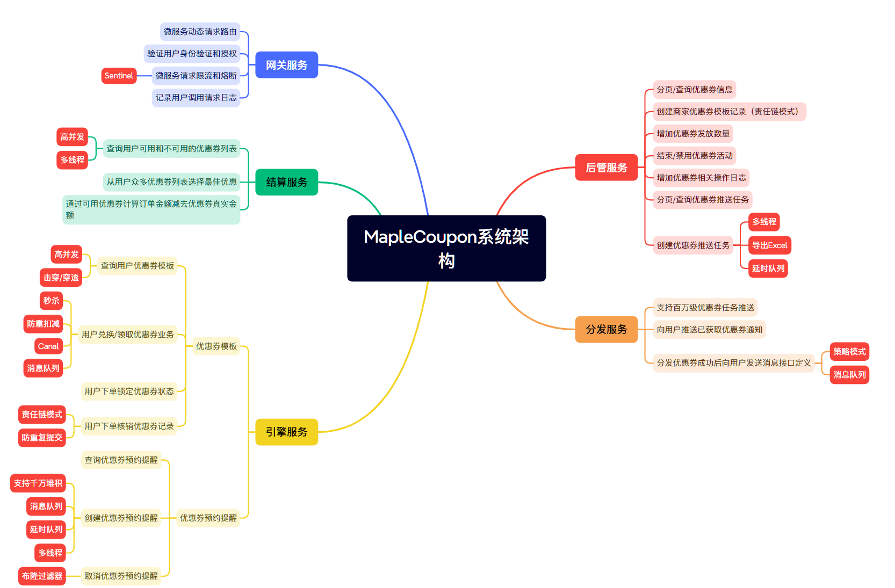

# MapleCoupon(http://coupon.mapleplus.club)
## 项目介绍：第三方优惠券系统，平台支持优惠券领取、预约提醒、结算服务等，并提供百万级别用户优惠券分发功能

## 技术架构：SpringBoot + SpringCloud Alibaba + SpringCloud Gateway + ShardingSphere + RocketMQ + Redis + MySQL + EasyExcel + HuTool + FastJson2 + MyBatis-Plus + BizLog + XXL-Job + Docker

## 业务架构

## 本项目由作者阅读[字节跳动技术团队博客](https://juejin.cn/post/7087824893831544845)，结合业内相关的解决方案，自研开发了本优惠券系统，并开源于GitHub，欢迎大家使用，也欢迎大家提建议，一起完善。
## 本项目已实现功能：
